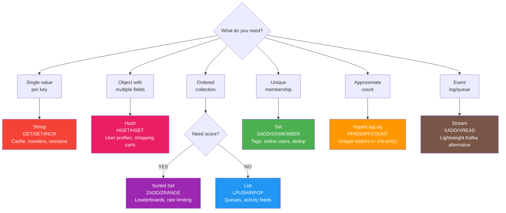
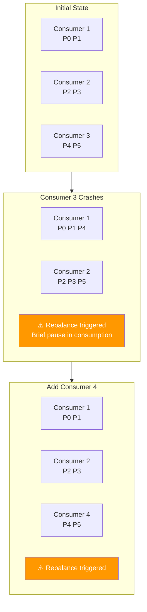
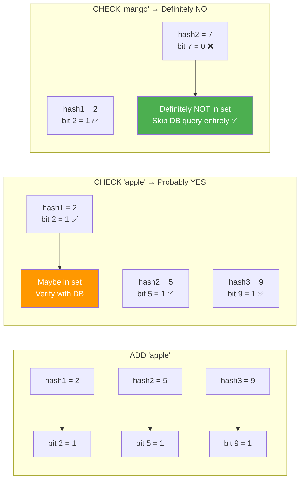
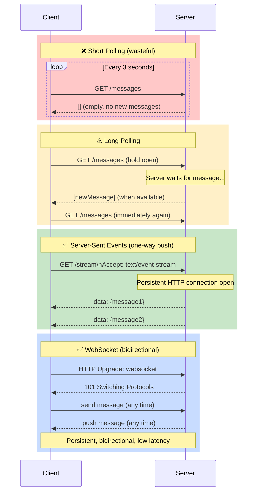
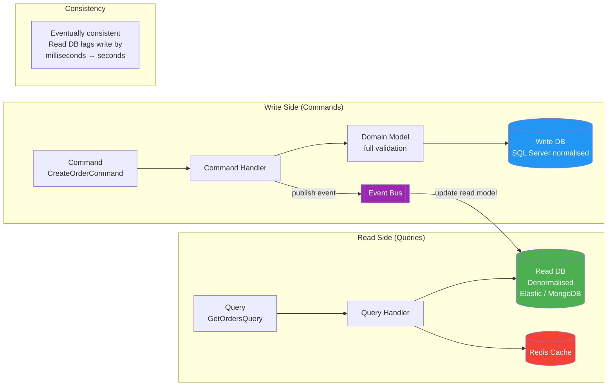

# 🔬 Advanced Topics — What Makes Recruiters Pause Mid-Scroll

> Redis internals · Kafka partitioning · CAP theorem · Consistent hashing · Bloom filters · WebSockets · Event sourcing · CQRS
> Every topic: how it works + when to use it + tradeoffs.

---

## 📋 Table of Contents

1. [Redis Internals](#1-redis-internals)
2. [Kafka Partitioning Deep Dive](#2-kafka-partitioning-deep-dive)
3. [CAP Theorem](#3-cap-theorem)
4. [Consistent Hashing](#4-consistent-hashing)
5. [Bloom Filters](#5-bloom-filters)
6. [CDN Caching Deep Dive](#6-cdn-caching-deep-dive)
7. [WebSockets vs Long Polling vs SSE](#7-websockets-vs-long-polling-vs-sse)
8. [Event Sourcing](#8-event-sourcing)
9. [CQRS Deep Dive](#9-cqrs-deep-dive)
10. [Tradeoffs — The Questions Interviewers Love](#10-tradeoffs--the-questions-interviewers-love)

---

## 1. Redis Internals

> 📚 Reference: https://redis.io/docs/

### Why Redis Is Fast
```
1. In-memory — no disk I/O for reads/writes
2. Single-threaded command processing — no lock contention
3. Non-blocking I/O — multiplexed via epoll/kqueue
4. Optimised data structures — purpose-built per type
5. Optional persistence — RDB snapshots or AOF journal (off the hot path)
```

### Data Structures and When to Use Each

| Structure | Commands | Use Case | Example |
|-----------|----------|----------|---------|
| **String** | GET/SET/INCR | Caching, counters, rate limiting | `SET session:abc "userId:123"` |
| **Hash** | HGET/HSET | Object with fields (user profile) | `HSET user:123 name Alice age 30` |
| **List** | LPUSH/RPOP | Queues, activity feeds (ordered) | Recent 10 actions, simple job queue |
| **Set** | SADD/SISMEMBER | Unique items, tags, membership | Online users, product tags |
| **Sorted Set** | ZADD/ZRANGE | Leaderboards, rate limiting, scheduled jobs | `ZADD leaderboard 1500 alice` |
| **Bitmap** | SETBIT/BITCOUNT | Compact boolean flags | Daily active user tracking (1 bit per user) |
| **HyperLogLog** | PFADD/PFCOUNT | Approximate cardinality | Count unique visitors (< 1% error, 12KB max) |
| **Stream** | XADD/XREAD | Event log, message queue | Lightweight Kafka alternative |

### Redis Sorted Set: Rate Limiting (Sliding Window)
```csharp
// Sliding window rate limiter using Sorted Set
// Key: ratelimit:{userId}, Score: timestamp, Member: request UUID
public async Task<bool> IsAllowedAsync(string userId, int limitPerMinute)
{
    var now    = DateTimeOffset.UtcNow.ToUnixTimeMilliseconds();
    var window = now - 60_000; // 1 minute ago
    var key    = $"ratelimit:{userId}";

    var script = @"
        redis.call('ZREMRANGEBYSCORE', KEYS[1], '-inf', ARGV[1])  -- remove old requests
        local count = redis.call('ZCARD', KEYS[1])                 -- count in window
        if count < tonumber(ARGV[2]) then
            redis.call('ZADD', KEYS[1], ARGV[3], ARGV[3])          -- add this request
            redis.call('EXPIRE', KEYS[1], 60)
            return 1
        end
        return 0
    ";

    var result = await _redis.ScriptEvaluateAsync(script,
        keys:   new RedisKey[]  { key },
        values: new RedisValue[] { window, limitPerMinute, now });

    return (int)result == 1;
}
```

### Redis Persistence Options
| Mode | How | Data Loss Risk | Use When |
|------|-----|---------------|---------|
| No persistence | Memory only | On restart: all lost | Pure cache (rebuild from DB) |
| RDB snapshot | Point-in-time snapshot every N minutes | Last N minutes on crash | Cache + tolerate some loss |
| AOF (Append-Only File) | Log every write operation | Last second (fsync=everysec) | Session store, rate limiting state |
| AOF + RDB | Both | Minimal | Critical data (sessions, locks) |

### Redis Dangerous Patterns
```csharp
// ❌ KEYS * in production — blocks single-threaded Redis for seconds
var keys = _redis.Multiplexer.GetServer(endpoint).Keys(pattern: "session:*");
// Scans ALL keys — blocks entire Redis for millions of keys

// ✅ SCAN instead — non-blocking, batched
var cursor = 0;
do {
    var result = await _redis.ExecuteAsync("SCAN", cursor.ToString(), "MATCH", "session:*", "COUNT", "100");
    // process batch
} while (cursor != 0);

// ❌ No TTL — Redis fills RAM, evicts unpredictably
await _redis.StringSetAsync("user:profile:123", data); // no expiry!

// ✅ Always set TTL on cached data
await _redis.StringSetAsync("user:profile:123", data, TimeSpan.FromHours(1));

// ❌ Caching mutable, user-specific data without invalidation
// Cache holds stale price after product update → users see wrong price
// ✅ Cache invalidation strategy: event-driven invalidation on write
await _bus.PublishAsync(new ProductUpdatedEvent(productId)); // subscriber clears cache
```

---

## 2. Kafka Partitioning Deep Dive

> 📚 Reference: https://kafka.apache.org/documentation/

### Partition Key Strategy
```
Topic: orders (6 partitions)

With key = customerId:
  hash("customer-123") % 6 = 3  → Partition 3
  hash("customer-456") % 6 = 1  → Partition 1
  hash("customer-123") % 6 = 3  → Partition 3 (always same customer → same partition)

Guarantees: All events for customer-123 are:
  1. In Partition 3
  2. Ordered within Partition 3
  3. Processed by the SAME consumer instance

This matters for:
  - Order state machines (events must be ordered per order)
  - Account balance changes (must be serialised per account)
  - Session events (must be correlated per session)
```

### Consumer Group Rebalancing
```
Initial state:
  Consumers: [C1, C2, C3]
  Partitions: [P0, P1, P2, P3, P4, P5]
  Assignment: C1→[P0,P1], C2→[P2,P3], C3→[P4,P5]

C3 crashes:
  Rebalance triggered:
  C1→[P0,P1,P4], C2→[P2,P3,P5]
  During rebalance: all consumption pauses briefly

New C4 joins:
  Rebalance: C1→[P0,P1], C2→[P2,P3], C4→[P4,P5]

Key insight: Adding consumers beyond partition count = idle consumers
  6 partitions + 8 consumers → 2 consumers idle
  Always: partitions ≥ max consumers for full parallelism
```

### Lag Monitoring
```
Consumer Lag = Latest Offset - Consumer's Committed Offset
= How many messages behind the consumer is

High lag = consumer can't keep up with producer rate
Action: scale out consumer instances (up to partition count)

// Check lag:
kafka-consumer-groups.sh --bootstrap-server localhost:9092 \
  --describe --group payment-service
```

### Compacted Topics (for Event Sourcing / Changelog)
```
Normal topic: all messages retained for N days, then deleted
log: [create-order][update-order][cancel-order][create-order][update-order]

Compacted topic: only the LATEST value per key is retained
key=order-123: only last event survives
→ Enables: read entire topic to rebuild current state
→ Used for: change data capture, materialised views, config

CREATE TABLE equivalent:
ZADD products 1 '{"id":1,"price":10}' → price updated → ZADD products 2 '{"id":1,"price":12}'
→ old record compacted away → latest state always available
```

---

## 3. CAP Theorem

### The Theorem
In a distributed system, you can guarantee at most **2 of 3** properties simultaneously:

```
C — Consistency:     Every read returns the most recent write (or an error)
A — Availability:    Every request receives a response (not necessarily latest data)
P — Partition Tolerance: System continues despite network partition (lost messages between nodes)

Network partitions ALWAYS happen in distributed systems.
Therefore P is non-negotiable → you choose between C and A.
```

### CA vs CP vs AP Systems

```
CP (Consistent + Partition Tolerant):
  During partition: some nodes refuse requests to stay consistent
  Examples: ZooKeeper, HBase, MongoDB (strong consistency mode)
  Trade: availability. "Better unavailable than wrong."

AP (Available + Partition Tolerant):
  During partition: nodes stay up and accept writes
  May return stale data until partition heals
  Examples: Cassandra, DynamoDB, CouchDB
  Trade: consistency. "Better stale than unavailable."

CA (Consistent + Available):
  Only possible if there are no network partitions
  → Impossible in distributed systems
  → Traditional RDBMS in single-node deployment
```

### Practical Examples

```
Cassandra (AP):
  Write to Node A during partition from Node B
  → Both nodes accept writes → conflict on recovery
  → Resolution: last-write-wins or application merge
  Use for: availability-critical (shopping cart, session)

ZooKeeper (CP):
  During partition: minority partition refuses writes
  → Leader election: only majority partition is active
  Use for: distributed locks, leader election, config

RDBMS (effectively CA on single node):
  One node → no partition → consistent + available
  Add replication → now distributed → CP or AP choice
```

### PACELC Extension
```
Even when there's no partition (E = else), you choose between:
  Latency vs Consistency

Example: DynamoDB
  Partition: AP (available over consistent)
  Normal: EL (low latency over strong consistency)
  → Strongly consistent read: forces coordination → higher latency
  → Eventually consistent read: returns immediately, may be stale
```

---

## 4. Consistent Hashing

### The Problem with Simple Hashing
```
Simple: hash(key) % N_servers
  
3 servers: hash("key") % 3 = server 1
Add server → 4 servers: hash("key") % 4 = server 2 (DIFFERENT!)
→ 75% of cached keys now point to wrong servers
→ Massive cache miss storm on every scale event
```

### The Solution: Hash Ring
```
Imagine a ring with 2^32 positions (0 to 4,294,967,295)

Hash each SERVER to a position on the ring:
  Server A → position 10
  Server B → position 30
  Server C → position 70

Hash each KEY to a position:
  "user:123" → position 15 → clockwise → Server B (position 30)
  "order:456" → position 25 → clockwise → Server B (position 30)
  "session:789" → position 55 → clockwise → Server C (position 70)

Add Server D at position 50:
  "order:456" at 25 → now routes to Server D (50) not B (30)
  Only keys between Server A (10) and Server D (50) are remapped!
  → ~25% remapped (1/N), not 75%
```

### Virtual Nodes (for Uniform Distribution)
```
Problem with basic ring: servers cluster, uneven load
Solution: each server gets 150 virtual nodes spread around the ring

Server A: positions 10, 85, 200, 312, ... (150 positions)
Server B: positions 30, 92, 215, 330, ... (150 positions)
Server C: positions 70, 110, 250, 355, ... (150 positions)

Each physical server handles ~33% of keyspace evenly
Adding a server: remaps only 1/(N+1) of keys, distributed evenly
```

```csharp
public class ConsistentHashRing
{
    private readonly SortedDictionary<uint, string> _ring = new();
    private const int VirtualNodesPerServer = 150;
    private readonly HashAlgorithm _hasher = MD5.Create();

    public void AddServer(string server)
    {
        for (int i = 0; i < VirtualNodesPerServer; i++)
        {
            var hash = GetHash($"{server}-vnode-{i}");
            _ring[hash] = server;
        }
    }

    public string GetServer(string key)
    {
        if (_ring.Count == 0) throw new InvalidOperationException("No servers");
        var hash = GetHash(key);

        // Find first server at or after this hash (clockwise)
        var node = _ring.FirstOrDefault(kvp => kvp.Key >= hash);
        return node.Value ?? _ring.First().Value; // wrap around
    }

    private uint GetHash(string input)
    {
        var bytes = _hasher.ComputeHash(Encoding.UTF8.GetBytes(input));
        return BitConverter.ToUInt32(bytes, 0);
    }
}
```

**Used by:** Redis Cluster, Amazon DynamoDB, Apache Cassandra, CDN routing.

---

## 5. Bloom Filters

### What Is It?
A space-efficient probabilistic data structure that answers: "Is this element in the set?" with:
- **False negatives: NEVER** (if Bloom says "no", it's definitely not in the set)
- **False positives: POSSIBLE** (if Bloom says "yes", it might not be in the set — check the source)

```
Use case: "Has user X ever visited this URL?"
Without Bloom: DB query for every URL visit (expensive)
With Bloom:   If Bloom says NO → definitely not visited (skip DB query)
              If Bloom says YES → might have visited (verify with DB)
→ Eliminates most DB queries for "definitely not visited" cases
```

### How It Works
```
Bloom filter = bit array of size m, initialized to 0
              + k different hash functions

ADD "apple":
  hash1("apple") = 2  → bit[2] = 1
  hash2("apple") = 5  → bit[5] = 1
  hash3("apple") = 9  → bit[9] = 1

CHECK "apple":
  hash1 → bit[2] = 1 ✓
  hash2 → bit[5] = 1 ✓
  hash3 → bit[9] = 1 ✓
  → "Probably YES" (all bits set)

CHECK "mango":
  hash1 → bit[2] = 1 ✓ (set by "apple")
  hash2 → bit[7] = 0 ✗
  → "Definitely NO" (one bit not set)
```

### Real-World Uses
```
1. Cache stampede prevention:
   Bloom filter: "is this key likely in cache?"
   NO → don't even check Redis
   YES → check Redis (might be false positive)

2. Database write amplification:
   "Does this username already exist?"
   NO (Bloom) → definitely available → skip DB check
   YES (Bloom) → might exist → verify with DB

3. Malicious URL detection:
   Google Safe Browsing: Bloom filter of malicious URLs
   Check locally first → false positive → verify with server
   Reduces server load by 99%+

4. Bitcoin node (UTXO set):
   Fast check if a transaction output has been spent

// Redis built-in Bloom filter (RedisBloom module)
await _redis.ExecuteAsync("BF.ADD", "visited-urls", url);
var exists = (int)await _redis.ExecuteAsync("BF.EXISTS", "visited-urls", url) == 1;
```

---

## 6. CDN Caching Deep Dive

### Cache Hierarchy
```
User's browser cache (private)
  └─ ISP cache
       └─ CDN Edge node (geographically nearest)
            └─ CDN Origin Shield (regional mid-tier cache)
                 └─ Origin server (your API/storage)

First request (cache miss all the way to origin):
  User → Edge MISS → Origin Shield MISS → Origin → response cached at Shield + Edge
  Latency: ~200ms

Subsequent requests (edge cache hit):
  User → Edge HIT → serve immediately
  Latency: ~3ms

```

### Cache Invalidation Strategies

```
1. TTL-based expiry (passive invalidation):
   Cache-Control: max-age=300
   → Stale content served for up to 5 minutes after change
   → Simple, no infrastructure needed

2. Purge on update (active invalidation):
   await _cdnClient.PurgeAsync($"/api/products/{productId}");
   → Instant freshness after product price change
   → Requires CDN API integration

3. Cache-busting with content hash (best for static assets):
   app.a1b2c3d4.js → change content → app.e5f6a7b8.js
   → Old filename cached forever (immutable)
   → New filename fetched from origin
   → No invalidation API calls needed

4. Stale-while-revalidate:
   Cache-Control: max-age=60, stale-while-revalidate=600
   → Serve stale content immediately (fast)
   → Async revalidate in background
   → Next request gets fresh content (no user waits)
```

### Surrogate Keys / Cache Tags
```
Tag all cached responses for a product with its ID:
  GET /products/123 → Surrogate-Key: product-123
  GET /products/123/reviews → Surrogate-Key: product-123 reviews-123

When product 123 is updated:
  Purge by tag: "product-123"
  → Invalidates ALL responses tagged with product-123
  → Product page + reviews + any other pages using that product
  → One API call invalidates entire content graph
```

---

## 7. WebSockets vs Long Polling vs SSE

### Comparison
| | Short Polling | Long Polling | SSE | WebSocket |
|-|--------------|-------------|-----|-----------|
| Protocol | HTTP | HTTP | HTTP | WebSocket (ws://) |
| Direction | Client → Server | Client → Server | Server → Client | Bidirectional |
| Connection | New per request | Held open, reopened | Persistent | Persistent |
| Latency | High (poll interval) | Low (when msg ready) | Low | Lowest |
| Server load | High (many requests) | Medium | Low | Low |
| Use for | Simple status checks | Notifications | Live feeds | Chat, games, collab |
| Browser support | ✅ Universal | ✅ Universal | ✅ Universal | ✅ Universal |

### Server-Sent Events (SSE) — Server Push over HTTP
```csharp
// SSE: perfect for one-way server push (notifications, live feeds)
[HttpGet("orders/{id}/status-stream")]
public async Task StreamStatus(Guid id, CancellationToken ct)
{
    Response.Headers["Content-Type"]  = "text/event-stream";
    Response.Headers["Cache-Control"] = "no-cache";
    Response.Headers["Connection"]    = "keep-alive";

    while (!ct.IsCancellationRequested)
    {
        var order = await _db.Orders.FindAsync(id);
        await Response.WriteAsync($"data: {JsonSerializer.Serialize(order)}\n\n", ct);
        await Response.Body.FlushAsync(ct);

        if (order?.Status is "Completed" or "Cancelled") break;
        await Task.Delay(2000, ct);
    }
}
```

```js
// JavaScript SSE client
const source = new EventSource('/api/orders/abc123/status-stream');
source.onmessage = (e) => {
  const order = JSON.parse(e.data);
  updateUI(order.status);
  if (order.status === 'Completed') source.close();
};
```

### When to Choose WebSocket over SSE
```
Use SSE (simpler) when:
  ✅ Only server needs to push data (order status, live scores)
  ✅ HTTP/2 multiplexing reduces connection overhead
  ✅ Auto-reconnect built into browser
  ✅ Simple HTTP — works through proxies/firewalls

Use WebSocket when:
  ✅ Bidirectional: client also sends data (chat, collaborative editing)
  ✅ Very high frequency updates (< 50ms, gaming)
  ✅ Binary data (WebRTC negotiation, custom protocols)
```

---

## 8. Event Sourcing

### What Is It?
Instead of storing **current state**, store the **sequence of events** that led to it. Current state is derived by replaying events.

```
Traditional (state store):
  Table: orders
    id=123, status=Shipped, total=99.99, updatedAt=...
  → Can't answer: "What was the status 3 days ago?"
  → Can't answer: "Who changed this and why?"

Event Sourcing (event store):
  events for order 123:
    1. OrderCreated    { total: 99.99, customerId: 456 }
    2. PaymentReceived { amount: 99.99, txnId: "stripe_abc" }
    3. ItemShipped     { trackingNumber: "UPS123" }
    4. OrderDelivered  {}
  
  Current state = replay events 1→4
  State at any past time = replay events up to that timestamp
  Full audit trail = free
  Debugging = replay to reproduce any state
```

### Implementation
```csharp
// Event store (append-only)
public class OrderAggregate
{
    public Guid   Id     { get; private set; }
    public string Status { get; private set; } = "New";
    public decimal Total  { get; private set; }

    private readonly List<IDomainEvent> _uncommittedEvents = new();

    // Reconstitute from event history
    public static OrderAggregate Rehydrate(IEnumerable<IDomainEvent> history)
    {
        var order = new OrderAggregate();
        foreach (var evt in history)
            order.Apply(evt);
        return order;
    }

    // Business method — raises event (doesn't save directly)
    public void Ship(string trackingNumber)
    {
        if (Status != "Paid") throw new InvalidOperationException("Cannot ship unpaid order");
        RaiseEvent(new OrderShippedEvent(Id, trackingNumber, DateTime.UtcNow));
    }

    private void RaiseEvent(IDomainEvent evt)
    {
        Apply(evt);                         // update in-memory state
        _uncommittedEvents.Add(evt);        // queue for persistence
    }

    // Apply — deterministic state change from event
    private void Apply(IDomainEvent evt)
    {
        switch (evt)
        {
            case OrderCreatedEvent e:  Id = e.OrderId; Total = e.Total; Status = "Created"; break;
            case PaymentReceivedEvent: Status = "Paid"; break;
            case OrderShippedEvent:    Status = "Shipped"; break;
            case OrderDeliveredEvent:  Status = "Delivered"; break;
        }
    }

    public IReadOnlyList<IDomainEvent> UncommittedEvents => _uncommittedEvents;
    public void ClearEvents() => _uncommittedEvents.Clear();
}

// Repository: load from event store, save events
public async Task<OrderAggregate> LoadAsync(Guid orderId)
{
    var events = await _eventStore.LoadAsync(orderId);
    return OrderAggregate.Rehydrate(events);
}

public async Task SaveAsync(OrderAggregate order)
{
    await _eventStore.AppendAsync(order.Id, order.UncommittedEvents);
    order.ClearEvents();
}
```

### Tradeoffs

| | Event Sourcing | Traditional State |
|-|---------------|-----------------|
| Audit trail | ✅ Free, complete | ❌ Requires extra work |
| Historical queries | ✅ Replay to any point | ❌ Need snapshots |
| Complexity | High | Low |
| Schema migration | Hard (old events must stay valid) | Standard EF migrations |
| Query performance | ❌ Must project to read model | ✅ Direct DB query |
| Debugging | ✅ Replay and inspect | Limited |
| Use when | Financial systems, audit-critical, domain with complex state machine | Most CRUD apps |

### Snapshots (Performance Optimization)
```
Problem: 10,000 events per order → replay takes seconds
Solution: periodic snapshot

Every 100 events, save: { "state": { status: "Paid", total: 99.99 }, "version": 100 }
On load: start from latest snapshot + replay only events since snapshot
→ Max 100 events to replay instead of 10,000
```

---

## 9. CQRS Deep Dive

### Why Separate Read and Write Models?

```
Problem: Same model for reads and writes
  Order entity has: 30 navigation properties, complex validation, 
  business rules, change tracking overhead
  
  But for the order list page, you need: 5 fields, flat DTO, 
  fast query, no tracking

CQRS:
  Write side (Commands): rich domain model, full validation, EF tracked
  Read side (Queries):   flat DTOs, AsNoTracking, projections, possibly separate DB
```

### Read Model Synchronisation
```
Option 1: Same DB, different queries (simple CQRS)
  Write: _db.Orders.Add(order); // tracked, validated
  Read:  _db.Orders.AsNoTracking().Select(new OrderListDto...) // fast projection

Option 2: Separate read database (full CQRS)
  Write → SQL Server (normalised, ACID)
            │
            └─ Publish event → Update read store
  Read  → Elasticsearch / Redis / MongoDB (denormalised, fast)
  
  Eventual consistency: read store lags behind write store by milliseconds-seconds
```

### Full CQRS with MediatR
```csharp
// COMMAND side — rich domain model
public record CreateOrderCommand(Guid CustomerId, List<OrderItemDto> Items) : IRequest<Guid>;

public class CreateOrderHandler : IRequestHandler<CreateOrderCommand, Guid>
{
    public async Task<Guid> Handle(CreateOrderCommand cmd, CancellationToken ct)
    {
        // Full domain validation
        var customer = await _db.Customers.FindAsync(cmd.CustomerId, ct)
            ?? throw new NotFoundException("Customer not found");
        if (customer.IsBlacklisted) throw new BusinessRuleException("Customer is blacklisted");

        var order = Order.Create(cmd.CustomerId, cmd.Items); // domain factory
        _db.Orders.Add(order);
        await _db.SaveChangesAsync(ct);

        // Publish integration event for read model update
        await _bus.PublishAsync(new OrderCreatedIntegrationEvent(order.Id), ct);
        return order.Id;
    }
}

// QUERY side — optimised read
public record GetOrdersQuery(string? Status, int Page, int Size) : IRequest<PagedResult<OrderListDto>>;

public class GetOrdersHandler : IRequestHandler<GetOrdersQuery, PagedResult<OrderListDto>>
{
    public async Task<PagedResult<OrderListDto>> Handle(GetOrdersQuery query, CancellationToken ct)
    {
        // AsNoTracking — no change tracker overhead
        // Select projection — only fetch needed columns
        var q = _readDb.Orders
            .AsNoTracking()
            .Where(o => query.Status == null || o.Status == query.Status)
            .Select(o => new OrderListDto(
                o.Id, o.Status, o.Total,
                o.Customer.Name,         // no N+1 — EF generates JOIN
                o.CreatedAt));

        var total = await q.CountAsync(ct);
        var items = await q.Skip((query.Page - 1) * query.Size)
                           .Take(query.Size)
                           .ToListAsync(ct);

        return new PagedResult<OrderListDto>(items, total, query.Page, query.Size);
    }
}
```

---

## 10. Tradeoffs — The Questions Interviewers Love

### Why Kafka over RabbitMQ?

```
Choose Kafka when:
✅ You need message REPLAY (consumers can re-read from the beginning)
✅ Event sourcing / change data capture (Kafka as the event log)
✅ Very high throughput (millions of messages/sec)
✅ Multiple independent consumer groups reading same topic
✅ Long message retention (days to forever)

Choose RabbitMQ when:
✅ Complex routing (topic exchange, fanout, headers)
✅ Per-message TTL and priority queues
✅ Simple work queue (each message processed exactly once by one consumer)
✅ Simpler ops (no ZooKeeper, smaller cluster)
✅ < 100k messages/sec throughput

Key difference: Kafka is a LOG (consumers read at their own pace, messages retained).
RabbitMQ is a QUEUE (messages consumed and deleted).
```

### Why Cursor Pagination over Offset?

```
Offset: SELECT * FROM Orders SKIP 50000 TAKE 20
→ DB scans 50,020 rows, discards first 50,000
→ O(n) cost — page 2500 is 2500x slower than page 1
→ If new item inserted on page 1, all items shift → page 25 shows duplicate/skipped item

Cursor: SELECT * FROM Orders WHERE id > {lastSeenId} TAKE 20
→ B-tree lookup on id → O(log n) regardless of position
→ New inserts don't affect pagination
→ Only limitation: can't jump to page 50 (forward/backward only)
```

### Why Optimistic Locking Here?

```
Use optimistic locking when:
✅ Contention is LOW (most operations succeed without conflict)
✅ You need concurrent reads (no read locks)
✅ Short transactions (less time holding locks)

Use pessimistic locking when:
✅ Contention is HIGH (many concurrent updates to same row)
✅ Long transactions (need exclusive access throughout)
✅ You can't tolerate retries

// Optimistic: read freely, detect conflict on write
// EF Core RowVersion:
[Timestamp] public byte[] RowVersion { get; set; }
// On SaveChanges: WHERE Id = @id AND RowVersion = @originalVersion
// If 0 rows updated → DbUpdateConcurrencyException → retry or return 409
```

### Why Redis Cache Can Become Dangerous

```
1. Cache stampede (thundering herd):
   Popular key expires → 10,000 requests all miss → all hit DB simultaneously
   Fix: probabilistic early expiration, mutex/lock for first miss, background refresh

2. Cache aside without TTL:
   Stale data never evicted → users see wrong prices/stock forever
   Fix: always set TTL; event-driven invalidation on update

3. Redis as primary store (not cache):
   Redis crashes → all data lost (if persistence not configured)
   Fix: Redis persistence (AOF) or use as cache-only (DB is source of truth)

4. Large key operations:
   KEYS * on 10M keys → blocks Redis for seconds → cascading failures
   HSET with 10,000 fields → slow serialisation/deserialisation
   Fix: SCAN, pipeline commands, split large hashes

5. Memory pressure:
   No maxmemory set → Redis grows until OOM → process killed
   Fix: set maxmemory + eviction policy (allkeys-lru for cache)

redis.conf:
  maxmemory 4gb
  maxmemory-policy allkeys-lru   # evict least recently used when full
```

---

> ✅ **10 advanced topics** — the ones that get highlighted in interview feedback.
>
> 💡 **How to use tradeoffs in interviews:**
> "I'd choose Kafka here because we need event replay for our audit requirements, and we have 3 independent consumer groups that need to read the same events. If it were a simple work queue, I'd reach for Service Bus or RabbitMQ — simpler to operate."
>
> Never say "X is better than Y." Always say: "X is better **in this context** because..."

---

*Last updated: 2026 | Redis 7 / Kafka 3 / .NET 8*

---

# ⚖️ Advanced Topics Comparisons — Side-by-Side Differences

---

## ADV-C1 — Redis vs Memcached

| | Redis | Memcached |
|-|-------|-----------|
| Data structures | String, Hash, List, Set, Sorted Set, Stream | String / binary blobs only |
| Persistence | ✅ RDB / AOF | ❌ Memory only |
| Pub/Sub | ✅ | ❌ |
| Cluster / sharding | ✅ Redis Cluster | ✅ Client-side sharding |
| Lua scripting | ✅ Atomic scripts | ❌ |
| Transactions | ✅ MULTI/EXEC | ❌ |
| Multi-threading | ✅ (Redis 6+ I/O threads) | ✅ Multi-threaded |
| Use for | Cache + pub/sub + queues + sessions + rate limiting | Pure simple cache, max throughput |

```
Choose Redis when: you need any feature beyond plain string cache
  — Leaderboard (Sorted Set), rate limiter (Lua + EXPIRE), pub/sub, sessions, queues

Choose Memcached when: pure in-memory cache, simplicity, and you have existing Memcached infra
```

---

## ADV-C2 — Event Sourcing vs CQRS vs Traditional CRUD

| | Traditional CRUD | CQRS | Event Sourcing |
|-|-----------------|------|----------------|
| State storage | Current state only | Current state (separate read/write) | All events that led to state |
| History / audit | ❌ Overwritten | ❌ Overwritten | ✅ Free |
| Read model | Same as write | Separate, optimised | Projected from events |
| Complexity | Low | Medium | High |
| Schema migration | Easy | Medium | Hard (old events must remain valid) |
| Debugging | Hard (what changed?) | Medium | ✅ Replay events to reproduce |
| Use for | Most CRUD apps | Read-heavy with complex queries | Financial, audit-critical, domain-event-heavy |

```
CRUD: Table has one row per entity — UPDATE overwrites state
CQRS: Write to SQL (normalised), read from Elasticsearch (denormalised) — separate models
Event Sourcing: Table has all events — current state = replay of events
```

---

## ADV-C3 — Kafka vs RabbitMQ vs Azure Service Bus vs Redis Pub/Sub

| | Kafka | RabbitMQ | Azure Service Bus | Redis Pub/Sub |
|-|-------|----------|------------------|--------------|
| Message retention | Days / forever | Deleted after consume | Configurable (max 80 GB) | ❌ No persistence |
| Replay | ✅ Yes | ❌ No | ❌ No | ❌ No |
| Throughput | ✅ Millions/sec | ~100k/sec | ~10k/sec | ✅ Very high |
| Consumer groups | ✅ Independent | Exchange + queues | ✅ Sessions + subscriptions | ❌ All subscribers |
| Ordering | Per-partition | Per-queue | ✅ Sessions | ❌ |
| Dead letter | ✅ | ✅ | ✅ | ❌ |
| Management overhead | High (ZooKeeper, tuning) | Medium | ✅ Managed SaaS | Low |
| Use for | Event streaming, replay, audit log | Work queues, complex routing | Azure-native apps | Real-time broadcast, ephemeral pub/sub |

---

## ADV-C4 — WebSocket vs Server-Sent Events (SSE) vs Long Polling vs Short Polling

| | Short Polling | Long Polling | SSE | WebSocket |
|-|--------------|-------------|-----|-----------|
| Direction | Client → Server | Client → Server | Server → Client | Bidirectional |
| Connection | New per poll | Held open, reopened | Persistent | Persistent (ws://) |
| Protocol | HTTP | HTTP | HTTP | WebSocket upgrade |
| Latency | High (poll interval) | Low | Low | Lowest |
| Server load | ❌ High (many requests) | Medium | ✅ Low | ✅ Low |
| Reconnect | Manual | Manual | ✅ Automatic browser | Manual |
| Proxy/firewall friendly | ✅ | ✅ | ✅ | ❌ Sometimes blocked |
| Use for | Status checks, infrequent | Notifications, chat fallback | Live feeds, notifications | Chat, games, collaborative editing |

```typescript
// SSE — server pushes only (simpler)
// Server:
Response.Headers["Content-Type"] = "text/event-stream";
await Response.WriteAsync($"data: {json}\n\n");

// Client:
const source = new EventSource('/api/stream');
source.onmessage = e => updateUI(JSON.parse(e.data));

// WebSocket — bidirectional
// Server: SignalR Hub
await Clients.All.SendAsync("OrderUpdated", order);
// Client:
const conn = new signalR.HubConnectionBuilder().withUrl("/hub").build();
conn.on("OrderUpdated", order => updateUI(order));
conn.invoke("SendMessage", "Hello");  // client → server ← only WebSocket can do this
```

---

## ADV-C5 — Consistent Hashing vs Simple Modulo Hashing

| | Modulo Hashing (`hash(key) % N`) | Consistent Hashing |
|-|----------------------------------|-------------------|
| Add/remove node | ❌ Remaps ~(N-1)/N keys | ✅ Remaps ~1/N keys |
| Cache miss on scale | ❌ Massive (75% for N=3→4) | ✅ Minimal (~25%) |
| Complexity | Low | Medium |
| Use for | Single-server or fixed-size pools | Distributed caches, databases, CDN routing |

```
Modulo: 3 → 4 servers = hash("key") % 3 = server 1, hash("key") % 4 = server 2 → DIFFERENT
→ 75% of all keys suddenly point to wrong server = cache stampede

Consistent hashing: add server D between A and C
→ Only keys between B and D remapped (~25%) → all others unaffected
```

---

## ADV-C6 — CAP Theorem: CP vs AP Real Examples

| System | Type | Why |
|--------|------|-----|
| PostgreSQL (single node) | CA | No distributed partition possible |
| PostgreSQL with replication | CP | During partition, replica refuses writes |
| Cassandra | AP | Accepts writes on any node, resolves conflict later |
| MongoDB (default) | CP | Primary required for writes |
| DynamoDB (eventual) | AP | Always available, may serve stale |
| DynamoDB (strong consistent) | CP | Sacrifices availability for consistency |
| ZooKeeper | CP | Leader required, minority partition unavailable |
| Redis Cluster | AP (usually) | May serve stale reads during partition |
| Kafka | CP | Partition requires quorum to elect leader |

```
Practical rule:
Money/inventory → CP (better unavailable than wrong)
User feed/notifications → AP (better stale than down)
Session data → AP (slightly stale session OK, downtime is not)
Order placement → CP (never double-charge, never oversell)
```

---

## ADV-C7 — Bloom Filter vs Hash Set vs Binary Search vs Database Lookup

| | Database Lookup | HashSet | Binary Search | Bloom Filter |
|-|----------------|---------|---------------|--------------|
| False negatives | ❌ Possible (DB inconsistency) | ❌ None | ❌ None | ❌ None (guaranteed) |
| False positives | ❌ None | ❌ None | ❌ None | ✅ Possible (small %) |
| Memory | ❌ Disk | Memory (full objects) | Memory (sorted) | ✅ Very small (bits) |
| Speed | Slowest (I/O) | O(1) | O(log n) | ✅ O(k) — constant |
| Use for | Source of truth | In-memory membership | Sorted data membership | Pre-filter before expensive lookup |

```
Pattern: Bloom Filter → HashSet/DB
"Is this URL malicious?"
1. Bloom says NO → definitely safe, skip DB (99% of cases)
2. Bloom says MAYBE → check DB for confirmation
→ DB load reduced by 99%+ with < 1% false positive rate
```

---

## ADV-C8 — Long Polling vs Server-Sent Events: When Each Wins

```
Long Polling wins when:
✅ Need bidirectional even if server-push focused
✅ Legacy browser support required
✅ SSE not supported by proxy/firewall
✅ Single-use notification (poll once, act, stop)

SSE wins when:
✅ Pure server → client stream (live scores, order status)
✅ Automatic browser reconnect built-in
✅ HTTP/2 multiplexing (multiple SSE streams per connection)
✅ Simpler server implementation than WebSocket

WebSocket wins when:
✅ Client must send data frequently too (chat, collaborative editing, gaming)
✅ Lowest possible latency required
✅ Binary data (audio, video signalling)
✅ Custom protocol needed
```


---

# 📊 Advanced Topics — Flow Diagrams

---

## ADV-D1 — Redis Data Structures Decision Tree



---

## ADV-D2 — Kafka Partition Rebalancing



---

## ADV-D3 — Bloom Filter Internals



---

## ADV-D4 — Event Sourcing vs Traditional State Storage

```mermaid
flowchart TD
    subgraph Traditional["Traditional (Store Current State)"]
        CMD1[createOrder] --> DB1[(DB: status=Created)]
        CMD2[payOrder] --> DB2[(DB: status=Paid)]
        CMD3[shipOrder] --> DB3[(DB: status=Shipped)]
        DB3 --> LIMIT["❌ Can't answer:\n'What was status on Tuesday?'\n'Who changed this?'"]
    end

    subgraph ES["Event Sourcing (Store Events)"]
        E1[OrderCreated\n{total: 99.99}]
        E2[PaymentReceived\n{txnId: 'stripe_1'}]
        E3[ItemShipped\n{tracking: 'UPS123'}]

        STORE[(Event Store\nAppend-only)]
        E1 --> STORE
        E2 --> STORE
        E3 --> STORE

        STORE -->|replay| STATE[Current State =\nReduce over events]
        STORE -->|replay to t=Tuesday| PAST[State at any past time ✅]
        STORE --> AUDIT[Full audit trail ✅]
    end

    style LIMIT fill:#ffcdd2,color:#333
    style AUDIT fill:#c8e6c9,color:#333
    style PAST fill:#c8e6c9,color:#333
```

---

## ADV-D5 — WebSocket vs SSE vs Long Polling



---

## ADV-D6 — CQRS Read vs Write Separation



