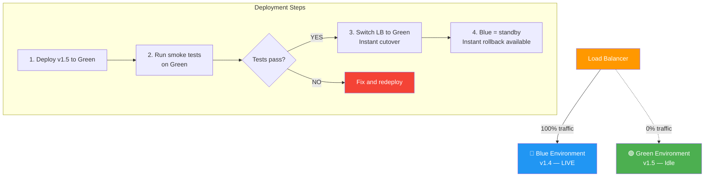
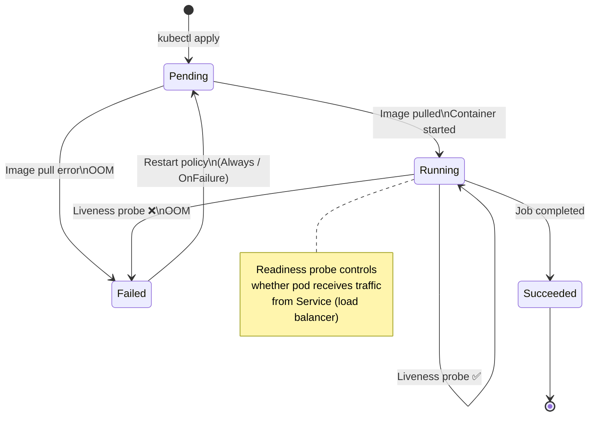
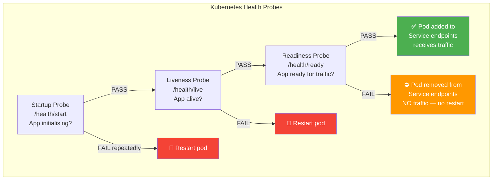
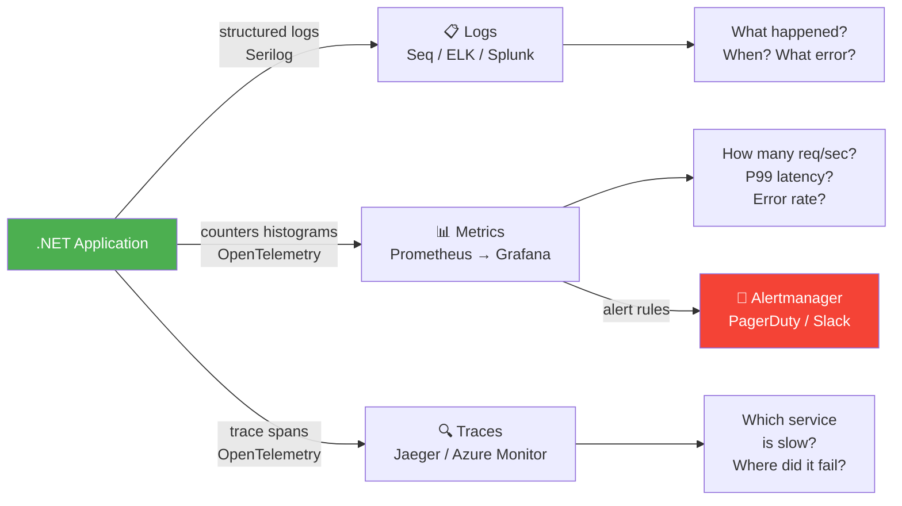
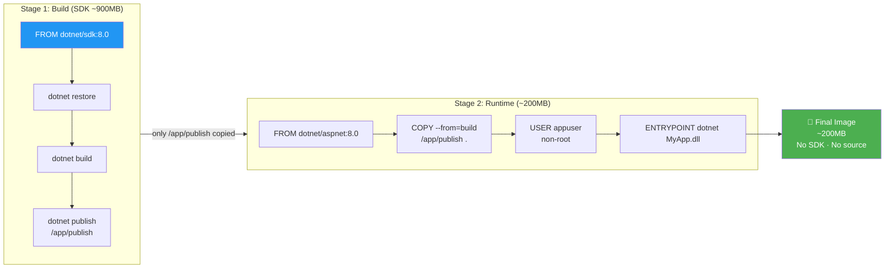
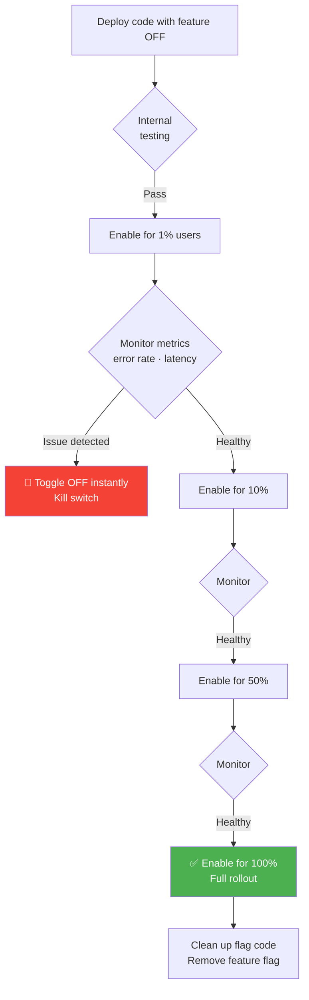

# ☁️ Cloud + DevOps Interview Guide

> Docker · Kubernetes · CI/CD · Deployment strategies · Observability · Feature flags
> Every concept includes diagram + code + tradeoff analysis.

---

## 📋 Table of Contents

1. [Docker Basics](#1-docker-basics)
2. [Kubernetes Basics](#2-kubernetes-basics)
3. [CI/CD Pipelines](#3-cicd-pipelines)
4. [Blue-Green Deployment](#4-blue-green-deployment)
5. [Rolling Deployment](#5-rolling-deployment)
6. [Horizontal Scaling](#6-horizontal-scaling)
7. [Load Balancing](#7-load-balancing)
8. [CDN (Content Delivery Network)](#8-cdn-content-delivery-network)
9. [Reverse Proxy](#9-reverse-proxy)
10. [Observability — Metrics, Logs, Traces](#10-observability--metrics-logs-traces)
11. [Prometheus & Grafana](#11-prometheus--grafana)
12. [Health Checks](#12-health-checks)
13. [Feature Flags](#13-feature-flags)

---

## 1. Docker Basics

> 📚 Reference: https://docs.docker.com/

### What is Docker and why does it solve "works on my machine"?

Docker packages your app + its **exact dependencies + OS libraries** into an image. The image runs identically on any machine with Docker — dev laptop, CI server, production.

```
Without Docker:
  Dev: "It works on my Windows 11 with .NET 8.0.5"
  Prod: "It crashes on Ubuntu with .NET 8.0.1"
  → library version mismatch

With Docker:
  Dev builds image → image contains .NET 8.0.5 + app + all deps
  Prod runs same image → identical environment
```

### Multi-Stage Dockerfile (.NET)

❌ **Wrong** — single stage: ships SDK + source code in production image (~900 MB):
```dockerfile
FROM mcr.microsoft.com/dotnet/sdk:8.0
WORKDIR /app
COPY . .
RUN dotnet build
ENTRYPOINT ["dotnet", "MyApp.dll"]
```

✅ **Correct** — multi-stage: build with SDK, ship only runtime (~200 MB):
```dockerfile
# Stage 1: Build
FROM mcr.microsoft.com/dotnet/sdk:8.0 AS build
WORKDIR /src
COPY ["MyApp.csproj", "."]
RUN dotnet restore
COPY . .
RUN dotnet publish -c Release -o /app/publish --no-restore

# Stage 2: Runtime — only the runtime image, no SDK
FROM mcr.microsoft.com/dotnet/aspnet:8.0 AS final
WORKDIR /app
EXPOSE 8080

# Security: run as non-root
RUN adduser --disabled-password --gecos "" appuser
USER appuser

COPY --from=build /app/publish .
ENTRYPOINT ["dotnet", "MyApp.dll"]
```

### Key Docker Commands
```bash
docker build -t myapp:1.0 .          # build image
docker run -p 8080:8080 myapp:1.0    # run container
docker ps                             # list running containers
docker logs <container-id>           # view logs
docker exec -it <id> /bin/bash       # shell into container
docker compose up -d                 # run multi-container stack
docker image prune                   # clean unused images
```

### Docker Compose (local dev)
```yaml
# docker-compose.yml
version: '3.9'
services:
  api:
    build: .
    ports: ["8080:8080"]
    environment:
      - ConnectionStrings__Default=Server=db;Database=myapp;User=sa;Password=Pass@word1;
    depends_on:
      db:
        condition: service_healthy

  db:
    image: mcr.microsoft.com/mssql/server:2022-latest
    environment:
      SA_PASSWORD: "Pass@word1"
      ACCEPT_EULA: "Y"
    healthcheck:
      test: /opt/mssql-tools/bin/sqlcmd -S localhost -U sa -P "Pass@word1" -Q "SELECT 1"
      interval: 10s
      retries: 5

  redis:
    image: redis:7-alpine
    ports: ["6379:6379"]
```

---

## 2. Kubernetes Basics

> 📚 Reference: https://kubernetes.io/docs/

### Core Objects
```
Cluster
  └── Nodes (VMs / physical machines)
        └── Pods (1+ containers, share network/storage)
              └── Containers (your Docker image)

Deployment  → declares desired state: "run 3 replicas of myapp:1.0"
Service     → stable DNS name + load balancing across pods
ConfigMap   → non-secret config (env vars, files)
Secret      → sensitive config (passwords, API keys) — base64 encoded
Ingress     → HTTP routing rules (path /api → service A, /web → service B)
HPA         → Horizontal Pod Autoscaler — scale pods based on CPU/memory
```

### Deployment YAML
```yaml
apiVersion: apps/v1
kind: Deployment
metadata:
  name: order-api
spec:
  replicas: 3                           # run 3 pods
  selector:
    matchLabels:
      app: order-api
  template:
    metadata:
      labels:
        app: order-api
    spec:
      containers:
      - name: order-api
        image: myregistry.azurecr.io/order-api:1.5.0
        ports:
        - containerPort: 8080
        env:
        - name: ASPNETCORE_ENVIRONMENT
          value: Production
        - name: ConnectionStrings__Default
          valueFrom:
            secretKeyRef:              # pull from Secret, not hardcoded
              name: db-secret
              key: connection-string
        resources:
          requests:
            cpu: "250m"                # 0.25 CPU
            memory: "256Mi"
          limits:
            cpu: "500m"
            memory: "512Mi"
        readinessProbe:                # pod ready to receive traffic?
          httpGet:
            path: /health/ready
            port: 8080
          initialDelaySeconds: 5
          periodSeconds: 10
        livenessProbe:                 # pod alive? restart if fails
          httpGet:
            path: /health/live
            port: 8080
          initialDelaySeconds: 15
          periodSeconds: 20
---
apiVersion: v1
kind: Service
metadata:
  name: order-api-svc
spec:
  selector:
    app: order-api
  ports:
  - port: 80
    targetPort: 8080
---
apiVersion: autoscaling/v2
kind: HorizontalPodAutoscaler
metadata:
  name: order-api-hpa
spec:
  scaleTargetRef:
    apiVersion: apps/v1
    kind: Deployment
    name: order-api
  minReplicas: 2
  maxReplicas: 20
  metrics:
  - type: Resource
    resource:
      name: cpu
      target:
        type: Utilization
        averageUtilization: 70         # scale out when avg CPU > 70%
```

### Tradeoffs: Docker Compose vs Kubernetes
| | Docker Compose | Kubernetes |
|-|---------------|------------|
| Learning curve | Low | High |
| Auto-healing | ❌ No | ✅ Yes — restarts failed pods |
| Auto-scaling | ❌ Manual | ✅ HPA |
| Rolling updates | Manual | ✅ Built-in |
| Service discovery | Basic | ✅ Full DNS |
| Use when | Local dev, small projects | Production, scale-out |

---

## 3. CI/CD Pipelines

> 📚 Reference: https://learn.microsoft.com/en-us/azure/devops/pipelines/

### Pipeline Stages
```
Code Push
    │
    ▼
[ CI — Continuous Integration ]
    ├─ Restore packages
    ├─ Build (dotnet build)
    ├─ Unit tests (dotnet test)
    ├─ Code coverage check (>80%)
    ├─ Static analysis (SonarQube, CodeQL)
    ├─ Security scan (OWASP dependency check)
    └─ Build Docker image + push to registry
    │
    ▼ (only if CI passes)
[ CD — Deploy to Staging ]
    ├─ Apply K8s manifests (kubectl apply)
    ├─ Run DB migrations
    ├─ Run smoke tests
    └─ Run integration tests
    │
    ▼ (manual approval gate)
[ CD — Deploy to Production ]
    ├─ Blue-green or rolling deploy
    ├─ Health check validation
    └─ Alert if failure → auto-rollback
```

### Azure Pipelines YAML
```yaml
trigger:
  branches:
    include: [main, release/*]

variables:
  imageTag: $(Build.BuildId)
  registry: myregistry.azurecr.io

stages:
- stage: CI
  jobs:
  - job: BuildAndTest
    pool:
      vmImage: ubuntu-latest
    steps:
    - task: UseDotNet@2
      inputs:
        version: '8.x'

    - script: dotnet restore
      displayName: Restore

    - script: dotnet build --no-restore -c Release
      displayName: Build

    - script: dotnet test --no-build --collect:"XPlat Code Coverage"
      displayName: Test

    - task: PublishCodeCoverageResults@1
      inputs:
        codeCoverageTool: Cobertura
        summaryFileLocation: '**/coverage.cobertura.xml'

    - task: Docker@2
      displayName: Build & Push Image
      inputs:
        command: buildAndPush
        repository: order-api
        tags: $(imageTag)

- stage: DeployStaging
  dependsOn: CI
  condition: succeeded()
  jobs:
  - deployment: Staging
    environment: staging
    strategy:
      runOnce:
        deploy:
          steps:
          - script: |
              sed -i "s|IMAGE_TAG|$(imageTag)|g" k8s/deployment.yaml
              kubectl apply -f k8s/deployment.yaml
              kubectl rollout status deployment/order-api --timeout=5m

- stage: DeployProd
  dependsOn: DeployStaging
  condition: succeeded()
  jobs:
  - deployment: Production
    environment: production   # requires manual approval in Azure DevOps
    strategy:
      runOnce:
        deploy:
          steps:
          - script: kubectl set image deployment/order-api order-api=$(registry)/order-api:$(imageTag)
```

---

## 4. Blue-Green Deployment

### How It Works
```
[ Load Balancer ]
      │
      ├──► Blue (v1.4 — LIVE, receiving 100% traffic)
      └──► Green (v1.5 — idle, being deployed to)

Steps:
1. Deploy v1.5 to Green environment
2. Run smoke tests against Green
3. Flip load balancer → Green receives 100% traffic
4. Blue becomes idle (instant rollback: flip back to Blue)
5. After confidence: decommission/reuse Blue for next release

[ Load Balancer ]
      │
      └──► Green (v1.5 — now LIVE, receiving 100% traffic)
      └──► Blue (v1.4 — standby for rollback)
```

### Kubernetes Blue-Green
```yaml
# Blue deployment (current)
apiVersion: apps/v1
kind: Deployment
metadata:
  name: order-api-blue
  labels:
    version: blue
spec:
  replicas: 3
  selector:
    matchLabels: { app: order-api, version: blue }
  template:
    metadata:
      labels: { app: order-api, version: blue }
    spec:
      containers:
      - name: order-api
        image: order-api:1.4.0
---
# Green deployment (new version)
apiVersion: apps/v1
kind: Deployment
metadata:
  name: order-api-green
spec:
  replicas: 3
  selector:
    matchLabels: { app: order-api, version: green }
  template:
    metadata:
      labels: { app: order-api, version: green }
    spec:
      containers:
      - name: order-api
        image: order-api:1.5.0
---
# Service — switch by changing selector
apiVersion: v1
kind: Service
metadata:
  name: order-api-svc
spec:
  selector:
    app: order-api
    version: blue     # ← change to "green" to flip traffic instantly
  ports:
  - port: 80
    targetPort: 8080
```

```bash
# Flip traffic to green (instant, zero-downtime)
kubectl patch service order-api-svc -p '{"spec":{"selector":{"version":"green"}}}'

# Rollback instantly
kubectl patch service order-api-svc -p '{"spec":{"selector":{"version":"blue"}}}'
```

### Tradeoffs vs Rolling Deployment
| | Blue-Green | Rolling |
|-|-----------|---------|
| Rollback speed | Instant (flip LB) | Slow (roll back each pod) |
| Resource cost | 2x (both envs live) | 1x + extra pods during update |
| Downtime | Zero | Zero |
| DB migrations | Hard (both versions run simultaneously) | Hard |
| Use when | Instant rollback critical | Resource-constrained |

---

## 5. Rolling Deployment

### How It Works
```
Before: [v1][v1][v1][v1] (4 pods)

Step 1: [v2][v1][v1][v1]   (1 new pod, 3 old)
Step 2: [v2][v2][v1][v1]   (2 new, 2 old)
Step 3: [v2][v2][v2][v1]   (3 new, 1 old)
Step 4: [v2][v2][v2][v2]   (all new)

maxSurge=1 means at most 1 extra pod during update
maxUnavailable=0 means never reduce below 4 running pods
```

```yaml
spec:
  strategy:
    type: RollingUpdate
    rollingUpdate:
      maxSurge: 1        # allow 1 extra pod during update
      maxUnavailable: 0  # never go below desired count
```

### Canary Release (Percentage Traffic Split)
```yaml
# Send 10% traffic to canary, 90% to stable
# stable: 9 replicas, canary: 1 replica → ~10% canary traffic
apiVersion: apps/v1
kind: Deployment
metadata:
  name: order-api-canary
spec:
  replicas: 1          # 1 out of 10 total pods = 10% traffic
  template:
    metadata:
      labels: { app: order-api }   # same label = same service routes to it
    spec:
      containers:
      - image: order-api:1.5.0-canary
```

---

## 6. Horizontal Scaling

```
Low traffic:                  High traffic:
[App][App]                    [App][App][App][App][App][App]
   └─ DB                            └─ DB (read replicas added)

Horizontal = more instances of same service (stateless)
Vertical   = bigger machine (CPU/RAM) — has a ceiling
```

### Making Services Stateless (Required for Horizontal Scaling)

❌ **Wrong** — session stored in server memory (can't scale):
```csharp
// Session stored in server RAM — request must hit SAME server
HttpContext.Session.SetString("cart", JsonSerializer.Serialize(cart));
```

✅ **Correct** — session stored in Redis (any server can serve any request):
```csharp
// Redis-backed distributed session
builder.Services.AddStackExchangeRedisCache(o => o.Configuration = "redis:6379");
builder.Services.AddSession(o =>
{
    o.IdleTimeout = TimeSpan.FromMinutes(30);
    o.Cookie.HttpOnly = true;
    o.Cookie.IsEssential = true;
});
// Now any of 10 app servers can serve the request
```

---

## 7. Load Balancing

### Algorithms
```
Round Robin:
  Request 1 → Server A
  Request 2 → Server B
  Request 3 → Server C
  Request 4 → Server A (repeat)
  Simple, even distribution, ignores server load

Least Connections:
  New request → server with fewest active connections
  Better for variable request duration (some requests slow, some fast)

IP Hash (Sticky Sessions):
  hash(clientIP) % N → always same server
  Needed if server holds session state (avoid if using Redis)

Weighted Round Robin:
  Server A weight=3, Server B weight=1
  3 requests to A, 1 to B → sends more traffic to powerful servers
```

### Layer 4 vs Layer 7 Load Balancer
| | L4 (TCP/UDP) | L7 (HTTP) |
|-|-------------|-----------|
| Routing based on | IP + Port | URL, Headers, Cookies |
| SSL termination | ❌ No | ✅ Yes |
| Content-based routing | ❌ No | ✅ /api → backend, /static → CDN |
| Azure equivalent | Azure Load Balancer | Application Gateway |
| Speed | Faster | Slightly slower (HTTP parsing) |

---

## 8. CDN (Content Delivery Network)

### How It Works
```
Without CDN:
  User in Mumbai ──────────────────► Origin Server in US East
                    (~200ms round trip)

With CDN:
  User in Mumbai ──► CDN Edge (Mumbai) ──► cache HIT → serve immediately (~5ms)
                                        ──► cache MISS → fetch from US East, cache it
```

### What to Cache on CDN
```
✅ Cache (static, rarely changes):
   - JavaScript bundles (cache-busting via content hash in filename)
   - CSS, fonts, images
   - API responses that are public + cacheable (product catalog, pricing)
   - HTML for SSG pages

❌ Don't cache (dynamic, user-specific):
   - Authenticated API responses
   - Shopping cart
   - User profile data
   - Payment pages
```

### Cache-Control Headers
```csharp
// Static assets — cache forever (filename includes content hash: app.a1b2c3.js)
app.UseStaticFiles(new StaticFileOptions
{
    OnPrepareResponse = ctx =>
    {
        ctx.Context.Response.Headers.CacheControl = "public, max-age=31536000, immutable";
    }
});

// API responses — cache at CDN, revalidate
[HttpGet("products")]
public IActionResult GetProducts()
{
    Response.Headers.CacheControl = "public, max-age=300, s-maxage=600";
    // s-maxage: CDN caches for 10 min; browser caches for 5 min
    return Ok(_productService.GetAll());
}

// Private data — never cache at CDN
[HttpGet("cart")]
[Authorize]
public IActionResult GetCart()
{
    Response.Headers.CacheControl = "private, no-store";
    return Ok(_cartService.Get(UserId));
}
```

---

## 9. Reverse Proxy

### What Is It?
A reverse proxy sits in front of backend servers. Clients talk to the proxy; the proxy forwards to backends. Used for SSL termination, load balancing, caching, and request routing.

```
Client ──► [ Reverse Proxy (nginx / YARP) ]
                  │
                  ├──► /api/orders  → Order Service :8001
                  ├──► /api/payments → Payment Service :8002
                  ├──► /            → Angular SPA    :4200
                  └──► /static      → CDN / Blob Storage
```

### YARP (Yet Another Reverse Proxy) — .NET
```csharp
// Program.cs
builder.Services.AddReverseProxy()
    .LoadFromConfig(builder.Configuration.GetSection("ReverseProxy"));

app.MapReverseProxy();
```

```json
// appsettings.json
{
  "ReverseProxy": {
    "Routes": {
      "orders-route": {
        "ClusterId": "orders-cluster",
        "Match": { "Path": "/api/orders/{**catch-all}" }
      },
      "payments-route": {
        "ClusterId": "payments-cluster",
        "Match": { "Path": "/api/payments/{**catch-all}" }
      }
    },
    "Clusters": {
      "orders-cluster": {
        "Destinations": {
          "orders1": { "Address": "http://order-service:8001/" },
          "orders2": { "Address": "http://order-service-2:8001/" }
        },
        "LoadBalancingPolicy": "LeastRequests"
      }
    }
  }
}
```

---

## 10. Observability — Metrics, Logs, Traces

### The Three Pillars

| Pillar | Answers | Tool | .NET Package |
|--------|---------|------|--------------|
| **Logs** | What happened and when? | Seq, ELK, Splunk | Serilog, ILogger |
| **Metrics** | How many? How fast? | Prometheus + Grafana | OpenTelemetry, prometheus-net |
| **Traces** | Where is it slow? | Jaeger, Zipkin, Azure Monitor | OpenTelemetry |

### Structured Logging with Serilog
```csharp
// ❌ String interpolation — can't query by field
_log.LogInformation($"Order {orderId} created for customer {customerId}");
// Stored as: "Order abc123 created for customer xyz789"
// Can't query: "show all orders for customer xyz789"

// ✅ Structured logging — fields queryable
_log.LogInformation("Order {OrderId} created for customer {CustomerId}",
    orderId, customerId);
// Stored as: { "OrderId": "abc123", "CustomerId": "xyz789", "message": "..." }
// Can query: SELECT * WHERE CustomerId = 'xyz789'

// Serilog setup
Log.Logger = new LoggerConfiguration()
    .MinimumLevel.Information()
    .Enrich.FromLogContext()
    .Enrich.WithProperty("Service", "OrderService")
    .WriteTo.Console(new JsonFormatter())
    .WriteTo.Seq("http://seq:5341")
    .WriteTo.ApplicationInsights(TelemetryConfiguration.Active,
                                 TelemetryConverter.Traces)
    .CreateLogger();
```

### Metrics — Custom Counters
```csharp
// OpenTelemetry metrics
var meter = new Meter("OrderService");
var ordersCreated  = meter.CreateCounter<long>("orders.created",
    unit: "{orders}", description: "Total orders created");
var orderDuration  = meter.CreateHistogram<double>("orders.processing.duration",
    unit: "ms", description: "Order processing time");

public async Task<Order> CreateOrderAsync(CreateOrderCommand cmd)
{
    var sw = Stopwatch.StartNew();
    try
    {
        var order = await _repo.CreateAsync(cmd);
        ordersCreated.Add(1, new TagList { { "status", "success" } });
        return order;
    }
    catch
    {
        ordersCreated.Add(1, new TagList { { "status", "error" } });
        throw;
    }
    finally
    {
        orderDuration.Record(sw.ElapsedMilliseconds,
            new TagList { { "endpoint", "create" } });
    }
}
```

---

## 11. Prometheus & Grafana

### Architecture
```
App (.NET)  →  /metrics endpoint  →  Prometheus (scrapes every 15s)  →  Grafana (dashboards)
                                       │
                                       └─ Alertmanager → PagerDuty / Slack
```

### Expose Metrics in .NET
```csharp
// Install: dotnet add package prometheus-net.AspNetCore
app.UseHttpMetrics();          // auto-instruments HTTP requests: duration, status code, path
app.MapMetrics();              // exposes /metrics endpoint for Prometheus to scrape

// Prometheus scrape config (prometheus.yml)
// scrape_configs:
//   - job_name: order-api
//     static_configs:
//       - targets: ['order-api:8080']
//     metrics_path: /metrics
//     scrape_interval: 15s
```

### Key Metrics to Monitor
```
# Golden Signals (Google SRE)
rate(http_requests_total[5m])          # Traffic — requests per second
rate(http_requests_total{code=~"5.."}[5m]) / rate(http_requests_total[5m])  # Error rate
histogram_quantile(0.99, http_request_duration_seconds_bucket)  # Latency P99
(node_memory_MemTotal_bytes - node_memory_MemAvailable_bytes) / node_memory_MemTotal_bytes  # Saturation
```

---

## 12. Health Checks

### Liveness vs Readiness vs Startup

| Check | Fails means | K8s action |
|-------|------------|------------|
| **Liveness** | App is deadlocked / crashed | Restart the pod |
| **Readiness** | App not ready for traffic (warming up, DB migration running) | Remove from load balancer (don't restart) |
| **Startup** | App still initialising (slow start) | Wait longer before checking liveness |

```csharp
// Program.cs
builder.Services.AddHealthChecks()
    .AddCheck("self",    () => HealthCheckResult.Healthy(), tags: ["live"])
    .AddSqlServer(connectionString,    name: "database", tags: ["ready"])
    .AddRedis(redisConnectionString,   name: "cache",    tags: ["ready"])
    .AddUrlGroup(new Uri("https://api.stripe.com/"), name: "stripe", tags: ["ready"]);

app.MapHealthChecks("/health/live", new HealthCheckOptions
{
    Predicate = check => check.Tags.Contains("live"),   // only "self" check
    ResponseWriter = UIResponseWriter.WriteHealthCheckUIResponse
});

app.MapHealthChecks("/health/ready", new HealthCheckOptions
{
    Predicate = check => check.Tags.Contains("ready"),  // DB + cache + external deps
});
```

```json
// Healthy response
{
  "status": "Healthy",
  "totalDuration": "00:00:00.0152",
  "entries": {
    "database": { "status": "Healthy", "duration": "00:00:00.0120" },
    "cache":    { "status": "Healthy", "duration": "00:00:00.0020" },
    "stripe":   { "status": "Healthy", "duration": "00:00:00.0012" }
  }
}
```

---

## 13. Feature Flags

### Why Use Feature Flags?

```
Without flags:
  Merge to main = ship to ALL users immediately
  → Risky: can't test with real users before full rollout
  → Slow: wait for full release cycle for each feature

With flags:
  Code is deployed but feature is OFF by default
  ✅ Turn on for 1% of users → monitor metrics
  ✅ Turn on for 10% → 50% → 100% (gradual rollout)
  ✅ Turn off instantly if something goes wrong (kill switch)
  ✅ A/B test: 50% see old UI, 50% see new UI
```

### Azure App Configuration + Feature Manager
```csharp
// Installation
// dotnet add package Microsoft.FeatureManagement.AspNetCore

// Program.cs
builder.Configuration.AddAzureAppConfiguration(options =>
    options.Connect(connectionString)
           .UseFeatureFlags(ff => ff.CacheExpirationInterval = TimeSpan.FromSeconds(30)));

builder.Services.AddFeatureManagement();

// Controller — check flag
public class OrdersController : ControllerBase
{
    private readonly IFeatureManager _features;

    [HttpPost]
    public async Task<IActionResult> Create(CreateOrderDto dto)
    {
        if (await _features.IsEnabledAsync("NewOrderFlow"))
            return await _newOrderService.CreateAsync(dto);   // new code path
        else
            return await _oldOrderService.CreateAsync(dto);   // old code path
    }
}

// Filter by user percentage (gradual rollout)
// appsettings.json:
{
  "FeatureManagement": {
    "NewOrderFlow": {
      "EnabledFor": [
        {
          "Name": "Percentage",
          "Parameters": { "Value": 10 }   // 10% of requests see new flow
        }
      ]
    }
  }
}
```

### Flag vs Code Branch Tradeoffs
| Approach | Feature Flag | Long-lived Branch |
|----------|-------------|-------------------|
| Merge conflicts | None (all merge to main) | Many (diverges over time) |
| Rollback | Instant (toggle off) | Hours (revert + redeploy) |
| Testing in prod | ✅ Yes (specific users) | ❌ No |
| Code cleanliness | ❌ Flag debt must be cleaned | ❌ Merge debt |
| Best practice | **Trunk-based development** + flags | Only for major rewrites |

---

> ✅ **13 cloud and DevOps topics** with full diagrams and .NET code.
>
> 💡 **Key tradeoffs to memorise:**
> - Blue-green vs rolling: **blue-green = instant rollback, 2x cost; rolling = gradual, 1x cost**
> - L4 vs L7 LB: **L7 when you need URL-based routing or SSL termination**
> - Feature flags vs branches: **flags always win for production deployments**
> - Liveness vs readiness: **liveness = restart; readiness = remove from LB** — never confuse these

---

*Last updated: 2026 | .NET 8 / Kubernetes 1.29 / Docker 25*

---

# ⚖️ Cloud & DevOps Comparisons — Side-by-Side Differences

---

## CD-C1 — Docker Container vs Virtual Machine

| | Docker Container | Virtual Machine |
|-|----------------|----------------|
| Isolation | Process-level (shared OS kernel) | Full OS isolation (hypervisor) |
| Size | MBs (layers, shared base) | GBs (full OS per VM) |
| Startup time | Seconds | Minutes |
| Performance | Near-native | ~5–10% overhead |
| Security boundary | Weaker (shared kernel) | Stronger (separate kernel) |
| Use for | App packaging, microservices, CI | Full OS isolation, legacy apps, compliance |

```
Container: App → Container Runtime → Host OS Kernel
VM:        App → Guest OS → Hypervisor → Host OS

Docker shares the host kernel — a Linux container on a Linux host
Windows containers on Windows host do the same
"Docker on Mac/Windows" = runs a lightweight Linux VM first, then containers inside it
```

---

## CD-C2 — Blue-Green vs Canary vs Rolling Deployment

| | Blue-Green | Canary | Rolling |
|-|-----------|--------|---------|
| Traffic split | 0% / 100% instant flip | Gradual % (1% → 10% → 100%) | Pod-by-pod replacement |
| Rollback | ✅ Instant (flip back) | ✅ Fast (reduce canary %) | Slow (roll back each pod) |
| Resource cost | 2x (both envs live) | 1x + small canary | 1x + extra pods during update |
| Risk exposure | All users at once after flip | Small % first | Growing % as pods update |
| Best for | Instant rollback, critical releases | Validate with real traffic first | Resource-constrained clusters |

```
Blue-Green:  [v1 100%] → flip → [v2 100%]          instant, all-or-nothing
Canary:      [v1 99% + v2 1%] → [v1 90% + v2 10%] → [v2 100%]
Rolling:     [v1 v1 v1 v1] → [v2 v1 v1 v1] → [v2 v2 v1 v1] → [v2 v2 v2 v2]
```

---

## CD-C3 — Kubernetes Liveness vs Readiness vs Startup Probes

| | Liveness Probe | Readiness Probe | Startup Probe |
|-|---------------|----------------|---------------|
| Question | "Is the app alive?" | "Is it ready for traffic?" | "Has the app finished starting?" |
| Fails → K8s does | Restart the pod | Remove from Service (no traffic) | Keep checking; don't kill yet |
| Use for | Deadlock detection | Warm-up, dependency check | Slow-starting apps (JVM, heavy init) |
| Failure is serious | ✅ Pod restarted | ❌ Pod not killed, just isolated | ❌ Pod not killed, just waiting |

```yaml
livenessProbe:    # restart if app is stuck/deadlocked
  httpGet: { path: /health/live, port: 8080 }
  initialDelaySeconds: 15
  periodSeconds: 20

readinessProbe:   # remove from LB if not ready (DB migration running, warming up)
  httpGet: { path: /health/ready, port: 8080 }
  initialDelaySeconds: 5
  periodSeconds: 10

startupProbe:     # give slow apps more time before liveness kicks in
  httpGet: { path: /health/live, port: 8080 }
  failureThreshold: 30   # 30 × 10s = 5 minutes to start
  periodSeconds: 10
```

---

## CD-C4 — Horizontal Pod Autoscaler vs Vertical Pod Autoscaler vs KEDA

| | HPA | VPA | KEDA |
|-|-----|-----|------|
| Scales | Number of pods | CPU/memory per pod | Pods based on external metrics |
| Trigger | CPU/memory utilisation | Observed resource usage | Queue depth, Kafka lag, custom metrics |
| Live adjustments | ✅ | ❌ (needs pod restart) | ✅ |
| Use for | Stateless services under load | Right-sizing containers | Event-driven workloads |

```yaml
# HPA — scale pods when CPU > 70%
apiVersion: autoscaling/v2
kind: HorizontalPodAutoscaler
spec:
  minReplicas: 2
  maxReplicas: 20
  metrics:
  - type: Resource
    resource: { name: cpu, target: { type: Utilization, averageUtilization: 70 } }

# KEDA — scale based on Azure Service Bus queue depth
triggers:
- type: azure-servicebus
  metadata:
    queueName: orders
    messageCount: "5"   # scale up when > 5 messages per pod
```

---

## CD-C5 — Layer 4 vs Layer 7 Load Balancer

| | L4 (Transport Layer) | L7 (Application Layer) |
|-|---------------------|----------------------|
| Routes based on | IP + TCP/UDP port | HTTP URL, headers, cookies |
| SSL termination | ❌ Pass-through | ✅ Yes |
| Content-based routing | ❌ | ✅ `/api` → backend, `/static` → CDN |
| Sticky sessions | IP hash only | ✅ Cookie-based |
| Performance | ✅ Faster (less parsing) | Slightly slower |
| Azure equivalent | Azure Load Balancer | Application Gateway / Front Door |
| Nginx role | Stream module | HTTP module (default) |

---

## CD-C6 — CI vs CD (Continuous Delivery vs Continuous Deployment)

| | Continuous Integration (CI) | Continuous Delivery (CD) | Continuous Deployment |
|-|----------------------------|--------------------------|-----------------------|
| What | Auto build + test on every push | Auto deploy to staging; manual prod approval | Auto deploy to production on every green build |
| Human approval | N/A | ✅ Required for prod | ❌ Fully automated |
| Risk | None | Low | Higher (needs excellent test coverage) |
| Use for | All teams | Most teams | High-maturity orgs |

```
CI:   Push → Build → Test → ✅ Green
CD:   CI → Deploy Staging → Auto tests → [Approval Gate] → Deploy Prod
Continuous Deployment: CI → Deploy Staging → Auto tests → Deploy Prod (no gate)
```

---

## CD-C7 — Metrics vs Logs vs Traces (Observability Pillars)

| | Metrics | Logs | Traces |
|-|---------|------|--------|
| Data type | Numeric time-series | Discrete text events | Request journey spans |
| Cardinality | Low (aggregated) | High (per event) | Medium (per request) |
| Storage cost | ✅ Low | ❌ High | Medium |
| Real-time alerting | ✅ Yes (Prometheus alerts) | Possible (log-based alerts) | Not typical |
| Answers | "How many? How fast? Error rate?" | "What happened and when?" | "Where is the bottleneck?" |
| Tools | Prometheus, Datadog metrics | Seq, ELK, Splunk | Jaeger, Zipkin, Azure Monitor |
| .NET package | `System.Diagnostics.Metrics` | `ILogger<T>` / Serilog | `System.Diagnostics.Activity` |

```csharp
// All three in one request handler
public async Task<Order> CreateOrderAsync(CreateOrderCommand cmd)
{
    using var activity = _activitySource.StartActivity("CreateOrder"); // TRACE
    _log.LogInformation("Creating order for {CustomerId}", cmd.CustomerId); // LOG
    var sw = Stopwatch.StartNew();

    var order = await _repo.CreateAsync(cmd);

    _ordersCreated.Add(1);                      // METRIC — counter
    _orderDuration.Record(sw.ElapsedMilliseconds); // METRIC — histogram
    return order;
}
```

---

## CD-C8 — Infrastructure as Code: Terraform vs Bicep vs ARM vs Pulumi

| | ARM Templates | Bicep | Terraform | Pulumi |
|-|-------------|-------|-----------|--------|
| Language | JSON (verbose) | Bicep DSL (concise) | HCL | TypeScript/Python/C# |
| Azure-native | ✅ | ✅ (compiles to ARM) | ✅ (via provider) | ✅ (via provider) |
| Multi-cloud | ❌ | ❌ | ✅ | ✅ |
| State management | Azure | Azure | Terraform state file | Pulumi Cloud / file |
| Learning curve | High | Medium | Medium | Low (familiar language) |
| Use for | Azure-only, simple | Azure-only, readable | Multi-cloud, mature IaC | Code-first, multi-cloud |


---

# 📊 Cloud & DevOps Flow Diagrams — Visual Reference

---

## CD-D1 — CI/CD Pipeline Stages

```mermaid
flowchart LR
    DEV([👨‍💻 Developer\npushes code]) --> GIT[Git Repository\nmain branch]

    subgraph CI["CI — Continuous Integration"]
        GIT --> BUILD[dotnet build]
        BUILD --> TEST[dotnet test\nunit + integration]
        TEST --> COVER[Code Coverage\n> 80% required]
        COVER --> SCAN[Security Scan\nOWASP / Snyk]
        SCAN --> DOCKER[Docker Build\n& Push to ACR]
    end

    subgraph CD_STAGING["CD — Staging"]
        DOCKER --> DEPLOY_S[kubectl apply\nStaging]
        DEPLOY_S --> SMOKE[Smoke Tests]
        SMOKE --> INT[Integration Tests]
    end

    subgraph CD_PROD["CD — Production (Manual Gate)"]
        INT --> APPROVAL{👤 Manual\nApproval}
        APPROVAL -->|Approved| DEPLOY_P[Rolling Deploy\nProduction]
        DEPLOY_P --> HEALTH[Health Check\nValidation]
        HEALTH -->|Fail| ROLLBACK[Auto Rollback]
    end

    style DEV fill:#4CAF50,color:#fff
    style APPROVAL fill:#FF9800,color:#fff
    style ROLLBACK fill:#f44336,color:#fff
```



---

## CD-D2 — Blue-Green Deployment



---

## CD-D3 — Kubernetes Pod Lifecycle



---

## CD-D4 — Liveness vs Readiness vs Startup Probes



---

## CD-D5 — Observability: Three Pillars



---

## CD-D6 — Docker Multi-Stage Build



---

## CD-D7 — Feature Flag Rollout Strategy



