# 🎨 Visual Diagrams — Advanced Topics

> Mermaid diagrams for every advanced concept. Renders on GitHub, VS Code (Markdown Preview Enhanced), GitLab, Obsidian.

---

## 📋 Table of Contents

1. [Kafka Architecture & Partitioning](#1-kafka-architecture--partitioning)
2. [Kafka Consumer Groups & Rebalancing](#2-kafka-consumer-groups--rebalancing)
3. [Consistent Hashing Ring](#3-consistent-hashing-ring)
4. [Bloom Filter Bit Array](#4-bloom-filter-bit-array)
5. [Event Sourcing vs Traditional State Store](#5-event-sourcing-vs-traditional-state-store)
6. [CQRS — Command vs Query Split](#6-cqrs--command-vs-query-split)
7. [WebSocket vs SSE vs Long Polling](#7-websocket-vs-sse-vs-long-polling)
8. [Redis Data Structure Decision Tree](#8-redis-data-structure-decision-tree)
9. [CAP Theorem — Venn Diagram](#9-cap-theorem--venn-diagram)
10. [Distributed Tracing — Span Tree](#10-distributed-tracing--span-tree)
11. [Message Delivery Guarantees](#11-message-delivery-guarantees)
12. [CDN Request Flow](#12-cdn-request-flow)

---

## 1. Kafka Architecture & Partitioning

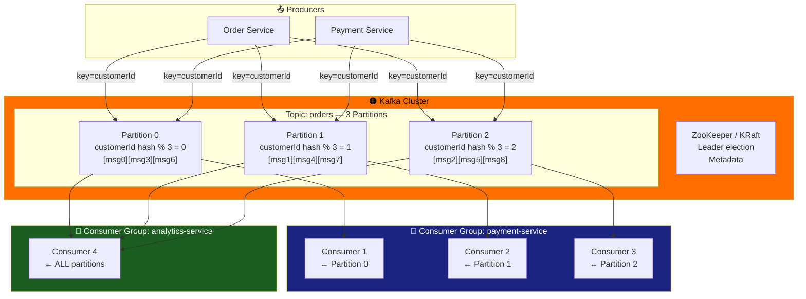

---

## 2. Kafka Consumer Groups & Rebalancing

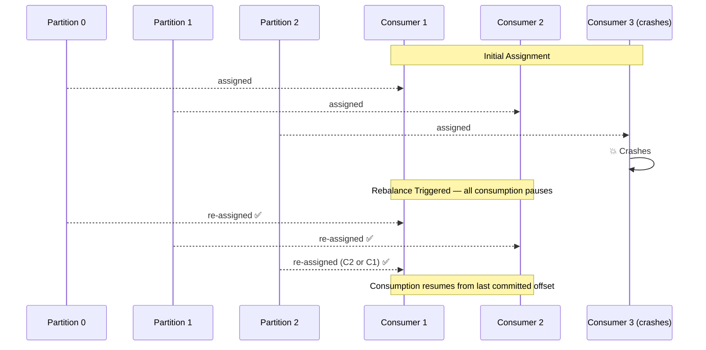

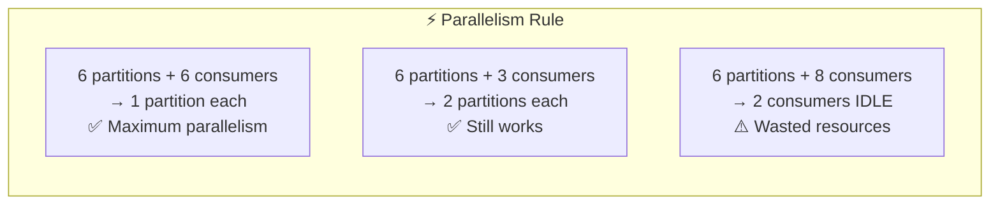

---

## 3. Consistent Hashing Ring

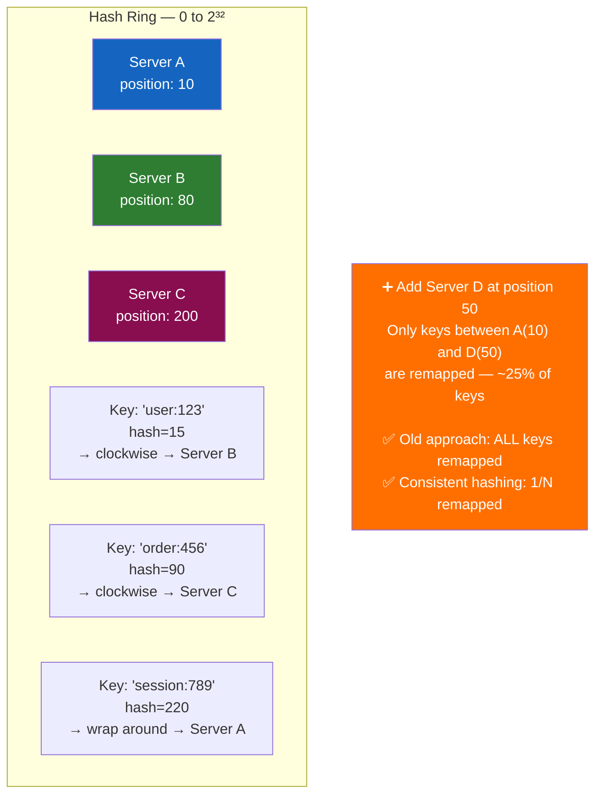

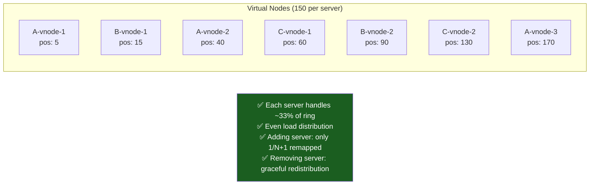

---

## 4. Bloom Filter Bit Array

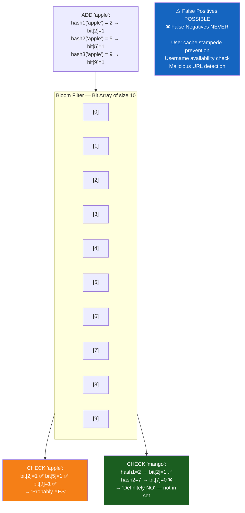

---

## 5. Event Sourcing vs Traditional State Store

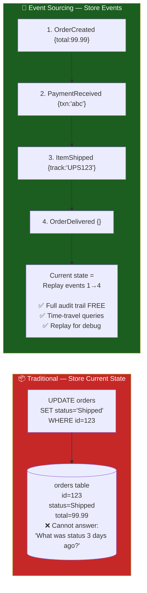

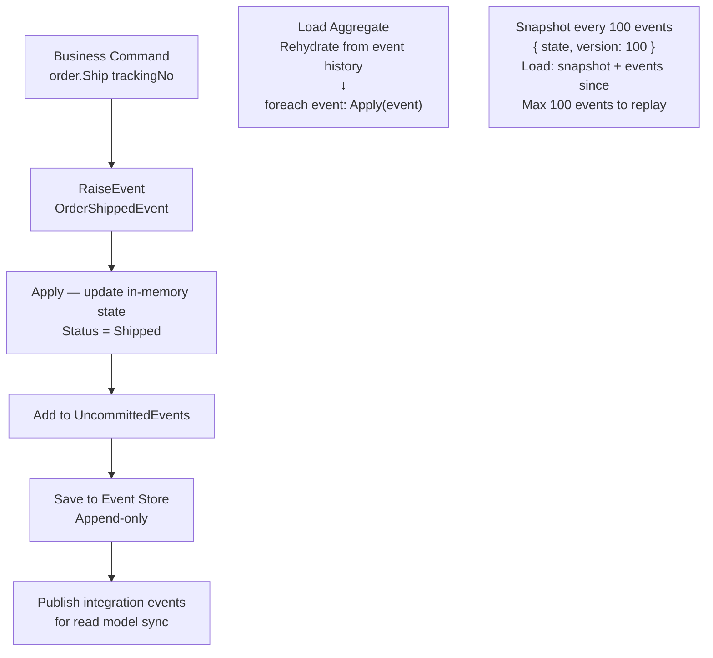

---

## 6. CQRS — Command vs Query Split

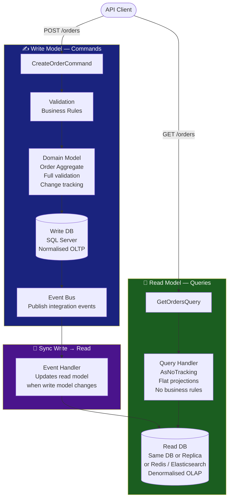

---

## 7. WebSocket vs SSE vs Long Polling

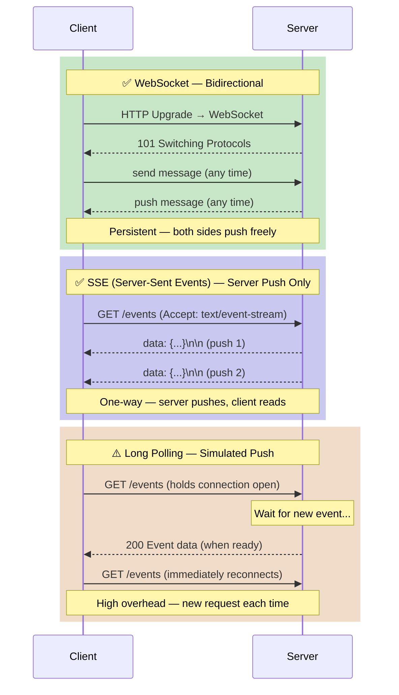

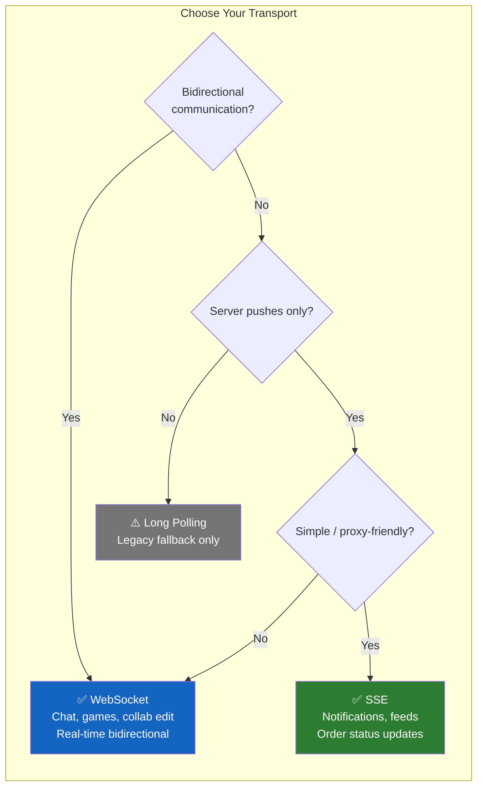

---

## 8. Redis Data Structure Decision Tree

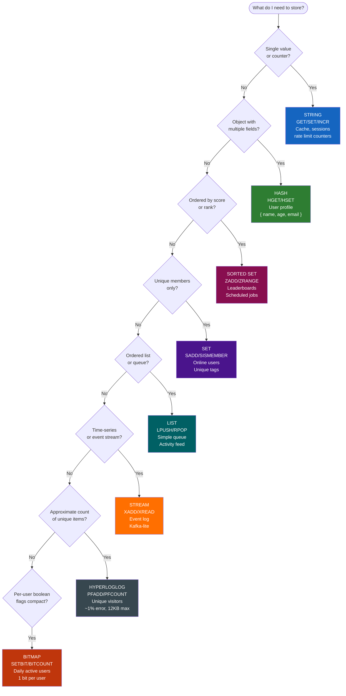

---

## 9. CAP Theorem — Venn Diagram

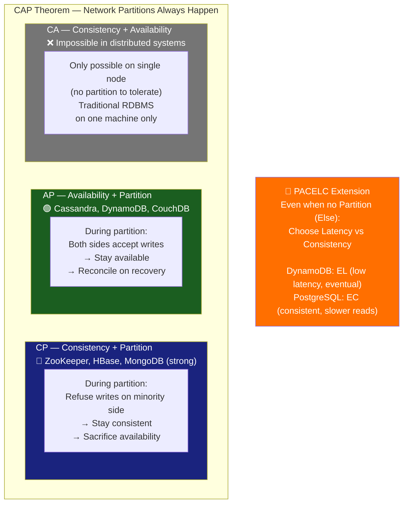

---

## 10. Distributed Tracing — Span Tree

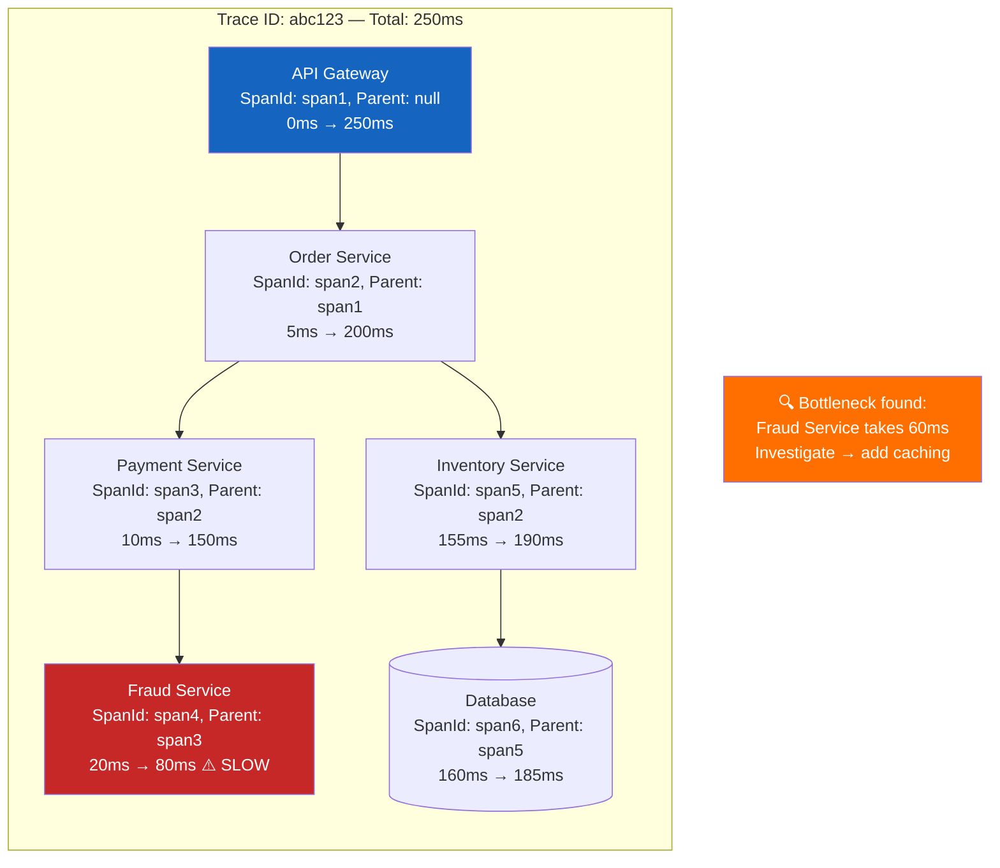

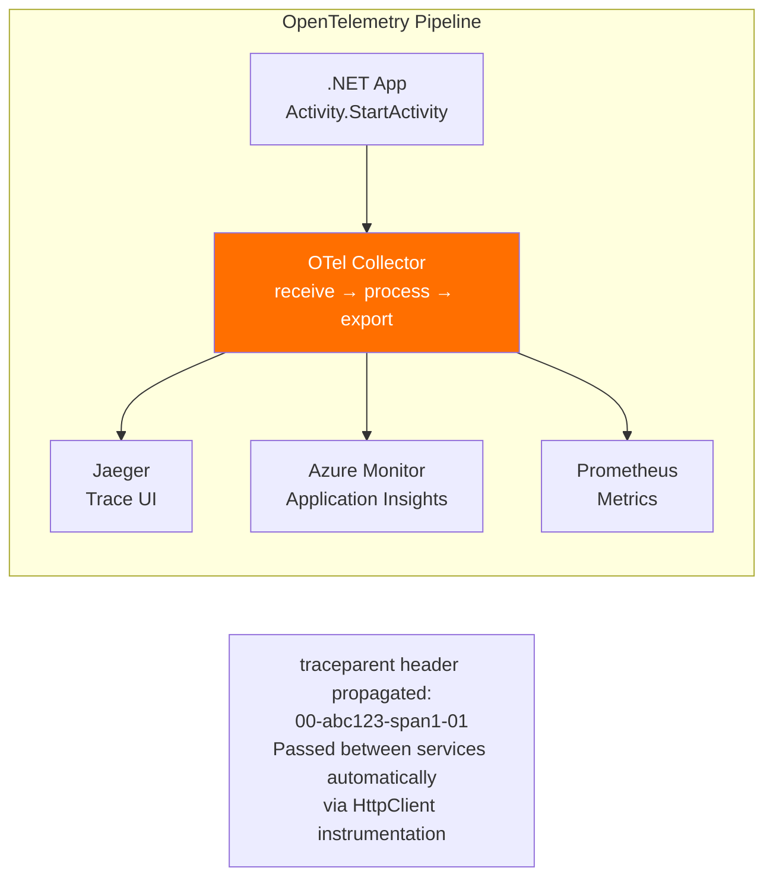

---

## 11. Message Delivery Guarantees

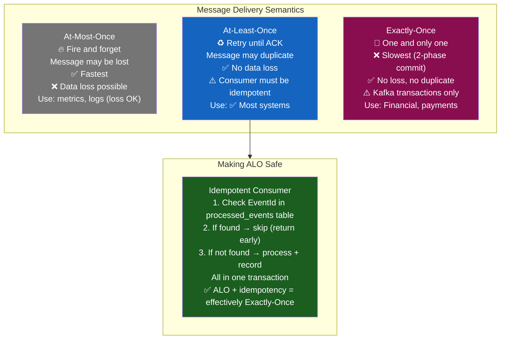

---

## 12. CDN Request Flow

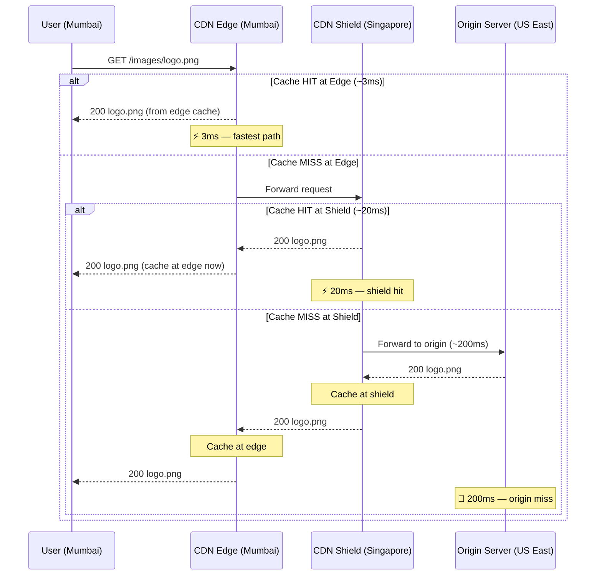

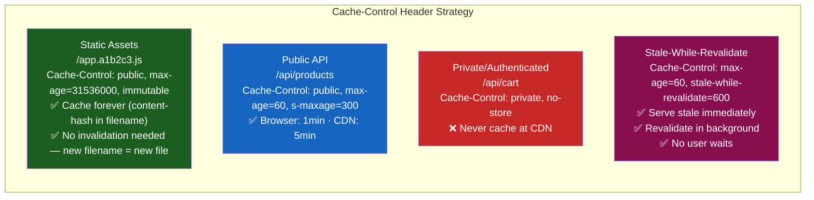

EOF
echo "Done diagrams-advanced-topics.md"