# 🎨 Visual Diagrams — Cloud, DevOps, Security & LLD

> Sequence diagrams, class diagrams, state machines, and architecture flows.
> Renders on GitHub, VS Code (Markdown Preview Enhanced), GitLab, Obsidian.

---

## 📋 Table of Contents

### Cloud & DevOps
1. [CI/CD Pipeline Stages](#1-cicd-pipeline-stages)
2. [Kubernetes Architecture](#2-kubernetes-architecture)
3. [Deployment Strategies Compared](#3-deployment-strategies-compared)
4. [Docker Multi-Stage Build](#4-docker-multi-stage-build)
5. [Observability — Three Pillars](#5-observability--three-pillars)
6. [Health Checks — Liveness vs Readiness](#6-health-checks--liveness-vs-readiness)

### Security
7. [JWT Authentication Full Flow](#7-jwt-authentication-full-flow)
8. [OAuth 2.0 + OIDC Flow](#8-oauth-20--oidc-flow)
9. [CSRF Attack & Defense](#9-csrf-attack--defense)
10. [XSS Attack Types](#10-xss-attack-types)
11. [SQL Injection Attack & Defense](#11-sql-injection-attack--defense)
12. [Password Hashing — Why bcrypt](#12-password-hashing--why-bcrypt)

### Low-Level Design (LLD)
13. [Design Patterns — Class Diagrams](#13-design-patterns--class-diagrams)
14. [Singleton Pattern Flow](#14-singleton-pattern-flow)
15. [Observer Pattern Flow](#15-observer-pattern-flow)
16. [Strategy Pattern Flow](#16-strategy-pattern-flow)
17. [Command Pattern — Undo Stack](#17-command-pattern--undo-stack)
18. [Chain of Responsibility Flow](#18-chain-of-responsibility-flow)
19. [Parking Lot — Class Diagram](#19-parking-lot--class-diagram)
20. [BookMyShow — Seat Booking Flow](#20-bookmyshow--seat-booking-flow)

### Frontend
21. [Angular Component Lifecycle](#21-angular-component-lifecycle)
22. [RxJS Operator Decision Tree](#22-rxjs-operator-decision-tree)
23. [NgRx State Management Flow](#23-ngrx-state-management-flow)
24. [Angular Change Detection](#24-angular-change-detection)

---

# ☁️ Cloud & DevOps Diagrams

## 1. CI/CD Pipeline Stages

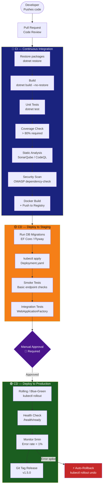

---

## 2. Kubernetes Architecture

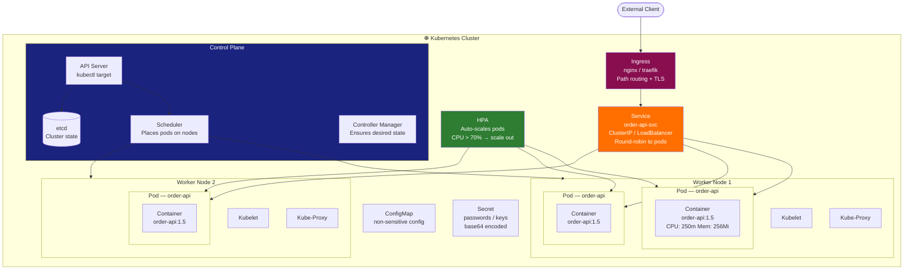

---

## 3. Deployment Strategies Compared

```mermaid
flowchart TD
    subgraph RollingDeploy["🔄 Rolling Deployment"]
        R_BEF["Before: [v1][v1][v1][v1]"]
        R_S1["Step 1: [v2][v1][v1][v1]"]
        R_S2["Step 2: [v2][v2][v1][v1]"]
        R_S3["Step 3: [v2][v2][v2][v1]"]
        R_AFT["After:  [v2][v2][v2][v2]"]
        R_BEF --> R_S1 --> R_S2 --> R_S3 --> R_AFT
    end

    subgraph BGDeploy["🔵🟢 Blue-Green Deployment"]
        BG_LB["Load Balancer"]
        BG_BLUE["🔵 Blue — v1.4\n(100% traffic LIVE)"]
        BG_GREEN["🟢 Green — v1.5\n(0% traffic STAGING)"]
        BG_LB --> BG_BLUE
        BG_LB -.->|smoke test| BG_GREEN
        BG_FLIP["⚡ Flip: one kubectl patch\nInstant rollback available"]
        BG_GREEN -->|pass tests| BG_FLIP
    end

    subgraph CanaryDeploy["🐤 Canary Deployment"]
        CAN_LB["Load Balancer"]
        CAN_STABLE["Stable — v1.4\n9 replicas (90% traffic)"]
        CAN_CANARY["Canary — v1.5\n1 replica (10% traffic)"]
        CAN_LB --> CAN_STABLE & CAN_CANARY
        CAN_MON["Monitor canary:\nError rate ✅ Latency ✅\n→ Gradually increase %"]
        CAN_CANARY --> CAN_MON
    end

    style BGDeploy fill:#1a237e,color:#fff
    style RollingDeploy fill:#1b5e20,color:#fff
    style CanaryDeploy fill:#4A148C,color:#fff
```

---

## 4. Docker Multi-Stage Build

```mermaid
flowchart LR
    subgraph Stage1["Stage 1: BUILD (SDK image ~900MB)"]
        SDK["FROM mcr.microsoft.com/dotnet/sdk:8.0"]
        COPY["COPY .csproj → dotnet restore"]
        BUILD["COPY . → dotnet publish -o /publish"]
    end

    subgraph Stage2["Stage 2: RUNTIME (ASP.NET image ~220MB)"]
        RT["FROM mcr.microsoft.com/dotnet/aspnet:8.0"]
        USER["RUN adduser appuser\nUSER appuser (non-root ✅)"]
        CPY["COPY --from=build /publish ."]
        ENT["ENTRYPOINT [dotnet, MyApp.dll]"]
    end

    RESULT["✅ Final image: ~220MB\n(SDK not included)\n✅ Non-root user\n✅ Only runtime files"]

    Stage1 --> Stage2 --> RESULT

    style Stage1 fill:#FF6F00,color:#fff
    style Stage2 fill:#1565C0,color:#fff
    style RESULT fill:#1b5e20,color:#fff
```

---

## 5. Observability — Three Pillars

```mermaid
flowchart LR
    APP2[.NET Application]

    subgraph Logs["📋 Logs — What happened?"]
        SERILOG[Serilog\nStructured JSON logs]
        SEQ2[Seq / ELK Stack\nQuery: WHERE OrderId='abc'"]
    end

    subgraph Metrics2["📊 Metrics — How much / How fast?"]
        PROM3[Prometheus\nScrapes /metrics every 15s]
        GRAF[Grafana\nDashboards + Alerts\nGolden Signals]
    end

    subgraph Traces2["🔍 Traces — Where is it slow?"]
        OTEL2[OpenTelemetry\nActivitySource spans]
        JAEGER2[Jaeger / Azure Monitor\nSpan tree visualisation]
    end

    APP2 --> SERILOG --> SEQ2
    APP2 --> PROM3 --> GRAF
    APP2 --> OTEL2 --> JAEGER2

    GOLDEN["📌 Golden Signals (Google SRE)\n1. Latency — how long do requests take?\n2. Traffic — how many requests/sec?\n3. Errors — what % fail?\n4. Saturation — how full is the system?"]

    style Logs fill:#1a237e,color:#fff
    style Metrics2 fill:#1b5e20,color:#fff
    style Traces2 fill:#880E4F,color:#fff
    style GOLDEN fill:#FF6F00,color:#fff
```

---

## 6. Health Checks — Liveness vs Readiness

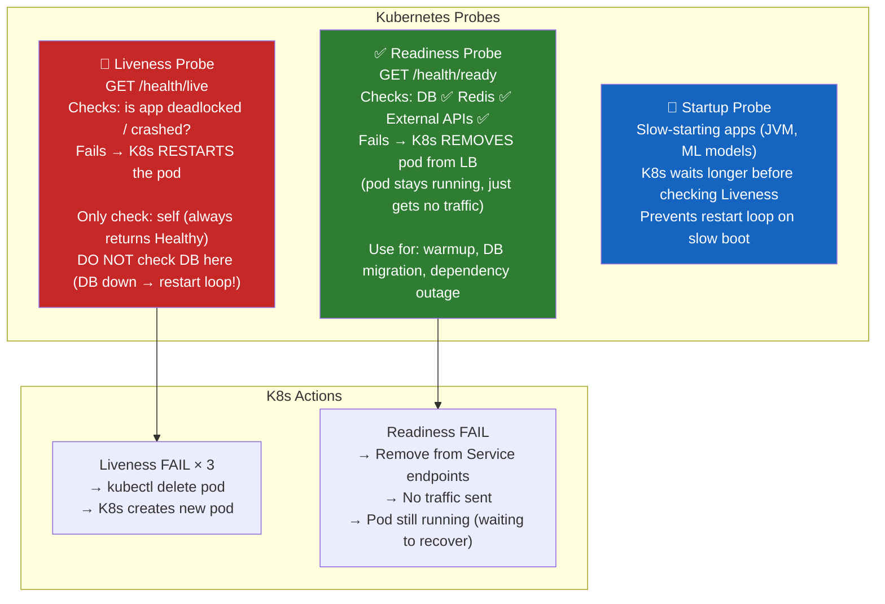

---

# 🔐 Security Diagrams

## 7. JWT Authentication Full Flow

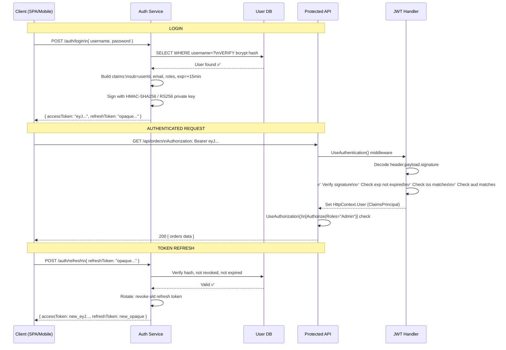

---

## 8. OAuth 2.0 + OIDC Flow

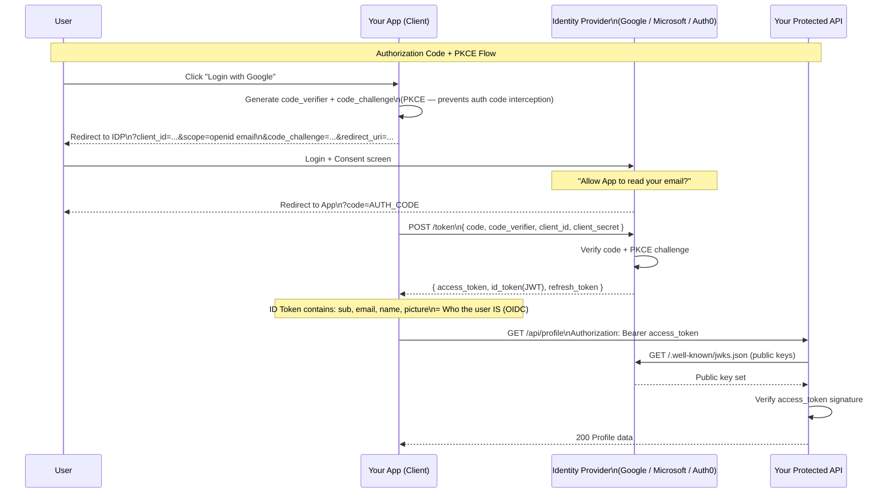

---

## 9. CSRF Attack & Defense

```mermaid
sequenceDiagram
    participant Alice as Alice (Victim)
    participant Bank as bank.com (Vulnerable)
    participant Evil as evil.com (Attacker)

    note over Alice,Bank: Alice is logged in — has session cookie

    Alice->>Evil: Visits evil.com (ad click, link)

    note over Evil: evil.com has hidden form:
    note over Evil: <form action="https://bank.com/transfer" method="POST">
    note over Evil: <input name="amount" value="10000">
    note over Evil: </form> auto-submits via JS

    Evil->>Bank: POST /transfer { amount: 10000 }\n🍪 Cookie: session=alice_abc (auto-sent!)
    note over Bank: ❌ No CSRF protection\nLegitimate-looking request\nTransfer executes!
    Bank-->>Alice: Money gone 💸

    note over Alice,Bank: ✅ DEFENSE: SameSite Cookie
    note over Bank: Set-Cookie: session=abc;\nSameSite=Strict (or Lax)
    note over Bank: SameSite=Strict → browser does NOT send\ncookie on cross-site form POST
    note over Evil: ❌ POST from evil.com → no cookie sent → 401
```

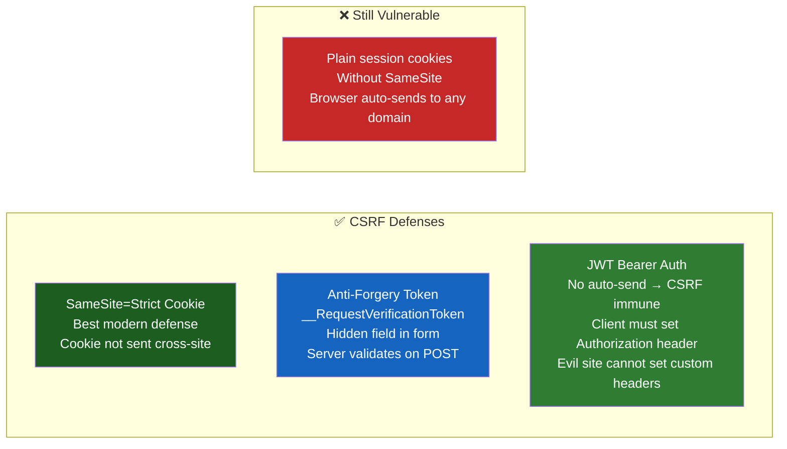

---

## 10. XSS Attack Types

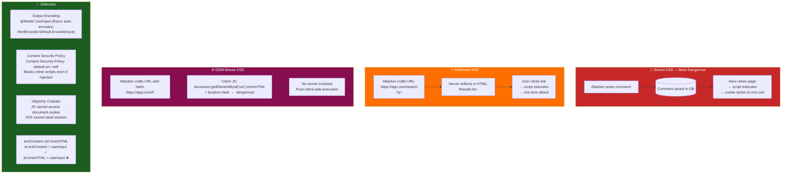

---

## 11. SQL Injection Attack & Defense

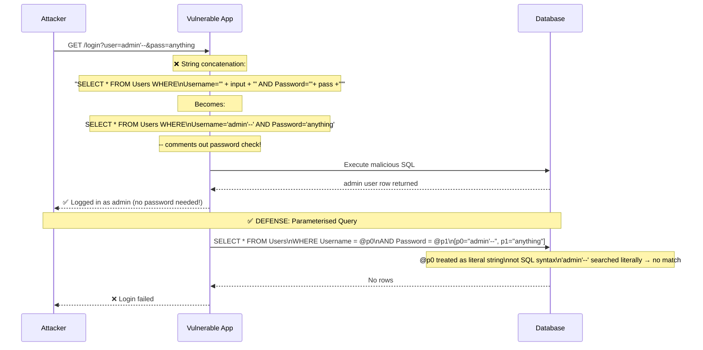

---

## 12. Password Hashing — Why bcrypt

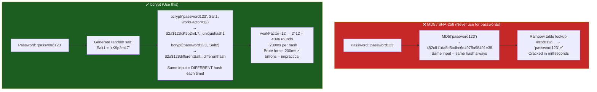

---

# 🏗️ Low-Level Design (LLD) Diagrams

## 13. Design Patterns — Class Diagrams

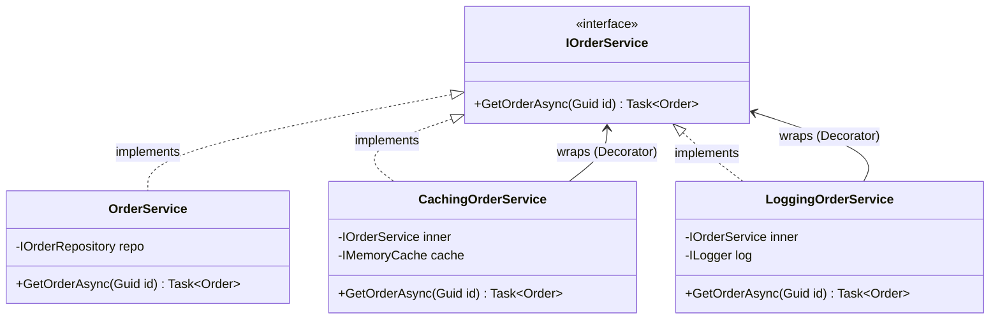

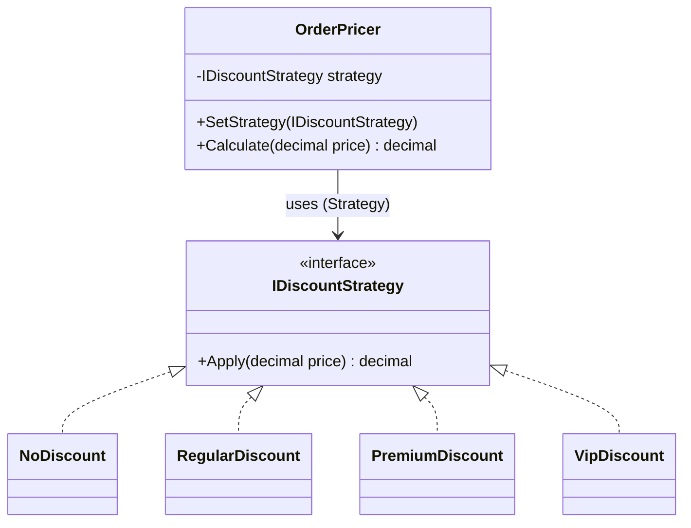

---

## 14. Singleton Pattern Flow

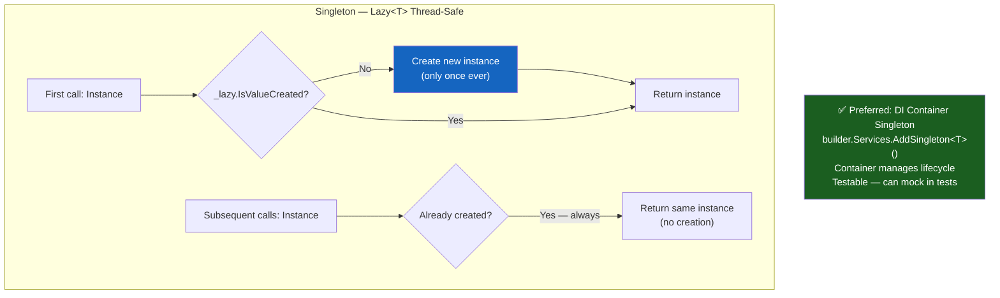

---

## 15. Observer Pattern Flow

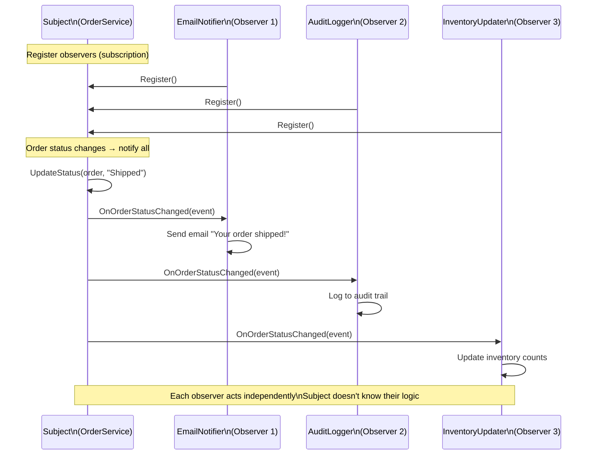

---

## 16. Strategy Pattern Flow

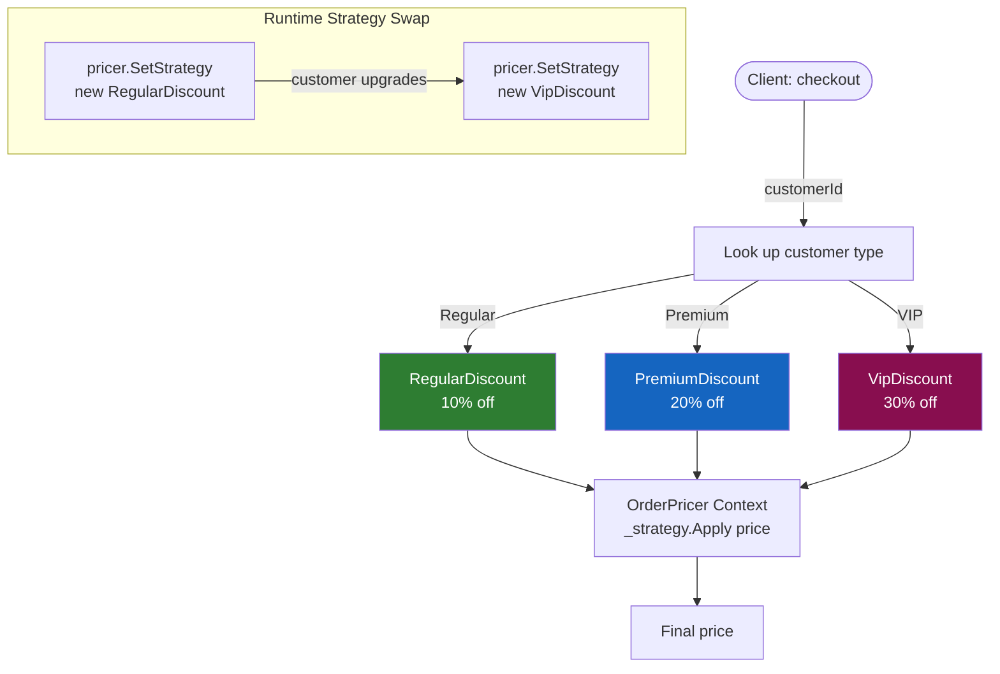

---

## 17. Command Pattern — Undo Stack

```mermaid
flowchart TD
    CLIENT3([Client]) -->|Execute| INVOKER[CommandInvoker\n_history: Stack&lt;ICommand&gt;]
    INVOKER -->|cmd.Execute| CMD3[ShipOrderCommand\n- Execute: status = Shipped\n- Undo: status = previousStatus]
    CMD3 --> ORDER[Order Entity\nStatus updated]
    INVOKER -->|_history.Push cmd| STACK[History Stack\n[ShipOrderCmd, ...]

    CLIENT3 -->|Undo| INVOKER2[CommandInvoker]
    INVOKER2 -->|_history.Pop| CMD4[Get last command]
    CMD4 -->|cmd.Undo| ORDER2[Order Entity\nStatus restored]

    style STACK fill:#1565C0,color:#fff
    style INVOKER fill:#FF6F00,color:#fff
```

---

## 18. Chain of Responsibility Flow

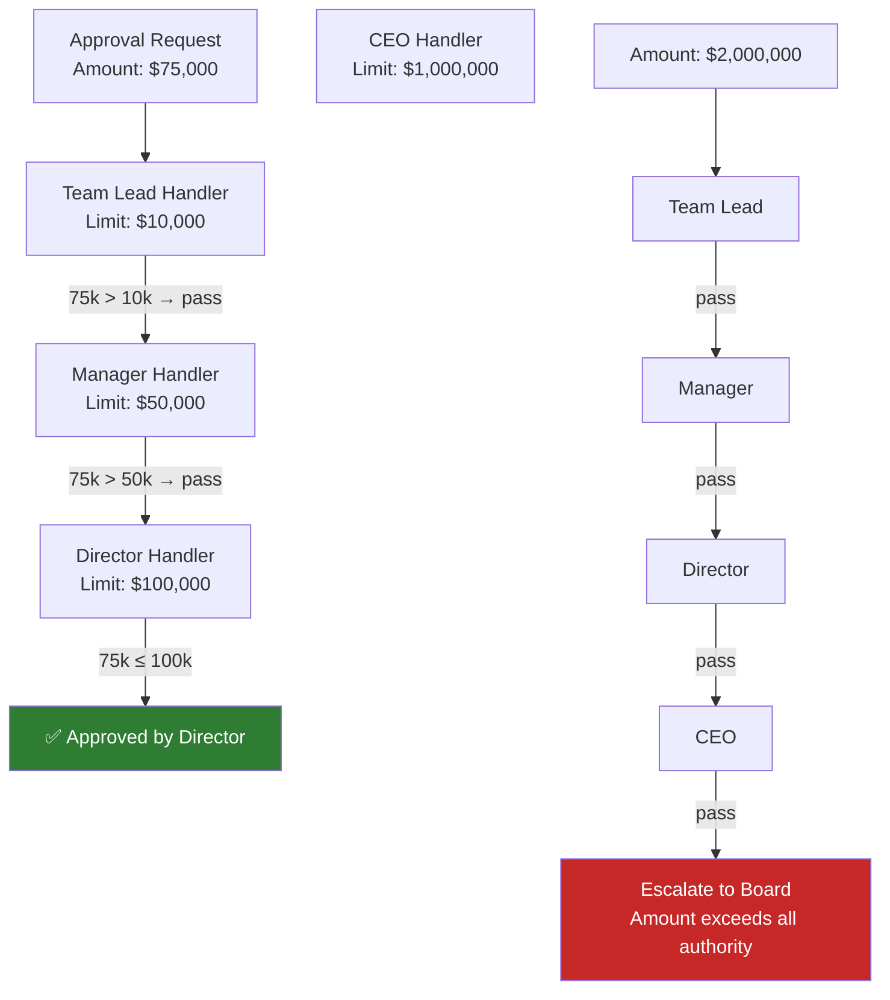

---

## 19. Parking Lot — Class Diagram

```mermaid
classDiagram
    class ParkingLot {
        -string name
        -List~ParkingFloor~ floors
        +getAvailableSpots(VehicleType) List~ParkingSpot~
        +park(Vehicle) Ticket
        +unpark(Ticket) Payment
    }
    class ParkingFloor {
        -int floorNumber
        -List~ParkingSpot~ spots
        +getAvailableSpots(VehicleType) List~ParkingSpot~
    }
    class ParkingSpot {
        -string spotId
        -SpotType type
        -SpotStatus status
        -Vehicle vehicle
        +assign(Vehicle)
        +free()
        +isAvailable() bool
    }
    class Vehicle {
        <<abstract>>
        -string licensePlate
        -VehicleType type
    }
    class Car
    class Truck
    class Motorcycle
    class Ticket {
        -string ticketId
        -ParkingSpot spot
        -DateTime entryTime
        -DateTime? exitTime
    }
    class IPricingStrategy {
        <<interface>>
        +calculateFee(Ticket) decimal
    }
    class HourlyPricing
    class DailyPricing

    ParkingLot "1" --> "*" ParkingFloor
    ParkingFloor "1" --> "*" ParkingSpot
    ParkingSpot "0..1" --> "0..1" Vehicle
    ParkingLot --> Ticket : creates
    Ticket --> ParkingSpot : references
    ParkingLot --> IPricingStrategy : uses
    IPricingStrategy <|.. HourlyPricing
    IPricingStrategy <|.. DailyPricing
    Vehicle <|-- Car
    Vehicle <|-- Truck
    Vehicle <|-- Motorcycle
```

---

## 20. BookMyShow — Seat Booking Flow

```mermaid
stateDiagram-v2
    [*] --> Available

    Available --> Held : holdSeat(userId, 10min)\nDistributed lock acquired
    Held --> Available : hold expired (10min)\nBackground job releases
    Held --> Available : user cancelled
    Held --> Booked : confirmBooking()\nPayment processed ✅

    Booked --> Available : refund + cancel\n(before showtime only)

    note right of Held
        Redis lock prevents
        concurrent pickup
        by two users
    end note
```

```mermaid
sequenceDiagram
    participant U1 as User Alice
    participant U2 as User Bob
    participant API8 as Booking API
    participant LOCK3 as Distributed Lock (Redis)
    participant DB11 as ShowSeats DB

    par Alice and Bob try same seat simultaneously
        U1->>API8: POST /bookings/hold { showId, seatIds:[S1,S2] }
        U2->>API8: POST /bookings/hold { showId, seatIds:[S1,S2] }
    end

    API8->>LOCK3: ACQUIRE lock on show-123 (Alice first)
    LOCK3-->>API8: Acquired ✅
    API8->>DB11: SELECT seats WHERE id IN (S1,S2) FOR UPDATE
    DB11-->>API8: S1=Available, S2=Available
    API8->>DB11: UPDATE seats SET status=Held, heldBy=Alice
    API8->>LOCK3: RELEASE lock
    API8-->>U1: { holdId, expiresIn: 600s, total: ₹500 }

    API8->>LOCK3: ACQUIRE lock on show-123 (Bob)
    LOCK3-->>API8: Acquired ✅
    API8->>DB11: SELECT seats WHERE id IN (S1,S2)
    DB11-->>API8: S1=Held, S2=Held ❌
    API8->>LOCK3: RELEASE lock
    API8-->>U2: 409 Conflict — Seats no longer available
```

---

# 🌐 Frontend Diagrams

## 21. Angular Component Lifecycle

```mermaid
flowchart TD
    CONST["constructor()\nDI injection only\n❌ No @Input values yet"]
    NGOC["ngOnChanges(changes)\n✅ @Input values first available\nRuns BEFORE ngOnInit\nRuns on every @Input change"]
    NGOI["ngOnInit()\n✅ One-time setup\nHTTP calls here\nComponent fully initialised"]
    NGDC["ngDoCheck()\nCustom change detection\n⚠️ Runs very frequently\nAvoid expensive operations"]
    NGACI["ngAfterContentInit()\nAfter ng-content projected\nOnce after first DoCheck"]
    NGACW["ngAfterContentChecked()\nAfter every DoCheck with content\n⚠️ Performance sensitive"]
    NGAVI["ngAfterViewInit()\n✅ DOM available\nViewChild refs accessible\nNot available before this"]
    NGAVW["ngAfterViewChecked()\nAfter every view change\n⚠️ Performance sensitive"]
    NGOD["ngOnDestroy()\n✅ ALWAYS implement\nUnsubscribe Observables\nClear intervals/timers\nRelease resources"]

    CONST --> NGOC --> NGOI --> NGDC --> NGACI --> NGACW --> NGAVI --> NGAVW
    NGAVW -->|"on @Input change"| NGOC
    NGAVW -->|destroy| NGOD

    style NGOI fill:#1b5e20,color:#fff
    style NGOD fill:#c62828,color:#fff
    style NGAVI fill:#1565C0,color:#fff
    style NGOC fill:#FF6F00,color:#fff
```

---

## 22. RxJS Operator Decision Tree

```mermaid
flowchart TD
    START3([I need to...])

    Q1c{Transform each\nvalue?}
    Q2c{Make inner\nObservable?}
    Q3c{Cancel previous\non new value?}
    Q4c{Wait for previous\nto complete?}
    Q5c{Run all in parallel?}
    Q6c{Ignore while busy?}
    Q7c{Filter values?}
    Q8c{Combine latest\nfrom multiple?}

    MAP2["map(fn)\nTransform each value\n[1,2,3] → [2,4,6]"]
    SWITCHMAP["switchMap(fn) ✅\nTypeahead search\nCancel prev, use latest"]
    CONCATMAP["concatMap(fn)\nQueued sequential\nFile uploads in order"]
    MERGEMAP["mergeMap(fn)\nAll parallel\nBatch notifications"]
    EXHAUSTMAP["exhaustMap(fn)\nIgnore while busy\nForm submit button"]
    FILTER2["filter(predicate)\nOnly pass matching\nfilter(x => x > 0)"]
    COMBINELATEST2["combineLatest([a$,b$])\nEmit when any changes\nForm validity + data"]

    START3 --> Q1c
    Q1c -->|Simple transform| MAP2
    Q1c -->|Makes Observable| Q2c
    Q2c -->|Yes| Q3c
    Q3c -->|Yes| SWITCHMAP
    Q3c -->|No| Q4c
    Q4c -->|Yes| CONCATMAP
    Q4c -->|No| Q5c
    Q5c -->|Yes| MERGEMAP
    Q5c -->|No| Q6c
    Q6c -->|Yes| EXHAUSTMAP
    Q1c -->|Filter| Q7c
    Q7c -->|Yes| FILTER2
    Q7c -->|No| Q8c
    Q8c -->|Yes| COMBINELATEST2

    style SWITCHMAP fill:#1565C0,color:#fff
    style CONCATMAP fill:#2e7d32,color:#fff
    style MERGEMAP fill:#880E4F,color:#fff
    style EXHAUSTMAP fill:#FF6F00,color:#fff
```

---

## 23. NgRx State Management Flow

```mermaid
flowchart LR
    subgraph NgRxFlow["NgRx Unidirectional Data Flow"]
        COMP2[Component\nUI triggers action]
        ACT[Action\n{ type: '[Orders] Load' }]
        EFF[Effect\nSide effects: HTTP calls\nDispatch result action]
        RED[Reducer\nPure function\nold state + action → new state]
        STORE2[("Store\n{ orders: [], loading: false }")]
        SEL[Selector\nMemoized derivation\nselect('orders')"]
        COMP2

        COMP2 -->|dispatch| ACT
        ACT --> EFF
        EFF -->|HTTP success| ACT2[Success Action\n{ type: '[Orders] Loaded'\npayload: orders[] }]
        ACT2 --> RED
        RED --> STORE2
        STORE2 --> SEL
        SEL -->|Observable| COMP2
    end

    style STORE2 fill:#FF6F00,color:#fff
    style RED fill:#1565C0,color:#fff
    style EFF fill:#880E4F,color:#fff
    style SEL fill:#1b5e20,color:#fff
```

---

## 24. Angular Change Detection

```mermaid
flowchart TD
    subgraph Default["ChangeDetectionStrategy.Default"]
        EVT["Any event anywhere in app\nClick, HTTP, timer, Promise..."]
        CD["Angular checks EVERY component\ntop-down in component tree\n⚠️ Even unrelated components"]
        UP["Updates DOM if changed"]
        EVT --> CD --> UP
    end

    subgraph OnPush["ChangeDetectionStrategy.OnPush ✅ Recommended"]
        EVT2["Event in THIS component\nOR @Input reference changes\nOR async pipe emits\nOR markForCheck() called"]
        SKIP["Skip subtree if no change\n✅ Much faster for large trees"]
        CD2["Check only this component\nand its children if needed"]
        EVT2 --> CD2
        CD2 -->|No trigger| SKIP
        CD2 -->|Triggered| UP2["Update DOM"]
    end

    RULE["📌 Rule:\nPresentational/dumb components → OnPush\nMust use immutable inputs or Observables\nnew array reference needed (not .push())"]

    style Default fill:#c62828,color:#fff
    style OnPush fill:#1b5e20,color:#fff
    style RULE fill:#1565C0,color:#fff
```

EOF
echo "Done diagrams-cloud-security-lld.md"