# 🎨 Visual Diagrams — .NET Code Flows & Architecture

> Mermaid diagrams for every major flow. Renders on GitHub, VS Code (Markdown Preview Enhanced), GitLab, and Obsidian.

---

## 📋 Table of Contents

1. [ASP.NET Core Request Pipeline](#1-aspnet-core-request-pipeline)
2. [Middleware Execution Chain](#2-middleware-execution-chain)
3. [Dependency Injection Lifecycle](#3-dependency-injection-lifecycle)
4. [Async/Await Execution Model](#4-asyncawait-execution-model)
5. [EF Core Query Flow](#5-ef-core-query-flow)
6. [JWT Authentication Flow](#6-jwt-authentication-flow)
7. [CQRS + MediatR Flow](#7-cqrs--mediatr-flow)
8. [Repository + Unit of Work](#8-repository--unit-of-work)
9. [Design Patterns — Decorator Chain](#9-design-patterns--decorator-chain)
10. [Design Patterns — State Machine (ATM)](#10-design-patterns--state-machine-atm)
11. [Design Patterns — Saga Orchestration](#11-design-patterns--saga-orchestration)
12. [Retry + Circuit Breaker](#12-retry--circuit-breaker)
13. [Outbox Pattern](#13-outbox-pattern)
14. [Rate Limiter Flow (Token Bucket)](#14-rate-limiter-flow-token-bucket)

---

## 1. ASP.NET Core Request Pipeline

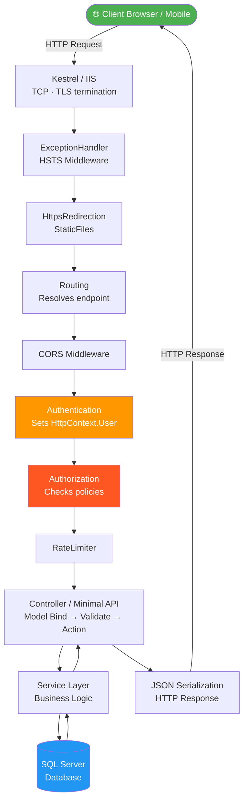

---

## 2. Middleware Execution Chain

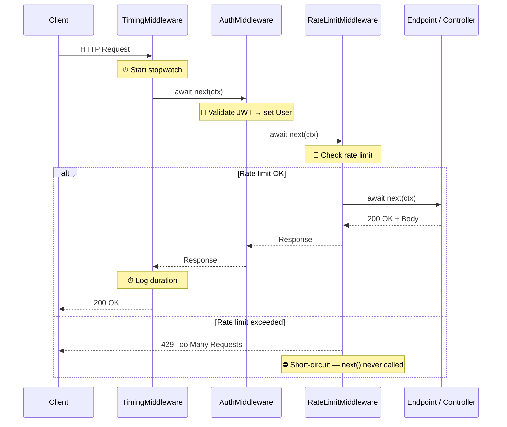

---

## 3. Dependency Injection Lifecycle

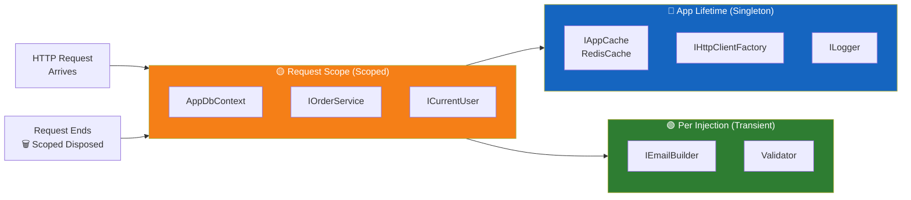

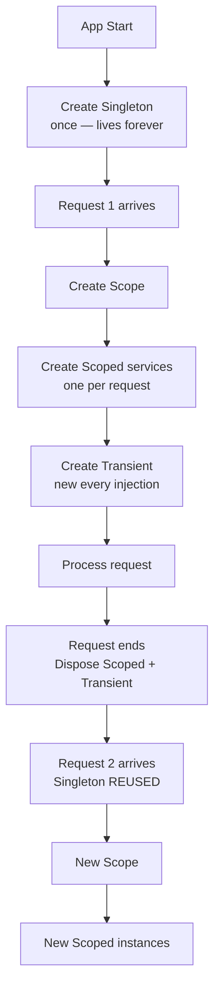

---

## 4. Async/Await Execution Model

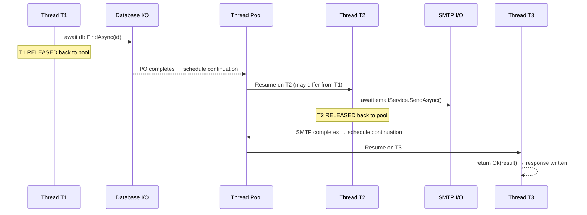

---

## 5. EF Core Query Flow

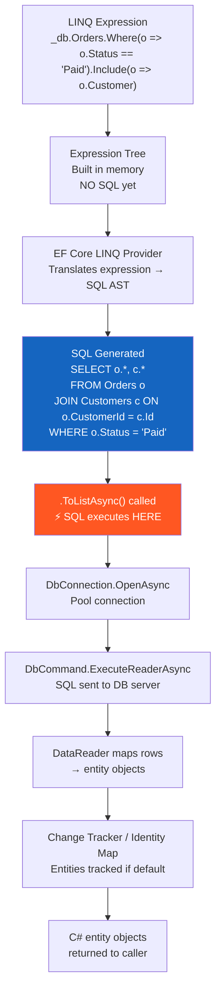

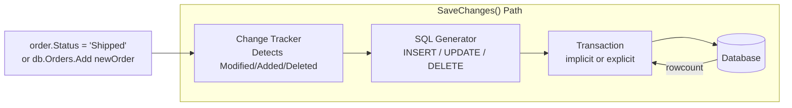

---

## 6. JWT Authentication Flow

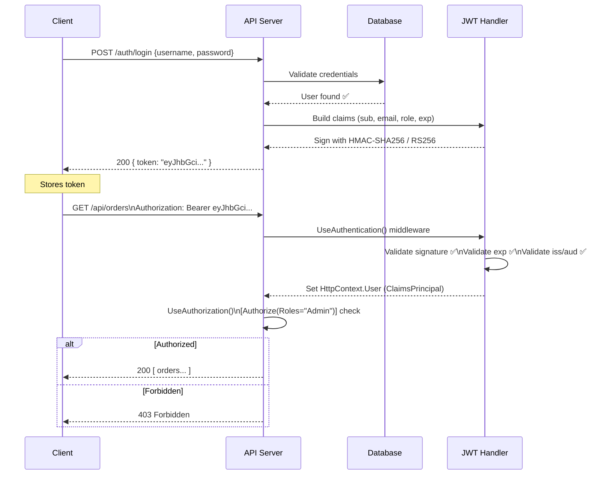

---

## 7. CQRS + MediatR Flow

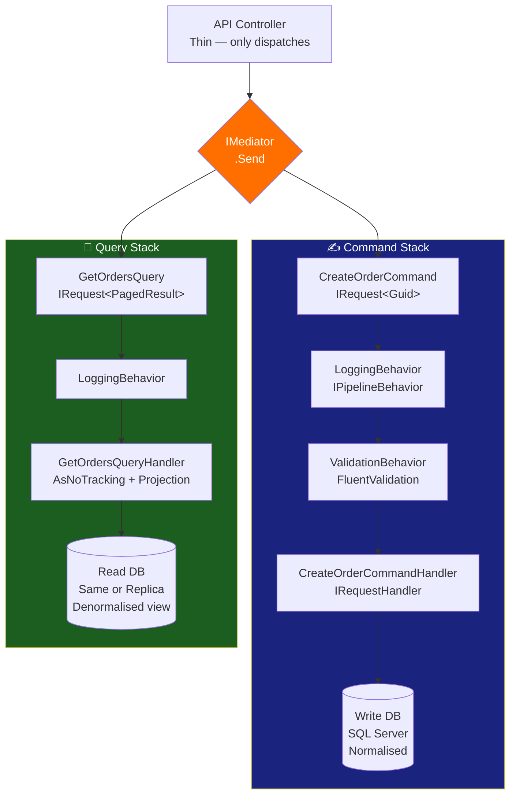

---

## 8. Repository + Unit of Work

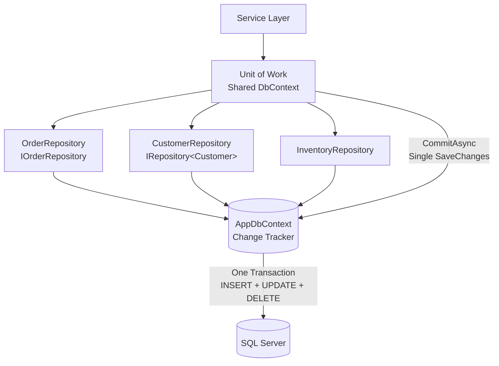

---

## 9. Design Patterns — Decorator Chain

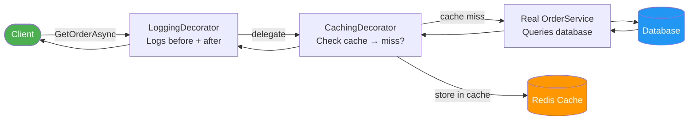

---

## 10. Design Patterns — State Machine (ATM)

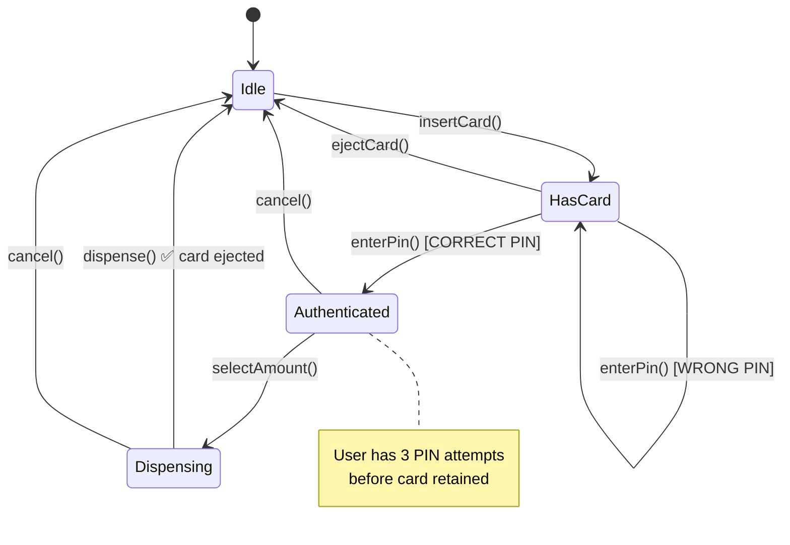

---

## 11. Design Patterns — Saga Orchestration

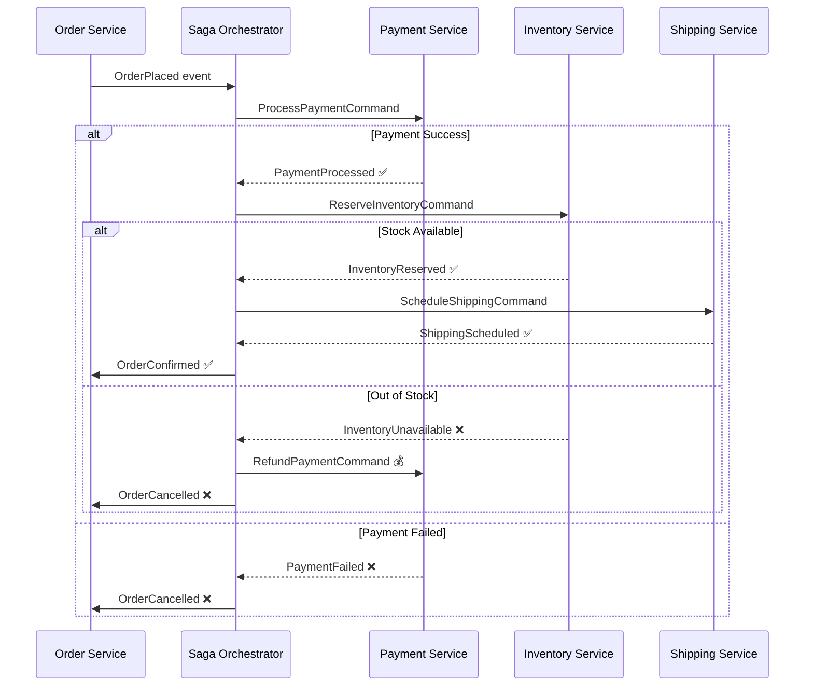

---

## 12. Retry + Circuit Breaker

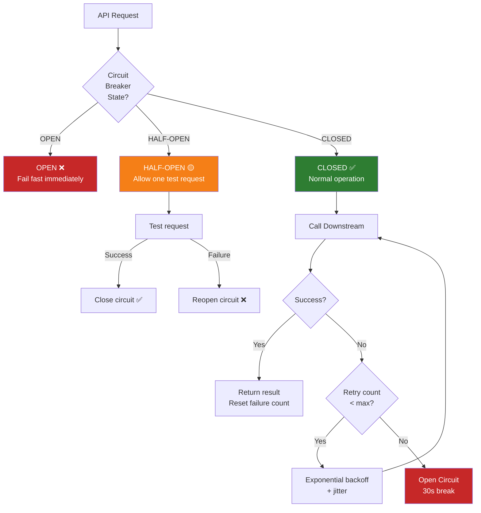

---

## 13. Outbox Pattern

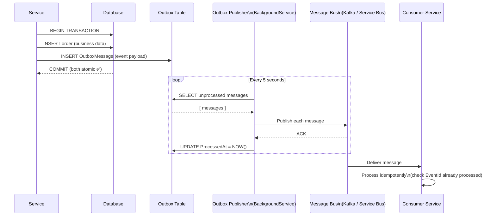

---

## 14. Rate Limiter Flow (Token Bucket)

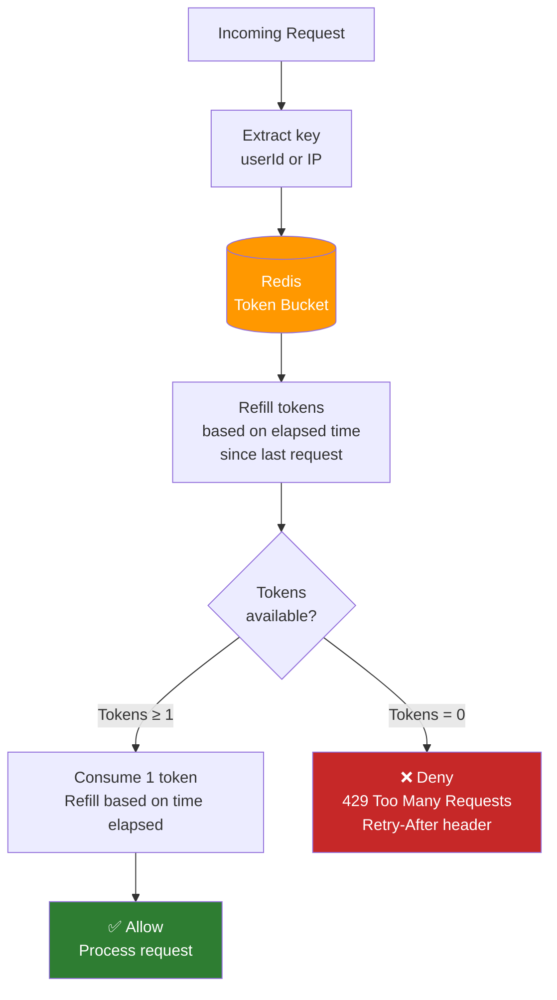

---

# 🎨 Visual Diagrams — High Level Design

---

## HLD-D1 — Load Balancer Architecture

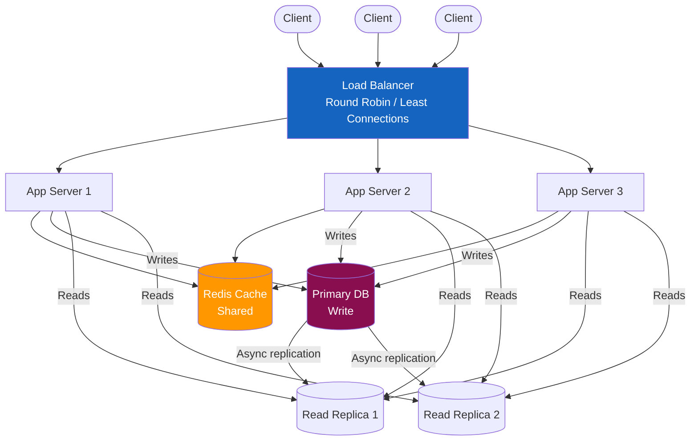

---

## HLD-D2 — Microservices Communication

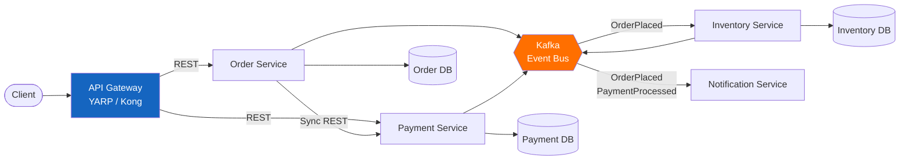

---

## HLD-D3 — Caching Layers

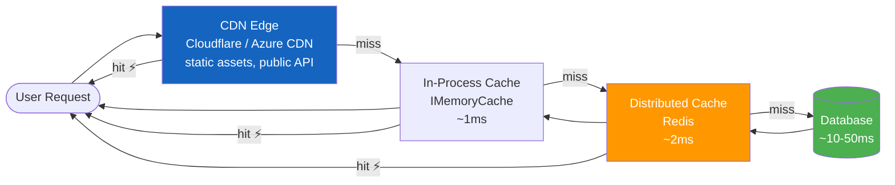

---

## HLD-D4 — CAP Theorem

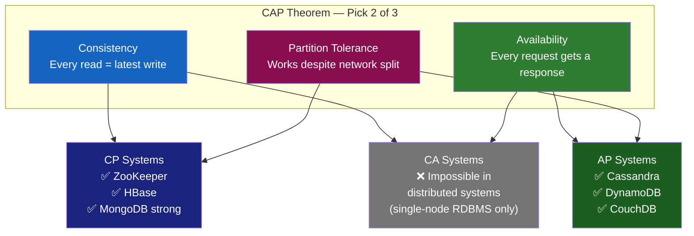

---

## HLD-D5 — SQL vs NoSQL Decision Tree

```mermaid
flowchart TD
    START([New Data Store Needed])
    Q1{Need ACID\ntransactions?}
    Q2{Schema\nflexible /\nchanges often?}
    Q3{Time-series\nor event log?}
    Q4{Key-value\nor session?}
    Q5{Full-text\nsearch?}
    Q6{Horizontal\nscale > 1TB?}

    SQL["✅ SQL\nPostgreSQL / SQL Server\nOrders, Users, Finance"]
    MONGO["✅ MongoDB\nFlexible docs\nProduct catalog, CMS"]
    CASSANDRA["✅ Cassandra\nTime-series, IoT\nWrite-heavy, distributed"]
    REDIS["✅ Redis\nSessions, cache\nReal-time counters"]
    ELASTIC["✅ Elasticsearch\nLogs, search\nFull-text queries"]
    EITHER["Either works\nSQL with read replicas\nOR NoSQL sharded"]

    START --> Q1
    Q1 -->|Yes| SQL
    Q1 -->|No| Q2
    Q2 -->|Yes| MONGO
    Q2 -->|No| Q3
    Q3 -->|Yes| CASSANDRA
    Q3 -->|No| Q4
    Q4 -->|Yes| REDIS
    Q4 -->|No| Q5
    Q5 -->|Yes| ELASTIC
    Q5 -->|No| Q6
    Q6 -->|Yes| EITHER
    Q6 -->|No| SQL

    style SQL fill:#1565C0,color:#fff
    style MONGO fill:#2e7d32,color:#fff
    style CASSANDRA fill:#4A148C,color:#fff
    style REDIS fill:#FF6F00,color:#fff
    style ELASTIC fill:#006064,color:#fff
```

---

## HLD-D6 — Event-Driven Architecture

```mermaid
flowchart LR
    subgraph Producers["📤 Event Producers"]
        OS2[Order Service]
        PS2[Payment Service]
        IS2[Inventory Service]
    end

    subgraph Broker["🔀 Message Broker\nKafka / Azure Service Bus"]
        T1[Topic: orders]
        T2[Topic: payments]
        T3[Topic: inventory]
    end

    subgraph Consumers["📥 Event Consumers"]
        NS2[Notification Service]
        AN[Analytics Service]
        AU[Audit Service]
        WH[Webhook Service]
    end

    OS2 --> T1
    PS2 --> T2
    IS2 --> T3

    T1 --> NS2 & AN & AU
    T2 --> NS2 & AN & AU & WH
    T3 --> AN & AU

    style Broker fill:#FF6F00,color:#fff
    style Producers fill:#1a237e,color:#fff
    style Consumers fill:#1b5e20,color:#fff
```

---

## HLD-D7 — Blue-Green Deployment

```mermaid
flowchart TD
    LB2[Load Balancer]

    subgraph Blue["🔵 Blue — v1.4 LIVE"]
        B1[Pod 1\nv1.4]
        B2[Pod 2\nv1.4]
        B3[Pod 3\nv1.4]
    end

    subgraph Green["🟢 Green — v1.5 STAGING"]
        G1[Pod 1\nv1.5]
        G2[Pod 2\nv1.5]
        G3[Pod 3\nv1.5]
    end

    DB3[(Shared Database)]

    LB2 -->|100% traffic| Blue
    LB2 -.->|0% traffic\nsmoke tests only| Green
    Blue --> DB3
    Green --> DB3

    FLIP[🔄 Flip Traffic\nkubectl patch service]
    FLIP -.->|"After tests pass:\n100% → Green"| LB2

    style Blue fill:#1565C0,color:#fff
    style Green fill:#2e7d32,color:#fff
    style FLIP fill:#FF6F00,color:#fff
```

---

## HLD-D8 — Testing Pyramid

```mermaid
flowchart TD
    subgraph Pyramid["Testing Pyramid"]
        E2E["🔺 E2E Tests\n5–10%\nSlowest · Most expensive\nSelenium, Playwright\nRun: pre-release"]
        INT["🔷 Integration Tests\n20–30%\nMedium speed\nWebApplicationFactory\nRun: every CI build"]
        UNIT["🟦 Unit Tests\n60–70%\nFastest · Cheapest\nxUnit + Moq\nRun: every save"]
    end

    UNIT --> INT --> E2E

    style E2E fill:#c62828,color:#fff
    style INT fill:#F57F17,color:#fff
    style UNIT fill:#1565C0,color:#fff
```

EOF
echo "Done diagrams-dotnet-flow.md"