# 🎨 Visual Diagrams — System Design

> Sequence diagrams, architecture flows, and decision trees for every major system design.

---

## 📋 Table of Contents

1. [URL Shortener — End-to-End Flow](#1-url-shortener--end-to-end-flow)
2. [Notification System Architecture](#2-notification-system-architecture)
3. [Rate Limiter — Token Bucket Flow](#3-rate-limiter--token-bucket-flow)
4. [File Upload — Chunked Presigned Flow](#4-file-upload--chunked-presigned-flow)
5. [Payment System — Idempotency Flow](#5-payment-system--idempotency-flow)
6. [Chat System — WebSocket Architecture](#6-chat-system--websocket-architecture)
7. [Saga Pattern — Choreography vs Orchestration](#7-saga-pattern--choreography-vs-orchestration)
8. [Dead Letter Queue (DLQ) Lifecycle](#8-dead-letter-queue-dlq-lifecycle)
9. [Retry + Exponential Backoff](#9-retry--exponential-backoff)
10. [Large File Import — Production Flow](#10-large-file-import--production-flow)
11. [Idempotency Key Pattern](#11-idempotency-key-pattern)
12. [System Design Selection Guide](#12-system-design-selection-guide)

---

## 1. URL Shortener — End-to-End Flow

```mermaid
flowchart LR
    subgraph WriteFlow["✍️ Write — Shorten URL"]
        CW([Client]) -->|POST /shorten\n{longUrl}| API_W[API Service]
        API_W --> IDG[ID Generator\nSnowflake / Auto-increment]
        IDG --> B62[Base62 Encoder\n123456 → 'aB3xZ9']
        B62 --> DB_W[("PostgreSQL\ncode → long_url")]
        B62 --> CACHE_W[("Redis Cache\nWarm after write")]
        DB_W --> API_W
        API_W -->|{ shortUrl: 'short.ly/aB3xZ9' }| CW
    end

    subgraph ReadFlow["📖 Read — Redirect"]
        CR([Client]) -->|GET /aB3xZ9| CDN2[CDN Edge\nCache popular codes]
        CDN2 -->|miss| LB[Load Balancer]
        LB --> API_R[API Service]
        API_R --> CACHE_R[("Redis\nO(1) lookup")]
        CACHE_R -->|hit| REDIR["301/302 Redirect"]
        CACHE_R -->|miss| DB_R[("PostgreSQL\nRead Replica")]
        DB_R --> CACHE_R
        DB_R --> REDIR
        REDIR --> CR
    end

    style CDN2 fill:#1565C0,color:#fff
    style CACHE_R fill:#FF9800,color:#fff
    style REDIR fill:#2e7d32,color:#fff
```

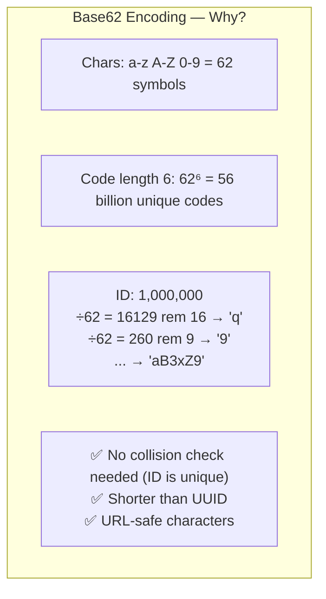

---

## 2. Notification System Architecture

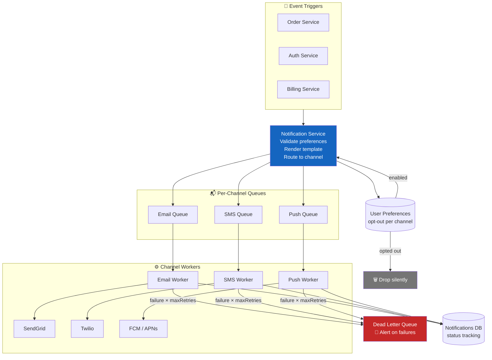

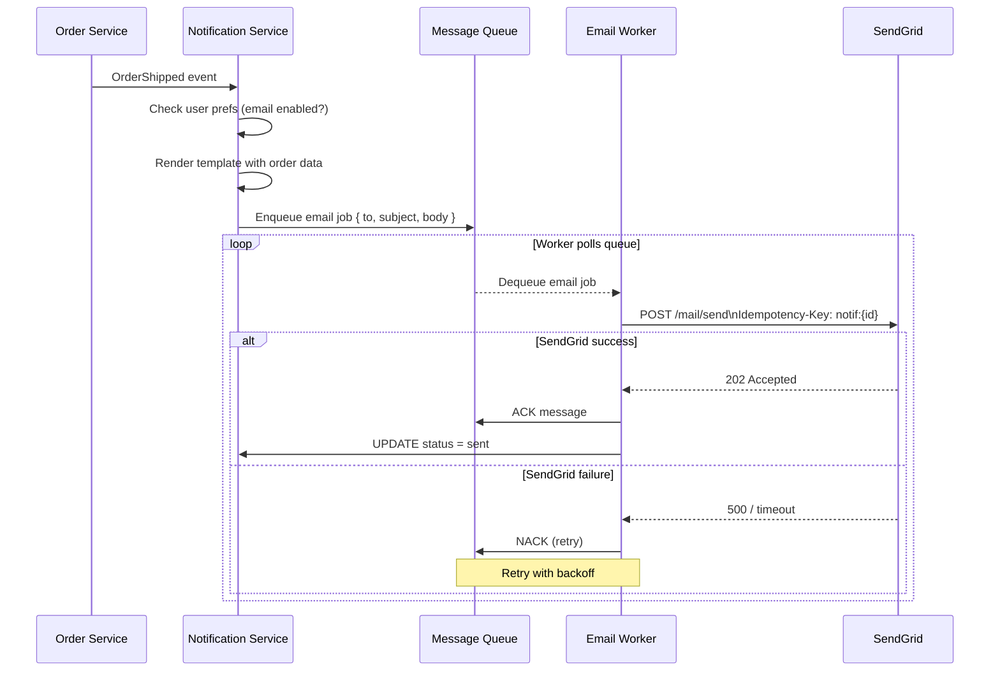

---

## 3. Rate Limiter — Token Bucket Flow

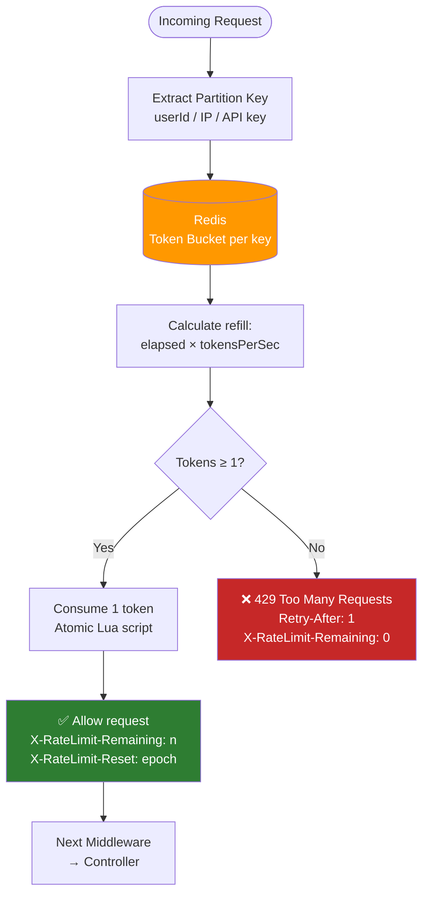

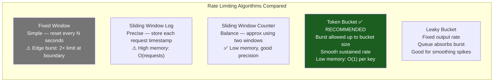

---

## 4. File Upload — Chunked Presigned Flow

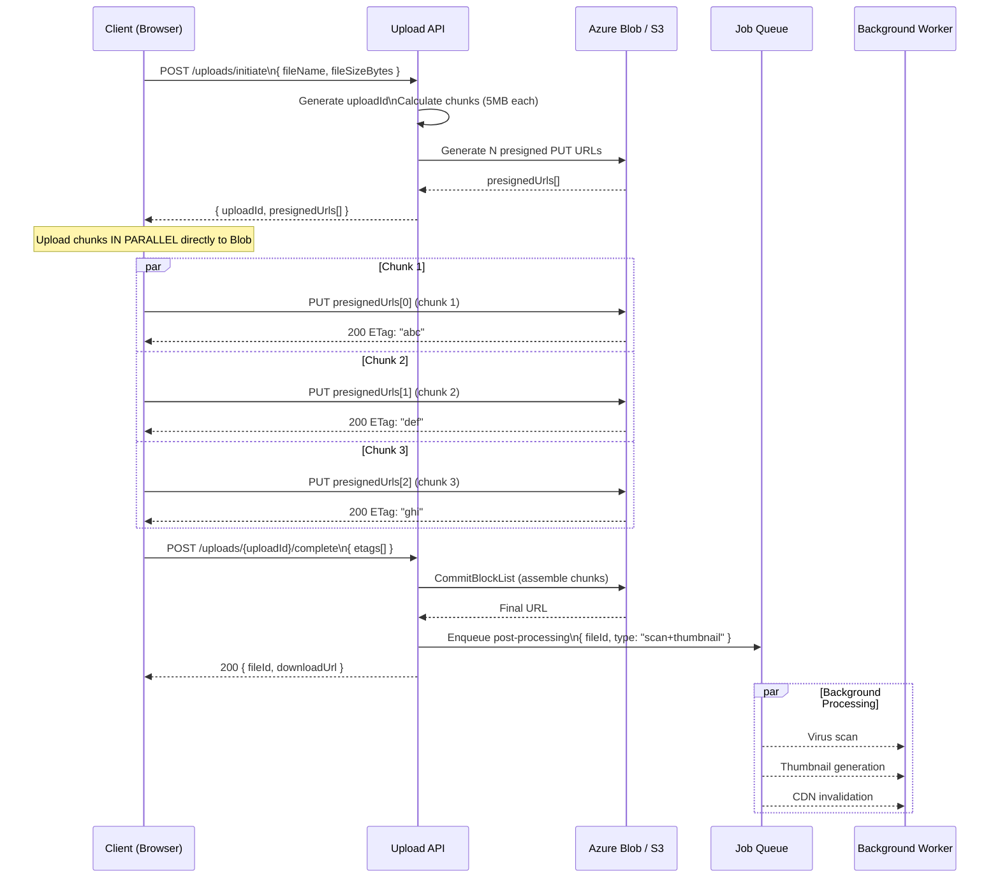

---

## 5. Payment System — Idempotency Flow

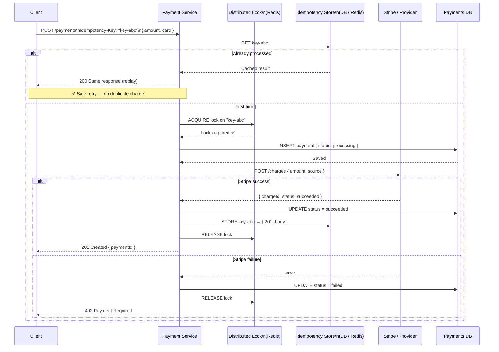

---

## 6. Chat System — WebSocket Architecture

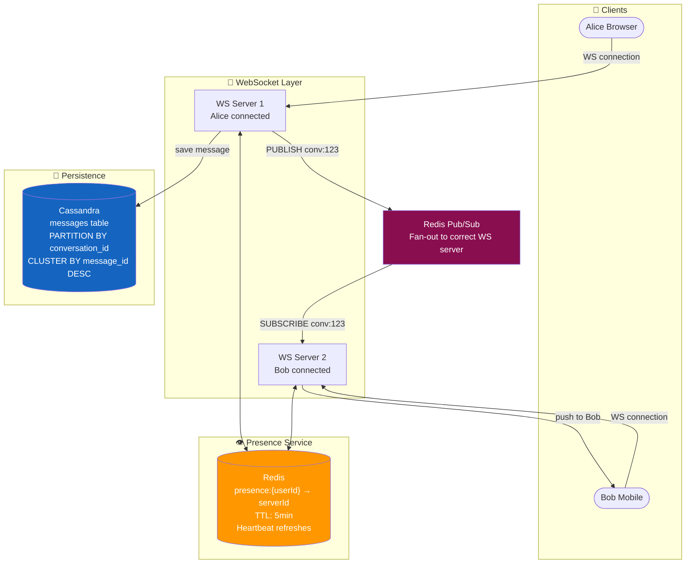

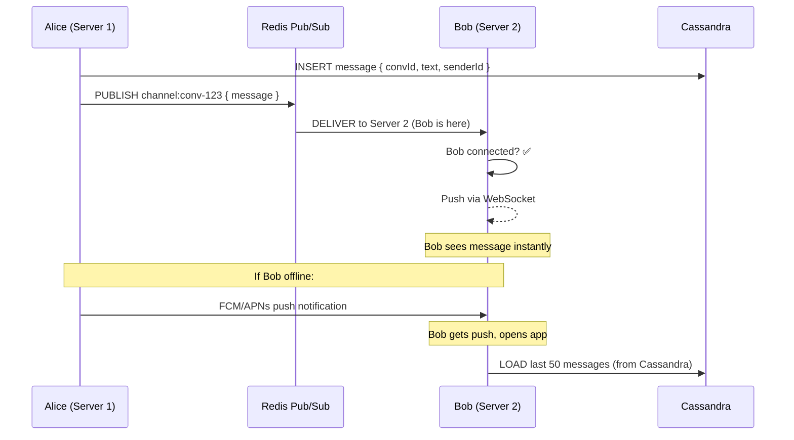

---

## 7. Saga Pattern — Choreography vs Orchestration

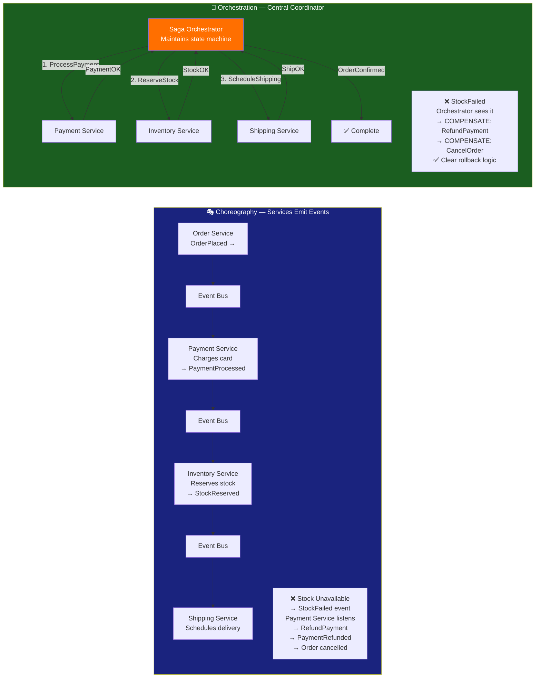

---

## 8. Dead Letter Queue (DLQ) Lifecycle

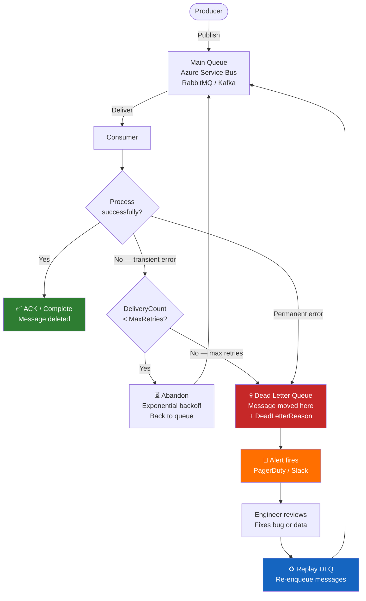

---

## 9. Retry + Exponential Backoff

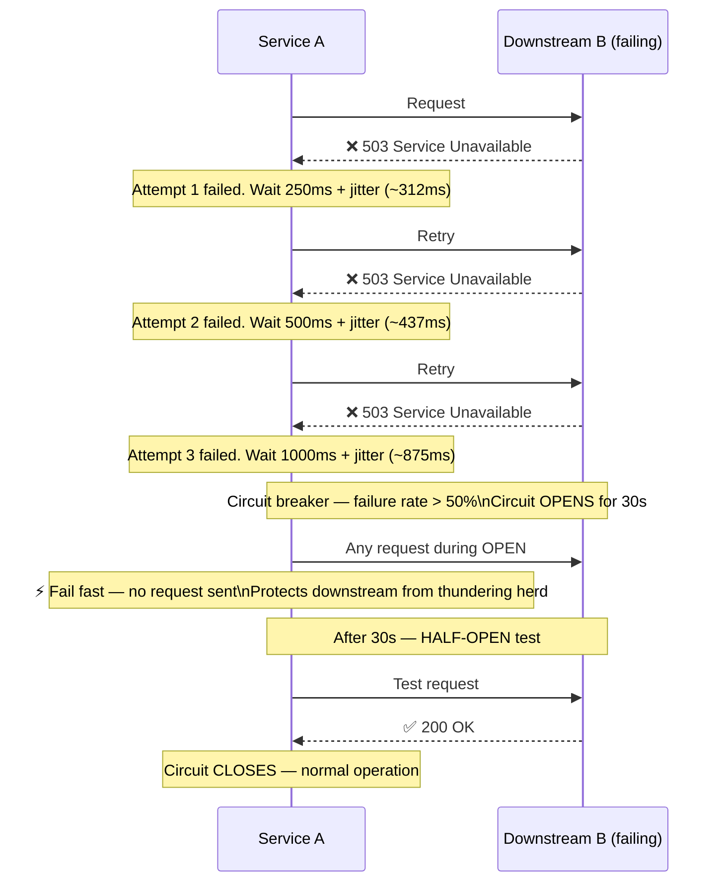

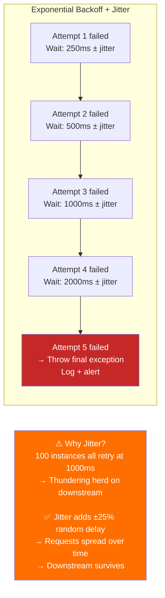

---

## 10. Large File Import — Production Flow

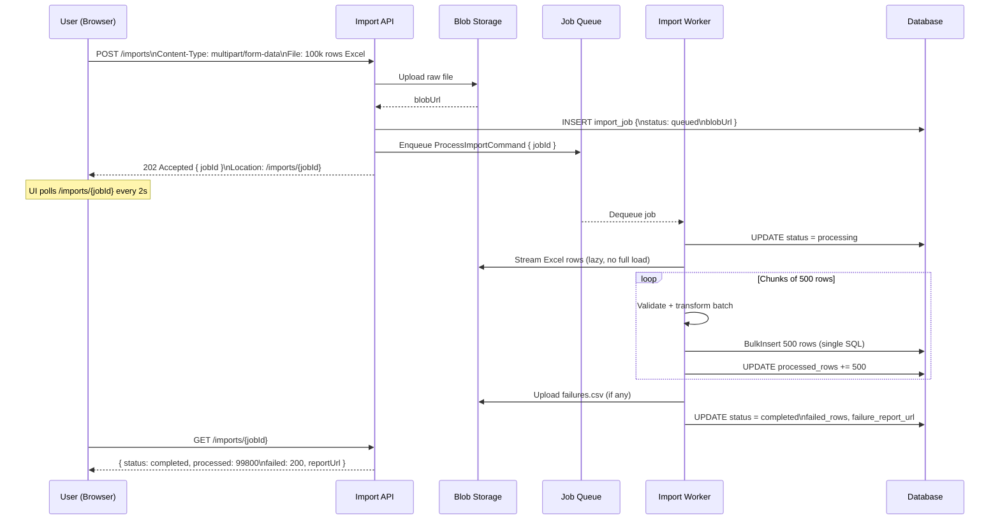

---

## 11. Idempotency Key Pattern

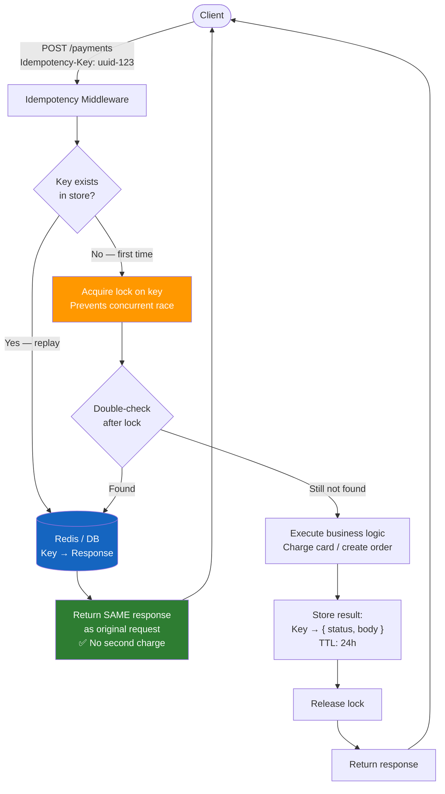

---

## 12. System Design Selection Guide

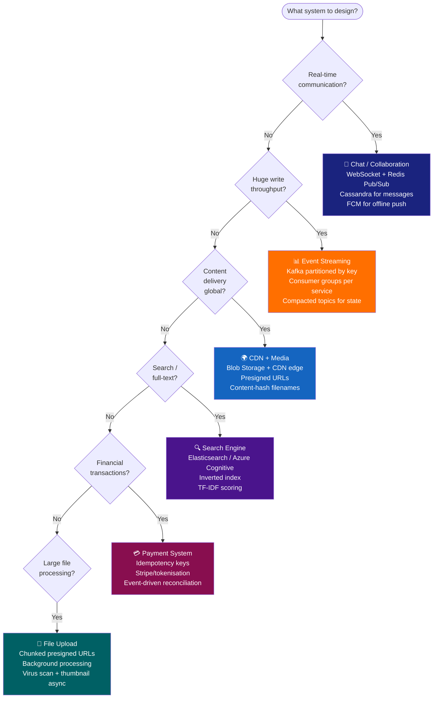

EOF
echo "Done diagrams-system-design.md"