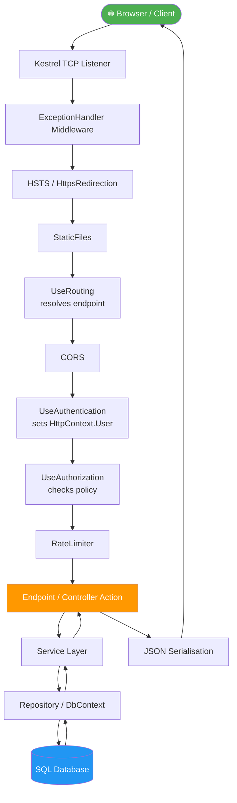
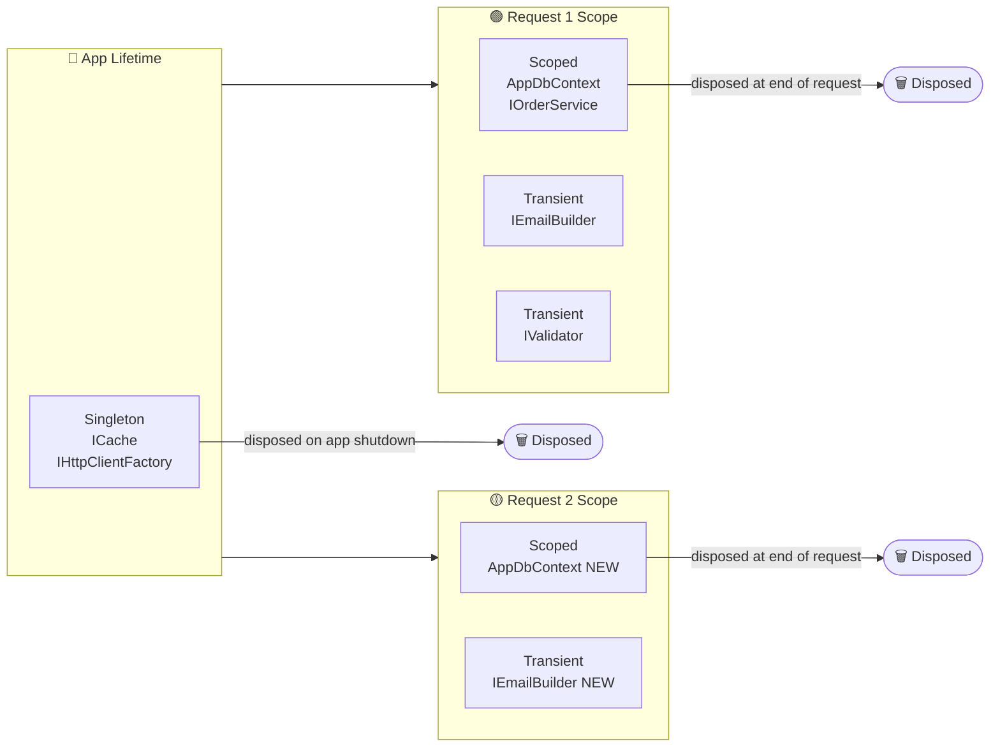
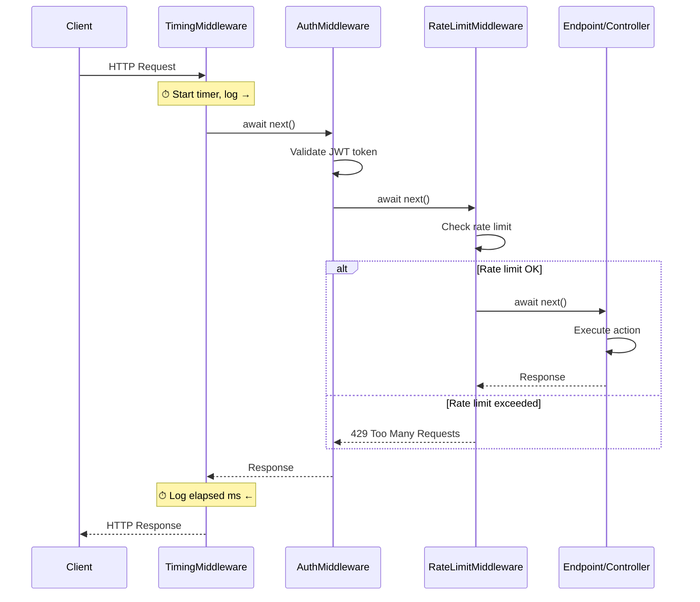
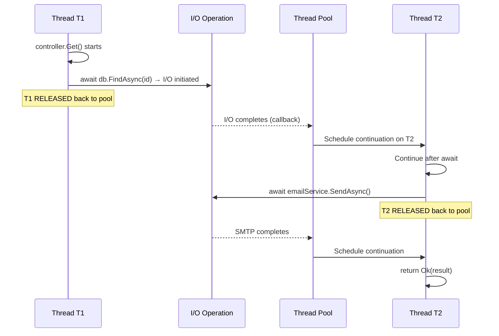
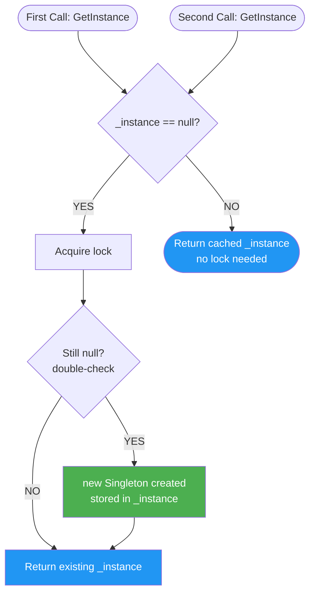
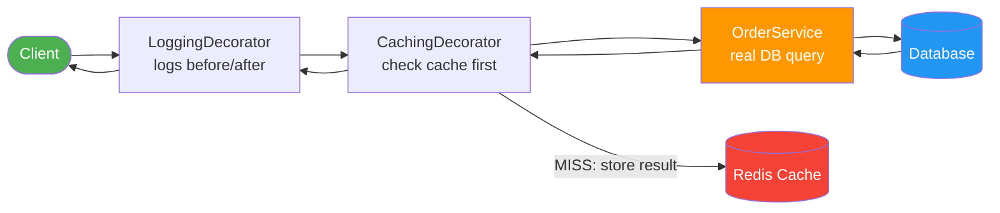
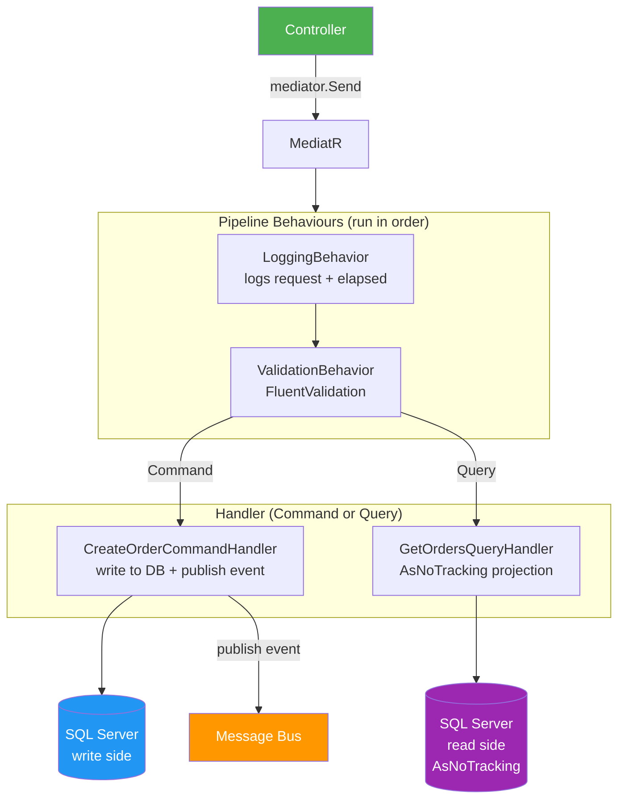
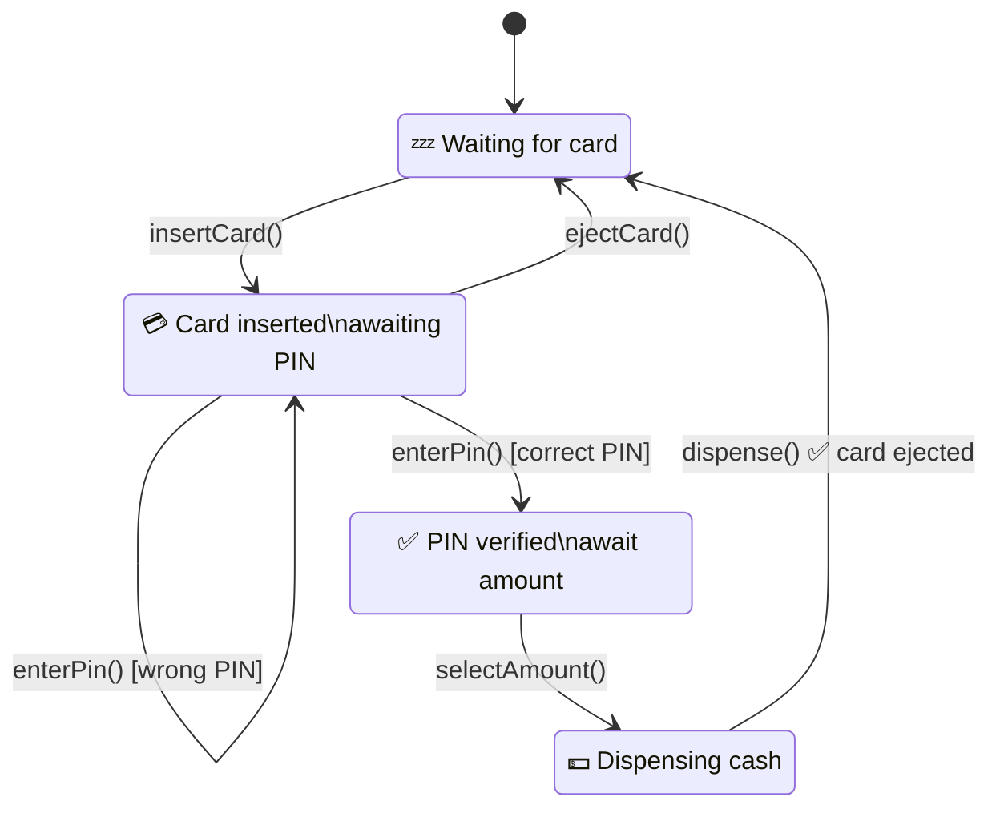
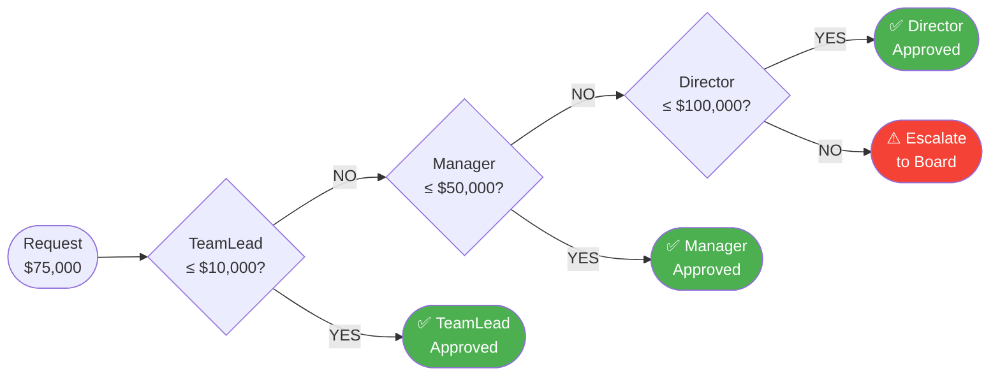
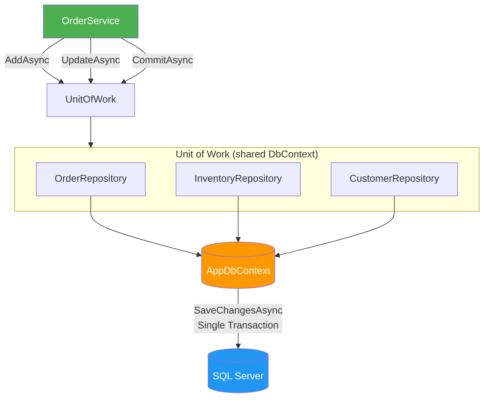

# 🔄 .NET Code Flows & Design Pattern Execution Flows

> Step-by-step execution traces — what actually runs, in what order, and why.
> Every flow includes an ASCII diagram + annotated C# code walking through each stage.

---

## 📋 Table of Contents

### .NET Runtime Flows
1. [ASP.NET Core Request Pipeline Flow](#1-aspnet-core-request-pipeline-flow)
2. [Dependency Injection Lifecycle Flow](#2-dependency-injection-lifecycle-flow)
3. [Middleware Chain Execution Flow](#3-middleware-chain-execution-flow)
4. [Entity Framework Core Query Flow](#4-entity-framework-core-query-flow)
5. [JWT Authentication Flow](#5-jwt-authentication-flow)
6. [Async/Await Execution Flow](#6-asyncawait-execution-flow)
7. [Exception Handling Pipeline Flow](#7-exception-handling-pipeline-flow)
8. [SignalR Connection Flow](#8-signalr-connection-flow)

### Design Pattern Flows
9.  [Singleton Pattern Flow](#9-singleton-pattern-flow)
10. [Factory Method Pattern Flow](#10-factory-method-pattern-flow)
11. [Abstract Factory Pattern Flow](#11-abstract-factory-pattern-flow)
12. [Builder Pattern Flow](#12-builder-pattern-flow)
13. [Decorator Pattern Flow](#13-decorator-pattern-flow)
14. [Adapter Pattern Flow](#14-adapter-pattern-flow)
15. [Facade Pattern Flow](#15-facade-pattern-flow)
16. [Proxy Pattern Flow](#16-proxy-pattern-flow)
17. [Observer Pattern Flow](#17-observer-pattern-flow)
18. [Strategy Pattern Flow](#18-strategy-pattern-flow)
19. [Command Pattern Flow](#19-command-pattern-flow)
20. [Chain of Responsibility Flow](#20-chain-of-responsibility-flow)
21. [State Pattern Flow](#21-state-pattern-flow)
22. [Template Method Pattern Flow](#22-template-method-pattern-flow)
23. [Repository + Unit of Work Flow](#23-repository--unit-of-work-flow)
24. [CQRS + MediatR Flow](#24-cqrs--mediatr-flow)

---

# .NET Runtime Flows

---

## 1. ASP.NET Core Request Pipeline Flow

```
Browser / Client
      │
      ▼
[ Kestrel / IIS ]         ← TCP socket, TLS termination
      │
      ▼
[ Host / WebApplication ]  ← Program.cs: builder.Build().Run()
      │
      ▼
┌─────────────────────────────────────────────┐
│           Middleware Pipeline               │
│                                             │
│  1. ExceptionHandler / HSTS                 │
│  2. HttpsRedirection                        │
│  3. StaticFiles                             │
│  4. Routing          ← matches endpoint     │
│  5. CORS                                    │
│  6. Authentication   ← sets HttpContext.User│
│  7. Authorization    ← checks policy        │
│  8. RateLimiter                             │
│  9. Endpoint Middleware (your code)         │
└─────────────────────────────────────────────┘
      │
      ▼
[ Controller / Minimal API Handler ]
      │  Model Binding → Validation → Action
      ▼
[ Service Layer ]   ← business logic
      │
      ▼
[ Repository / DbContext ]
      │
      ▼
[ Database ]
      │
      ▼ (response bubbles back up through middleware)
[ JSON Serialization → HttpResponse ]
      │
      ▼
Browser / Client
```

### Annotated Code Walk-through

```csharp
// ── Program.cs ───────────────────────────────────────────────────────
var builder = WebApplication.CreateBuilder(args);        // STEP 1: host + DI container built

// Register services into DI
builder.Services.AddControllers();
builder.Services.AddScoped<IOrderService, OrderService>();
builder.Services.AddDbContext<AppDbContext>(o =>
    o.UseSqlServer(builder.Configuration.GetConnectionString("Default")));

var app = builder.Build();                               // STEP 2: pipeline compiled

// ── Middleware registration ORDER matters ─────────────────────────────
app.UseExceptionHandler("/error");                       // STEP 3a: outermost — catches unhandled exceptions
app.UseHsts();                                           // STEP 3b: adds Strict-Transport-Security header
app.UseHttpsRedirection();                               // STEP 3c: 301 if HTTP
app.UseStaticFiles();                                    // STEP 3d: short-circuits for wwwroot files
app.UseRouting();                                        // STEP 3e: resolves which endpoint matches URL
app.UseCors("AllowAll");                                 // STEP 3f: CORS preflight/headers
app.UseAuthentication();                                 // STEP 3g: reads JWT/cookie → sets HttpContext.User
app.UseAuthorization();                                  // STEP 3h: checks [Authorize] policies
app.MapControllers();                                    // STEP 3i: endpoint middleware runs controller

app.Run();                                               // STEP 4: Kestrel starts listening

// ── Request arrives: GET /api/orders/42 ──────────────────────────────
// STEP 5: Routing resolves → OrdersController.Get(42)
// STEP 6: Model binding → id = 42
// STEP 7: Action filter OnActionExecuting
// STEP 8: Action method executes
[ApiController]
[Route("api/[controller]")]
public class OrdersController : ControllerBase
{
    private readonly IOrderService _svc;
    public OrdersController(IOrderService svc) => _svc = svc; // STEP 9: DI injects scoped service

    [HttpGet("{id:guid}")]
    public async Task<IActionResult> Get(Guid id)
    {
        var order = await _svc.GetByIdAsync(id);   // STEP 10: service → repo → DbContext → SQL
        return order is null ? NotFound() : Ok(order); // STEP 11: IActionResult serialized to JSON
    }
}
// STEP 12: Response travels back through middleware (in reverse)
// STEP 13: Kestrel writes bytes to TCP socket
```

---

## 2. Dependency Injection Lifecycle Flow

```
app.Run() → Request 1 arrives
│
├─ DI Scope created  (1 scope per HTTP request)
│    │
│    ├─ Singleton resolved  → same instance across ALL requests/scopes (created once)
│    │       IAppCache, IHttpClientFactory, ILogger<T>
│    │
│    ├─ Scoped resolved     → same instance WITHIN this request scope
│    │       AppDbContext, IOrderService, ICurrentUser
│    │
│    └─ Transient resolved  → new instance EVERY time it is requested
│            IEmailBuilder, validators
│
└─ Request 1 ends → Scope disposed
         │
         ├─ Scoped services: Dispose() called
         └─ Transient services: Dispose() called (if IDisposable)

Singleton services: only disposed when host shuts down
```

### Annotated Code Walk-through

```csharp
// Registration
builder.Services.AddSingleton<ICache, RedisCache>();         // one instance, entire app lifetime
builder.Services.AddScoped<AppDbContext>();                   // one per HTTP request
builder.Services.AddTransient<IEmailBuilder, EmailBuilder>(); // new every injection

// ── What happens during a request ──────────────────────────────────────
// DI resolves OrdersController constructor:
//   IOrderService (Scoped) → created fresh for this request
//     └─ IOrderRepository (Scoped) → same scope, may share with OrderService
//          └─ AppDbContext (Scoped) → one DbContext tracks all entities for this request

// ── Captive Dependency Bug ─────────────────────────────────────────────
// ❌ Singleton holding Scoped = captured scope = shared state across requests
builder.Services.AddSingleton<MySingleton>(); // MySingleton(AppDbContext dbContext) → WRONG
// Fix: inject IServiceScopeFactory instead
public class MySingleton
{
    private readonly IServiceScopeFactory _factory;
    public MySingleton(IServiceScopeFactory f) => _factory = f;

    public async Task DoWork()
    {
        using var scope = _factory.CreateScope();                  // manually create scope
        var db = scope.ServiceProvider.GetRequiredService<AppDbContext>(); // scoped db for this work
        // ...
    } // scope.Dispose() → db.Dispose()
}
```

---

## 3. Middleware Chain Execution Flow

```
Request →  MW1.InvokeAsync(ctx, next)
              │ before-logic
              ▼
           MW2.InvokeAsync(ctx, next)
              │ before-logic
              ▼
           MW3.InvokeAsync(ctx, next)
              │ before-logic
              ▼
           [ Endpoint / Controller ]
              │
              ▼ (response flows BACK up)
           MW3 after-logic
              │
              ▼
           MW2 after-logic  ← can inspect/modify response here
              │
              ▼
           MW1 after-logic
              │
              ▼
         ← Response
```

### Annotated Code Walk-through

```csharp
// Custom middleware — timing + logging
public class TimingMiddleware
{
    private readonly RequestDelegate _next;
    private readonly ILogger<TimingMiddleware> _log;

    public TimingMiddleware(RequestDelegate next, ILogger<TimingMiddleware> log)
    {
        _next = next;  // _next = the rest of the pipeline
        _log  = log;
    }

    public async Task InvokeAsync(HttpContext ctx)
    {
        // ── BEFORE: runs on the way IN ───────────────────────
        var sw = Stopwatch.StartNew();
        _log.LogInformation("→ {Method} {Path}", ctx.Request.Method, ctx.Request.Path);

        await _next(ctx);  // ◄─ hand off to next middleware / endpoint

        // ── AFTER: runs on the way OUT ───────────────────────
        sw.Stop();
        _log.LogInformation("← {Status} in {Ms}ms",
            ctx.Response.StatusCode, sw.ElapsedMilliseconds);
        // IMPORTANT: cannot modify ctx.Response.Body here if it's already started
    }
}

// Short-circuit example — returns 429 without calling _next
public class RateLimitMiddleware
{
    public async Task InvokeAsync(HttpContext ctx)
    {
        if (IsThrottled(ctx))
        {
            ctx.Response.StatusCode = 429;
            await ctx.Response.WriteAsync("Too Many Requests");
            return; // ← short-circuit: _next never called
        }
        await _next(ctx);
    }
}
```

---

## 4. Entity Framework Core Query Flow

```
C# LINQ Query
      │
      ▼
[ IQueryable<T> built ] ← nothing hits DB yet
      │
      ▼
[ DbContext.Set<T>().Where(...).Include(...) ]
      │
      ▼
[ EF Core LINQ Provider ]   ← translates expression tree → SQL AST
      │
      ▼
[ SQL Query Generated ]     ← "SELECT o.*, c.* FROM Orders o JOIN Customers c ..."
      │
      ▼
[ DbConnection.OpenAsync() ]  ← connection from pool
      │
      ▼
[ DbCommand.ExecuteReaderAsync() ] ← SQL sent to DB server
      │
      ▼
[ DataReader maps rows → entity objects ]
      │
      ▼
[ Identity Map / Change Tracker ]  ← entity tracked if AsTracking (default)
      │
      ▼
C# entity objects returned

SaveChanges() path:
[ Change Tracker detects Added/Modified/Deleted ]
      │
      ▼
[ SQL INSERT/UPDATE/DELETE generated ]
      │
      ▼
[ Transaction (implicit or explicit) ]
      │
      ▼
[ DbCommand.ExecuteNonQueryAsync() ]
      │
      ▼
[ DB commits, rowcount returned ]
```

### Annotated Code Walk-through

```csharp
// STEP 1: LINQ builds an expression tree — NO SQL yet
IQueryable<Order> query = _db.Orders
    .Include(o => o.Customer)          // JOIN Customer
    .Where(o => o.Status == "Pending") // WHERE filter
    .OrderBy(o => o.CreatedAt);        // ORDER BY

// STEP 2: Materialise — SQL executed HERE
List<Order> orders = await query.ToListAsync(); // ← hits DB

// STEP 3: AsNoTracking — skips change tracker for read-only queries (faster)
var dtos = await _db.Orders
    .AsNoTracking()
    .Where(o => o.CustomerId == customerId)
    .Select(o => new OrderDto { Id = o.Id, Total = o.Total }) // projection — fewer columns
    .ToListAsync();

// STEP 4: Mutation — change tracker watches entities
var order = await _db.Orders.FindAsync(id);    // tracked
order.Status = "Shipped";                       // change tracker marks as Modified
await _db.SaveChangesAsync();                   // generates UPDATE Orders SET Status=... WHERE Id=...

// STEP 5: Explicit transaction spanning multiple operations
await using var tx = await _db.Database.BeginTransactionAsync();
try
{
    _db.Orders.Add(newOrder);
    _db.Inventory.Update(item);
    await _db.SaveChangesAsync();
    await tx.CommitAsync();
}
catch
{
    await tx.RollbackAsync();
    throw;
}
```

---

## 5. JWT Authentication Flow

```
Client                              Server
  │                                   │
  │── POST /auth/login ──────────────►│
  │   { username, password }          │
  │                                   ├─ 1. Validate credentials vs DB
  │                                   ├─ 2. Build Claims:
  │                                   │      sub, email, roles, exp
  │                                   ├─ 3. Sign token with secret key
  │◄── 200 { token: "eyJ..." } ───────│
  │                                   │
  │── GET /api/orders ───────────────►│
  │   Authorization: Bearer eyJ...    │
  │                                   ├─ 4. UseAuthentication middleware
  │                                   ├─ 5. JwtBearer handler reads header
  │                                   ├─ 6. Validate signature, exp, iss, aud
  │                                   ├─ 7. Set HttpContext.User (ClaimsPrincipal)
  │                                   ├─ 8. UseAuthorization checks [Authorize]
  │◄── 200 [ orders... ] ─────────────│
```

### Annotated Code Walk-through

```csharp
// ── 1. Register JWT bearer ─────────────────────────────────────────────
builder.Services
    .AddAuthentication(JwtBearerDefaults.AuthenticationScheme)
    .AddJwtBearer(o =>
    {
        o.TokenValidationParameters = new TokenValidationParameters
        {
            ValidateIssuer           = true,
            ValidIssuer              = "https://myapp.com",
            ValidateAudience         = true,
            ValidAudience            = "https://myapp.com",
            ValidateLifetime         = true,    // checks exp claim
            ValidateIssuerSigningKey = true,
            IssuerSigningKey         = new SymmetricSecurityKey(
                Encoding.UTF8.GetBytes(builder.Configuration["Jwt:Key"]!))
        };
    });

// ── 2. Issue token on login ────────────────────────────────────────────
string IssueToken(User user, IConfiguration cfg)
{
    var claims = new[]
    {
        new Claim(JwtRegisteredClaimNames.Sub,   user.Id.ToString()),
        new Claim(JwtRegisteredClaimNames.Email, user.Email),
        new Claim(ClaimTypes.Role,               user.Role)
    };

    var key   = new SymmetricSecurityKey(Encoding.UTF8.GetBytes(cfg["Jwt:Key"]!));
    var creds = new SigningCredentials(key, SecurityAlgorithms.HmacSha256);
    var token = new JwtSecurityToken(
        issuer:             "https://myapp.com",
        audience:           "https://myapp.com",
        claims:             claims,
        expires:            DateTime.UtcNow.AddHours(1),
        signingCredentials: creds);

    return new JwtSecurityTokenHandler().WriteToken(token); // "eyJhbGci..."
}

// ── 3. Protect endpoint ────────────────────────────────────────────────
[Authorize(Roles = "Admin")]           // 401 if no token; 403 if wrong role
[HttpDelete("{id}")]
public async Task<IActionResult> Delete(Guid id)
{
    var userId = User.FindFirstValue(ClaimTypes.NameIdentifier); // from token claims
    // ...
}
```

---

## 6. Async/Await Execution Flow

```
Thread T1 (request thread)
  │
  ├─ controller.Get() called
  ├─ await dbContext.FindAsync(id)  ── I/O initiated ──► DB server
  │                                                        │
  │  T1 RELEASED back to thread pool                       │
  │  (no blocking!)                                        │
  │                                                        │
  │◄──────────────── I/O completes ─────────────────────── │
  │
  ├─ Continuation scheduled on Thread T2 (may differ from T1)
  ├─ await emailService.SendAsync()  ── I/O initiated ──► SMTP
  │
  │  T2 RELEASED back to thread pool
  │
  │◄──────────────── SMTP completes ──────────────────────
  │
  ├─ Thread T3 continues
  └─ return Ok(result) → response written
```

### Annotated Code Walk-through

```csharp
// State machine generated by compiler for every async method
public async Task<Order?> GetOrderWithNotificationAsync(Guid id)
{
    // Checkpoint 1: synchronous until first await
    _log.LogInformation("Starting");

    var order = await _db.Orders.FindAsync(id);   // ← compiler generates MoveNext() here
    // Everything below is a "continuation" — resumes after I/O completes

    if (order is null) return null;

    await _emailService.SendAsync(order.CustomerEmail, "Order found"); // another checkpoint

    return order; // returned via Task<Order?> completion source
}

// ConfigureAwait(false) — avoid deadlock in library code
// In ASP.NET Core there is NO SynchronizationContext, so it doesn't matter there,
// but in library code:
public async Task<string> LibraryMethod()
{
    var data = await _httpClient.GetStringAsync(url).ConfigureAwait(false);
    // continues on thread pool thread — never needs to return to captured context
    return data.Trim();
}

// ValueTask for hot paths (avoids Task allocation when already-complete)
public ValueTask<Order?> GetCachedAsync(Guid id)
{
    if (_cache.TryGetValue(id, out var order))
        return ValueTask.FromResult(order); // synchronous path — zero allocation

    return new ValueTask<Order?>(LoadFromDbAsync(id)); // async path — wraps Task
}
```

---

## 7. Exception Handling Pipeline Flow

```
Exception thrown in action
        │
        ▼
[ Action Filters — OnException ]      ← first chance: IExceptionFilter
        │ (if not handled)
        ▼
[ Exception Middleware ]              ← UseExceptionHandler("/error")
        │ catches, logs, returns ProblemDetails
        ▼
[ /error endpoint ]                   ← maps to structured error response

Custom global handler path:
        │
        ▼
[ IExceptionHandler (NET 8) ]         ← TryHandleAsync
        │
        ▼
[ ProblemDetails middleware ]         ← UseProblemDetails()
```

### Annotated Code Walk-through

```csharp
// ── .NET 8 IExceptionHandler ───────────────────────────────────────────
public class GlobalExceptionHandler : IExceptionHandler
{
    private readonly ILogger<GlobalExceptionHandler> _log;
    public GlobalExceptionHandler(ILogger<GlobalExceptionHandler> log) => _log = log;

    public async ValueTask<bool> TryHandleAsync(
        HttpContext ctx, Exception ex, CancellationToken ct)
    {
        _log.LogError(ex, "Unhandled exception");

        var problem = ex switch
        {
            NotFoundException  => new ProblemDetails { Status = 404, Title = "Not Found",  Detail = ex.Message },
            ValidationException=> new ProblemDetails { Status = 400, Title = "Bad Request",Detail = ex.Message },
            _                  => new ProblemDetails { Status = 500, Title = "Server Error" }
        };

        ctx.Response.StatusCode = problem.Status!.Value;
        await ctx.Response.WriteAsJsonAsync(problem, ct);
        return true; // handled — stop propagation
    }
}

// Registration
builder.Services.AddExceptionHandler<GlobalExceptionHandler>();
builder.Services.AddProblemDetails();
app.UseExceptionHandler();
```

---

## 8. SignalR Connection Flow

```
Client (Browser JS)                    Server (Hub)
  │                                       │
  ├── HTTP GET /hub (negotiate) ─────────►│
  │◄── { connectionId, transports } ──────│
  │                                       │
  ├── WebSocket Upgrade ─────────────────►│
  │◄── 101 Switching Protocols ───────────│
  │                                       │
  │  [Persistent bidirectional channel]   │
  │                                       │
  ├── Invoke "SendMessage" ─────────────►│
  │    { target, args }                   ├─ Hub.SendMessage() called
  │                                       ├─ Clients.All.SendAsync("ReceiveMessage", ...)
  │◄── "ReceiveMessage" broadcast ────────│
  │                                       │
  ├── Disconnect ────────────────────────►│
  │                                       └─ OnDisconnectedAsync()
```

### Annotated Code Walk-through

```csharp
// ── Hub definition ─────────────────────────────────────────────────────
public class ChatHub : Hub
{
    // STEP 1: Client calls this via connection.invoke("SendMessage", user, msg)
    public async Task SendMessage(string user, string message)
    {
        // STEP 2: Broadcast to every connected client
        await Clients.All.SendAsync("ReceiveMessage", user, message);
    }

    // STEP 3: Lifecycle — add to group on connect
    public override async Task OnConnectedAsync()
    {
        var room = Context.GetHttpContext()!.Request.Query["room"];
        await Groups.AddToGroupAsync(Context.ConnectionId, room!);
        await base.OnConnectedAsync();
    }

    public override Task OnDisconnectedAsync(Exception? ex)
    {
        // cleanup
        return base.OnDisconnectedAsync(ex);
    }
}

// ── Inject IHubContext to push from background service ─────────────────
public class OrderStatusService
{
    private readonly IHubContext<ChatHub> _hub;
    public OrderStatusService(IHubContext<ChatHub> hub) => _hub = hub;

    public async Task NotifyOrderShipped(Guid orderId)
    {
        await _hub.Clients.Group($"order-{orderId}")
                  .SendAsync("OrderShipped", orderId);
    }
}

// ── JS client ─────────────────────────────────────────────────────────
/*
const conn = new signalR.HubConnectionBuilder().withUrl("/chatHub").build();
conn.on("ReceiveMessage", (user, msg) => console.log(`${user}: ${msg}`));
await conn.start();
await conn.invoke("SendMessage", "Alice", "Hello!");
*/
```

---

# Design Pattern Flows

---

## 9. Singleton Pattern Flow

```
First call:  GetInstance()
    │
    ├─ _instance == null?  YES
    │       │
    │       └─ lock(_lock)
    │               │
    │               ├─ double-check: still null?
    │               └─ new Singleton() → stored in _instance
    │
    └─ return _instance

Second call: GetInstance()
    │
    ├─ _instance != null  (already created)
    └─ return same _instance  (no lock needed)
```

### Annotated Code Walk-through

```csharp
// Thread-safe Singleton using Lazy<T>
public sealed class AppConfig
{
    // STEP 1: Lazy<T> guarantees thread-safe single initialization
    private static readonly Lazy<AppConfig> _lazy =
        new(() => new AppConfig(), LazyThreadSafetyMode.ExecutionAndPublication);

    // STEP 2: Private constructor — external callers cannot use new AppConfig()
    private AppConfig()
    {
        // expensive initialization: load config files, parse settings
        Settings = LoadSettings();
    }

    // STEP 3: Public access point
    public static AppConfig Instance => _lazy.Value;
    // First access: Lazy creates the instance
    // Subsequent accesses: returns cached instance

    public Dictionary<string, string> Settings { get; }
    private Dictionary<string, string> LoadSettings() => new() { ["Theme"] = "Dark" };
}

// Usage flow
var cfg1 = AppConfig.Instance; // → creates instance
var cfg2 = AppConfig.Instance; // → returns same instance
Console.WriteLine(ReferenceEquals(cfg1, cfg2)); // True

// Preferred in ASP.NET Core: let DI manage singleton lifetime
builder.Services.AddSingleton<IAppConfig, AppConfig>();
// DI container is the "single source" — no manual locking needed
```

---

## 10. Factory Method Pattern Flow

```
Client code
    │
    ▼
Creator.CreateLogger(type)     ← factory method
    │
    ├─ type == "file"   → return new FileLogger()
    ├─ type == "db"     → return new DatabaseLogger()
    └─ type == "cloud"  → return new CloudLogger()
    │
    ▼
ILogger (interface)            ← client uses abstraction, unaware of concrete type
    │
    ▼
logger.Log(message)            ← polymorphic call routed to correct impl
```

### Annotated Code Walk-through

```csharp
// STEP 1: Product interface — what the factory produces
public interface ILogger
{
    void Log(string message);
}

// STEP 2: Concrete products
public class FileLogger   : ILogger { public void Log(string m) => File.AppendAllText("log.txt", m); }
public class CloudLogger  : ILogger { public void Log(string m) => Console.WriteLine($"[CLOUD] {m}"); }
public class DatabaseLogger : ILogger
{
    private readonly AppDbContext _db;
    public DatabaseLogger(AppDbContext db) => _db = db;
    public void Log(string m) { _db.Logs.Add(new LogEntry { Message = m }); _db.SaveChanges(); }
}

// STEP 3: Factory method — centralises creation logic
public static class LoggerFactory
{
    public static ILogger Create(string type, IServiceProvider sp) => type switch
    {
        "file"  => new FileLogger(),
        "db"    => sp.GetRequiredService<DatabaseLogger>(),  // needs DI
        "cloud" => new CloudLogger(),
        _       => throw new ArgumentException($"Unknown logger type: {type}")
    };
}

// STEP 4: Client code — depends only on ILogger
// Flow: client → factory → concrete type → interface
ILogger logger = LoggerFactory.Create(config["LoggerType"], serviceProvider);
logger.Log("Order created"); // polymorphic: correct impl called based on config
```

---

## 11. Abstract Factory Pattern Flow

```
Client chooses factory: WindowsUIFactory | MacUIFactory
        │
        ▼
IUIFactory.CreateButton()     → IButton (WinButton | MacButton)
IUIFactory.CreateCheckBox()   → ICheckBox (WinCheckBox | MacCheckBox)
        │
        ▼
Client uses IButton.Render()  ← platform-agnostic code
                               ← actual render matches OS family
```

### Annotated Code Walk-through

```csharp
// STEP 1: Abstract product interfaces
public interface IButton   { void Render(); }
public interface ICheckBox { void Render(); }

// STEP 2: Concrete products per family
public class WinButton   : IButton   { public void Render() => Console.WriteLine("Windows Button"); }
public class MacButton   : IButton   { public void Render() => Console.WriteLine("Mac Button"); }
public class WinCheckBox : ICheckBox { public void Render() => Console.WriteLine("Windows CheckBox"); }
public class MacCheckBox : ICheckBox { public void Render() => Console.WriteLine("Mac CheckBox"); }

// STEP 3: Abstract factory interface
public interface IUIFactory
{
    IButton   CreateButton();
    ICheckBox CreateCheckBox();
}

// STEP 4: Concrete factories — each produces a CONSISTENT family
public class WindowsFactory : IUIFactory
{
    public IButton   CreateButton()   => new WinButton();    // always Windows
    public ICheckBox CreateCheckBox() => new WinCheckBox();  // always Windows
}
public class MacFactory : IUIFactory
{
    public IButton   CreateButton()   => new MacButton();
    public ICheckBox CreateCheckBox() => new MacCheckBox();
}

// STEP 5: Client — talks only to interfaces, never concrete classes
public class Application
{
    private readonly IButton _btn;
    private readonly ICheckBox _chk;

    // STEP 6: Factory injected → concrete products created consistently
    public Application(IUIFactory factory)
    {
        _btn = factory.CreateButton();   // Windows or Mac, determined by factory
        _chk = factory.CreateCheckBox(); // same family guaranteed
    }

    public void RenderUI()
    {
        _btn.Render();
        _chk.Render();
    }
}

// Wiring
IUIFactory factory = RuntimeInformation.IsOSPlatform(OSPlatform.Windows)
    ? new WindowsFactory()
    : new MacFactory();
new Application(factory).RenderUI();
```

---

## 12. Builder Pattern Flow

```
Client
  │
  ▼
new QueryBuilder()
  .Select("Id", "Name")     ← STEP 1: set SELECT columns
  .From("Orders")           ← STEP 2: set table
  .Where("Status='Paid'")   ← STEP 3: add condition
  .OrderBy("CreatedAt")     ← STEP 4: add ORDER BY
  .Limit(10)                ← STEP 5: set page size
  .Build()                  ← STEP 6: assemble and return final object
  │
  ▼
SqlQuery { Sql = "SELECT Id, Name FROM Orders WHERE Status='Paid' ORDER BY CreatedAt LIMIT 10" }
```

### Annotated Code Walk-through

```csharp
// STEP 1: Product — what we're building
public class SqlQuery
{
    public string Sql     { get; init; } = "";
    public object[] Params { get; init; } = [];
}

// STEP 2: Builder — accumulates state, returns `this` for chaining
public class QueryBuilder
{
    private string _table = "";
    private readonly List<string> _columns  = new();
    private readonly List<string> _wheres   = new();
    private string _orderBy = "";
    private int? _limit;

    public QueryBuilder Select(params string[] cols)  { _columns.AddRange(cols); return this; }
    public QueryBuilder From(string table)             { _table = table;          return this; }
    public QueryBuilder Where(string condition)        { _wheres.Add(condition);  return this; }
    public QueryBuilder OrderBy(string col)            { _orderBy = col;          return this; }
    public QueryBuilder Limit(int n)                   { _limit = n;              return this; }

    // STEP 3: Build() assembles all state into the final immutable product
    public SqlQuery Build()
    {
        var cols  = _columns.Count > 0 ? string.Join(", ", _columns) : "*";
        var where = _wheres.Count  > 0 ? $" WHERE {string.Join(" AND ", _wheres)}" : "";
        var order = !string.IsNullOrEmpty(_orderBy) ? $" ORDER BY {_orderBy}" : "";
        var limit = _limit.HasValue ? $" LIMIT {_limit}" : "";
        return new SqlQuery { Sql = $"SELECT {cols} FROM {_table}{where}{order}{limit}" };
    }
}

// Usage
var query = new QueryBuilder()
    .Select("Id", "Name", "Total")
    .From("Orders")
    .Where("Status = 'Paid'")
    .Where("Total > 100")
    .OrderBy("CreatedAt DESC")
    .Limit(20)
    .Build();

Console.WriteLine(query.Sql);
// SELECT Id, Name, Total FROM Orders WHERE Status = 'Paid' AND Total > 100 ORDER BY CreatedAt DESC LIMIT 20
```

---

## 13. Decorator Pattern Flow

```
Client
  │
  ▼
LoggingDecorator.GetOrderAsync(id)      ← outermost wrapper
  │  logs "calling GetOrder"
  ▼
CachingDecorator.GetOrderAsync(id)      ← middle wrapper
  │  checks Redis cache
  │  MISS → calls inner
  ▼
OrderService.GetOrderAsync(id)          ← real implementation
  │  queries database
  ▼
returns Order
  │
  ▼ (bubbles back up)
CachingDecorator stores result in cache
  ▼
LoggingDecorator logs "returned in Xms"
  ▼
Client receives Order
```

### Annotated Code Walk-through

```csharp
// STEP 1: Interface (contract shared by real service and all decorators)
public interface IOrderService
{
    Task<Order?> GetOrderAsync(Guid id);
}

// STEP 2: Real implementation
public class OrderService : IOrderService
{
    private readonly AppDbContext _db;
    public OrderService(AppDbContext db) => _db = db;
    public Task<Order?> GetOrderAsync(Guid id) => _db.Orders.FindAsync(id).AsTask();
}

// STEP 3: Caching decorator — wraps IOrderService, adds caching concern
public class CachingOrderService : IOrderService
{
    private readonly IOrderService _inner;   // ← the real service (or another decorator)
    private readonly IMemoryCache _cache;

    public CachingOrderService(IOrderService inner, IMemoryCache cache)
    {
        _inner = inner;
        _cache = cache;
    }

    public async Task<Order?> GetOrderAsync(Guid id)
    {
        if (_cache.TryGetValue(id, out Order? cached)) return cached; // cache HIT
        var order = await _inner.GetOrderAsync(id);                    // cache MISS → delegate
        if (order is not null) _cache.Set(id, order, TimeSpan.FromMinutes(5));
        return order;
    }
}

// STEP 4: Logging decorator — wraps again
public class LoggingOrderService : IOrderService
{
    private readonly IOrderService _inner;
    private readonly ILogger<LoggingOrderService> _log;

    public LoggingOrderService(IOrderService inner, ILogger<LoggingOrderService> log)
    {
        _inner = inner;
        _log   = log;
    }

    public async Task<Order?> GetOrderAsync(Guid id)
    {
        _log.LogInformation("GetOrder {Id} started", id);
        var sw = Stopwatch.StartNew();
        var result = await _inner.GetOrderAsync(id); // ← delegates to CachingOrderService
        _log.LogInformation("GetOrder {Id} → {Status} in {Ms}ms",
            id, result is null ? "null" : "found", sw.ElapsedMilliseconds);
        return result;
    }
}

// STEP 5: Wire decorators (outermost last, inner first)
builder.Services.AddScoped<AppDbContext>();
builder.Services.AddMemoryCache();
builder.Services.AddScoped<IOrderService>(sp =>
    new LoggingOrderService(                              // outermost
        new CachingOrderService(                          // middle
            new OrderService(sp.GetRequiredService<AppDbContext>()), // innermost
            sp.GetRequiredService<IMemoryCache>()),
        sp.GetRequiredService<ILogger<LoggingOrderService>>()));
```

---

## 14. Adapter Pattern Flow

```
Client code (uses IModernLogger)
      │
      ▼
LoggerAdapter.Log(message)          ← adapter implements IModernLogger
      │  translates call
      ▼
LegacyLogger.WriteEntry(msg, date)  ← incompatible 3rd-party / legacy API
      │
      ▼
Log written
```

### Annotated Code Walk-through

```csharp
// STEP 1: Target interface — what the client expects
public interface IModernLogger
{
    void Log(string level, string message);
}

// STEP 2: Adaptee — existing class with incompatible interface
public class LegacyLogger
{
    public void WriteEntry(string text, DateTime timestamp, int severity)
    {
        Console.WriteLine($"[{timestamp:u}][{severity}] {text}");
    }
}

// STEP 3: Adapter — bridges the gap
public class LegacyLoggerAdapter : IModernLogger
{
    private readonly LegacyLogger _legacy = new();

    // STEP 4: Translate modern interface → legacy calls
    public void Log(string level, string message)
    {
        int severity = level switch { "ERROR" => 3, "WARN" => 2, _ => 1 };
        _legacy.WriteEntry(message, DateTime.UtcNow, severity); // adapted call
    }
}

// STEP 5: Client uses only IModernLogger — unaware of legacy underneath
builder.Services.AddSingleton<IModernLogger, LegacyLoggerAdapter>();

public class OrderController
{
    private readonly IModernLogger _log;
    public OrderController(IModernLogger log) => _log = log;

    public void Create(Order o)
    {
        // calls adapter → which calls legacy library internally
        _log.Log("INFO", $"Order {o.Id} created");
    }
}
```

---

## 15. Facade Pattern Flow

```
Client: placeOrder(items, paymentInfo)
      │
      ▼
OrderFacade.PlaceOrder()        ← single entry point
      │
      ├──► InventoryService.Reserve(items)
      │
      ├──► PaymentService.Charge(paymentInfo)
      │
      ├──► ShippingService.Schedule(order)
      │
      └──► NotificationService.SendConfirmation(order)
      │
      ▼
returns OrderConfirmation       ← client never directly calls any subsystem
```

### Annotated Code Walk-through

```csharp
// STEP 1: Complex subsystems (each has its own interface)
public class InventoryService    { public bool Reserve(List<Item> items) { /*...*/ return true; } }
public class PaymentService      { public string Charge(PaymentInfo pi)  { /*...*/ return "txn_123"; } }
public class ShippingService     { public string Schedule(Order o)       { /*...*/ return "TRACK-99"; } }
public class NotificationService { public void Send(string email, string msg) { /*...*/ } }

// STEP 2: Facade — orchestrates subsystems, presents a simple interface
public class OrderFacade
{
    private readonly InventoryService    _inv;
    private readonly PaymentService      _pay;
    private readonly ShippingService     _ship;
    private readonly NotificationService _notify;

    public OrderFacade(InventoryService inv, PaymentService pay,
                       ShippingService ship, NotificationService notify)
    {
        _inv    = inv;
        _pay    = pay;
        _ship   = ship;
        _notify = notify;
    }

    // STEP 3: One method that coordinates all subsystems in order
    public OrderConfirmation PlaceOrder(List<Item> items, PaymentInfo payment, string email)
    {
        if (!_inv.Reserve(items))                          // STEP 3a
            throw new InvalidOperationException("Out of stock");

        var txnId    = _pay.Charge(payment);               // STEP 3b
        var order    = new Order(items, txnId);
        var tracking = _ship.Schedule(order);              // STEP 3c
        _notify.Send(email, $"Order confirmed! Tracking: {tracking}"); // STEP 3d

        return new OrderConfirmation(order.Id, tracking);
    }
}

// STEP 4: Client — one call, no knowledge of subsystems
var confirmation = orderFacade.PlaceOrder(cart.Items, paymentInfo, user.Email);
```

---

## 16. Proxy Pattern Flow

```
Client
  │
  ▼
IOrderRepository (interface)
  │
  ▼
CachingProxy.GetByIdAsync(id)          ← proxy intercepts
  │
  ├─ cache HIT?  ──────────────────► return cached value (real repo never called)
  │
  └─ cache MISS? ──────────────────► RealOrderRepository.GetByIdAsync(id)
                                            │
                                            ▼
                                        SQL Database
                                            │
                                            ▼
                                     proxy stores result in cache
                                            │
                                            ▼
                                     return result to client
```

### Annotated Code Walk-through

```csharp
// STEP 1: Subject interface
public interface IOrderRepository
{
    Task<Order?> GetByIdAsync(Guid id);
    Task SaveAsync(Order order);
}

// STEP 2: Real subject
public class OrderRepository : IOrderRepository
{
    private readonly AppDbContext _db;
    public OrderRepository(AppDbContext db) => _db = db;
    public Task<Order?> GetByIdAsync(Guid id)    => _db.Orders.FindAsync(id).AsTask();
    public async Task SaveAsync(Order order)     { _db.Orders.Update(order); await _db.SaveChangesAsync(); }
}

// STEP 3: Caching Proxy — same interface, adds caching transparently
public class CachingOrderRepositoryProxy : IOrderRepository
{
    private readonly IOrderRepository _real;   // ← delegates to real repo on miss
    private readonly IDistributedCache _cache;

    public CachingOrderRepositoryProxy(IOrderRepository real, IDistributedCache cache)
    {
        _real  = real;
        _cache = cache;
    }

    public async Task<Order?> GetByIdAsync(Guid id)
    {
        var key  = $"order:{id}";
        var data = await _cache.GetStringAsync(key);

        if (data is not null)
            return JsonSerializer.Deserialize<Order>(data); // cache HIT

        var order = await _real.GetByIdAsync(id);           // cache MISS → real DB
        if (order is not null)
            await _cache.SetStringAsync(key,
                JsonSerializer.Serialize(order),
                new DistributedCacheEntryOptions { AbsoluteExpirationRelativeToNow = TimeSpan.FromMinutes(5) });
        return order;
    }

    public async Task SaveAsync(Order order)
    {
        await _real.SaveAsync(order);                                       // persist
        await _cache.RemoveAsync($"order:{order.Id}");                      // invalidate cache
    }
}

// STEP 4: Client sees only IOrderRepository — proxy is transparent
builder.Services.AddScoped<OrderRepository>();
builder.Services.AddScoped<IOrderRepository>(sp =>
    new CachingOrderRepositoryProxy(
        sp.GetRequiredService<OrderRepository>(),
        sp.GetRequiredService<IDistributedCache>()));
```

---

## 17. Observer Pattern Flow

```
Subject (EventPublisher / event source)
  │
  ├─ Subscribe: observer1.Register() → internal list: [obs1, obs2, obs3]
  │
  │  [Event occurs: Order status changes]
  │
  ├─ NotifyAll()
  │     ├─► Observer1.OnNext(event)   (EmailNotifier)
  │     ├─► Observer2.OnNext(event)   (AuditLogger)
  │     └─► Observer3.OnNext(event)   (InventoryUpdater)
  │
  └─ Each observer acts independently
```

### Annotated Code Walk-through

```csharp
// STEP 1: Event / notification payload
public record OrderStatusChangedEvent(Guid OrderId, string OldStatus, string NewStatus);

// STEP 2: Observer interface
public interface IOrderEventObserver
{
    Task OnOrderStatusChanged(OrderStatusChangedEvent e);
}

// STEP 3: Concrete observers
public class EmailNotifier : IOrderEventObserver
{
    public async Task OnOrderStatusChanged(OrderStatusChangedEvent e)
    {
        if (e.NewStatus == "Shipped")
            await SendEmailAsync($"Order {e.OrderId} shipped!");
    }
    private Task SendEmailAsync(string msg) => Task.CompletedTask; // stub
}

public class AuditLogger : IOrderEventObserver
{
    public Task OnOrderStatusChanged(OrderStatusChangedEvent e)
    {
        Console.WriteLine($"AUDIT: {e.OrderId} {e.OldStatus}→{e.NewStatus}");
        return Task.CompletedTask;
    }
}

// STEP 4: Subject — maintains observer list and notifies
public class OrderService
{
    private readonly List<IOrderEventObserver> _observers;

    public OrderService(IEnumerable<IOrderEventObserver> observers)
        => _observers = observers.ToList();

    public async Task UpdateStatusAsync(Order order, string newStatus)
    {
        var oldStatus = order.Status;
        order.Status  = newStatus;                    // STEP 5: state change

        // STEP 6: notify all observers
        var evt = new OrderStatusChangedEvent(order.Id, oldStatus, newStatus);
        foreach (var obs in _observers)
            await obs.OnOrderStatusChanged(evt);
    }
}

// STEP 7: .NET built-in: C# events (delegate-based observer)
public class StockTicker
{
    public event EventHandler<decimal>? PriceChanged; // built-in observer

    public void UpdatePrice(decimal price)
    {
        PriceChanged?.Invoke(this, price); // notifies all subscribers
    }
}

var ticker = new StockTicker();
ticker.PriceChanged += (_, price) => Console.WriteLine($"Price: {price}"); // subscribe
ticker.UpdatePrice(150.5m); // → triggers subscriber
```

---

## 18. Strategy Pattern Flow

```
Client: checkout(order, discountType)
      │
      ▼
DiscountCalculator.Calculate(order)
      │
      ├─ _strategy = new RegularDiscount()   → 10% off
      ├─ _strategy = new PremiumDiscount()   → 20% off
      └─ _strategy = new VipDiscount()       → 30% off
      │
      ▼  (strategy is swappable at runtime — same Calculate() call)
returns discounted price
```

### Annotated Code Walk-through

```csharp
// STEP 1: Strategy interface
public interface IDiscountStrategy
{
    decimal Apply(decimal originalPrice);
    string Name { get; }
}

// STEP 2: Concrete strategies — each encapsulates one algorithm
public class NoDiscount     : IDiscountStrategy { public string Name => "None";    public decimal Apply(decimal p) => p; }
public class RegularDiscount: IDiscountStrategy { public string Name => "Regular"; public decimal Apply(decimal p) => p * 0.90m; }
public class PremiumDiscount: IDiscountStrategy { public string Name => "Premium"; public decimal Apply(decimal p) => p * 0.80m; }
public class VipDiscount    : IDiscountStrategy { public string Name => "VIP";     public decimal Apply(decimal p) => p * 0.70m; }

// STEP 3: Context — holds strategy reference, delegates algorithm to it
public class OrderPricer
{
    private IDiscountStrategy _strategy;

    public OrderPricer(IDiscountStrategy strategy)
        => _strategy = strategy;

    // STEP 4: Strategy can be swapped at runtime
    public void SetStrategy(IDiscountStrategy strategy)
        => _strategy = strategy;

    public decimal Calculate(decimal price)
    {
        var discounted = _strategy.Apply(price); // ← polymorphic dispatch
        Console.WriteLine($"Applying {_strategy.Name}: {price:C} → {discounted:C}");
        return discounted;
    }
}

// STEP 5: Strategy selected at runtime based on data
var pricer = new OrderPricer(new NoDiscount());

string customerType = GetCustomerType(customerId); // "Regular", "Premium", "VIP"
pricer.SetStrategy(customerType switch
{
    "Regular" => new RegularDiscount(),
    "Premium" => new PremiumDiscount(),
    "VIP"     => new VipDiscount(),
    _         => new NoDiscount()
});

decimal finalPrice = pricer.Calculate(order.Total); // calls correct algorithm
```

---

## 19. Command Pattern Flow

```
Client
  │
  ├─ cmd = new ShipOrderCommand(orderId)
  │
  ▼
CommandInvoker.Execute(cmd)
  │
  ├─ cmd.Execute()           ← executes the action
  ├─ _history.Push(cmd)      ← stores for undo
  │
  ▼
Order.Status = "Shipped"

CommandInvoker.Undo()
  │
  ├─ cmd = _history.Pop()
  ├─ cmd.Undo()              ← reverses the action
  │
  ▼
Order.Status = "Processing"  ← restored
```

### Annotated Code Walk-through

```csharp
// STEP 1: Command interface
public interface ICommand
{
    void Execute();
    void Undo();
}

// STEP 2: Concrete command — encapsulates action + undo data
public class ShipOrderCommand : ICommand
{
    private readonly Order _order;
    private string _previousStatus = "";    // saved for undo

    public ShipOrderCommand(Order order) => _order = order;

    public void Execute()
    {
        _previousStatus = _order.Status;   // STEP 3: save state before change
        _order.Status   = "Shipped";
        Console.WriteLine($"Order {_order.Id} shipped");
    }

    public void Undo()
    {
        _order.Status = _previousStatus;   // STEP 4: restore previous state
        Console.WriteLine($"Undo: Order {_order.Id} back to {_previousStatus}");
    }
}

// STEP 5: Invoker — manages execution and history
public class OrderCommandInvoker
{
    private readonly Stack<ICommand> _history = new();

    public void Execute(ICommand cmd)
    {
        cmd.Execute();           // run command
        _history.Push(cmd);      // push to undo stack
    }

    public void Undo()
    {
        if (_history.TryPop(out var cmd))
            cmd.Undo();
    }
}

// STEP 6: Usage flow
var order   = new Order { Id = Guid.NewGuid(), Status = "Processing" };
var invoker = new OrderCommandInvoker();

invoker.Execute(new ShipOrderCommand(order));   // Order shipped → status = "Shipped"
Console.WriteLine(order.Status);               // "Shipped"
invoker.Undo();                                // reversed → status = "Processing"
Console.WriteLine(order.Status);               // "Processing"
```

---

## 20. Chain of Responsibility Flow

```
Request: order approval for $75,000
      │
      ▼
TeamLeadHandler.Handle(request)
  │  amount <= 10,000?  NO
  │
  ▼
ManagerHandler.Handle(request)
  │  amount <= 50,000?  NO
  │
  ▼
DirectorHandler.Handle(request)
  │  amount <= 100,000? YES
  │
  ▼
  Approved by Director   ← chain stops here
```

### Annotated Code Walk-through

```csharp
// STEP 1: Handler interface with next-handler reference
public abstract class ApprovalHandler
{
    protected ApprovalHandler? _next;

    public ApprovalHandler SetNext(ApprovalHandler next)
    {
        _next = next;
        return next; // fluent chaining: lead.SetNext(mgr).SetNext(dir)
    }

    public abstract void Handle(decimal amount);
}

// STEP 2: Concrete handlers — each decides to handle OR pass to next
public class TeamLeadHandler : ApprovalHandler
{
    public override void Handle(decimal amount)
    {
        if (amount <= 10_000)
            Console.WriteLine($"Team Lead approved ${amount}");   // handle it
        else
            _next?.Handle(amount);                                 // pass up chain
    }
}

public class ManagerHandler : ApprovalHandler
{
    public override void Handle(decimal amount)
    {
        if (amount <= 50_000)
            Console.WriteLine($"Manager approved ${amount}");
        else
            _next?.Handle(amount);
    }
}

public class DirectorHandler : ApprovalHandler
{
    public override void Handle(decimal amount)
    {
        if (amount <= 100_000)
            Console.WriteLine($"Director approved ${amount}");
        else
            Console.WriteLine($"${amount} exceeds authority — escalate to Board");
    }
}

// STEP 3: Build the chain
var lead    = new TeamLeadHandler();
var manager = new ManagerHandler();
var director= new DirectorHandler();
lead.SetNext(manager).SetNext(director);   // TeamLead → Manager → Director

// STEP 4: Send requests — each routes to the correct handler
lead.Handle(5_000);   // "Team Lead approved $5000"
lead.Handle(30_000);  // "Manager approved $30000"
lead.Handle(75_000);  // "Director approved $75000"
lead.Handle(200_000); // "exceeds authority"

// ASP.NET Core Middleware IS Chain of Responsibility — see Section 3
```

---

## 21. State Pattern Flow

```
ATM Machine states:

  [Idle] ──insertCard()──► [HasCard]
     │                         │
     │                    enterPin()
     │                         │
     │                    ┌────▼────┐
     │                    │ correct? │
     │                    └────┬────┘
     │                   YES   │  NO
     │              [Authenticated] [HasCard] (retry)
     │                    │
     │               selectAmount()
     │                    │
     │              [Dispensing]
     │                    │
     │               dispense()
     │                    │
     └────────────────[Idle] (card ejected)
```

### Annotated Code Walk-through

```csharp
// STEP 1: State interface — operations valid across all states
public interface IAtmState
{
    void InsertCard(AtmMachine atm);
    void EnterPin(AtmMachine atm, string pin);
    void SelectAmount(AtmMachine atm, decimal amount);
    void Dispense(AtmMachine atm);
}

// STEP 2: Concrete states — each implements only its valid operations
public class IdleState : IAtmState
{
    public void InsertCard(AtmMachine atm)
    {
        Console.WriteLine("Card inserted");
        atm.SetState(new HasCardState());          // STEP 3: transition to next state
    }
    public void EnterPin(AtmMachine atm, string pin)    => Console.WriteLine("Insert card first");
    public void SelectAmount(AtmMachine atm, decimal a) => Console.WriteLine("Insert card first");
    public void Dispense(AtmMachine atm)                => Console.WriteLine("Insert card first");
}

public class HasCardState : IAtmState
{
    public void InsertCard(AtmMachine atm)              => Console.WriteLine("Card already inserted");
    public void EnterPin(AtmMachine atm, string pin)
    {
        if (pin == "1234")
        {
            Console.WriteLine("PIN correct");
            atm.SetState(new AuthenticatedState());
        }
        else Console.WriteLine("Wrong PIN");
    }
    public void SelectAmount(AtmMachine atm, decimal a) => Console.WriteLine("Enter PIN first");
    public void Dispense(AtmMachine atm)                => Console.WriteLine("Enter PIN first");
}

public class AuthenticatedState : IAtmState
{
    private decimal _requested;
    public void InsertCard(AtmMachine atm)              => Console.WriteLine("Already authenticated");
    public void EnterPin(AtmMachine atm, string pin)    => Console.WriteLine("Already authenticated");
    public void SelectAmount(AtmMachine atm, decimal a)
    {
        _requested = a;
        Console.WriteLine($"Amount ${a} selected");
        atm.SetState(new DispensingState(a));
    }
    public void Dispense(AtmMachine atm)                => Console.WriteLine("Select amount first");
}

public class DispensingState : IAtmState
{
    private readonly decimal _amount;
    public DispensingState(decimal amount) => _amount = amount;

    public void InsertCard(AtmMachine atm) => Console.WriteLine("Processing");
    public void EnterPin(AtmMachine atm, string pin) => Console.WriteLine("Processing");
    public void SelectAmount(AtmMachine atm, decimal a) => Console.WriteLine("Processing");
    public void Dispense(AtmMachine atm)
    {
        Console.WriteLine($"Dispensing ${_amount}");
        atm.SetState(new IdleState());             // return to idle after dispense
    }
}

// STEP 4: Context — holds current state, delegates all operations to it
public class AtmMachine
{
    private IAtmState _state = new IdleState();
    public void SetState(IAtmState state) => _state = state;

    public void InsertCard()              => _state.InsertCard(this);
    public void EnterPin(string pin)      => _state.EnterPin(this, pin);
    public void SelectAmount(decimal amt) => _state.SelectAmount(this, amt);
    public void Dispense()                => _state.Dispense(this);
}

// STEP 5: Usage — client drives state transitions via context
var atm = new AtmMachine();
atm.InsertCard();           // "Card inserted"        → state: HasCard
atm.EnterPin("1234");       // "PIN correct"          → state: Authenticated
atm.SelectAmount(200);      // "Amount $200 selected" → state: Dispensing
atm.Dispense();             // "Dispensing $200"      → state: Idle
```

---

## 22. Template Method Pattern Flow

```
AbstractClass.Process()            ← defines the skeleton algorithm
  │
  ├─ Step1()  ← concrete (same for all subclasses)
  ├─ Step2()  ← abstract (each subclass provides own impl)
  ├─ Step3()  ← concrete with default (subclass may override)
  └─ Step4()  ← hook (empty by default, optional override)

Subclass A overrides Step2 + Step4
Subclass B overrides Step2 only

Client calls AbstractClass.Process() on either subclass →
same flow, different behaviour at variable steps
```

### Annotated Code Walk-through

```csharp
// STEP 1: Abstract class defines the template (skeleton algorithm)
public abstract class ReportGenerator
{
    // Template method — final to prevent overriding the skeleton
    public void GenerateReport()
    {
        FetchData();         // STEP A — abstract: must override
        ProcessData();       // STEP B — concrete: shared logic
        FormatOutput();      // STEP C — abstract: must override
        SaveReport();        // STEP D — concrete with hook
        OnReportSaved();     // STEP E — hook: empty default, optional override
    }

    protected abstract void FetchData();     // subclass provides data source
    protected abstract void FormatOutput();  // subclass provides format

    protected void ProcessData()             // shared processing
        => Console.WriteLine("Processing data...");

    protected void SaveReport()              // shared save logic
        => Console.WriteLine("Saving report to disk...");

    protected virtual void OnReportSaved()  // hook — empty default
    { }
}

// STEP 2: Concrete subclass — provides variable steps
public class PdfReportGenerator : ReportGenerator
{
    protected override void FetchData()    => Console.WriteLine("Fetching from SQL Server");
    protected override void FormatOutput() => Console.WriteLine("Formatting as PDF");
    protected override void OnReportSaved() => Console.WriteLine("Emailing PDF to stakeholders"); // hook used
}

public class ExcelReportGenerator : ReportGenerator
{
    protected override void FetchData()    => Console.WriteLine("Fetching from CSV files");
    protected override void FormatOutput() => Console.WriteLine("Formatting as Excel");
    // OnReportSaved not overridden — uses empty default
}

// STEP 3: Usage — client calls template method, polymorphism handles the rest
ReportGenerator generator = new PdfReportGenerator();
generator.GenerateReport();
// Output:
// Fetching from SQL Server
// Processing data...
// Formatting as PDF
// Saving report to disk...
// Emailing PDF to stakeholders

generator = new ExcelReportGenerator();
generator.GenerateReport();
// Output:
// Fetching from CSV files
// Processing data...
// Formatting as Excel
// Saving report to disk...
// (no hook output)
```

---

## 23. Repository + Unit of Work Flow

```
Controller
  │
  ▼
UnitOfWork.Orders.AddAsync(order)          ← IOrderRepository
UnitOfWork.Inventory.Reduce(item, qty)     ← IInventoryRepository
  │
  ▼
UnitOfWork.CommitAsync()                   ← single transaction
  │
  ├─► DbContext.SaveChangesAsync()
  │       ├─ INSERT Orders ...
  │       └─ UPDATE Inventory SET Qty = Qty - 1 ...
  │
  └─ either BOTH succeed or BOTH rollback
```

### Annotated Code Walk-through

```csharp
// STEP 1: Generic repository interface
public interface IRepository<T> where T : class
{
    Task<T?> GetByIdAsync(Guid id);
    Task<IEnumerable<T>> GetAllAsync();
    Task AddAsync(T entity);
    void Update(T entity);
    void Remove(T entity);
}

// STEP 2: Generic base repository — reuses common EF logic
public class Repository<T> : IRepository<T> where T : class
{
    protected readonly AppDbContext _db;
    protected readonly DbSet<T> _set;

    public Repository(AppDbContext db) { _db = db; _set = db.Set<T>(); }

    public Task<T?> GetByIdAsync(Guid id)         => _set.FindAsync(id).AsTask();
    public Task<IEnumerable<T>> GetAllAsync()      => Task.FromResult<IEnumerable<T>>(_set.AsEnumerable());
    public async Task AddAsync(T entity)           => await _set.AddAsync(entity);
    public void Update(T entity)                   => _set.Update(entity);
    public void Remove(T entity)                   => _set.Remove(entity);
}

// STEP 3: Specific repositories can add domain methods
public interface IOrderRepository : IRepository<Order>
{
    Task<IEnumerable<Order>> GetPendingAsync();
}

public class OrderRepository : Repository<Order>, IOrderRepository
{
    public OrderRepository(AppDbContext db) : base(db) { }
    public async Task<IEnumerable<Order>> GetPendingAsync() =>
        await _set.Where(o => o.Status == "Pending").ToListAsync();
}

// STEP 4: Unit of Work — groups repositories, owns the transaction
public interface IUnitOfWork : IDisposable
{
    IOrderRepository Orders     { get; }
    IRepository<Customer> Customers { get; }
    Task<int> CommitAsync();
}

public class UnitOfWork : IUnitOfWork
{
    private readonly AppDbContext _db;

    public UnitOfWork(AppDbContext db)
    {
        _db       = db;
        Orders    = new OrderRepository(db);     // STEP 5: shared DbContext!
        Customers = new Repository<Customer>(db);
    }

    public IOrderRepository       Orders    { get; }
    public IRepository<Customer>  Customers { get; }

    // STEP 6: Single SaveChanges covers ALL repo changes
    public Task<int> CommitAsync() => _db.SaveChangesAsync();
    public void Dispose()          => _db.Dispose();
}

// STEP 7: Usage — atomic operation across two repos
public class OrderService
{
    private readonly IUnitOfWork _uow;
    public OrderService(IUnitOfWork uow) => _uow = uow;

    public async Task PlaceOrderAsync(Order order, Customer customer)
    {
        await _uow.Orders.AddAsync(order);       // tracked in DbContext
        _uow.Customers.Update(customer);          // tracked in same DbContext
        await _uow.CommitAsync();                 // ONE SaveChanges — both in same transaction
    }
}
```

---

## 24. CQRS + MediatR Flow

```
Command flow (write):
  Controller ──► mediator.Send(CreateOrderCommand)
                       │
                       ▼
                 CreateOrderCommandHandler.Handle()
                       │
                       ├─ validate
                       ├─ create Order entity
                       ├─ _db.Orders.Add(order)
                       └─ _db.SaveChangesAsync()
                       │
                       ▼
                 returns OrderId

Query flow (read):
  Controller ──► mediator.Send(GetOrderQuery { Id })
                       │
                       ▼
                 GetOrderQueryHandler.Handle()
                       │
                       ├─ _readDb.Orders.AsNoTracking()
                       └─ .Select(new OrderDto...)
                       │
                       ▼
                 returns OrderDto (no tracking overhead)

Pipeline Behaviour (cross-cutting):
  mediator.Send(cmd)
       │
       ▼
  LoggingBehavior.Handle()           ← runs before/after every handler
       │
       ▼
  ValidationBehavior.Handle()        ← runs FluentValidation
       │
       ▼
  Actual Handler.Handle()
```

### Annotated Code Walk-through

```csharp
// ── STEP 1: Commands / Queries (inputs) ──────────────────────────────────
public record CreateOrderCommand(Guid CustomerId, List<OrderItem> Items)
    : IRequest<Guid>;   // returns OrderId

public record GetOrderQuery(Guid OrderId)
    : IRequest<OrderDto?>;   // returns DTO (no EF tracking)

// ── STEP 2: Command Handler ───────────────────────────────────────────────
public class CreateOrderCommandHandler : IRequestHandler<CreateOrderCommand, Guid>
{
    private readonly AppDbContext _db;
    public CreateOrderCommandHandler(AppDbContext db) => _db = db;

    public async Task<Guid> Handle(CreateOrderCommand cmd, CancellationToken ct)
    {
        var order = new Order
        {
            Id         = Guid.NewGuid(),
            CustomerId = cmd.CustomerId,
            Items      = cmd.Items,
            Status     = "Pending",
            CreatedAt  = DateTime.UtcNow
        };
        _db.Orders.Add(order);
        await _db.SaveChangesAsync(ct);
        return order.Id;       // returns only the new ID
    }
}

// ── STEP 3: Query Handler (read side) ────────────────────────────────────
public class GetOrderQueryHandler : IRequestHandler<GetOrderQuery, OrderDto?>
{
    private readonly AppDbContext _db;
    public GetOrderQueryHandler(AppDbContext db) => _db = db;

    public Task<OrderDto?> Handle(GetOrderQuery qry, CancellationToken ct)
        => _db.Orders
              .AsNoTracking()    // ← read-side: never track entities
              .Where(o => o.Id == qry.OrderId)
              .Select(o => new OrderDto(o.Id, o.Status, o.Total))
              .FirstOrDefaultAsync(ct);
}

// ── STEP 4: Pipeline Behaviour — runs around every handler ───────────────
public class LoggingBehavior<TRequest, TResponse>
    : IPipelineBehavior<TRequest, TResponse> where TRequest : notnull
{
    private readonly ILogger<LoggingBehavior<TRequest, TResponse>> _log;
    public LoggingBehavior(ILogger<LoggingBehavior<TRequest, TResponse>> log) => _log = log;

    public async Task<TResponse> Handle(
        TRequest request, RequestHandlerDelegate<TResponse> next, CancellationToken ct)
    {
        _log.LogInformation("→ {Name}", typeof(TRequest).Name);
        var sw       = Stopwatch.StartNew();
        var response = await next();           // ← call actual handler
        _log.LogInformation("← {Name} in {Ms}ms", typeof(TRequest).Name, sw.ElapsedMilliseconds);
        return response;
    }
}

// ── STEP 5: Registration ──────────────────────────────────────────────────
builder.Services.AddMediatR(cfg =>
{
    cfg.RegisterServicesFromAssembly(typeof(Program).Assembly);
    cfg.AddBehavior(typeof(IPipelineBehavior<,>), typeof(LoggingBehavior<,>));
});

// ── STEP 6: Controller — thin, just dispatches ───────────────────────────
[ApiController]
[Route("api/orders")]
public class OrdersController : ControllerBase
{
    private readonly IMediator _mediator;
    public OrdersController(IMediator mediator) => _mediator = mediator;

    [HttpPost]
    public async Task<IActionResult> Create(CreateOrderCommand cmd)
    {
        var id = await _mediator.Send(cmd);   // dispatches through pipeline → handler
        return CreatedAtAction(nameof(Get), new { id }, new { id });
    }

    [HttpGet("{id:guid}")]
    public async Task<IActionResult> Get(Guid id)
    {
        var dto = await _mediator.Send(new GetOrderQuery(id));
        return dto is null ? NotFound() : Ok(dto);
    }
}
```

---

> ✅ **24 code flows covered** — .NET runtime flows + all major design patterns.
>
> 💡 **How to use this during an interview:**
> - For system questions: draw the ASCII flow first, then walk through the code top-to-bottom
> - For pattern questions: state "here's what runs step by step" before writing code
> - For .NET pipeline questions: always mention middleware order matters (routing before auth before authorization)

---

*Last updated: 2026 | .NET 8 / C# 12 / MediatR 12*

---

# 📊 Flow Diagrams — Visual Reference

---

## Diagram 1 — ASP.NET Core Request Pipeline



---

## Diagram 2 — DI Lifetime Scopes



---

## Diagram 3 — Middleware Chain Execution



---

## Diagram 4 — Async/Await Thread Flow



---

## Diagram 5 — Singleton Pattern Flow



---

## Diagram 6 — Decorator Pattern Layering



---

## Diagram 7 — CQRS + MediatR Pipeline



---

## Diagram 8 — State Pattern (ATM Machine)



---

## Diagram 9 — Chain of Responsibility (Approval Flow)



---

## Diagram 10 — Repository + Unit of Work



