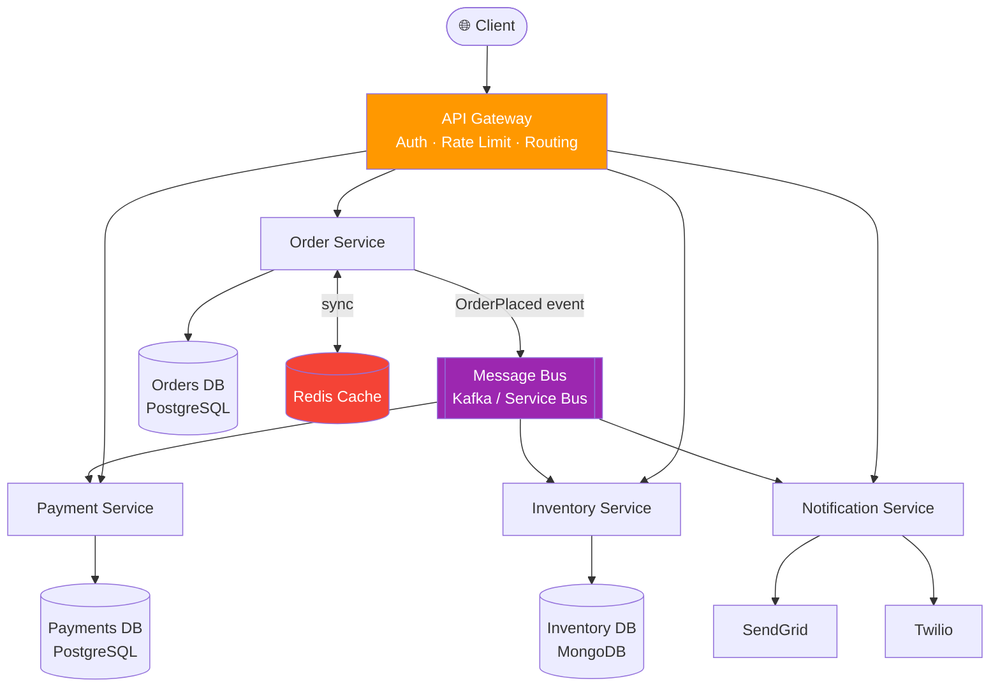
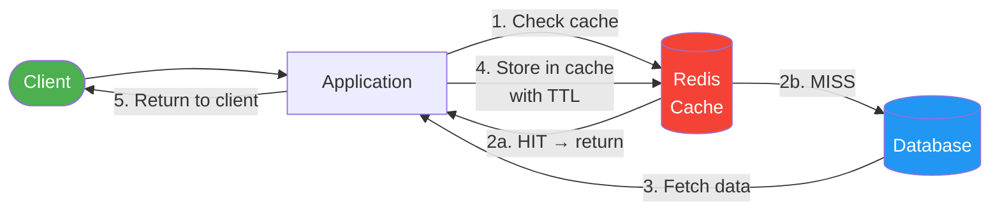
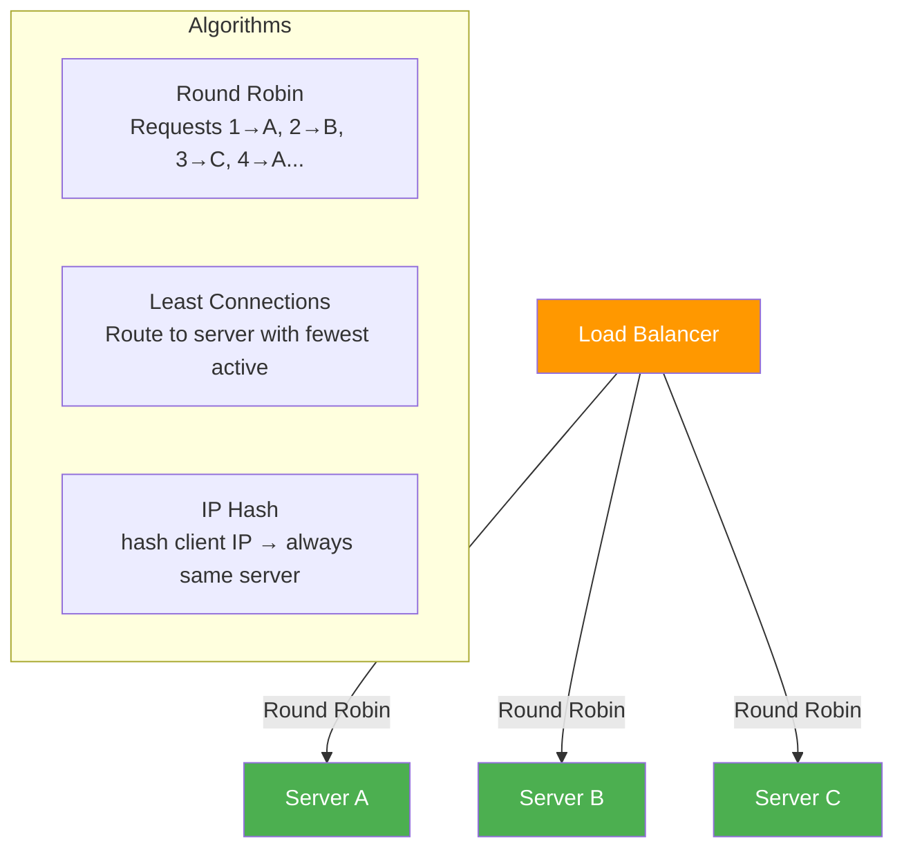
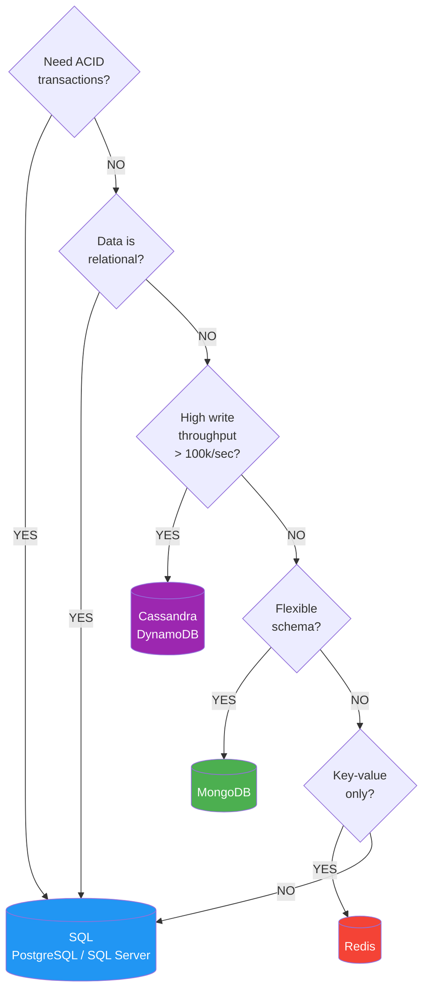
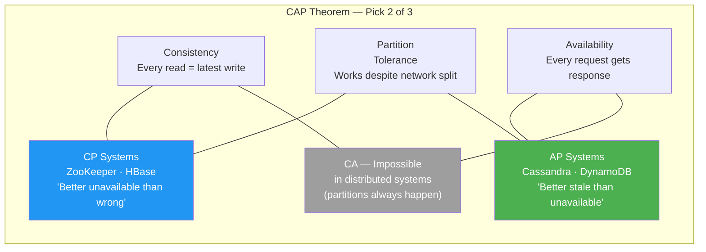
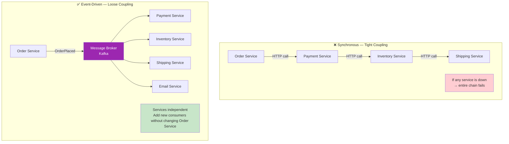
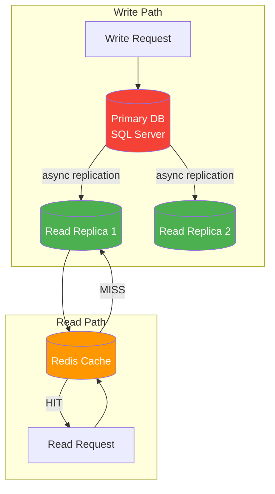
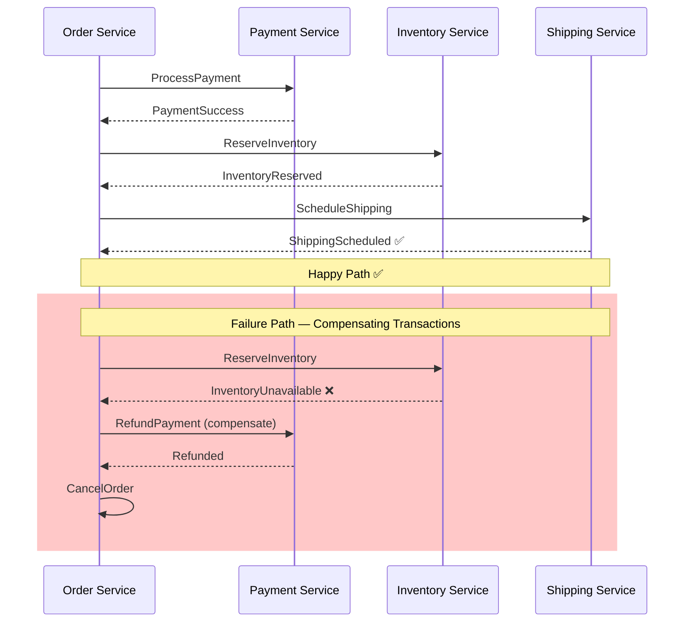
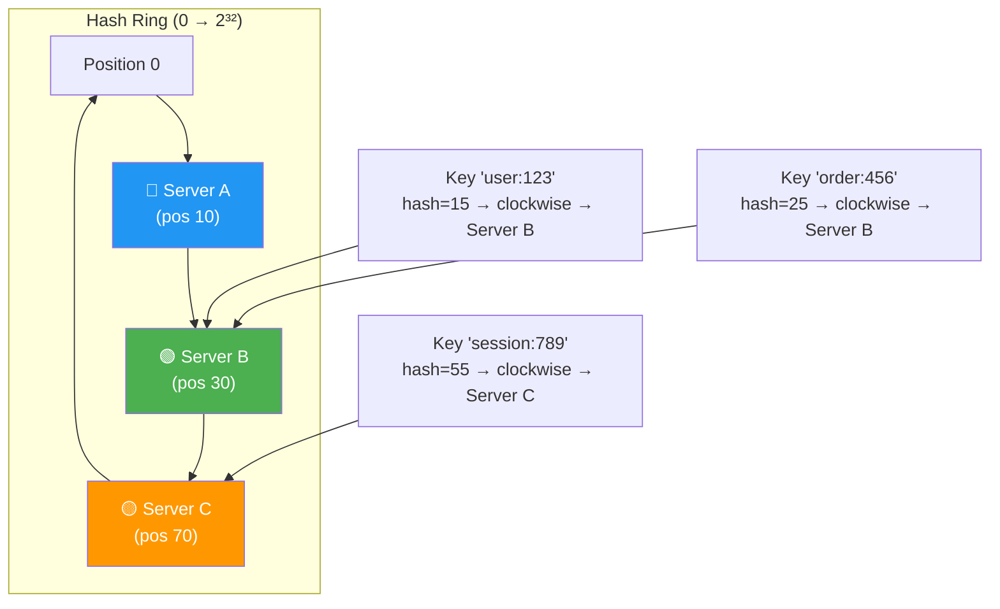

# 🌍 High Level Design (HLD) Interview Questions — Complete Guide

> **65+ questions** grouped by concept · With definitions, ✅ good examples, ❌ bad examples & 📚 reference links.
> Use `Ctrl+F` / `Cmd+F` to jump to any topic.

---

## 📋 Table of Contents
1. [Scalability Fundamentals](#1-scalability-fundamentals)
2. [Load Balancing & Traffic Management](#2-load-balancing--traffic-management)
3. [Caching Strategies](#3-caching-strategies)
4. [Databases — SQL vs NoSQL & Sharding](#4-databases--sql-vs-nosql--sharding)
5. [Messaging & Event-Driven Architecture](#5-messaging--event-driven-architecture)
6. [Microservices & Service Design](#6-microservices--service-design)
7. [CAP Theorem & Consistency](#7-cap-theorem--consistency)
8. [Common HLD Problems](#8-common-hld-problems)
9. [System Design — Google Calendar](#9-system-design--google-calendar)
10. [System Design — WhatsApp](#10-system-design--whatsapp)
11. [System Design — Facebook News Feed](#11-system-design--facebook-news-feed)
12. [System Design — Netflix](#12-system-design--netflix)
13. [System Design — Uber](#13-system-design--uber)

---

# 1. Scalability Fundamentals

> 📚 Reference: https://learn.microsoft.com/en-us/azure/architecture/guide/
> 📚 Patterns: https://learn.microsoft.com/en-us/azure/architecture/patterns/

---

## 1.1 Vertical vs Horizontal Scaling

### Q1. What is the difference between vertical and horizontal scaling and when do you choose each?

**Answer:**
Vertical scaling (scale-up) adds more resources to a single machine — more CPU, RAM, SSD. Horizontal scaling (scale-out) adds more machines and distributes load. Vertical has a hard physical ceiling and creates a single point of failure. Horizontal is theoretically unlimited but requires stateless services, distributed coordination, and network-aware design.

❌ **Wrong — designing a stateful service that can only be vertically scaled:**
```
Architecture:
[Web Server] → stores user sessions in local memory
              → writes temporary files to local disk

Problem: Can only run ONE instance because:
- Session state is local memory — second instance has no access to it
- File uploads go to local disk — can't be shared
→ When traffic spikes, only option is to buy a bigger machine
```

✅ **Correct — stateless service design that supports horizontal scaling:**
```
Architecture:
[Load Balancer]
  ├── [App Server 1] ─┐
  ├── [App Server 2] ─┼── [Redis: distributed sessions]
  └── [App Server 3] ─┘        [Azure Blob: file storage]
                               [SQL / NoSQL: persistent data]

- Any request can go to any app server
- Sessions stored in Redis — shared across instances
- Files stored in Blob Storage — not on local disk
- Scale out by adding more app servers behind the load balancer
```

---

## 1.2 Stateless vs Stateful Services

### Q2. Why must services be stateless for horizontal scaling?

**Answer:**
A stateful service stores request-specific data (session, in-progress work) in local memory. If the next request from the same user hits a different instance, the state is missing. Stateless services push state to external stores (Redis, databases), so any instance can serve any request.

❌ **Wrong — ASP.NET Core service storing session data in a static in-memory dictionary:**
```csharp
public class SessionController : ControllerBase {
    // Static dictionary — only lives in this process, not shared across instances
    private static Dictionary<string, UserSession> _sessions = new();

    [HttpPost("login")]
    public IActionResult Login([FromBody] LoginDto dto) {
        var session = CreateSession(dto);
        _sessions[session.Token] = session; // stored in local memory only
        return Ok(session.Token);
    }
    // Works on one instance, breaks silently on second instance
}
```

✅ **Correct — session stored in Redis, shareable across all instances:**
```csharp
// Program.cs
builder.Services.AddStackExchangeRedisCache(options =>
    options.Configuration = config["Redis:ConnectionString"]);
builder.Services.AddSession(options => options.IdleTimeout = TimeSpan.FromMinutes(30));

// Controller — session reads/writes go to Redis
[HttpPost("login")]
public IActionResult Login([FromBody] LoginDto dto) {
    var session = CreateSession(dto);
    HttpContext.Session.SetString("UserId", session.UserId.ToString());
    return Ok(session.Token); // any instance can validate this token via Redis
}
```

---

# 2. Load Balancing & Traffic Management

> 📚 Reference: https://learn.microsoft.com/en-us/azure/load-balancer/load-balancer-overview
> 📚 API Gateway: https://learn.microsoft.com/en-us/azure/api-management/

---

## 2.1 Load Balancing Algorithms

### Q3. What load balancing algorithms exist and when do you use each?

**Answer:**
Round Robin cycles through servers equally — good when all servers have equal capacity. Least Connections routes to the server with the fewest active connections — better for variable request durations. IP Hash routes the same client IP to the same server — useful for sticky sessions. Weighted routes more traffic to higher-capacity servers.

❌ **Wrong — Round Robin for services with unequal processing times:**
```
Round Robin: each request cycles to next server
Request 1 (2ms task)  → Server A
Request 2 (30s task)  → Server B  ← Server B overloaded while A is idle
Request 3 (2ms task)  → Server C
Request 4 (2ms task)  → Server A
Request 5 (2ms task)  → Server B  ← still processing 30s task!
```

✅ **Correct — Least Connections for variable-duration requests:**
```
Least Connections: route to server with fewest active connections
Request 1 (30s task)  → Server A (1 active)
Request 2 (2ms task)  → Server B (0 active) ← B is free
Request 3 (2ms task)  → Server C (0 active) ← C is free
Request 4 (2ms task)  → Server B (0 active) ← not Server A which has a long-running task
→ Load is distributed by actual work, not just request count
```

---

## 2.2 API Gateway Pattern

### Q4. What is an API Gateway and what problems does it solve?

**Answer:**
An API Gateway is the single entry point for all client traffic. It handles cross-cutting concerns — authentication, rate limiting, SSL termination, request routing, response aggregation, and observability — so individual microservices don't need to implement these themselves.

❌ **Wrong — clients call microservices directly, duplicated auth and rate limiting everywhere:**
```
Mobile App → directly calls: OrderService:3001, UserService:3002, ProductService:3003
                             Each service implements its own auth, rate limiting, CORS, logging
                             Client must know all internal service URLs
                             A service port change breaks the mobile app
```

✅ **Correct — single API Gateway entry point:**
```
Mobile App → [API Gateway (Azure API Management / NGINX / Ocelot)]
                 ├── Auth & JWT validation (once, in the gateway)
                 ├── Rate limiting per client/endpoint
                 ├── SSL termination
                 ├── Route: /api/orders  → OrderService (internal)
                 ├── Route: /api/users   → UserService (internal)
                 └── Route: /api/products → ProductService (internal)

Services: no public ports, no auth logic, focus on business logic only
```

---

# 3. Caching Strategies

> 📚 Reference: https://learn.microsoft.com/en-us/azure/architecture/patterns/cache-aside
> 📚 Redis: https://learn.microsoft.com/en-us/azure/azure-cache-for-redis/cache-overview

---

## 3.1 Cache-Aside Pattern

### Q5. What is the Cache-Aside (Lazy Loading) pattern and when do you use it?

**Answer:**
Cache-Aside: application checks the cache first; on miss, reads from the database and writes to the cache. The cache doesn't auto-populate — it's lazy. Good for read-heavy data that can tolerate slight staleness. The application owns cache invalidation logic.

❌ **Wrong — always reading from the database, no caching:**
```csharp
public async Task<Product?> GetProductAsync(int id) {
    return await _db.Products.FindAsync(id);
    // 1000 users requesting the same product = 1000 identical DB queries
    // Product catalog rarely changes — perfect candidate for caching
}
```

✅ **Correct — Cache-Aside with Redis:**
```csharp
public async Task<Product?> GetProductAsync(int id) {
    string key = $"product:{id}";

    // 1. Check cache
    var cached = await _cache.GetStringAsync(key);
    if (cached is not null)
        return JsonSerializer.Deserialize<Product>(cached);

    // 2. Cache miss — query DB
    var product = await _db.Products.FindAsync(id);
    if (product is null) return null;

    // 3. Populate cache with TTL
    await _cache.SetStringAsync(key,
        JsonSerializer.Serialize(product),
        new DistributedCacheEntryOptions { AbsoluteExpirationRelativeToNow = TimeSpan.FromMinutes(15) });

    return product;
}

// On update: invalidate the cache
public async Task UpdateProductAsync(Product product) {
    await _db.SaveChangesAsync();
    await _cache.RemoveAsync($"product:{product.Id}");
}
```

---

## 3.2 Cache Eviction Policies

### Q6. What are the common cache eviction policies and when do you choose each?

**Answer:**
LRU (Least Recently Used) evicts the least recently accessed items — best for general-purpose caches. LFU (Least Frequently Used) evicts items accessed least often — better when access frequency matters more than recency. TTL-based eviction removes items after a fixed time — best for time-sensitive data like session tokens or API responses.

❌ **Wrong — no TTL on session tokens (security risk — tokens never expire in cache):**
```csharp
await _cache.SetStringAsync($"session:{token}", userId.ToString());
// No expiration — token lives in cache forever even after user logs out
// Security vulnerability: stolen token is valid indefinitely
```

✅ **Correct — TTL matches the session's intended lifetime:**
```csharp
await _cache.SetStringAsync(
    $"session:{token}",
    userId.ToString(),
    new DistributedCacheEntryOptions {
        AbsoluteExpirationRelativeToNow = TimeSpan.FromHours(1),  // hard expiry
        SlidingExpiration = TimeSpan.FromMinutes(20)               // extends on activity
    });
```

---

# 4. Databases — SQL vs NoSQL & Sharding

> 📚 Reference: https://learn.microsoft.com/en-us/azure/architecture/data-guide/
> 📚 CAP: https://en.wikipedia.org/wiki/CAP_theorem

---

## 4.1 SQL vs NoSQL Trade-offs

### Q7. How do you choose between SQL and NoSQL for a new system?

**Answer:**
SQL (relational): ACID transactions, complex joins, structured schema — best for financial data, CRMs, inventory. NoSQL: flexible schema, horizontal scale, high write throughput — best for user activity feeds, IoT telemetry, product catalogs, session data. Many modern systems use both — polyglot persistence.

❌ **Wrong — using a document store for transactional financial data:**
```
Payment System using MongoDB:
- Transfer $100 from Account A to Account B
- Debit A: { $set: { balance: A.balance - 100 } }
- Credit B: { $set: { balance: B.balance + 100 } }

Problem: if the process crashes between the two operations,
money is lost with no atomic guarantee (without multi-doc transactions).
Financial data requires ACID — use a relational DB.
```

✅ **Correct — polyglot: SQL for transactions, NoSQL for scale-out reads:**
```
System:
├── PostgreSQL  — Orders, Payments, Users (ACID, joins, integrity)
├── MongoDB     — Product catalog (flexible schema, fast reads, easy sharding)
├── Redis       — Sessions, rate limiting counters, leaderboards (in-memory speed)
└── Elasticsearch — Full-text search across products and orders (search-optimized)

Each store is chosen for what it's good at.
```

---

## 4.2 Database Sharding

### Q8. What is database sharding and what are common sharding strategies?

**Answer:**
Sharding splits a table across multiple database instances (shards) based on a shard key. Each shard holds a subset of rows. Strategies: range-based (users A–M on shard 1, N–Z on shard 2 — uneven load risk), hash-based (consistent hash of user ID — even distribution), geography-based (users by region — data residency compliance).

❌ **Wrong — sharding by timestamp on a write-heavy system (hot shard problem):**
```
Shard 1: records from 2020
Shard 2: records from 2021
Shard 3: records from 2022
Shard 4: records from 2024 ← ALL current writes go here (hot shard)

The current shard gets 100% of write load while older shards sit idle.
```

✅ **Correct — hash-based sharding distributes writes evenly:**
```
Shard key: hash(user_id) % num_shards

user_id=1001 → hash → Shard 2
user_id=1002 → hash → Shard 0
user_id=1003 → hash → Shard 3
user_id=1004 → hash → Shard 1

Writes and reads are evenly distributed across all shards.
Cross-shard queries require fan-out, but most user-specific queries hit one shard.
```

---

# 5. Messaging & Event-Driven Architecture

> 📚 Reference: https://learn.microsoft.com/en-us/azure/service-bus-messaging/service-bus-messaging-overview
> 📚 Event-driven: https://learn.microsoft.com/en-us/azure/architecture/guide/architecture-styles/event-driven

---

## 5.1 Message Queues vs Event Streams

### Q9. What is the difference between a message queue and an event stream?

**Answer:**
Message queue (Azure Service Bus, RabbitMQ): each message is consumed by one consumer and then deleted — point-to-point delivery. Event stream (Kafka, Azure Event Hubs): messages are retained and multiple consumers read independently at their own offset — pub/sub, replayable. Use queues for task distribution (e.g., send one email); use streams for event sourcing, multiple independent consumers, or replay scenarios.

❌ **Wrong — using a queue when multiple services need the same event:**
```
OrderPlaced event → [Queue] → EmailService reads and deletes the message
                               InventoryService never sees it — message is gone
                               AnalyticsService never sees it — message is gone

A queue delivers to ONE consumer. Multiple consumers need a topic or stream.
```

✅ **Correct — event stream (or topic with subscriptions) for multiple consumers:**
```
Azure Service Bus Topic: "order-placed"
├── Subscription: EmailService       → sends confirmation email
├── Subscription: InventoryService   → reduces stock
└── Subscription: AnalyticsService   → records purchase event

Each subscription gets a copy of the message.
Or use Azure Event Hubs / Kafka for high-throughput + replay capability.
```

---

## 5.2 Outbox Pattern

### Q10. What is the Transactional Outbox pattern and why is it important?

**Answer:**
The Outbox pattern guarantees that a database write and a message publication happen atomically. Instead of publishing to a message broker directly (which could fail independently), write the message to an `Outbox` table in the same DB transaction. A separate relay process reads the outbox and publishes to the broker.

❌ **Wrong — DB save and message publish in non-atomic steps (data loss risk):**
```csharp
public async Task PlaceOrderAsync(Order order) {
    _db.Orders.Add(order);
    await _db.SaveChangesAsync();  // Step 1: DB saved
    // CRASH HERE? Message is never sent — order exists but downstream services don't know
    await _bus.PublishAsync(new OrderPlacedEvent(order.Id)); // Step 2: may never execute
}
```

✅ **Correct — Outbox pattern, message written atomically with the order:**
```csharp
public async Task PlaceOrderAsync(Order order) {
    _db.Orders.Add(order);

    // Written in the SAME transaction as the order
    _db.OutboxMessages.Add(new OutboxMessage {
        Type = "OrderPlaced",
        Payload = JsonSerializer.Serialize(new OrderPlacedEvent(order.Id)),
        CreatedAt = DateTime.UtcNow
    });

    await _db.SaveChangesAsync(); // atomic: both order + outbox message saved or neither

    // Separate background relay reads outbox and publishes (at-least-once delivery)
}
```

---

# 6. Microservices & Service Design

> 📚 Reference: https://learn.microsoft.com/en-us/azure/architecture/microservices/
> 📚 Patterns: https://microservices.io/patterns/

---

## 6.1 Service Decomposition

### Q11. How do you decide how to split a monolith into microservices?

**Answer:**
Split along business domain boundaries (Domain-Driven Design bounded contexts) — not by technical layers. Signs a monolith should be split: independent scaling needs, different deployment frequencies, different team ownership, or different availability requirements. Avoid micro-splitting — too-small services create distributed monolith overhead with none of the benefits.

❌ **Wrong — splitting by technical layer (creates a distributed monolith):**
```
"Microservices":
- DataAccessService (just the database layer)
- BusinessLogicService (just the logic layer)
- APIService (just the web layer)

These must be deployed together and call each other synchronously —
this is a monolith split across the network. Worse than the original.
```

✅ **Correct — split by business domain (bounded contexts):**
```
Domain-Driven decomposition:

OrderService     — place order, view order status, order history
ProductService   — product catalog, pricing, inventory levels
UserService      — registration, profiles, authentication
NotificationService — email, SMS, push notifications
PaymentService   — payment processing, refunds, invoicing

Each service: owns its data, can be deployed independently,
can scale independently, can be owned by a different team.
```

---

## 6.2 Saga Pattern for Distributed Transactions

### Q12. How do you handle transactions that span multiple microservices?

**Answer:**
Two-phase commit across services is an anti-pattern in microservices (tight coupling, poor availability). Instead use the Saga pattern: a sequence of local transactions, each publishing events that trigger the next service. On failure, compensating transactions undo completed steps.

❌ **Wrong — distributed 2PC across microservices (tight coupling, availability risk):**
```
Begin distributed transaction:
  → OrderService.ReserveOrder()
  → InventoryService.DeductStock()
  → PaymentService.ChargeCard()
  → NotificationService.SendEmail()
Commit all or rollback all

Problem: if PaymentService is slow, all services hold locks.
One slow service kills the entire transaction.
```

✅ **Correct — Saga with compensating transactions:**
```
Choreography-based Saga:

1. OrderService creates order (status: PENDING), publishes OrderCreated
2. InventoryService deducts stock, publishes StockReserved
3. PaymentService charges card, publishes PaymentProcessed
4. OrderService marks order CONFIRMED

On failure at step 3 (payment fails):
← PaymentService publishes PaymentFailed
← InventoryService hears PaymentFailed → restores stock (compensating tx)
← OrderService hears PaymentFailed → marks order CANCELLED

Each step is a local transaction. No distributed locks.
```

---

# 7. CAP Theorem & Consistency

> 📚 Reference: https://en.wikipedia.org/wiki/CAP_theorem
> 📚 Eventual consistency: https://learn.microsoft.com/en-us/azure/cosmos-db/consistency-levels

---

## 7.1 CAP Theorem

### Q13. What is the CAP theorem and how does it guide system design decisions?

**Answer:**
CAP states a distributed system can guarantee at most two of three properties: Consistency (every read receives the latest write), Availability (every request receives a response), and Partition Tolerance (the system continues operating despite network partitions). Since network partitions are unavoidable, real systems choose between CP (consistency over availability) and AP (availability over consistency).

❌ **Wrong — claiming a distributed system can be fully consistent AND always available:**
```
"Our distributed database guarantees:
 - All nodes always return the most recent data (strong consistency)
 - Every request always gets a response (100% availability)
 - Works fine even when the network partitions"

This violates CAP theorem — impossible to guarantee all three simultaneously.
```

✅ **Correct — making a conscious CP vs AP trade-off based on business need:**
```
Banking system → CP (choose consistency over availability)
  - A failed network partition means refusing writes rather than risking inconsistent balances
  - Users may get temporary errors, but data is never stale or duplicated
  - "We cannot debit an account if we can't confirm the current balance"

Social media feed → AP (choose availability over strong consistency)
  - A user might see slightly stale like counts during a partition
  - Better to show the feed (possibly slightly stale) than an error page
  - "Eventual consistency is fine — a like count being off by 2 for 200ms is acceptable"
```

---

## 7.2 Eventual Consistency

### Q14. What is eventual consistency and what are the design implications?

**Answer:**
In an eventually consistent system, replicas will converge to the same value given enough time with no new updates. Reads may return stale data during the convergence window. Design implications: UI should handle stale reads gracefully, operations should be idempotent, and writes should be designed to be conflict-resolvable.

❌ **Wrong — application assumes immediate consistency after a write:**
```csharp
await _userService.UpdateProfileAsync(userId, newName);

// Immediately reading from a replica that may not have the update yet
var user = await _userService.GetProfileAsync(userId);
// user.Name may still be the old name — confusing UX
Assert.Equal(newName, user.Name); // flaky in distributed systems
```

✅ **Correct — read your own writes by routing to the primary, or use optimistic UI:**
```csharp
await _userService.UpdateProfileAsync(userId, newName);

// Option 1: Read from primary/leader after write (read-your-writes guarantee)
var user = await _userService.GetProfileFromPrimaryAsync(userId);

// Option 2: Optimistic UI — assume update succeeded, update local state immediately
// Don't wait for a round-trip to confirm; show the new name immediately in the UI
// If the write failed, reconcile on next sync
```

---

# 8. Common HLD Problems

> 📚 Reference: https://github.com/donnemartin/system-design-primer
> 📚 Azure architectures: https://learn.microsoft.com/en-us/azure/architecture/browse/

---

## 8.1 Design a URL Shortener

### Q15. How do you design a URL shortener at the system level?

**Answer:**
Core components: hash/encode function for unique short codes, database to map short → long URLs, cache for popular URLs, redirect service. Scale concerns: read-heavy (most traffic is redirects), high availability, low latency redirects. Use Base62 encoding on an auto-incremented ID for unique collision-free short codes.

❌ **Wrong — MD5 hash of the URL as short code (collision risk, too long):**
```
short_code = MD5(long_url).Substring(0, 7)
Problem: two different URLs could produce the same 7-char prefix (collision)
Solution requires collision checking + retry, which adds complexity
MD5 is non-deterministic in distribution — same URL gives same code (deduplication is accidental)
```

✅ **Correct — Base62 encoding of auto-incremented ID:**
```
1. Store URL in DB: INSERT INTO urls (long_url) VALUES (?) → returns id = 10000000
2. Encode: Base62(10000000) = "FXdiS" (6 characters)
3. Store mapping: short_code = "FXdiS", long_url = "https://..."

Redirect flow:
GET /FXdiS
  → Check Redis cache for "FXdiS" (cache hit: ~1ms redirect)
  → Cache miss: query DB for "FXdiS" → get long_url → cache it → redirect

Architecture:
[Client] → [CDN/Edge: caches popular redirects]
         → [API Gateway]
         → [Redirect Service (stateless, many instances)]
         → [Redis Cache: hot short codes]
         → [PostgreSQL: source of truth for all mappings]
```

---

## 8.2 Design a Notification System

### Q16. How do you design a notification system that supports email, SMS, and push?

**Answer:**
Decouple notification delivery from the business events that trigger them. Use a message queue with per-channel workers. Handle retries, deduplication, and user preferences centrally. Scale each channel independently.

❌ **Wrong — synchronous notification sending in the same API request:**
```csharp
[HttpPost("order")]
public async Task<IActionResult> PlaceOrder([FromBody] OrderDto dto) {
    var order = await _orderService.CreateAsync(dto);
    await _emailService.SendAsync(dto.Email, "Order Confirmed", BuildEmailBody(order)); // slow
    await _smsService.SendAsync(dto.Phone, $"Order #{order.Id} confirmed");            // slow
    await _pushService.SendAsync(dto.UserId, "Your order is confirmed");               // slow
    return Ok(order); // response delayed by all notification calls
}
// If SMS provider is slow, the order API is slow. If it fails, order appears to fail.
```

✅ **Correct — async event-driven notification pipeline:**
```
OrderService → publishes "OrderConfirmed" event to Service Bus Topic

Subscription: EmailWorker
  - Reads event, sends email via SendGrid
  - Retries up to 3 times with exponential backoff
  - Dead-letters after 3 failures

Subscription: SmsWorker
  - Reads event, sends SMS via Twilio
  - Independent retry policy

Subscription: PushWorker
  - Reads event, sends push via Firebase

NotificationPreferenceService:
  - Each worker checks user preferences before sending
  - Respects unsubscribe/opt-out

Architecture advantages:
- PlaceOrder API returns immediately (fast user experience)
- Each channel scales independently
- Failures in one channel don't affect others
- Full audit trail of all notifications sent
```

---

# 9. System Design — Google Calendar

> 📚 Reference: https://learn.microsoft.com/en-us/azure/architecture/patterns/event-sourcing
> 📚 Calendar RFC: https://datatracker.ietf.org/doc/html/rfc5545

---

## 9.1 Requirements Clarification

### Q17. Walk through the full design of Google Calendar from scratch.

**Answer:**

**Functional Requirements**
- Create, read, update, delete events (single and recurring)
- Invite attendees; attendees accept/decline
- Notifications (email, push) before events
- View: day, week, month, agenda
- Multiple calendars per user (personal, work, shared)
- Timezone support

**Non-Functional Requirements**
- 500M+ users, ~1B events created per day
- Read-heavy: users view their calendar far more than they create events
- High availability (99.99%) — users rely on it for business meetings
- Eventual consistency acceptable for attendee responses, not for event creation
- Low-latency calendar load (< 200ms for a week view)

---

## 9.2 Capacity Estimation

```
Users:            500M active
Events/day:       1B creates → ~12,000 writes/sec (peak 3x = 36,000)
Reads/day:        50B reads  → ~580,000 reads/sec (calendar opens all day)
Event size:       ~1KB (title, description, time, attendees, recurrence rule)
Storage/day:      1B × 1KB = 1TB/day → ~365TB/year
```

---

## 9.3 API Design

```
POST   /calendars/{calId}/events                    → Create event
GET    /calendars/{calId}/events?timeMin=&timeMax=  → List events in range
GET    /calendars/{calId}/events/{eventId}           → Get event detail
PUT    /calendars/{calId}/events/{eventId}           → Update event
DELETE /calendars/{calId}/events/{eventId}           → Delete event
POST   /calendars/{calId}/events/{eventId}/attendees → Invite attendees
PUT    /events/{eventId}/attendees/{userId}          → Accept / decline
```

---

## 9.4 Data Model

```sql
-- Core tables (PostgreSQL)
Calendar (id, owner_user_id, name, color, timezone, is_public)
Event (
  id, calendar_id, creator_id,
  title, description, location,
  start_utc TIMESTAMPTZ, end_utc TIMESTAMPTZ,
  timezone VARCHAR,                    -- user's local timezone at creation
  recurrence_rule TEXT,               -- iCalendar RRULE string
  recurrence_exception_dates TEXT[],  -- dates where recurrence is overridden
  status ENUM(confirmed, tentative, cancelled),
  created_at, updated_at
)
Attendee (event_id, user_id, response ENUM(accepted, declined, tentative, needs_action), notified_at)
EventOverride (event_id, original_start_utc, new_start_utc, new_end_utc, title, ...)
-- Overrides handle "edit this and following" for recurring events
```

---

## 9.5 Architecture

```
                        ┌─────────────────────────────────────┐
Client (Web/Mobile)     │         API Gateway                 │
        ↓               │   (Auth, Rate Limiting, Routing)    │
        └───────────────┤                                     │
                        └──────────┬──────────────────────────┘
                                   │
          ┌────────────────────────┼────────────────────────┐
          ↓                        ↓                        ↓
  [Calendar Service]      [Notification Service]    [Sharing Service]
  (CRUD events,           (schedules reminders,     (ACL, public cals,
   recurrence expand)      fan-out to push/email)    shared calendars)
          │                        │                        │
          ↓                        ↓                        ↓
  [PostgreSQL              [Message Queue          [Redis: permission
   (events, attendees)]     Azure Service Bus]      cache for hot cals]
          │
  [Read Replicas ×N]  ← Most traffic hits read replicas
  [Redis Cache]       ← Cache week-view results per user (TTL 5 min)
  [Elasticsearch]     ← Full-text search across event titles/descriptions
```

---

## 9.6 Key Design Decisions

**Recurring Events — Expand on Read vs Store Instances**

❌ **Wrong — pre-generate all recurrence instances at write time:**
```
Create "Daily standup, forever" → INSERT 365+ rows immediately
Create "Weekly meeting, 5 years" → INSERT 260 rows
Problem: infinite recurrences can't be stored; updates require updating thousands of rows
```

✅ **Correct — store the RRULE, expand on read within the requested time window:**
```
DB stores: recurrence_rule = "FREQ=DAILY;BYHOUR=9"
Query for week of June 1–7:
  CalendarService.ExpandRecurrence(rule, windowStart, windowEnd)
  → returns 7 virtual event instances on the fly
  → overrides table checked for any individual edits to specific instances

Benefits:
- 1 row per recurring event series (not thousands)
- "Edit this and following" creates an EventOverride record
- Deletion of one instance adds a date to recurrence_exception_dates
```

**Timezone Handling**

❌ **Wrong — storing event times in the user's local time:**
```csharp
// Stored as "9:00 AM" with no timezone
// When user travels to Tokyo, standup shows at the wrong time
// Daylight saving time changes break all stored times
```

✅ **Correct — always store UTC, convert on read:**
```csharp
// Store: start_utc = 2024-06-10T07:00:00Z, timezone = "America/New_York"
// Display: convert UTC → user's current timezone at render time
// Recurrence expansion uses the original timezone to find the correct local time
// DST transitions handled by the timezone conversion library (NodaTime in .NET)
```

**Notification Scheduling**

```
Approach: Delayed message queue
1. On event create/update → publish message to Service Bus with a scheduledEnqueueTimeUtc
   = event.start_utc - reminder_minutes
2. NotificationService receives it at the right time
3. Sends push + email to all attendees

Why not a cron job polling the DB?
- Polling 1B events every minute is expensive
- Delayed messages are more efficient — only fire when needed
```

---

# 10. System Design — WhatsApp

> 📚 Reference: https://highscalability.com/blog/2014/2/26/the-whatsapp-architecture-facebook-bought-for-19-billion.html
> 📚 WebSockets: https://learn.microsoft.com/en-us/aspnet/core/fundamentals/websockets

---

## 10.1 Requirements Clarification

### Q18. Walk through the full design of WhatsApp (messaging system).

**Answer:**

**Functional Requirements**
- One-to-one and group messaging (up to 1024 members)
- Message delivery statuses: sent ✓, delivered ✓✓, read ✓✓ (blue)
- Media sharing (images, video, documents)
- Online/last-seen presence
- End-to-end encryption
- Message history on new devices

**Non-Functional Requirements**
- 2B users, 100B messages/day → ~1.2M messages/sec
- Messages delivered in < 500ms when both users are online
- High availability (99.99%) — downtime is newsworthy
- Store messages for 30 days on server (after delivery, messages live on device)

---

## 10.2 Capacity Estimation

```
Messages/day:     100B → 1.2M/sec
Avg message size: 100 bytes text + metadata
Media:            10% of messages include media → 10B media messages/day
Media avg size:   200KB
Storage/day:      100B × 100B text = 10TB text/day
                  10B × 200KB media = 2PB media/day
Connections:      500M concurrent open WebSocket connections (peak)
```

---

## 10.3 API Design

```
WebSocket connection:
  Client connects to: wss://chat.whatsapp.com/connect?token=JWT

Messages (over WebSocket):
  SEND_MESSAGE   { to, content, type, clientMsgId, timestamp }
  ACK_DELIVERED  { msgId }
  ACK_READ       { msgId }
  TYPING_START   { conversationId }
  TYPING_STOP    { conversationId }

REST (for history/media):
  POST   /media/upload          → Get upload URL (pre-signed S3)
  GET    /messages/{convId}     → Message history (paginated)
  GET    /users/{userId}/presence → Online status
```

---

## 10.4 Data Model

```sql
-- Cassandra (write-heavy, time-series, horizontal scale)
Messages (
  conversation_id UUID,          -- partition key
  message_id      TIMEUUID,      -- clustering key (time-ordered)
  sender_id       UUID,
  content         TEXT,
  content_type    ENUM(text, image, video, doc, audio),
  media_url       TEXT,          -- CDN URL if media
  status          ENUM(sent, delivered, read),
  created_at      TIMESTAMP
) PRIMARY KEY (conversation_id, message_id)

-- PostgreSQL (structured user/group data)
User (id, phone_hash, display_name, avatar_url, last_seen, public_key)
Conversation (id, type ENUM(direct, group), created_at)
ConversationMember (conversation_id, user_id, joined_at, role)
```

---

## 10.5 Architecture

```
Client A (online)                                  Client B (online)
    │                                                    │
    │ WebSocket                                WebSocket │
    ↓                                                    ↓
[Chat Server A] ─── Pub/Sub (Redis) ──────── [Chat Server B]
    │                    │                              │
    │           [Presence Service]             (delivers to B)
    │           (Redis: who's online)
    │
    ↓
[Message Queue (Kafka)]
    │
    ├── [Message Storage Service] → Cassandra (persist message)
    ├── [Push Notification Service] → FCM/APNs (if B is offline)
    └── [Delivery Receipt Service] → updates message status

[Media Service]
    ├── Upload: Client → Pre-signed URL → S3/Blob Storage
    └── Download: Client → CDN (CloudFront/Azure CDN) → S3
```

---

## 10.6 Key Design Decisions

**WebSocket Connection Management**

❌ **Wrong — HTTP polling for messages:**
```
Client polls every 2 seconds: GET /messages/new
- 2B users × polling every 2s = massive wasted traffic
- Minimum 2-second message delay
- Server under constant unnecessary load even when no new messages
```

✅ **Correct — persistent WebSocket per client:**
```
Client establishes one WebSocket connection to a Chat Server
Chat Server keeps connection open (heartbeat every 30s)
New message → push to client immediately over existing socket
Reconnection logic in client for dropped connections

Challenge: 500M concurrent connections → need ~50,000 Chat Servers
(each server handles ~10,000 concurrent WebSocket connections)
Load balancer uses consistent hashing on user_id to route to same server
```

**Message Delivery When Receiver Is Offline**

```
Flow:
1. Sender sends message → Chat Server A
2. Chat Server A checks Presence Service → User B is OFFLINE
3. Message saved to Cassandra via Message Storage Service
4. Push Notification Service sends FCM/APNs notification to B's device
5. B's device comes online → opens WebSocket
6. Chat Server fetches undelivered messages from Cassandra
7. Delivers to B, B sends ACK_DELIVERED
8. Delivery receipt flows back to Sender → ✓✓ appears
```

**Group Messages Fan-Out**

❌ **Wrong — synchronous fan-out to all group members in the request path:**
```csharp
// For a 1024-member group, sending to each member synchronously:
foreach (var member in group.Members) // 1024 iterations
    await chatServer.DeliverAsync(member.UserId, message); // each may be on different server
// Request takes seconds, not milliseconds
```

✅ **Correct — async fan-out via message queue:**
```
1. Sender sends group message → saved to Cassandra once
2. Fan-out Worker reads the message, publishes one delivery task per member
3. Each Chat Server picks up delivery tasks for its connected users
4. Offline members get push notifications via batch push service

Optimization: for large groups, store one copy of the message,
each member's read receipt tracked separately in a receipts table
```

---

# 11. System Design — Facebook News Feed

> 📚 Reference: https://engineering.fb.com/2021/02/22/production-engineering/news-feed-consistency/
> 📚 Fan-out: https://learn.microsoft.com/en-us/azure/architecture/patterns/publisher-subscriber

---

## 11.1 Requirements Clarification

### Q19. Walk through the full design of a Facebook-style News Feed.

**Answer:**

**Functional Requirements**
- Users post text, images, videos
- Follow/friend other users
- News feed shows posts from followed users in ranked order
- Like, comment on posts
- Feed updates in near real-time

**Non-Functional Requirements**
- 3B users, 500M DAU
- 500M posts/day → ~6,000 writes/sec
- Feed reads: each user loads feed ~5x/day = 2.5B reads/day → ~30,000 reads/sec
- Feed must load in < 500ms
- High availability — feed must work even if some services are degraded

---

## 11.2 Core Architecture Challenge: Fan-Out Strategy

The central problem: when a celebrity with 100M followers posts, how do you populate 100M feeds?

**Fan-Out on Write (Push model)** vs **Fan-Out on Read (Pull model)**

❌ **Wrong — pure Fan-Out on Write for all users including celebrities:**
```
Taylor Swift (100M followers) posts a photo:
→ Write to 100M feed tables immediately
→ 100M writes in seconds — overwhelms the write pipeline
→ Writes for users who may never open the app (wasted work)
→ Storage: 100M × post reference = massive fan-out amplification
```

❌ **Wrong — pure Fan-Out on Read for all users:**
```
User opens feed → query all N friends' posts → merge and rank
→ A user with 5,000 friends = 5,000 queries per feed load
→ 30,000 feed loads/sec × 5,000 queries = 150M queries/sec to post DB
→ Completely unscalable
```

✅ **Correct — Hybrid: fan-out on write for regular users, fan-out on read for celebrities:**
```
Classify users: "regular" (< 10,000 followers) vs "celebrity" (≥ 10,000)

Regular user posts:
  → Fan-out on WRITE → push post_id to each follower's feed cache in Redis
  → O(followers) writes, manageable

Celebrity posts:
  → Fan-out on READ → stored in Celebrity Post Store
  → At feed load time: merge user's pre-populated feed + celebrity posts user follows

Feed Load:
  → Read user's feed from Redis (pre-populated, O(1))
  → Add any celebrity posts from users they follow (small set of celebrities)
  → Rank combined list
  → Return top 20 posts
```

---

## 11.3 Data Model

```sql
-- PostgreSQL (relational)
User (id, name, profile_pic, created_at)
Post (id, author_id, content, media_url[], created_at, like_count, comment_count)
Follow (follower_id, followee_id, created_at)  -- INDEX on both columns

-- Redis (feed cache per user)
Key:   feed:{user_id}
Type:  Sorted Set
Score: post creation timestamp (for ranking)
Value: post_id

-- Cassandra (likes, comments — high write throughput)
Like (post_id, user_id, created_at) PRIMARY KEY (post_id, user_id)
Comment (post_id, comment_id TIMEUUID, author_id, text) PRIMARY KEY (post_id, comment_id)
```

---

## 11.4 Architecture

```
[Client]
    │
    ↓
[API Gateway]
    │
    ├─── [Post Service]          → PostgreSQL (posts)
    │        │                      + Media Upload → CDN
    │        └── on new post → [Kafka: post-created topic]
    │
    ├─── [Feed Service]
    │        ├── Write: Fan-out Worker reads Kafka, populates Redis feed sets
    │        └── Read:  Fetch from Redis + celebrity merge + rank → return feed
    │
    ├─── [Social Graph Service]  → Neo4j or PostgreSQL (follow relationships)
    │
    ├─── [Ranking Service]       → ML model scores posts (engagement prediction)
    │
    └─── [Notification Service]  → push when someone likes/comments your post

[Redis Cluster]    ← pre-computed feeds per user (top 1000 posts kept per user)
[CDN]              ← images and videos (cache at edge near user)
[Elasticsearch]    ← search posts and people
```

---

## 11.5 Feed Ranking

❌ **Wrong — purely chronological feed (reverse time order):**
```
Show posts sorted by created_at DESC
Problem: a post from a close friend 2 hours ago ranked below
a post from a page the user barely follows posted 1 hour ago
Engagement drops — users miss content they care about
```

✅ **Correct — scored ranking with engagement signals:**
```
Score = w1 × recency_score
      + w2 × relationship_score   (close friend vs acquaintance)
      + w3 × engagement_velocity  (likes/comments in first hour)
      + w4 × content_type_preference  (user watches more videos)
      + w5 × post_quality_score   (spam/clickbait penalty)

Ranking Service uses a pre-trained ML model, runs on each feed load
Top 20 scored posts returned to client
Feed freshness check: if user scrolls, fetch next batch
```

---

# 12. System Design — Netflix

> 📚 Reference: https://netflixtechblog.com/
> 📚 CDN: https://learn.microsoft.com/en-us/azure/cdn/cdn-overview

---

## 12.1 Requirements Clarification

### Q20. Walk through the full design of Netflix (video streaming platform).

**Answer:**

**Functional Requirements**
- Browse and search content catalog
- Stream video in adaptive quality (360p → 4K based on bandwidth)
- Resume playback where you left off
- User profiles, watchlists, continue watching
- Recommendations

**Non-Functional Requirements**
- 238M subscribers, ~100M concurrent streams at peak
- Content: 15,000+ titles, each encoded in 10+ quality/codec variants
- Streaming bandwidth: 100M × avg 5Mbps = 500 Tbps total throughput
- Video must start in < 2 seconds, buffering < 1% of playback time
- Catalog reads must be < 100ms

---

## 12.2 The Core Problem: Video Delivery at Scale

```
500 Tbps of video cannot be served from a central data center.
The network alone would cost billions and latency would be terrible.
Solution: Push content to the edge — Open Connect CDN.
```

---

## 12.3 Architecture

```
UPLOAD / INGESTION PIPELINE (offline, before users see it)
──────────────────────────────────────────────────────────
[Studio Master File]
    → [Transcoding Service (thousands of parallel FFmpeg jobs)]
        Produces: 1080p H.264, 720p H.264, 4K HEVC, HDR, Dolby Atmos audio
        × 10+ quality levels = ~50 files per title
    → [Quality Validation]
    → [Storage: AWS S3 (origin)]
    → [CDN Population: push to Open Connect Appliances (OCAs)]
       Netflix installs OCA servers inside ISPs worldwide
       Popular content is proactively pushed to local OCAs

PLAYBACK PIPELINE (real-time)
──────────────────────────────────────────────────────────
[Client]
    │
    │ 1. "Play Breaking Bad S1E1"
    ↓
[API Gateway]
    │
    ├─ [Steering Service]
    │   → picks best OCA for this client (nearest, least loaded)
    │   → returns CDN URLs for the video manifest
    │
    ├─ [License Service] → DRM token (Widevine/FairPlay)
    │
    └─ [Bookmark Service] → resume position

[Client] ──── HTTPS ────→ [OCA (inside user's ISP)]
                              serves video chunks directly
                              no Netflix origin involved for popular content

[Adaptive Bitrate Player (ABR)]
    - Downloads video in 2-4 second chunks (MPEG-DASH or HLS)
    - Measures download speed each chunk
    - Selects quality level for next chunk to fill buffer
    - Smooth transitions: 720p → 1080p as bandwidth improves
```

---

## 12.4 Key Design Decisions

**Adaptive Bitrate Streaming (ABR)**

❌ **Wrong — serving fixed quality video regardless of network:**
```
Client requests 4K stream
Network degrades → buffer empties → playback stalls
User sees spinning wheel → bad experience
```

✅ **Correct — ABR with per-chunk quality selection:**
```
Video is segmented into 2-second chunks.
Each chunk is available at multiple bitrates: 235kbps, 750kbps, 3Mbps, 15Mbps, 40Mbps

ABR algorithm (BOLA / Buffer-Based):
  - Buffer > 30s → try higher quality
  - Buffer < 10s → drop quality immediately
  - Buffer < 5s  → drop to lowest quality to prevent stall

Client always plays the highest quality sustainable given current network.
Quality changes happen at chunk boundaries — seamless to user.
```

**Recommendation System**

```
Two-stage: Candidate Generation → Ranking

Candidate Generation:
  - Collaborative Filtering: "users like you watched X" (matrix factorization)
  - Content-Based: similar genre/director/cast to things you liked
  - Trending: popular in your region this week

Ranking:
  - ML model scores each candidate for this specific user
  - Signals: watch history, ratings, time of day, device type
  - Contextual: Friday night → action/comedy; Sunday morning → documentaries

Output: personalized rows on homepage
  "Continue Watching", "Because you watched Stranger Things", "Top Picks for You"
```

**Watchlist & Bookmarks Service**

```
Data Model:
  UserActivity (user_id, title_id, profile_id, last_watched_utc, progress_seconds, completed)
  PRIMARY KEY (user_id, profile_id, title_id)

Storage: Cassandra — high write throughput (progress saved every 30s during playback)
Cache: Redis — "continue watching" list per profile, updated on each save
```

---

## 12.5 Fault Tolerance

❌ **Wrong — single point of failure if any one service goes down:**
```
Payment fails → user can't play anything
Recommendations service down → homepage won't load
DRM service slow → all playbacks timeout
```

✅ **Correct — graceful degradation with fallbacks:**
```
Recommendations down → show globally popular titles (no personalization, but page loads)
Steering service slow → fall back to closest geographic OCA (not optimal but works)
Bookmark service down → start from beginning (can't resume, but content plays)
Each service has: circuit breaker, fallback response, timeout, retry with backoff
Netflix pioneered Chaos Engineering (Chaos Monkey) — randomly kills services in production
to ensure every service has a tested fallback path
```

---

# 13. System Design — Uber

> 📚 Reference: https://eng.uber.com/
> 📚 Geospatial: https://learn.microsoft.com/en-us/azure/cosmos-db/nosql/query/geospatial-query

---

## 13.1 Requirements Clarification

### Q21. Walk through the full design of Uber (ride-hailing platform).

**Answer:**

**Functional Requirements**
- Rider requests a ride from A to B
- Match rider with nearby available driver
- Real-time driver location tracking during ride
- ETA and fare estimation
- Trip lifecycle: requested → accepted → en route → arrived → in trip → completed
- Payments, ratings

**Non-Functional Requirements**
- 5M trips/day → ~60 requests/sec (peaks 10x during rush hours = 600/sec)
- 6M active drivers → location updates every 4 seconds
- Location updates: 6M drivers × 1 update/4s = 1.5M location writes/sec
- Match latency: driver must be assigned in < 3 seconds
- High availability — riders stranded if system goes down

---

## 13.2 The Core Problem: Real-Time Geospatial Matching

```
Finding available drivers near a rider's location in < 3 seconds
across millions of active drivers worldwide.
```

---

## 13.3 Geospatial Indexing — S2 / Geohash

❌ **Wrong — brute-force distance calculation across all drivers:**
```sql
SELECT driver_id,
       SQRT(POW(lat - rider_lat, 2) + POW(lng - rider_lng, 2)) AS dist
FROM driver_locations
WHERE is_available = true
ORDER BY dist ASC
LIMIT 10;
-- Scans ALL 6M drivers on every match request — impossible at scale
```

✅ **Correct — geohash cells for efficient spatial lookup:**
```
Divide the world into a grid using Geohash or Google S2 cells.
Each cell has a string key (e.g., "dp3wj2").
Nearby cells share a common prefix.

Driver location update:
  1. Compute geohash for driver's (lat, lng) at precision level 6 (~1.2km × 0.6km cell)
  2. Store in Redis: GEOADD drivers_available {lng} {lat} {driver_id}
     Redis Geo uses Geohash internally

Match request:
  1. Compute geohash cell for rider location
  2. GEORADIUS drivers_available {rider_lng} {rider_lat} 5 km ASC COUNT 10
     → returns up to 10 nearest available drivers in O(log N + M)
  3. Apply surge pricing zone, driver rating filters
  4. Select best driver, send offer
```

---

## 13.4 Architecture

```
[Rider App]                                    [Driver App]
    │                                               │
    │ Request ride                                  │ Location update every 4s
    ↓                                               ↓
[API Gateway]                              [Location Service]
    │                                           → Redis Geo (current positions)
    ↓                                           → Kafka (location event stream)
[Trip Service]                                  → DynamoDB (location history for trips)
    │ "Find driver for rider at lat/lng"
    ↓
[Matching Service]
    ├── GEORADIUS query → Redis (nearby drivers)
    ├── ETA Service (road distance via Google Maps / OSRM)
    ├── Surge Pricing Service
    └── Driver Score / Acceptance Rate filter
    │
    │ Send offer to best driver
    ↓
[Notification Service] → push to Driver App
    │
    │ Driver accepts
    ↓
[Trip Service] updates trip state machine
    │
    ↓
[Rider App] — real-time driver location via WebSocket / long-poll

[Payment Service]   → Stripe / internal wallet
[Rating Service]    → PostgreSQL
[Analytics (Kafka)] → trip events streamed for fraud, surge pricing, ML
```

---

## 13.5 Trip State Machine

```
REQUESTED
    │ Driver accepts (< 30s timeout, else re-offer to next driver)
    ↓
ACCEPTED
    │ Driver arrives at pickup
    ↓
DRIVER_ARRIVED
    │ Rider boards
    ↓
IN_TRIP
    │ Driver ends trip
    ↓
COMPLETED
    │ Payment processed, rating prompted
    ↓
CLOSED

Cancelation paths:
  REQUESTED → CANCELLED_BY_RIDER (no charge)
  ACCEPTED  → CANCELLED_BY_RIDER (possible cancellation fee)
  ACCEPTED  → CANCELLED_BY_DRIVER (re-match rider)
```

---

## 13.6 Surge Pricing

❌ **Wrong — static pricing regardless of demand:**
```
Price = base_fare + (distance × rate) + (time × rate)
Problem: during rain/rush hour, all drivers get taken immediately,
riders can't get cars, drivers have no incentive to be available
```

✅ **Correct — dynamic surge pricing balances supply and demand:**
```
Surge Multiplier = f(demand_score, supply_score)
  demand_score = ride requests in cell in last 5 minutes
  supply_score = available drivers in cell right now

Multiplier zones:
  demand/supply < 1.5  → 1.0x  (normal)
  demand/supply 1.5-3  → 1.5x
  demand/supply 3-5    → 2.0x
  demand/supply > 5    → 3.0x cap

Implementation:
- Geohash cells maintained as Redis counters
- Supply: GEORADIUS query for available drivers per cell
- Demand: Kafka consumer counts requests per cell per 5-minute window
- Surge Service recomputes every 30 seconds
- Rider shown surge multiplier and must confirm before booking
```

---

## 13.7 Driver-Rider Matching Algorithm

```
Given: N nearby drivers (e.g., 10 candidates from GEORADIUS)
Goal: assign the optimal driver

Score each candidate driver:
  score = w1 × (1 / eta_seconds)          ← closer is better
        + w2 × acceptance_rate             ← drivers who accept get priority
        + w3 × driver_rating               ← higher rated drivers preferred
        + w4 × consecutive_trips_bonus     ← reward drivers working long shifts

Send offer to top-scored driver.
If no acceptance in 15s → offer to next driver.
If all N drivers reject → expand search radius and repeat.

At high surge: relax acceptance_rate weight to include more drivers
```

---

# 14. Consistent Hashing

> 📚 Reference: https://en.wikipedia.org/wiki/Consistent_hashing
> 📚 Used in: distributed caches, load balancers, Cassandra, DynamoDB ring topology

---

## 14.1 Why Consistent Hashing?

### Q22. What is consistent hashing and why is it superior to modular hashing for distributed systems?

**Answer:**
With modular hashing (`key % N`), adding or removing a node remaps nearly all keys — causing massive cache invalidation or data reshuffling. Consistent hashing places both nodes and keys on a virtual ring (0 to 2³²). A key is assigned to the first node clockwise from it. Adding/removing a node only remaps the keys in that node's segment — O(K/N) keys instead of O(K).

❌ **Wrong — modular hashing, catastrophic reshuffling on node change:**
```
3 nodes, key → node = hash(key) % 3

State:  Node0, Node1, Node2
key "user:1" → hash = 100 → 100 % 3 = Node1

Add Node3:
key "user:1" → hash = 100 → 100 % 4 = Node0  ← MOVED!
~75% of all keys reassigned to different nodes
→ Cache miss storm, database overload during scale-out
```

✅ **Correct — consistent hashing, only O(K/N) keys remapped:**
```
Virtual ring (0 → 2³²):
  Node0 at position 100
  Node1 at position 300
  Node2 at position 700

key "user:1" hash = 150 → first node clockwise = Node1

Add Node3 at position 200:
  key "user:1" hash = 150 → first node clockwise = Node3  ← only keys between 100-200 affected
  Keys between Node0 (100) and Node3 (200) move from Node1 → Node3
  All other keys: unchanged

→ Only ~25% of keys move (1/N proportion), not 75%

Virtual nodes (vnodes): each physical node gets 100-150 positions on the ring
→ Evens out load distribution even with heterogeneous node capacities
```

---

## 14.2 Consistent Hashing in .NET

### Q23. How would you implement consistent hashing in C# for a distributed cache?

**Answer:**
Use a sorted dictionary keyed by hash position. Virtual nodes improve distribution. `SortedDictionary` allows O(log N) lookup of the first key ≥ hash(key).

❌ **Wrong — linear scan through all nodes to find the nearest, O(N) per lookup:**
```csharp
public string GetNode(string key) {
    int hash = Math.Abs(key.GetHashCode());
    string? best = null; int bestDist = int.MaxValue;
    foreach (var (pos, node) in _ring) {
        int dist = pos >= hash ? pos - hash : int.MaxValue;
        if (dist < bestDist) { bestDist = dist; best = node; }
    }
    return best ?? _ring.Values.First();
}
```

✅ **Correct — sorted dictionary with O(log N) lookup:**
```csharp
public class ConsistentHashRing {
    private readonly SortedDictionary<int, string> _ring = new();
    private readonly int _virtualNodes;
    private readonly HashAlgorithm _hasher = MD5.Create();

    public ConsistentHashRing(int virtualNodes = 150) => _virtualNodes = virtualNodes;

    public void AddNode(string node) {
        for (int i = 0; i < _virtualNodes; i++) {
            int hash = GetHash($"{node}:vnode{i}");
            _ring[hash] = node;
        }
    }

    public void RemoveNode(string node) {
        for (int i = 0; i < _virtualNodes; i++)
            _ring.Remove(GetHash($"{node}:vnode{i}"));
    }

    public string GetNode(string key) {
        if (_ring.Count == 0) throw new InvalidOperationException("No nodes in ring");
        int hash = GetHash(key);
        // Find first node with position >= hash (wrap around the ring)
        var node = _ring.FirstOrDefault(kv => kv.Key >= hash);
        return node.Value ?? _ring.Values.First(); // wrap around
    }

    private int GetHash(string input) {
        var bytes = _hasher.ComputeHash(Encoding.UTF8.GetBytes(input));
        return Math.Abs(BitConverter.ToInt32(bytes, 0));
    }
}
```

---

# 15. Circuit Breaker & Resilience

> 📚 Reference: https://learn.microsoft.com/en-us/dotnet/architecture/microservices/implement-resilient-applications/implement-circuit-breaker-pattern
> 📚 Polly: https://github.com/App-vNext/Polly

---

## 15.1 Circuit Breaker Pattern

### Q24. What is the Circuit Breaker pattern and what are its three states?

**Answer:**
Circuit Breaker prevents an application from repeatedly calling a failing service. Three states: **Closed** (normal operation, failures counted), **Open** (calls fail immediately without hitting the service — fast fail), **Half-Open** (probe: allow one call through; if it succeeds → Closed, if it fails → back to Open). Prevents cascade failures across microservices.

❌ **Wrong — retrying indefinitely with no circuit breaker, cascading failure:**
```csharp
public async Task<Product?> GetProductAsync(int id) {
    while (true) {                              // retry forever
        try {
            return await _httpClient.GetFromJsonAsync<Product>($"/products/{id}");
        } catch {
            await Task.Delay(1000);             // ProductService is down for 10 min
            // This service's thread pool drains → this service also becomes unavailable
            // Cascade failure: one service down takes down the whole system
        }
    }
}
```

✅ **Correct — Polly circuit breaker with retry + exponential backoff:**
```csharp
// Program.cs — resilience pipeline with Polly v8
builder.Services.AddHttpClient<IProductClient, ProductClient>()
    .AddResilienceHandler("product-pipeline", pipeline => {
        // 1. Retry with exponential backoff (for transient errors)
        pipeline.AddRetry(new HttpRetryStrategyOptions {
            MaxRetryAttempts = 3,
            Delay = TimeSpan.FromMilliseconds(200),
            BackoffType = DelayBackoffType.Exponential,
            ShouldHandle = new PredicateBuilder<HttpResponseMessage>()
                .HandleResult(r => r.StatusCode >= HttpStatusCode.InternalServerError)
        });

        // 2. Circuit breaker (stops retrying when service is consistently down)
        pipeline.AddCircuitBreaker(new HttpCircuitBreakerStrategyOptions {
            FailureRatio = 0.5,                          // open if 50%+ requests fail
            SamplingDuration = TimeSpan.FromSeconds(30),
            MinimumThroughput = 10,                      // need at least 10 calls to evaluate
            BreakDuration = TimeSpan.FromSeconds(30),    // stay open for 30s
            OnOpened = args => { logger.LogWarning("Circuit opened for ProductService"); return default; }
        });

        // 3. Timeout (don't wait more than 3s per attempt)
        pipeline.AddTimeout(TimeSpan.FromSeconds(3));
    });
```

---

## 15.2 Bulkhead Pattern

### Q25. What is the Bulkhead pattern and how does it prevent resource exhaustion?

**Answer:**
Bulkhead isolates resources (thread pool slots, connection pool) per downstream service. If Service A is slow and consumes all threads, it doesn't starve requests to Service B. Named after watertight ship compartments — one flooded compartment doesn't sink the ship.

❌ **Wrong — all outbound HTTP calls share the same HttpClient and thread pool:**
```csharp
// Single shared HttpClient for all downstream services
// If InventoryService is slow → threads pile up waiting → OrderService can't call PaymentService
builder.Services.AddSingleton<HttpClient>();
```

✅ **Correct — separate named HttpClients with concurrency limits per service:**
```csharp
// Each downstream service gets its own named client with its own connection pool
builder.Services.AddHttpClient("inventory")
    .AddResilienceHandler("inventory", p =>
        p.AddConcurrencyLimiter(new ConcurrencyLimiterOptions { PermitLimit = 20 }));

builder.Services.AddHttpClient("payment")
    .AddResilienceHandler("payment", p =>
        p.AddConcurrencyLimiter(new ConcurrencyLimiterOptions { PermitLimit = 10 }));

// Inventory being slow only consumes its 20 slots — payment's 10 slots are unaffected
```

---

# 16. CQRS & Read/Write Separation

> 📚 Reference: https://learn.microsoft.com/en-us/azure/architecture/patterns/cqrs
> 📚 Event Sourcing: https://learn.microsoft.com/en-us/azure/architecture/patterns/event-sourcing

---

## 16.1 CQRS Pattern

### Q26. What is CQRS and when does it add value?

**Answer:**
CQRS (Command Query Responsibility Segregation) separates the write model (commands that change state) from the read model (queries that return data). Write side uses a normalized domain model; read side uses denormalized projections optimized for query patterns. Valuable when read and write workloads have very different shapes, scale requirements, or consistency needs.

❌ **Wrong — single model serving both reads and writes, complex queries on normalized schema:**
```csharp
// Same Order entity used for both creating orders AND generating the orders list page
public class OrderService {
    public async Task CreateOrderAsync(CreateOrderDto dto) {
        // Write: validate, apply business rules, save normalized entity
        var order = new Order(dto); // normalized domain object
        await _db.Orders.AddAsync(order);
    }

    public async Task<List<Order>> GetOrdersForUserAsync(int userId) {
        // Read: loading full Order + nested OrderItems + Customer + Product for every row
        // Just to show order ID, date, and total on a list page — massive over-fetch
        return await _db.Orders
            .Include(o => o.Items).ThenInclude(i => i.Product)
            .Include(o => o.Customer)
            .Where(o => o.UserId == userId).ToListAsync();
    }
}
```

✅ **Correct — separate command handlers and query handlers with tailored projections:**
```csharp
// Command side — enforces business rules, uses domain model
public class CreateOrderCommandHandler : IRequestHandler<CreateOrderCommand, Guid> {
    public async Task<Guid> Handle(CreateOrderCommand cmd, CancellationToken ct) {
        var order = Order.Create(cmd.UserId, cmd.Items);  // domain logic
        await _repo.AddAsync(order, ct);
        await _mediator.Publish(new OrderCreatedEvent(order.Id), ct); // update read model
        return order.Id;
    }
}

// Query side — dedicated read model, SQL projection, no domain object overhead
public class GetUserOrdersQueryHandler : IRequestHandler<GetUserOrdersQuery, List<OrderSummaryDto>> {
    public async Task<List<OrderSummaryDto>> Handle(GetUserOrdersQuery q, CancellationToken ct) {
        // Direct SQL projection — returns exactly what the UI needs, nothing more
        return await _db.Database.SqlQuery<OrderSummaryDto>(
            $"SELECT o.Id, o.CreatedAt, o.TotalAmount, COUNT(i.Id) as ItemCount " +
            $"FROM Orders o JOIN OrderItems i ON i.OrderId = o.Id " +
            $"WHERE o.UserId = {q.UserId} GROUP BY o.Id, o.CreatedAt, o.TotalAmount").ToListAsync(ct);
    }
}
```

---

## 16.2 Read Replicas

### Q27. How do you route reads to replicas and writes to the primary in .NET?

**Answer:**
Use multiple `DbContext` registrations or a custom `IDbConnectionFactory` that returns the read replica connection string for queries. In EF Core, use two contexts sharing the same model but different connection strings.

❌ **Wrong — all reads and writes go through the primary, primary becomes a bottleneck:**
```csharp
// Single DbContext, all queries hit the primary database
builder.Services.AddDbContext<AppDbContext>(o => o.UseSqlServer(config["DB:Primary"]));
// For a read-heavy app (90% reads), the primary is overloaded and writes slow down
```

✅ **Correct — separate contexts for read replica and primary:**
```csharp
// Register two DbContexts
builder.Services.AddDbContext<WriteDbContext>(o => o.UseSqlServer(config["DB:Primary"]));
builder.Services.AddDbContext<ReadDbContext>(o =>
    o.UseSqlServer(config["DB:ReadReplica"]).UseQueryTrackingBehavior(QueryTrackingBehavior.NoTracking));

// Write operations use WriteDbContext (primary)
public class OrderCommandService(WriteDbContext db) {
    public async Task CreateAsync(Order order) { db.Orders.Add(order); await db.SaveChangesAsync(); }
}

// Read operations use ReadDbContext (replica, no tracking overhead)
public class OrderQueryService(ReadDbContext db) {
    public Task<List<OrderSummaryDto>> GetSummariesAsync(int userId) =>
        db.Orders.Where(o => o.UserId == userId)
                 .Select(o => new OrderSummaryDto(o.Id, o.CreatedAt, o.Total))
                 .ToListAsync();
}
```

---

# 17. Service Discovery & Communication

> 📚 Reference: https://learn.microsoft.com/en-us/dotnet/core/extensions/service-discovery
> 📚 Consul: https://developer.hashicorp.com/consul

---

## 17.1 Service Discovery

### Q28. What is service discovery and what are the client-side vs server-side approaches?

**Answer:**
Service discovery lets microservices find each other without hardcoded URLs. **Server-side** (AWS ALB, Kubernetes Service): load balancer or DNS resolves service name — client calls a stable name, infrastructure routes to a healthy instance. **Client-side** (Consul, Eureka): client queries a registry, gets a list of instances, and picks one with its own load balancing logic.

❌ **Wrong — hardcoded service URLs, breaks on scaling or deployment:**
```csharp
// Hardcoded URL — if InventoryService moves or scales, this breaks
var response = await _http.GetAsync("http://10.0.1.45:8080/api/stock/123");
// Different IPs in dev/staging/prod = manual config changes everywhere
```

✅ **Correct — Kubernetes DNS-based service discovery (server-side):**
```csharp
// In Kubernetes: InventoryService is exposed as a K8s Service named "inventory-svc"
// DNS resolves "inventory-svc" to healthy pod IPs via kube-proxy

// appsettings.json
{ "Services": { "Inventory": "http://inventory-svc" } }

// Program.cs — .NET 8 Microsoft.Extensions.ServiceDiscovery
builder.Services.AddServiceDiscovery();
builder.Services.ConfigureHttpClientDefaults(http =>
    http.AddServiceDiscovery()); // resolves "inventory-svc" via DNS

builder.Services.AddHttpClient<IInventoryClient, InventoryClient>(client =>
    client.BaseAddress = new Uri("http://inventory-svc")); // K8s DNS handles routing

// No IP addresses in code — works across all environments
```

---

# 18. More System Design Problems

> 📚 Reference: https://github.com/donnemartin/system-design-primer

---

## 18.1 Design Twitter

### Q29. Walk through the design of a Twitter-like microblogging platform.

**Answer:**

**Requirements:** Post tweets (≤280 chars), follow users, home timeline (tweets from followed users), trending topics, search, notifications.

**Scale:** 400M users, 500M tweets/day, 150M DAU reading timelines 8x/day = 1.2B timeline reads/day → ~14,000 reads/sec vs 6,000 writes/sec. Very read-heavy — cache is critical.

**The Core Challenge — Timeline Fan-Out**

Twitter's "celebrity problem" is more acute than Facebook's: Katy Perry has 100M followers. Each tweet must reach 100M timelines.

```
Write path:
Tweet posted → Kafka "tweets" topic
   ↓
Fan-out Service reads Kafka:
  - For regular users: push tweet_id to each follower's timeline cache (Redis sorted set)
  - For celebrities (>1M followers): skip fan-out — use pull at read time

Read path (home timeline):
  1. Fetch pre-computed timeline from Redis
  2. Merge in tweets from celebrities the user follows (pulled on read)
  3. Sort merged result by time
  4. Return top 200 tweets

Why this hybrid?
  - Katy Perry tweets → 100M Redis writes = 100M × 16 bytes = 1.6GB Redis writes per tweet
  - Instead: store tweet once, read-merge for the 0.01% of users who ARE celebrities
```

**Data Model:**
```sql
Tweet (id BIGINT, user_id, content VARCHAR(280), created_at, like_count, retweet_count, reply_to_tweet_id)
Follow (follower_id, followee_id, created_at)  INDEX on both columns
UserTimeline: Redis sorted set  key=timeline:{user_id}  score=timestamp  value=tweet_id
TrendingTopics: Redis sorted set  key=trending:{window}  score=mention_count  value=hashtag
```

**Trending Topics:**
```
Kafka consumer counts hashtag mentions with a 1-hour sliding window
Top 50 hashtags by count per region stored in Redis
Trending Service recomputes every 60 seconds
```

**Architecture:**
```
[Client] → [API Gateway]
            ├── [Tweet Service]       → Cassandra (tweets), Kafka (fan-out events)
            ├── [Timeline Service]    → Redis (pre-computed timelines), Celebrity pull
            ├── [Search Service]      → Elasticsearch (full-text tweet search)
            ├── [Trending Service]    → Redis (hashtag counts via Kafka consumer)
            ├── [Notification Service]→ Push/email on likes, retweets, follows
            └── [Media Service]       → S3 + CDN (images, videos in tweets)
```

---

## 18.2 Design Google Drive / Dropbox

### Q30. Walk through the design of a file storage and sync system like Google Drive.

**Answer:**

**Requirements:** Upload/download files, folder hierarchy, sync across devices, share files, version history, collaborative editing (for docs).

**Scale:** 1B users, average 15GB free storage = 15 exabytes total. 10M concurrent syncing clients. Upload/download: 50M operations/day.

**The Core Challenge — Chunked Upload & Delta Sync**

❌ **Wrong — upload entire file on every change:**
```
User edits a 500MB video file, changes 1 frame:
→ Upload all 500MB again → 500MB bandwidth × millions of users = petabytes/day wasted
```

✅ **Correct — chunked upload with delta sync:**
```
File split into fixed-size chunks (4MB each).
Each chunk is content-addressed: id = SHA-256(chunk_bytes)

Upload flow:
  1. Client computes SHA-256 of each chunk
  2. Client sends chunk IDs to server: "which of these do you already have?"
  3. Server responds: "I'm missing chunks [3, 7, 12]"
  4. Client uploads ONLY missing chunks → if file barely changed, ~0 data transferred
  5. Server assembles file from chunks (deduplication: same chunk shared across users)

Edit 1 line of a 100KB text file:
  → Only 1 chunk (4KB) changed → upload 4KB, not 100KB
```

**Data Model:**
```sql
File    (id, owner_id, name, parent_folder_id, created_at, is_deleted)
FileVersion (id, file_id, version_num, size_bytes, created_at, created_by)
Chunk   (id=SHA256_hash, size_bytes, storage_path)  -- global dedup table
FileVersionChunk (version_id, chunk_id, sequence_num)

-- Redis: sync state per device
device_sync_state:{device_id} → { last_sync_cursor: timestamp, pending_events: [...] }
```

**Sync Protocol:**
```
Long-polling or WebSocket per client device.
Server maintains a change log (event stream): file_created, file_modified, file_deleted.
Client subscribes to changes for its user_id.
On reconnect: client sends last_sync_cursor, server returns all changes since then.
Conflict resolution: last-write-wins for most files; for collaborative docs, OT/CRDT.
```

**Architecture:**
```
[Desktop/Mobile Client]
    │
    ├── Chunk Upload: Client → [Upload Service] → S3 (chunks) → Metadata DB
    ├── Download: Client → [CDN] → S3 (cached chunks by SHA-256)
    └── Sync: Client ←WebSocket→ [Sync Service] → Change Event Stream (Kafka)

[Metadata Service] → PostgreSQL (folder tree, file metadata, permissions)
[Version Service]  → stores version history, handles rollback
[Share Service]    → ACL management, public link generation
[Search Service]   → Elasticsearch (filename, content if text-extractable)
[Thumbnail Service]→ async thumbnail generation for images/videos → CDN
```

---

## 18.3 Design an E-Commerce Platform (Amazon)

### Q31. Walk through the design of a large-scale e-commerce platform.

**Answer:**

**Requirements:** Product catalog, search, cart, checkout, order management, inventory, recommendations, seller management, reviews.

**Scale:** 300M products, 1B+ users, 1M+ orders/day, 100K+ concurrent users during flash sales.

**Domain Services (Microservices Decomposition):**
```
ProductService     — catalog, descriptions, images, pricing
SearchService      — Elasticsearch for full-text + faceted search
InventoryService   — stock levels, reservations, warehouse locations
CartService        — user carts (Redis, short TTL)
CheckoutService    — orchestrates: reserve inventory → charge → create order → notify
OrderService       — order lifecycle, fulfillment, returns
PaymentService     — payment processing, refunds (PCI-DSS isolated)
UserService        — accounts, addresses, payment methods
RecommendationService — "customers also bought", personalized homepage
SellerService      — seller onboarding, listings, payouts
NotificationService   — email, SMS, push for order updates
```

**Flash Sale / Inventory Contention:**

❌ **Wrong — stock decrement in application layer with optimistic locking, thundering herd:**
```
10,000 users buy last 100 items simultaneously
→ 10,000 concurrent SELECT + UPDATE on inventory row
→ Database lock contention → timeouts → bad user experience
```

✅ **Correct — Redis atomic counter for hot inventory:**
```
Pre-sale: SET inventory:{product_id} 100  (atomic counter in Redis)

On "Add to Cart" for flash sale item:
  DECR inventory:{product_id}
  If result >= 0: reservation succeeded (atomic, no DB involved)
  If result < 0:  INCR (restore), return "sold out"

Async reconciliation: Kafka consumer writes final inventory to DB every 5s
Result: 1M+ reservation attempts/sec without database lock contention
```

**Product Search Architecture:**
```
Write path: Product created/updated → Kafka → Elasticsearch indexer
            Indexed fields: name, description, brand, category, price, rating, seller_id

Read path: Search query → Search Service
  1. Elasticsearch: full-text + filters (category, price range, brand, rating ≥ 4★)
  2. Apply personalization boost (user's past purchases, browsing history)
  3. Apply business rules (promoted products, in-stock only)
  4. Return ranked product IDs

Elasticsearch cluster: 3 masters + 6 data nodes, 1 replica per shard
Index size: 300M products × ~2KB = ~600GB → manageable on 6 data nodes
```

**Order State Machine:**
```
CART_ACTIVE → CHECKOUT_INITIATED → PAYMENT_PENDING → PAYMENT_CONFIRMED
           → INVENTORY_RESERVED → AWAITING_FULFILLMENT → SHIPPED
           → OUT_FOR_DELIVERY → DELIVERED → REVIEW_REQUESTED

Cancellation paths:
  Any state before SHIPPED: CANCELLED (inventory released, refund initiated)
  After SHIPPED: RETURN_REQUESTED → RETURN_IN_TRANSIT → RETURNED → REFUNDED
```

---

# ⚖️ HLD Comparisons — Side-by-Side Differences

---

## HLD-C1 — SQL vs NoSQL

| | SQL (RDBMS) | NoSQL |
|-|------------|-------|
| Schema | Fixed, enforced | Flexible / schema-less |
| ACID | ✅ Full | Varies (Mongo: document-level; Cassandra: eventual) |
| Joins | ✅ Native | ❌ Denormalize or application-level |
| Scale | Vertical (+ read replicas) | Horizontal (sharding built-in) |
| Query language | SQL (standardised) | Varies per DB |
| Use for | Financial records, orders, users | Catalogs, social feeds, time-series, logs |
| Examples | SQL Server, PostgreSQL, MySQL | MongoDB, Cassandra, DynamoDB, Redis |

```
Choose SQL when:
✅ Data is relational with many joins
✅ ACID transactions critical (payments, orders)
✅ Complex reporting / aggregations

Choose NoSQL when:
✅ Massive scale (> 1TB, > 100k writes/sec)
✅ Schema changes frequently
✅ Document, key-value, or time-series shape
✅ Geographic distribution needed (Cassandra multi-region)
```

---

## HLD-C2 — Monolith vs Microservices vs Modular Monolith

| | Monolith | Microservices | Modular Monolith |
|-|---------|--------------|-----------------|
| Deployment | Single unit | Independent per service | Single unit |
| Team autonomy | ❌ Shared codebase | ✅ Per service | Partial |
| Operational complexity | Low | ❌ High (K8s, tracing, etc.) | Low |
| Network calls | In-process (fast) | Remote (slower, failure risk) | In-process |
| Data isolation | Shared DB | Per-service DB | Shared DB (module boundaries in code) |
| Use when | Early stage, small team | Scale per service needed, independent deploys | Growing monolith, not ready for micro |

---

## HLD-C3 — Synchronous vs Asynchronous Communication

| | Synchronous (REST/gRPC) | Asynchronous (Events/Queue) |
|-|------------------------|---------------------------|
| Coupling | Tight (caller waits) | Loose (fire and forget) |
| Latency | Immediate response | Eventual response |
| Failure isolation | ❌ Cascade failure | ✅ Queue buffers failures |
| Consistency | Strong | Eventual |
| Use for | Query responses, simple CRUD | Workflows, fan-out, long-running tasks |

---

## HLD-C4 — Message Queue vs Event Streaming

| | Message Queue (RabbitMQ, Service Bus) | Event Streaming (Kafka) |
|-|---------------------------------------|------------------------|
| Message retention | Deleted after consume | Retained for days/forever |
| Replay | ❌ No (deleted) | ✅ Yes |
| Consumers | One queue → one consumer group | One topic → many independent groups |
| Ordering | Per-queue FIFO | Per-partition ordering |
| Throughput | Up to ~50k/sec | Millions/sec |
| Use for | Work queues, notifications | Event sourcing, audit log, analytics |

---

## HLD-C5 — CDN vs Load Balancer vs Reverse Proxy vs API Gateway

| | CDN | Load Balancer | Reverse Proxy | API Gateway |
|-|-----|---------------|---------------|-------------|
| Primary role | Cache + edge delivery | Distribute traffic | Route to backend | API management |
| SSL termination | ✅ | ✅ L7 | ✅ | ✅ |
| Caching | ✅ Static content | ❌ | Optional | Optional |
| Auth / rate limiting | ✅ (basic) | ❌ | ❌ | ✅ |
| Protocol translation | ❌ | ❌ | ❌ | ✅ REST↔gRPC |
| Examples | Cloudflare, Azure CDN | Azure LB, AWS ALB | nginx, YARP | Azure APIM, Kong |

---

## HLD-C6 — Horizontal vs Vertical Scaling

| | Vertical (Scale Up) | Horizontal (Scale Out) |
|-|--------------------|------------------------|
| How | Bigger machine (CPU/RAM) | More machines |
| Cost | Exponential (premium hardware) | Linear |
| Ceiling | ❌ Hard limit | ✅ Near-unlimited |
| Downtime | ❌ Required | ✅ Zero (rolling) |
| Complexity | Low (no code change) | High (stateless required, LB needed) |
| Use for | DB servers (short-term), simple apps | Web servers, API servers, stateless workers |

---

## HLD-C7 — Read Replica vs Caching vs CQRS (for Read Scalability)

| | Read Replica | Cache (Redis) | CQRS Read Model |
|-|-------------|--------------|-----------------|
| Data freshness | Near-real-time (replication lag) | TTL-based staleness | Event-driven (milliseconds lag) |
| Query flexibility | Full SQL | Key-value / simple | Custom denormalised model |
| Complexity | Low | Low–Medium | High |
| Use for | Heavy read load, same queries | Repeated identical lookups | Complex read patterns, different shape from write |

---

## HLD-C8 — Strong vs Eventual Consistency

| | Strong Consistency | Eventual Consistency |
|-|-------------------|--------------------|
| Guarantee | Every read returns latest write | Reads may return stale data temporarily |
| Availability | ❌ May reject requests during partition | ✅ Always available |
| Examples | PostgreSQL, ZooKeeper, HBase | DynamoDB, Cassandra, DNS |
| Use for | Financial transactions, inventory (exact) | Social feeds, search indexes, caches |

```
Practical rule:
- Same row, same moment → needs strong consistency → RDBMS / Cosmos with strong
- Notification that order shipped → eventual is fine → Kafka event

A shopping cart can be eventually consistent (user adds items).
The final payment deduction must be strongly consistent.
```


---

# 📊 HLD Flow Diagrams — Visual Reference

---

## HLD-D1 — Microservices Architecture



---

## HLD-D2 — Caching Layers (Cache-Aside Pattern)



---

## HLD-D3 — Load Balancer Algorithms



---

## HLD-D4 — SQL vs NoSQL Decision Tree



---

## HLD-D5 — CAP Theorem Venn Diagram



---

## HLD-D6 — Event-Driven Architecture vs Synchronous



---

## HLD-D7 — Read/Write Scaling Patterns



---

## HLD-D8 — Saga Pattern (Order Flow)



---

## HLD-D9 — Consistent Hashing Ring



