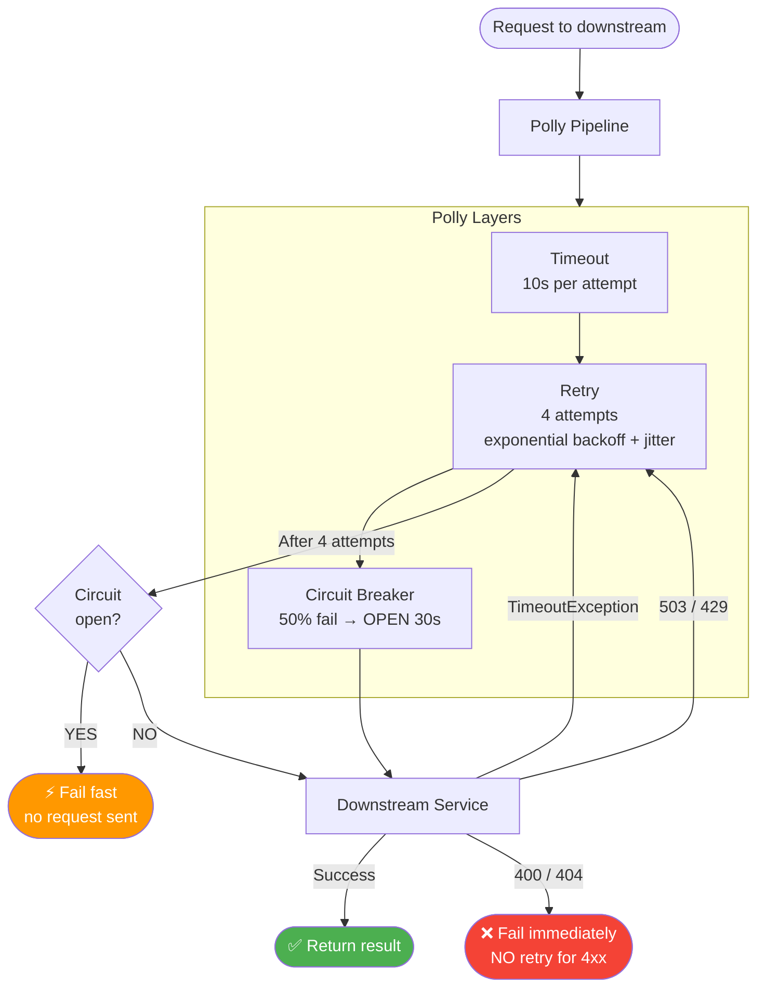
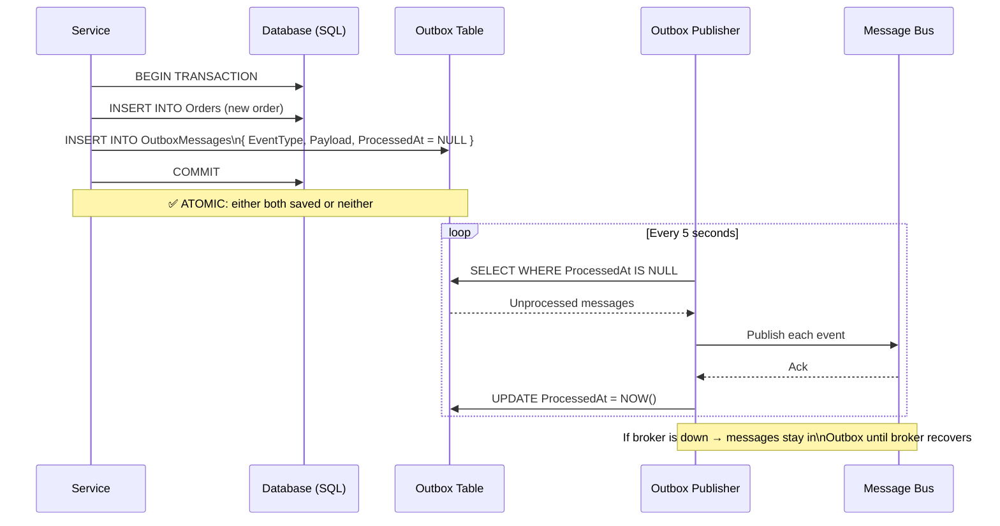
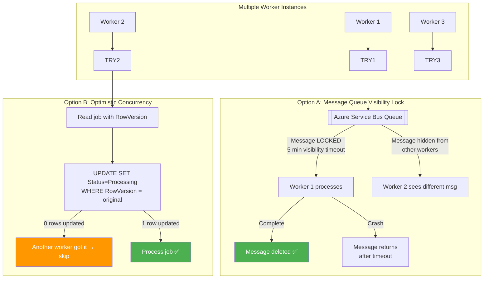
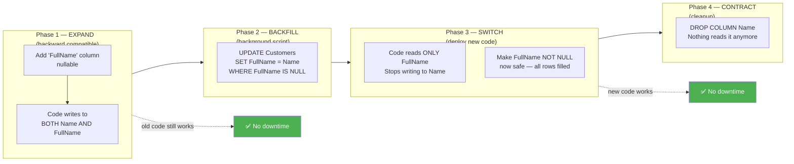

# ⚙️ Real Production Scenarios — Engineering Field Manual

> The questions that separate senior engineers from the rest.
> Every scenario: Problem → Naive approach (why it fails) → Production-grade solution with .NET code.

---

## 📋 Table of Contents

1. [How do you process 1 lakh (100,000) Excel records?](#1-how-do-you-process-1-lakh-100000-excel-records)
2. [How do retries work safely?](#2-how-do-retries-work-safely)
3. [How do you avoid duplicate processing?](#3-how-do-you-avoid-duplicate-processing)
4. [How do you design batch jobs?](#4-how-do-you-design-batch-jobs)
5. [How do you recover failed records?](#5-how-do-you-recover-failed-records)
6. [How do you prevent concurrent job pickup?](#6-how-do-you-prevent-concurrent-job-pickup)
7. [How do you handle database migrations with zero downtime?](#7-how-do-you-handle-database-migrations-with-zero-downtime)
8. [How do you build an audit trail?](#8-how-do-you-build-an-audit-trail)
9. [How do you handle long-running background jobs?](#9-how-do-you-handle-long-running-background-jobs)
10. [How do you deal with third-party API rate limits?](#10-how-do-you-deal-with-third-party-api-rate-limits)
11. [How do you gracefully shutdown a service?](#11-how-do-you-gracefully-shutdown-a-service)
12. [How do you prevent memory leaks in production?](#12-how-do-you-prevent-memory-leaks-in-production)

---

## 1. How do you process 1 lakh (100,000) Excel records?

### Naive Approach (Why It Fails)
```csharp
// ❌ Load entire file into memory → OOM for large files
var workbook = new XSSFWorkbook(stream); // loads all 100k rows into RAM
foreach (var row in workbook.GetSheetAt(0))
{
    var order = MapRow(row);
    await _db.Orders.AddAsync(order);
    await _db.SaveChangesAsync(); // N individual INSERT statements → very slow
}
```
**Problems:** Memory spike, N+1 saves (100k individual inserts), no error recovery, no progress tracking, blocks HTTP thread for minutes.

### Production Solution

```csharp
// Step 1: Receive file, save to Blob, enqueue job — respond immediately
[HttpPost("import/orders")]
[RequestSizeLimit(50 * 1024 * 1024)] // 50 MB limit
public async Task<IActionResult> Import(IFormFile file)
{
    // Save raw file to Blob Storage
    var blobName = $"imports/{Guid.NewGuid()}/{file.FileName}";
    await _blobService.UploadAsync(blobName, file.OpenReadStream());

    // Create import job record
    var job = new ImportJob
    {
        Id         = Guid.NewGuid(),
        BlobName   = blobName,
        Status     = ImportStatus.Queued,
        TotalRows  = 0,
        CreatedBy  = CurrentUserId,
        CreatedAt  = DateTime.UtcNow
    };
    _db.ImportJobs.Add(job);
    await _db.SaveChangesAsync();

    // Enqueue background processing
    await _bus.PublishAsync(new ProcessImportCommand(job.Id));

    return Accepted(new { jobId = job.Id, statusUrl = $"/api/imports/{job.Id}" });
    // Returns 202 immediately — client polls /api/imports/{jobId} for status
}

// Step 2: Background worker processes file in chunks
public class ImportOrdersHandler : IConsumer<ProcessImportCommand>
{
    private const int ChunkSize = 500; // insert 500 rows per batch

    public async Task Consume(ConsumeContext<ProcessImportCommand> ctx)
    {
        var job = await _db.ImportJobs.FindAsync(ctx.Message.JobId);
        job!.Status    = ImportStatus.Processing;
        job.StartedAt  = DateTime.UtcNow;
        await _db.SaveChangesAsync();

        var stream = await _blobService.DownloadAsync(job.BlobName);

        // Step 3: Stream rows from Excel without loading entire file
        var rows = ExcelStreamReader.ReadRows(stream); // yields rows lazily

        var chunk       = new List<Order>(ChunkSize);
        int processed   = 0;
        int failed       = 0;
        var failures    = new List<ImportFailure>();

        await foreach (var row in rows)
        {
            // Step 4: Validate each row
            var (isValid, order, error) = ValidateAndMap(row);
            if (!isValid)
            {
                failures.Add(new ImportFailure { RowNumber = row.Number, Error = error });
                failed++;
                continue;
            }

            chunk.Add(order);

            // Step 5: Bulk insert when chunk is full
            if (chunk.Count >= ChunkSize)
            {
                await BulkInsertAsync(chunk);
                processed += chunk.Count;
                chunk.Clear();

                // Update progress so UI can show "45,000 / 100,000 processed"
                job.ProcessedRows = processed;
                job.FailedRows    = failed;
                await _db.SaveChangesAsync();
            }
        }

        // Insert remaining rows
        if (chunk.Count > 0)
        {
            await BulkInsertAsync(chunk);
            processed += chunk.Count;
        }

        // Step 6: Save failure report to Blob
        if (failures.Any())
        {
            var reportBlob = $"imports/{job.Id}/failures.csv";
            await _blobService.UploadAsync(reportBlob, GenerateCsv(failures));
            job.FailureReportUrl = reportBlob;
        }

        job.Status       = failed == 0 ? ImportStatus.Completed : ImportStatus.CompletedWithErrors;
        job.ProcessedRows = processed;
        job.FailedRows    = failed;
        job.CompletedAt   = DateTime.UtcNow;
        await _db.SaveChangesAsync();
    }

    private async Task BulkInsertAsync(List<Order> orders)
    {
        // EF Core bulk insert — single SQL statement
        await _db.BulkInsertAsync(orders); // EFCore.BulkExtensions
        // Or: SqlBulkCopy for maximum throughput
    }
}

// Step 7: Client polls for status
[HttpGet("imports/{jobId}")]
public async Task<IActionResult> GetStatus(Guid jobId)
{
    var job = await _db.ImportJobs.FindAsync(jobId);
    return Ok(new
    {
        job.Status,
        job.ProcessedRows,
        job.FailedRows,
        job.TotalRows,
        ProgressPct = job.TotalRows > 0 ? (job.ProcessedRows * 100 / job.TotalRows) : 0,
        job.FailureReportUrl
    });
}
```

### Key Design Decisions
| Decision | Reason |
|----------|--------|
| 202 Accepted + job ID | Don't block HTTP connection for minutes |
| Blob storage for file | Don't pass large files through message queues |
| Streaming rows | Don't load 100k rows into RAM |
| Bulk insert in chunks of 500 | Balance: individual inserts too slow; one 100k insert too risky |
| Failure report as CSV | User can fix and re-import failed rows only |
| Progress tracking | User sees live progress, not a spinner |

---

## 2. How do retries work safely?

### The Problem: What Can Go Wrong Without Careful Retry Design
```
1. Retry on non-retriable errors → wastes time, hides bugs
2. Retry without delay → hammers failing downstream (retry storm)
3. Retry without jitter → all instances retry at same time (thundering herd)
4. Retry non-idempotent operations → duplicate payments, double emails
5. Infinite retries → never give up, queue backs up
```

### Safe Retry Implementation
```csharp
// Full production retry strategy with Polly
public static class ResiliencePolicies
{
    public static ResiliencePipeline<HttpResponseMessage> BuildHttpPipeline(
        ILogger logger) =>
        new ResiliencePipelineBuilder<HttpResponseMessage>()
            // Layer 1: Timeout per attempt
            .AddTimeout(TimeSpan.FromSeconds(10))

            // Layer 2: Retry with exponential backoff + jitter
            .AddRetry(new RetryStrategyOptions<HttpResponseMessage>
            {
                MaxRetryAttempts = 4,
                Delay            = TimeSpan.FromMilliseconds(250),
                BackoffType      = DelayBackoffType.Exponential,
                UseJitter        = true,   // prevents thundering herd

                // Only retry on retriable errors
                ShouldHandle = new PredicateBuilder<HttpResponseMessage>()
                    .Handle<TimeoutRejectedException>()
                    .Handle<HttpRequestException>()
                    .HandleResult(r => r.StatusCode is
                        HttpStatusCode.TooManyRequests or       // 429
                        HttpStatusCode.ServiceUnavailable or    // 503
                        HttpStatusCode.GatewayTimeout),         // 504
                    // NOT retrying: 400, 401, 403, 404, 422 — permanent failures

                OnRetry = args =>
                {
                    logger.LogWarning("Retry {Attempt} after {Delay}ms. Reason: {Outcome}",
                        args.AttemptNumber + 1,
                        args.RetryDelay.TotalMilliseconds,
                        args.Outcome.Exception?.Message ?? args.Outcome.Result?.StatusCode.ToString());
                    return ValueTask.CompletedTask;
                }
            })

            // Layer 3: Circuit breaker — stop hammering a dead service
            .AddCircuitBreaker(new CircuitBreakerStrategyOptions<HttpResponseMessage>
            {
                FailureRatio      = 0.5,                       // open at 50% failure rate
                SamplingDuration  = TimeSpan.FromSeconds(10),
                MinimumThroughput = 5,                         // need at least 5 requests to measure
                BreakDuration     = TimeSpan.FromSeconds(30),  // stay open 30s
                OnOpened  = _ => { logger.LogError("Circuit OPEN"); return ValueTask.CompletedTask; },
                OnClosed  = _ => { logger.LogInformation("Circuit CLOSED"); return ValueTask.CompletedTask; }
            })
            .Build();
}
```

### Retry Delay Schedule
```
Attempt | Base Delay | With Jitter (±25%)
1       | 250ms      | 188ms – 313ms
2       | 500ms      | 375ms – 625ms
3       | 1000ms     | 750ms – 1250ms
4       | 2000ms     | 1500ms – 2500ms
Total max wait: ~4.5 seconds before final failure
```

---

## 3. How do you avoid duplicate processing?

### The Problem
```
Message broker delivers message → consumer crashes after processing but before ACK
Broker redelivers message → processed TWICE
→ Duplicate order, double charge, duplicate email
```

### Solution: Idempotent Consumer with Outbox
```csharp
// Idempotency table — tracks processed event IDs
// CREATE TABLE processed_events (
//     event_id    UNIQUEIDENTIFIER PRIMARY KEY,
//     processed_at DATETIME NOT NULL,
//     handler_name NVARCHAR(200)
// );

public class OrderCreatedHandler : IConsumer<OrderCreatedEvent>
{
    public async Task Consume(ConsumeContext<OrderCreatedEvent> ctx)
    {
        var eventId = ctx.Message.EventId;

        // Use a transaction to make the check + process atomic
        await using var tx = await _db.Database.BeginTransactionAsync(
            IsolationLevel.ReadCommitted);

        // Step 1: Check if already processed
        var alreadyProcessed = await _db.ProcessedEvents
            .AnyAsync(e => e.EventId == eventId);

        if (alreadyProcessed)
        {
            _log.LogInformation("Duplicate event {Id} — skipping", eventId);
            await ctx.ConsumeCompleted(); // ACK the duplicate
            return;
        }

        // Step 2: Process business logic
        await _inventoryService.ReserveAsync(ctx.Message.Items);

        // Step 3: Record event ID + commit in same transaction
        _db.ProcessedEvents.Add(new ProcessedEvent
        {
            EventId     = eventId,
            ProcessedAt = DateTime.UtcNow,
            HandlerName = nameof(OrderCreatedHandler)
        });

        await _db.SaveChangesAsync();
        await tx.CommitAsync();
        // If crash here: event not ACKed → redelivered → step 1 finds it → skipped safely
    }
}
```

### Outbox Pattern — Guarantee Event is Published
```csharp
// Problem: save Order to DB + publish event = two operations
// If DB succeeds but broker is down → order saved, event never published

// Solution: save event to DB in same transaction, separate publisher reads and sends

// Step 1: In same transaction — save entity + save outbox record
await using var tx = await _db.Database.BeginTransactionAsync();
_db.Orders.Add(order);
_db.OutboxMessages.Add(new OutboxMessage
{
    Id          = Guid.NewGuid(),
    EventType   = nameof(OrderCreatedEvent),
    Payload     = JsonSerializer.Serialize(new OrderCreatedEvent(order.Id)),
    CreatedAt   = DateTime.UtcNow,
    ProcessedAt = null  // null = not yet sent
});
await _db.SaveChangesAsync();
await tx.CommitAsync(); // atomic: either BOTH saved or NEITHER

// Step 2: Background publisher reads unprocessed outbox messages and sends
public class OutboxPublisher : BackgroundService
{
    protected override async Task ExecuteAsync(CancellationToken ct)
    {
        while (!ct.IsCancellationRequested)
        {
            var messages = await _db.OutboxMessages
                .Where(m => m.ProcessedAt == null)
                .OrderBy(m => m.CreatedAt)
                .Take(50)
                .ToListAsync(ct);

            foreach (var msg in messages)
            {
                await _bus.PublishAsync(msg.EventType, msg.Payload, ct);
                msg.ProcessedAt = DateTime.UtcNow;
            }

            await _db.SaveChangesAsync(ct);
            await Task.Delay(TimeSpan.FromSeconds(5), ct); // poll every 5s
        }
    }
}
```

---

## 4. How do you design batch jobs?

### Production Batch Job Architecture
```csharp
// Use .NET BackgroundService + IServiceScopeFactory for proper DI lifetime

public class DailyReportJob : BackgroundService
{
    private readonly IServiceScopeFactory _scopeFactory;
    private readonly ILogger<DailyReportJob> _log;

    // Use CRON scheduling (e.g. with NCrontab or Hangfire)
    private readonly string _cronExpression = "0 2 * * *"; // 2 AM daily

    protected override async Task ExecuteAsync(CancellationToken stoppingToken)
    {
        while (!stoppingToken.IsCancellationRequested)
        {
            var nextRun = CronExpression.Parse(_cronExpression).GetNextOccurrence(DateTime.UtcNow);
            var delay   = nextRun - DateTime.UtcNow;

            await Task.Delay(delay, stoppingToken);

            // Create scope per job run — proper Scoped/Transient lifetime
            using var scope = _scopeFactory.CreateScope();
            var job = scope.ServiceProvider.GetRequiredService<IDailyReportService>();

            await RunJobSafelyAsync(job, stoppingToken);
        }
    }

    private async Task RunJobSafelyAsync(IDailyReportService job, CancellationToken ct)
    {
        var jobRun = new JobRun
        {
            JobName   = "DailyReport",
            StartedAt = DateTime.UtcNow,
            Status    = "running"
        };

        try
        {
            _log.LogInformation("DailyReport job started");
            await job.ExecuteAsync(ct);

            jobRun.Status      = "completed";
            jobRun.CompletedAt = DateTime.UtcNow;
            _log.LogInformation("DailyReport completed in {Ms}ms",
                (jobRun.CompletedAt - jobRun.StartedAt)!.Value.TotalMilliseconds);
        }
        catch (Exception ex) when (ex is not OperationCanceledException)
        {
            jobRun.Status    = "failed";
            jobRun.ErrorMsg  = ex.Message;
            _log.LogError(ex, "DailyReport job failed");
            // Send alert — do NOT crash the BackgroundService
        }
        finally
        {
            await SaveJobRunAsync(jobRun); // persist every run for audit
        }
    }
}
```

### Chunk Processing Pattern
```csharp
// Process large dataset in chunks to avoid OOM and enable resume
public async Task ExecuteAsync(CancellationToken ct)
{
    Guid? lastProcessedId = await GetCheckpointAsync(); // resume from last good position

    while (true)
    {
        // Keyset pagination — no OFFSET performance issues
        var batch = await _db.Orders
            .Where(o => o.Status == "Pending" &&
                        (lastProcessedId == null || o.Id > lastProcessedId))
            .OrderBy(o => o.Id)
            .Take(1000)
            .AsNoTracking()
            .ToListAsync(ct);

        if (!batch.Any()) break; // no more records

        foreach (var order in batch)
        {
            await ProcessOrderAsync(order, ct);
            lastProcessedId = order.Id;
        }

        // Save checkpoint after each batch — enables resume on crash
        await SaveCheckpointAsync(lastProcessedId!.Value);
        _log.LogInformation("Processed batch up to {Id}", lastProcessedId);
    }
}
```

### Use Hangfire for Production Job Scheduling
```csharp
// Hangfire — persisted job scheduler with dashboard
builder.Services.AddHangfire(config =>
    config.UseSqlServerStorage(connectionString));
builder.Services.AddHangfireServer();

// Recurring job
RecurringJob.AddOrUpdate<IDailyReportService>(
    "daily-report",
    svc => svc.ExecuteAsync(CancellationToken.None),
    Cron.Daily(hour: 2)); // 2 AM UTC

// One-off delayed job
BackgroundJob.Schedule<IEmailService>(
    svc => svc.SendReminderAsync(userId),
    TimeSpan.FromHours(24));

// Hangfire dashboard (admin only)
app.UseHangfireDashboard("/hangfire", new DashboardOptions
{
    Authorization = new[] { new HangfireAuthFilter() } // secure it!
});
```

---

## 5. How do you recover failed records?

### Multi-Level Recovery Architecture
```
Processing flow:
  [Pending Queue]
       │
       ▼ worker picks up record
  [Processing]
       │
       ├─ Success → mark Completed, move to archive
       │
       └─ Failure (transient) → increment RetryCount
                  │
                  ├─ RetryCount < MaxRetries (3) → back to Pending after delay
                  │
                  └─ RetryCount >= MaxRetries → move to Dead state + alert
                                                    │
                                        Manual review or automated DLQ replay
```

### Implementation
```csharp
// Job record tracks retry state
public class ProcessingJob
{
    public Guid     Id           { get; set; }
    public string   Payload      { get; set; } = "";
    public string   Status       { get; set; } = "Pending"; // Pending|Processing|Completed|Failed|Dead
    public int      RetryCount   { get; set; }
    public int      MaxRetries   { get; set; } = 3;
    public DateTime? NextRetryAt { get; set; }
    public string?  LastError    { get; set; }
}

// Worker with retry logic
public async Task ProcessNextJobAsync()
{
    var job = await _db.Jobs
        .Where(j => j.Status == "Pending" && (j.NextRetryAt == null || j.NextRetryAt <= DateTime.UtcNow))
        .OrderBy(j => j.CreatedAt)
        .FirstOrDefaultAsync();

    if (job is null) return;

    // Claim it (optimistic concurrency — prevents two workers picking same job)
    job.Status    = "Processing";
    job.StartedAt = DateTime.UtcNow;
    try
    {
        await _db.SaveChangesAsync(); // will throw DbUpdateConcurrencyException if already claimed
    }
    catch (DbUpdateConcurrencyException)
    {
        return; // another worker got it
    }

    try
    {
        await ProcessAsync(job.Payload);
        job.Status      = "Completed";
        job.CompletedAt = DateTime.UtcNow;
    }
    catch (Exception ex)
    {
        job.RetryCount++;
        job.LastError = ex.Message;

        if (job.RetryCount >= job.MaxRetries)
        {
            job.Status = "Dead"; // give up
            await _alertService.SendAsync($"Job {job.Id} permanently failed: {ex.Message}");
        }
        else
        {
            job.Status      = "Pending";
            // Exponential backoff: retry after 1min, 2min, 4min
            job.NextRetryAt = DateTime.UtcNow.AddMinutes(Math.Pow(2, job.RetryCount));
        }
    }

    await _db.SaveChangesAsync();
}

// DLQ replay endpoint — after fixing the bug
[HttpPost("admin/jobs/replay-dead")]
[Authorize(Roles = "Admin")]
public async Task<IActionResult> ReplayDead([FromQuery] string? jobType = null)
{
    var deadJobs = await _db.Jobs
        .Where(j => j.Status == "Dead" && (jobType == null || j.Type == jobType))
        .ToListAsync();

    foreach (var job in deadJobs)
    {
        job.Status     = "Pending";
        job.RetryCount = 0;            // reset retry counter
        job.NextRetryAt = null;
        job.LastError   = null;
    }

    await _db.SaveChangesAsync();
    return Ok(new { replayed = deadJobs.Count });
}
```

---

## 6. How do you prevent concurrent job pickup?

### The Problem
```
Worker A and Worker B both query: SELECT TOP 1 WHERE Status = 'Pending'
Both get JobId = 42
Both process it → duplicate processing, race conditions
```

### Solution 1: SELECT ... WITH (UPDLOCK, ROWLOCK)
```csharp
// SQL Server-specific: lock the row on SELECT → only one worker gets it
var job = await _db.Jobs
    .FromSqlRaw(@"
        SELECT TOP 1 *
        FROM Jobs WITH (UPDLOCK, ROWLOCK)
        WHERE Status = 'Pending'
          AND (NextRetryAt IS NULL OR NextRetryAt <= GETUTCDATE())
        ORDER BY CreatedAt ASC
    ")
    .FirstOrDefaultAsync();

if (job is null) return;
job.Status = "Processing";
await _db.SaveChangesAsync(); // lock released after commit
```

### Solution 2: Optimistic Concurrency with RowVersion
```csharp
// Entity has RowVersion (concurrency token)
public class Job
{
    public Guid   Id     { get; set; }
    public string Status { get; set; } = "Pending";

    [Timestamp]
    public byte[] RowVersion { get; set; } = []; // EF adds WHERE RowVersion = @original
}

// Worker 1 and Worker 2 both read JobId=42 with same RowVersion
// Worker 1 saves first → RowVersion changes → succeeds
// Worker 2 saves → WHERE RowVersion = old_value → 0 rows updated → DbUpdateConcurrencyException
try
{
    job.Status = "Processing";
    await _db.SaveChangesAsync(); // only one worker wins
}
catch (DbUpdateConcurrencyException)
{
    return; // another worker claimed it — move on
}
```

### Solution 3: Redis Distributed Lock (Best for Multi-Instance)
```csharp
public class JobWorker
{
    private readonly IDistributedLockFactory _lockFactory; // RedLock.net

    public async Task ProcessJobAsync(Guid jobId, CancellationToken ct)
    {
        var lockKey = $"job-lock:{jobId}";
        var expiry  = TimeSpan.FromMinutes(5); // longer than expected job duration

        // Acquire distributed lock — atomic across all instances
        await using var redLock = await _lockFactory.CreateLockAsync(
            lockKey, expiry,
            wait:  TimeSpan.FromSeconds(1),   // how long to try
            retry: TimeSpan.FromMilliseconds(200));

        if (!redLock.IsAcquired)
        {
            _log.LogDebug("Job {Id} already locked by another worker", jobId);
            return; // another worker has it
        }

        // Only one instance executes here
        await ProcessCoreAsync(jobId, ct);
    }
}
```

### Solution 4: Message Queue (Best Architecture)
```
Instead of polling DB, push jobs to a queue with visibility timeout:

Azure Service Bus:
  - Pick up message → message LOCKED (hidden from other consumers) for 5 minutes
  - Process → Complete (delete message) OR Abandon (return to queue)
  - Lock timeout: if worker crashes, message auto-returns to queue after 5min

This is the cleanest solution — no SELECT FOR UPDATE, no concurrency tokens needed.
```

---

## 7. How do you handle database migrations with zero downtime?

### The Problem with Standard Migrations
```
Standard approach: stop app → apply migration (ALTER TABLE) → restart app
→ Downtime! Unacceptable for production

Dangerous patterns:
❌ Rename a column → old code reads old name → crashes immediately
❌ Add NOT NULL column without default → existing rows violate constraint
❌ Drop a column still read by old code → crashes
```

### Expand and Contract Pattern
```
Phase 1 — EXPAND (backward-compatible change, deploy new code):
  - Add new column (nullable or with default)
  - New code writes to BOTH old and new column
  - Old code still works (reads old column)

Phase 2 — MIGRATE DATA (backfill):
  - Background job copies data from old to new column
  - No downtime — can run while app is live

Phase 3 — CONTRACT (remove old):
  - Deploy code that reads ONLY new column
  - Remove old column in migration (nothing reads it anymore)
```

### Code Example: Rename Column Safely
```csharp
// Current state: column named "Name", code uses "Name"
// Goal: rename to "FullName" — zero downtime

// Step 1 — EXPAND migration: add FullName column
migrationBuilder.AddColumn<string>(
    name: "FullName", table: "Customers",
    nullable: true);

// Step 1 — Code writes to BOTH columns:
customer.Name     = dto.Name;     // old code still works
customer.FullName = dto.Name;     // populate new column

// Step 2 — BACKFILL (one-time script):
// UPDATE Customers SET FullName = Name WHERE FullName IS NULL;

// Step 3 — Make FullName NOT NULL after backfill:
migrationBuilder.AlterColumn<string>(
    name: "FullName", table: "Customers", nullable: false);

// Step 3 — Switch code to read ONLY FullName:
// customer.FullName = dto.Name; (remove writing to Name)

// Step 4 — CONTRACT: drop old column in a separate migration:
migrationBuilder.DropColumn(name: "Name", table: "Customers");
```

---

## 8. How do you build an audit trail?

### Requirements
- Track who changed what and when for every entity
- Cannot be deleted or modified
- Queryable: "show all changes to Order #42"

### EF Core SaveChanges Interceptor
```csharp
public class AuditInterceptor : SaveChangesInterceptor
{
    private readonly ICurrentUser _currentUser;

    public override async ValueTask<InterceptionResult<int>> SavingChangesAsync(
        DbContextEventData eventData, InterceptionResult<int> result, CancellationToken ct)
    {
        var db = eventData.Context!;
        var auditEntries = new List<AuditEntry>();

        foreach (var entry in db.ChangeTracker.Entries()
            .Where(e => e.State is EntityState.Added or EntityState.Modified or EntityState.Deleted))
        {
            var audit = new AuditEntry
            {
                EntityName  = entry.Entity.GetType().Name,
                EntityId    = entry.Properties
                    .FirstOrDefault(p => p.Metadata.IsPrimaryKey())?.CurrentValue?.ToString() ?? "",
                Action      = entry.State.ToString(),      // Added|Modified|Deleted
                ChangedBy   = _currentUser.Email,
                ChangedAt   = DateTime.UtcNow,
                OldValues   = entry.State == EntityState.Modified
                    ? JsonSerializer.Serialize(entry.Properties
                        .Where(p => p.IsModified)
                        .ToDictionary(p => p.Metadata.Name, p => p.OriginalValue))
                    : null,
                NewValues   = entry.State != EntityState.Deleted
                    ? JsonSerializer.Serialize(entry.Properties
                        .Where(p => p.IsModified || entry.State == EntityState.Added)
                        .ToDictionary(p => p.Metadata.Name, p => p.CurrentValue))
                    : null
            };
            auditEntries.Add(audit);
        }

        var saveResult = await base.SavingChangesAsync(eventData, result, ct);

        // Save audit log AFTER main changes committed
        db.Set<AuditEntry>().AddRange(auditEntries);
        await db.SaveChangesAsync(ct);

        return saveResult;
    }
}

// Registration
builder.Services.AddDbContext<AppDbContext>((sp, opts) =>
    opts.UseSqlServer(cs)
        .AddInterceptors(sp.GetRequiredService<AuditInterceptor>()));
```

---

## 9. How do you handle long-running background jobs?

### Patterns for Long Jobs
```csharp
// Problem: Job takes 30 minutes. How do you:
// 1. Not block HTTP thread
// 2. Track progress
// 3. Allow cancellation
// 4. Handle app restart mid-job

public class LongRunningExportJob : BackgroundService
{
    protected override async Task ExecuteAsync(CancellationToken appStopping)
    {
        // Listen for both: job cancellation and app shutdown
        while (!appStopping.IsCancellationRequested)
        {
            var nextJob = await _queue.DequeueAsync(appStopping);
            if (nextJob is null) continue;

            // Combine app shutdown token with job-specific cancellation
            using var jobCts = CancellationTokenSource.CreateLinkedTokenSource(
                appStopping, nextJob.CancellationToken);

            try
            {
                await RunJobAsync(nextJob, jobCts.Token);
            }
            catch (OperationCanceledException) when (appStopping.IsCancellationRequested)
            {
                // App shutting down — save checkpoint so job can resume
                await SaveCheckpointAsync(nextJob);
                _log.LogInformation("Job {Id} paused due to app shutdown", nextJob.Id);
                break;
            }
        }
    }

    private async Task RunJobAsync(ExportJob job, CancellationToken ct)
    {
        var progress = 0;
        await foreach (var batch in GetBatchesAsync(job, ct))
        {
            ct.ThrowIfCancellationRequested();
            await ProcessBatchAsync(batch, ct);
            progress += batch.Count;

            // Update progress in DB for polling clients
            await _progressStore.UpdateAsync(job.Id, progress, job.TotalRecords);
        }
    }
}
```

---

## 10. How do you deal with third-party API rate limits?

### Scenario: Sending emails via SendGrid — 100 req/sec limit
```csharp
// SemaphoreSlim as a rate limiter
public class RateLimitedEmailSender
{
    private readonly SemaphoreSlim _semaphore;
    private readonly IEmailClient _client;
    private int _requestsThisSecond = 0;
    private DateTime _windowStart = DateTime.UtcNow;

    public RateLimitedEmailSender(IEmailClient client, int maxPerSecond = 90) // 90% of limit = safety margin
    {
        _semaphore = new SemaphoreSlim(maxPerSecond, maxPerSecond);
        _client    = client;
    }

    public async Task SendAsync(EmailMessage email, CancellationToken ct)
    {
        await _semaphore.WaitAsync(ct); // blocks until a slot is free

        _ = Task.Run(async () =>
        {
            try
            {
                await Task.Delay(TimeSpan.FromSeconds(1), ct); // release slot after 1 second
            }
            finally
            {
                _semaphore.Release();
            }
        }, ct);

        await _client.SendAsync(email, ct);
    }
}

// Better: Use Polly rate limiter + token bucket
var pipeline = new ResiliencePipelineBuilder()
    .AddRateLimiter(new TokenBucketRateLimiter(new TokenBucketRateLimiterOptions
    {
        TokenLimit         = 90,
        ReplenishmentPeriod = TimeSpan.FromSeconds(1),
        TokensPerPeriod    = 90,
        QueueLimit         = 1000        // queue up to 1000 emails
    }))
    .Build();
```

---

## 11. How do you gracefully shutdown a service?

### The Problem
```
Kubernetes sends SIGTERM → app stops immediately
→ In-flight requests cut off (connection reset errors)
→ Background jobs interrupted mid-write (data corruption)
```

### .NET Graceful Shutdown
```csharp
// Program.cs — configure shutdown timeout
builder.Services.Configure<HostOptions>(options =>
{
    options.ShutdownTimeout = TimeSpan.FromSeconds(30); // wait up to 30s for graceful shutdown
});

// BackgroundService — respect cancellation
public class OrderProcessor : BackgroundService
{
    protected override async Task ExecuteAsync(CancellationToken stoppingToken)
    {
        while (!stoppingToken.IsCancellationRequested)
        {
            try
            {
                await ProcessNextOrderAsync(stoppingToken);
            }
            catch (OperationCanceledException)
            {
                _log.LogInformation("Shutdown requested — stopping order processor");
                break; // exit cleanly
            }
        }

        _log.LogInformation("Order processor stopped");
    }
}

// Kubernetes: give the pod time to drain
// In deployment.yaml:
// lifecycle:
//   preStop:
//     exec:
//       command: ["/bin/sh", "-c", "sleep 5"]  ← wait 5s before SIGTERM
// terminationGracePeriodSeconds: 60             ← Kubernetes waits 60s before SIGKILL
```

---

## 12. How do you prevent memory leaks in production?

### Common Leak Patterns and Fixes
```csharp
// ❌ Leak 1: Event handler subscription never unsubscribed
public class OrderService
{
    public OrderService(IEventBus bus)
    {
        bus.OrderPlaced += OnOrderPlaced; // ❌ service held in memory forever by bus
    }
    // Destructor never reached because bus holds reference
}

// ✅ Fix: implement IDisposable, unsubscribe
public class OrderService : IDisposable
{
    private readonly IEventBus _bus;
    public OrderService(IEventBus bus)
    {
        _bus = bus;
        _bus.OrderPlaced += OnOrderPlaced;
    }
    public void Dispose() => _bus.OrderPlaced -= OnOrderPlaced; // unsubscribe
}

// ❌ Leak 2: Static cache grows unbounded
private static Dictionary<Guid, CachedItem> _cache = new(); // never evicted!

// ✅ Fix: use IMemoryCache with size limits
services.AddMemoryCache(opts => opts.SizeLimit = 1000);
_cache.Set(key, value, new MemoryCacheEntryOptions { Size = 1, SlidingExpiration = TimeSpan.FromMinutes(5) });

// ❌ Leak 3: HttpClient created per request
public async Task<string> CallApiAsync()
{
    var client = new HttpClient(); // ❌ port exhaustion, socket leak
    return await client.GetStringAsync("https://api.example.com");
}

// ✅ Fix: IHttpClientFactory manages pool
public class MyService
{
    private readonly HttpClient _client;
    public MyService(IHttpClientFactory factory) => _client = factory.CreateClient("MyApi");
}

// ❌ Leak 4: DbContext not disposed (Singleton DbContext)
services.AddSingleton<AppDbContext>(); // ❌ grows change tracker forever

// ✅ Fix: DbContext must be Scoped
services.AddDbContext<AppDbContext>(); // Scoped by default — disposed after each request
```

---

> ✅ **12 production scenarios** — each one a real interview differentiator.
>
> 💡 **Key patterns to memorise:**
> - Large file import: **202 Accepted + background job + chunked bulk insert + progress tracking**
> - Duplicate prevention: **idempotency key + transactional dedup record**
> - Concurrent job pickup: **message queue visibility lock** (cleanest) or **SELECT WITH (UPDLOCK)**
> - Zero-downtime migration: **expand and contract** — never rename in one step
> - Retries: **exponential backoff + jitter + circuit breaker** — never retry 4xx

---

*Last updated: 2026 | .NET 8 / Hangfire 1.8 / Polly 8.x*

---

# 📊 Production Scenario Flow Diagrams — Visual Reference

---

## PS-D1 — Processing 1 Lakh Excel Records

```mermaid
flowchart TD
    C([Client uploads\n100k row Excel file]) -->|POST /import| API[API Controller]
    API -->|Save file to Blob| BLOB[(Azure Blob Storage)]
    API -->|Create ImportJob record| DB[(Database)]
    API -->|Publish ProcessImportCommand| BUS[[Message Bus]]
    API -->|202 Accepted\n{jobId}| C

    BUS --> WORKER[Background Worker]
    WORKER -->|Download file| BLOB
    WORKER --> STREAM[Stream rows lazily\nDO NOT load all into RAM]

    STREAM --> CHUNK{500 rows\nchunk full?}
    CHUNK -->|YES| BULK[BulkInsertAsync\nsingle SQL statement]
    BULK --> PROG[Update progress\nProcessedRows = N]
    PROG --> CHUNK
    CHUNK -->|NO| NEXT[Continue streaming]

    BULK --> FAIL{Row valid?}
    FAIL -->|NO| FERR[Append to failures list]
    FAIL -->|YES| BULK

    PROG --> DONE([Import complete\nSave failure report to Blob])

    C2([Client polls]) -->|GET /imports/{jobId}| STATUS[Status endpoint]
    STATUS --> DB
    DB -->|ProcessedRows, Status, FailureReportUrl| C2

    style C fill:#4CAF50,color:#fff
    style WORKER fill:#2196F3,color:#fff
    style BULK fill:#FF9800,color:#fff
    style DONE fill:#4CAF50,color:#fff
```

---

## PS-D2 — Safe Retry Architecture



---

## PS-D3 — Outbox Pattern (Guaranteed Event Publishing)



---

## PS-D4 — Concurrent Job Pickup Prevention



---

## PS-D5 — Zero-Downtime Database Migration (Expand and Contract)



