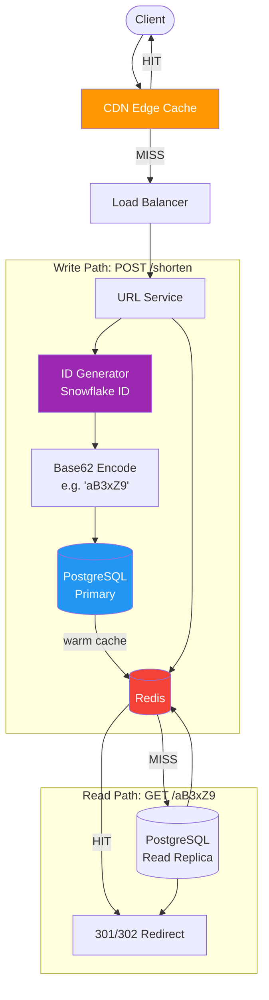
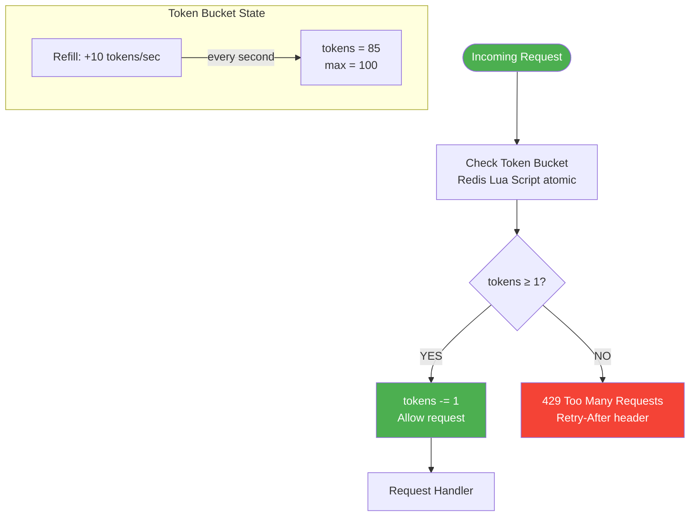
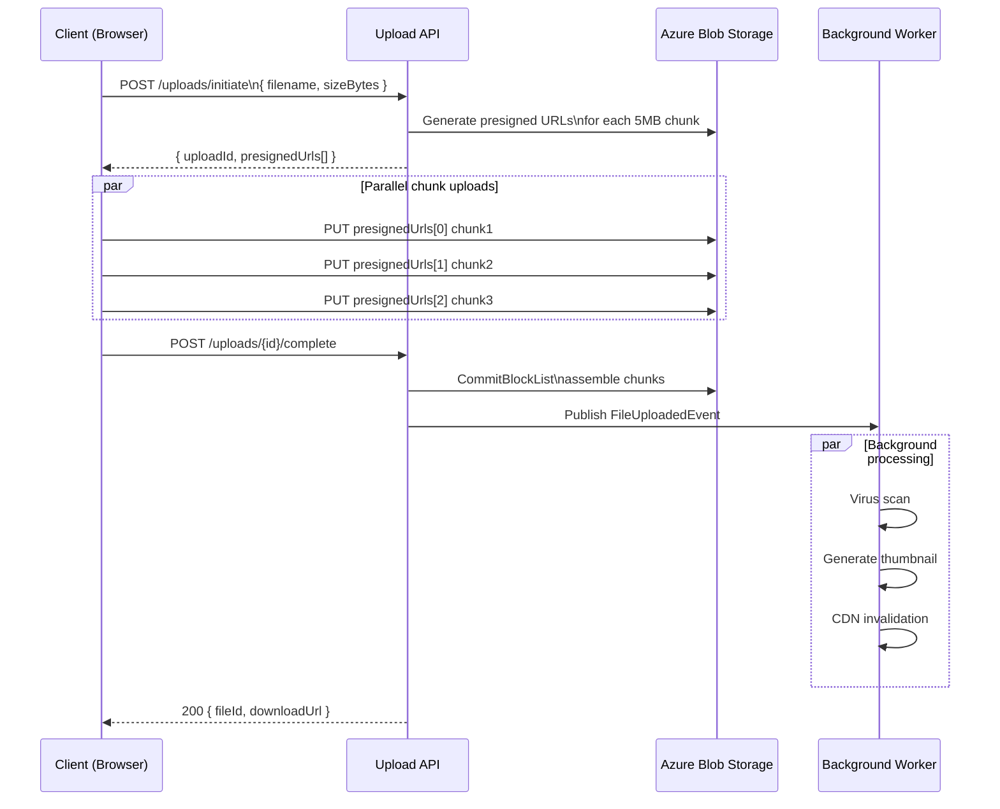
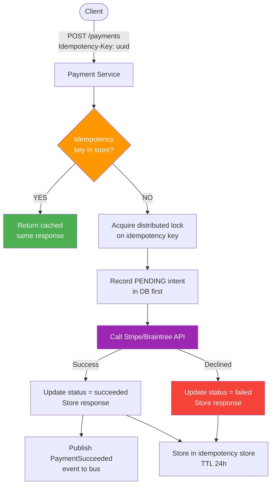
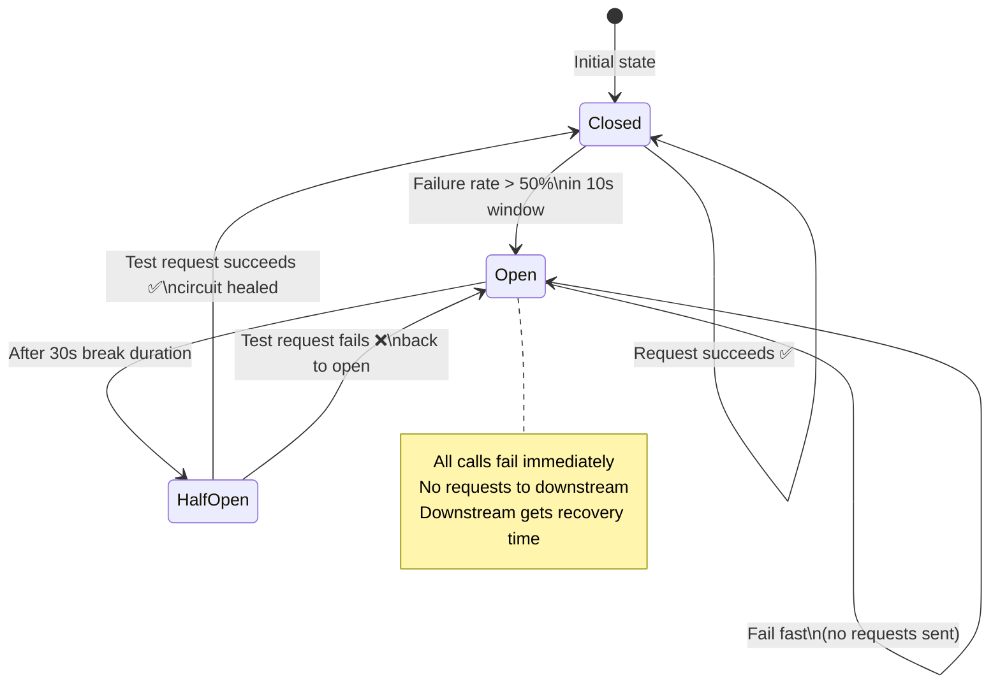
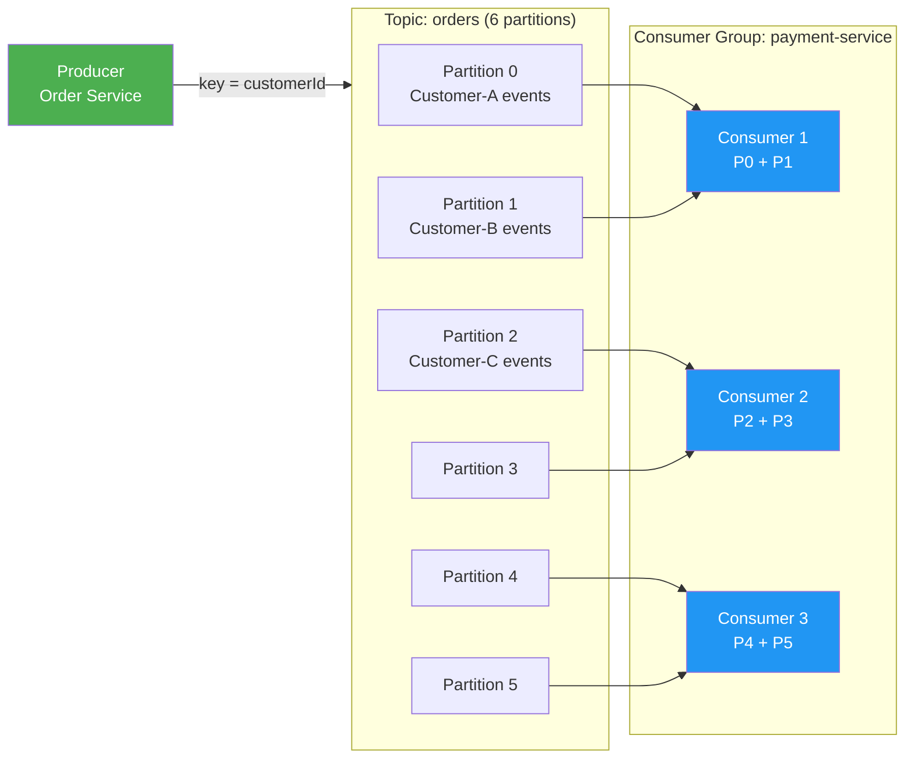
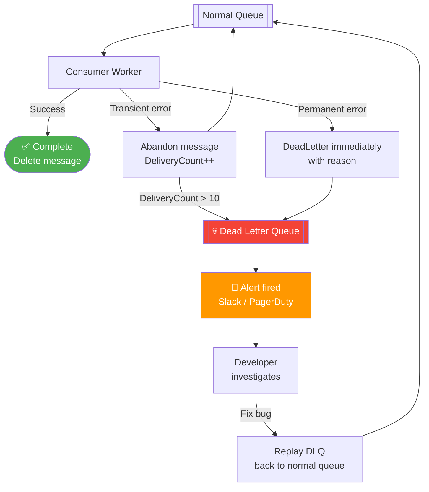

# 🏗️ System Design Extended — Elite Interview Guide

> Full system designs + production engineering patterns.
> Every design includes: Requirements → Capacity → API → Data Model → Architecture → Tradeoffs.

---

## 📋 Table of Contents

### Essential System Designs
1. [URL Shortener](#1-url-shortener)
2. [Notification System](#2-notification-system)
3. [Rate Limiter](#3-rate-limiter)
4. [File Upload Service](#4-file-upload-service)
5. [Payment System](#5-payment-system)
6. [Chat System](#6-chat-system)

### Production Engineering Patterns
7. [Retry Architecture](#7-retry-architecture)
8. [Idempotency Keys](#8-idempotency-keys)
9. [Event-Driven Architecture](#9-event-driven-architecture)
10. [Kafka Basics](#10-kafka-basics)
11. [Exactly-Once vs At-Least-Once](#11-exactly-once-vs-at-least-once)
12. [Dead Letter Queue (DLQ)](#12-dead-letter-queue-dlq)
13. [Saga Pattern](#13-saga-pattern)
14. [Distributed Tracing](#14-distributed-tracing)

---

# Essential System Designs

---

## 1. URL Shortener

### Requirements
**Functional:** Shorten long URL → short code (e.g. short.ly/aB3xZ9). Redirect short → original. Custom aliases. Expiry.  
**Non-functional:** 100M URLs created/day. Read:Write = 100:1. P99 redirect < 10ms. 99.99% availability.

### Capacity Estimation
```
Writes: 100M / 86400s ≈ 1200 writes/sec
Reads:  1200 × 100   = 120,000 reads/sec
Storage: 100M × 500 bytes = 50 GB/day → 18 TB/year
```

### API Design
```
POST /shorten
Body: { "longUrl": "https://...", "alias": "mylink", "expiresAt": "2027-01-01" }
Response: { "shortUrl": "https://short.ly/aB3xZ9" }

GET /{code}
Response: 301 Redirect → longUrl   (or 302 for analytics tracking)
```

**301 vs 302 tradeoff:**
| | 301 Permanent | 302 Temporary |
|-|---------------|---------------|
| Browser caches | ✅ Yes — faster repeat visits | ❌ No — always hits server |
| Analytics counted | ❌ No — cached redirect skips server | ✅ Yes — every click tracked |
| Use when | Speed matters most | Click tracking matters |

### Data Model
```sql
CREATE TABLE urls (
    id         BIGINT PRIMARY KEY,          -- internal auto-increment
    code       VARCHAR(8) UNIQUE NOT NULL,  -- short code "aB3xZ9"
    long_url   TEXT NOT NULL,
    user_id    BIGINT,
    created_at TIMESTAMP DEFAULT NOW(),
    expires_at TIMESTAMP,
    click_count BIGINT DEFAULT 0
);
CREATE INDEX idx_code ON urls(code);        -- lookup by short code
```

### Architecture
```
Client
  │
  ▼
[ CDN / Edge Cache ]           ← cache popular redirects at edge
  │ miss
  ▼
[ Load Balancer ]
  │
  ├── Write Path ──────────────────────────────────────────────────
  │   [ URL Service ]
  │        │ generate unique code
  │        ▼
  │   [ ID Generator ]         ← Snowflake ID or Base62(auto-increment)
  │        │
  │        ▼
  │   [ PostgreSQL (primary) ] ← write code + long_url
  │        │ async replicate
  │        ▼
  │   [ Redis Cache ]          ← warm cache after write
  │
  └── Read Path ───────────────────────────────────────────────────
      [ URL Service ]
           │ GET /aB3xZ9
           ▼
      [ Redis Cache ]          ← hit → return longUrl instantly
           │ miss
           ▼
      [ PostgreSQL (replica) ] ← read long_url, warm cache
           │
           ▼
      301/302 Redirect
```

### Code Generation: Base62
```csharp
public class UrlCodeGenerator
{
    private const string Chars = "abcdefghijklmnopqrstuvwxyzABCDEFGHIJKLMNOPQRSTUVWXYZ0123456789";

    // Convert auto-increment ID to Base62 string — guaranteed unique
    public string Encode(long id)
    {
        var sb = new StringBuilder();
        while (id > 0)
        {
            sb.Insert(0, Chars[(int)(id % 62)]);
            id /= 62;
        }
        return sb.ToString().PadLeft(6, 'a'); // at least 6 chars
    }
}

// 62^6 = 56 billion possible codes — enough for decades
```

### Key Tradeoffs
| Decision | Option A | Option B | Winner |
|----------|----------|----------|--------|
| Code generation | Random hash (MD5 first 6 chars) | Base62(auto-increment ID) | **Base62** — no collision check needed |
| Redirect type | 301 | 302 | **302** if analytics needed, **301** if speed |
| Storage | SQL | NoSQL (Cassandra) | **SQL** for this scale; NoSQL if > 1TB/day |
| Cache TTL | Short (1 min) | Long (1 day) | **Long** — URLs rarely change |

---

## 2. Notification System

### Requirements
**Functional:** Send push, email, SMS, in-app notifications. Support templates. Schedule notifications. User preference management (opt-out per channel).  
**Non-functional:** 10M notifications/day. Delivery < 30s for real-time. At-least-once delivery. No duplicates to end users.

### Architecture
```
API / Trigger Services  (Order Service, Auth Service, etc.)
        │
        ▼
[ Notification Service ]
        │
        ├─ validate preferences (user opted out? → drop)
        ├─ render template
        │
        ▼
[ Message Queue ]  ←── per-channel queues for fan-out
   │        │        │
   ▼        ▼        ▼
[Email Q] [SMS Q] [Push Q]
   │        │        │
   ▼        ▼        ▼
[Email    [SMS     [FCM/APNs
 Worker]   Worker]  Worker]
   │        │        │
   ▼        ▼        ▼
[SendGrid][Twilio] [Firebase]

Failures → DLQ → Alert → Retry or Manual Review
```

### Data Model
```sql
CREATE TABLE notification_templates (
    id       UUID PRIMARY KEY,
    name     VARCHAR(100),       -- "order_shipped"
    channel  VARCHAR(20),        -- "email" | "sms" | "push"
    subject  TEXT,
    body     TEXT                -- "Your order {{orderId}} has shipped!"
);

CREATE TABLE notifications (
    id           UUID PRIMARY KEY,
    user_id      BIGINT,
    template_id  UUID,
    channel      VARCHAR(20),
    status       VARCHAR(20),    -- queued|sent|failed|delivered
    payload      JSONB,          -- { "orderId": "..." }
    scheduled_at TIMESTAMP,
    sent_at      TIMESTAMP,
    created_at   TIMESTAMP DEFAULT NOW()
);

CREATE TABLE user_preferences (
    user_id   BIGINT,
    channel   VARCHAR(20),
    enabled   BOOLEAN DEFAULT TRUE,
    PRIMARY KEY (user_id, channel)
);
```

### Idempotent Delivery
```csharp
// Each notification has a unique idempotency key
// Third-party providers (SendGrid, Twilio) deduplicate on this key
public async Task SendEmailAsync(Notification n)
{
    var idempotencyKey = $"notif:{n.Id}"; // stable per notification

    await _sendGridClient.SendEmailAsync(new EmailMessage
    {
        To      = n.UserEmail,
        Subject = n.Subject,
        Body    = n.Body,
        Headers = new() { ["X-Idempotency-Key"] = idempotencyKey }
    });

    await _db.Notifications
        .Where(x => x.Id == n.Id)
        .ExecuteUpdateAsync(s => s.SetProperty(x => x.Status, "sent")
                                  .SetProperty(x => x.SentAt, DateTime.UtcNow));
}
```

### Key Tradeoffs
| Decision | Option A | Option B | Choice |
|----------|----------|----------|--------|
| Queue per channel | Single queue | Separate queue per channel | **Separate** — SMS outage doesn't block email |
| Delivery guarantee | Exactly-once | At-least-once + dedup | **At-least-once + dedup** — simpler, provider handles dedup |
| Template storage | Code | DB-driven | **DB-driven** — non-dev can edit templates |

---

## 3. Rate Limiter

### Requirements
**Functional:** Limit requests per user/IP per time window. Return 429 when exceeded. Support per-endpoint limits.  
**Non-functional:** < 5ms overhead. Distributed (multiple app servers share state).

### Algorithms Compared

| Algorithm | Memory | Burst Allowed | Smoothness | Best For |
|-----------|--------|---------------|------------|---------|
| Fixed Window | Low | ✅ Yes (edge burst) | ❌ Bursty | Simple APIs |
| Sliding Window Log | High | ❌ No | ✅ Smooth | Precision required |
| Sliding Window Counter | Medium | ⚠️ Partial | ✅ Good | General purpose |
| Token Bucket | Low | ✅ Yes (controlled) | ✅ Good | **Most APIs** |
| Leaky Bucket | Low | ❌ No | ✅ Smooth | Stable output rate |

### Token Bucket Implementation (Redis)
```csharp
public class RedisRateLimiter
{
    private readonly IDatabase _redis;

    // Lua script — atomic check-and-decrement (no race condition)
    private const string LuaScript = @"
        local key      = KEYS[1]
        local capacity = tonumber(ARGV[1])
        local refill   = tonumber(ARGV[2])   -- tokens added per second
        local now      = tonumber(ARGV[3])   -- current timestamp (ms)
        local cost     = tonumber(ARGV[4])   -- tokens this request costs

        local data     = redis.call('HMGET', key, 'tokens', 'last_refill')
        local tokens   = tonumber(data[1]) or capacity
        local last     = tonumber(data[2]) or now

        -- Refill tokens based on elapsed time
        local elapsed  = math.max(0, now - last)
        tokens = math.min(capacity, tokens + elapsed * refill / 1000)

        if tokens >= cost then
            tokens = tokens - cost
            redis.call('HMSET', key, 'tokens', tokens, 'last_refill', now)
            redis.call('EXPIRE', key, 3600)
            return 1        -- allowed
        else
            redis.call('HMSET', key, 'tokens', tokens, 'last_refill', now)
            return 0        -- denied
        end
    ";

    public async Task<bool> IsAllowedAsync(string userId, int capacity = 100, double refillPerSec = 10)
    {
        var key    = $"ratelimit:{userId}";
        var now    = DateTimeOffset.UtcNow.ToUnixTimeMilliseconds();
        var result = await _redis.ScriptEvaluateAsync(LuaScript,
            keys:   new RedisKey[]  { key },
            values: new RedisValue[] { capacity, refillPerSec, now, 1 });

        return (int)result == 1;
    }
}

// Middleware
public class RateLimitMiddleware
{
    public async Task InvokeAsync(HttpContext ctx)
    {
        var userId  = ctx.User.FindFirst("sub")?.Value ?? ctx.Connection.RemoteIpAddress?.ToString();
        var allowed = await _limiter.IsAllowedAsync(userId!);

        if (!allowed)
        {
            ctx.Response.StatusCode = 429;
            ctx.Response.Headers["Retry-After"] = "1";
            await ctx.Response.WriteAsJsonAsync(new { error = "Rate limit exceeded" });
            return;
        }
        await _next(ctx);
    }
}
```

### Key Tradeoffs
| Decision | Option A | Option B | Choice |
|----------|----------|----------|--------|
| Storage | In-process memory | Redis | **Redis** — shared across all app servers |
| Algorithm | Fixed window | Token bucket | **Token bucket** — handles burst naturally |
| Atomicity | Check then update (2 calls) | Lua script (atomic) | **Lua** — no race conditions |
| Limit scope | Per user | Per user + per endpoint | **Both** — coarse + fine-grained |

---

## 4. File Upload Service

### Requirements
**Functional:** Upload files up to 5GB. Resume interrupted uploads. Generate download URLs. Virus scanning. Thumbnail generation for images.  
**Non-functional:** 1M uploads/day. Uploads parallelizable. Files stored durably (11 nines).

### Architecture: Chunked Upload Flow
```
Client
  │
  ├─ 1. POST /uploads/initiate
  │         → { uploadId, presignedUrls[]: [part1URL, part2URL, ...] }
  │
  ├─ 2. PUT presignedUrls[0]  ← chunk 1 directly to Azure Blob / S3
  ├─ 3. PUT presignedUrls[1]  ← chunk 2 directly to Azure Blob / S3
  │    (parallel, retry-able per chunk)
  │
  ├─ 4. POST /uploads/{uploadId}/complete
  │         → { fileId, downloadUrl }
  │
  └─ 5. Background workers:
           ├─ Virus scanner (ClamAV / Defender)
           ├─ Thumbnail generator
           └─ CDN invalidation
```

### Implementation
```csharp
// Step 1: Initiate — generate presigned URLs for each chunk
public async Task<InitiateUploadResponse> InitiateUploadAsync(InitiateUploadRequest req)
{
    var uploadId  = Guid.NewGuid().ToString();
    var chunkSize = 5 * 1024 * 1024; // 5 MB per chunk
    var numChunks = (int)Math.Ceiling((double)req.FileSizeBytes / chunkSize);

    // Store metadata
    await _db.Uploads.AddAsync(new Upload
    {
        Id         = uploadId,
        FileName   = req.FileName,
        TotalChunks= numChunks,
        Status     = "initiated"
    });

    // Generate presigned URLs for direct browser → Blob upload
    var urls = Enumerable.Range(1, numChunks)
        .Select(i => _blobService.GeneratePresignedUploadUrl(
            container:  "uploads",
            blobName:   $"{uploadId}/part{i}",
            expiresIn:  TimeSpan.FromHours(2)))
        .ToList();

    return new(uploadId, urls);
}

// Step 4: Complete — assemble chunks
public async Task<CompleteUploadResponse> CompleteUploadAsync(string uploadId)
{
    var upload   = await _db.Uploads.FindAsync(uploadId)
        ?? throw new NotFoundException($"Upload {uploadId} not found");

    // Compose chunks into final blob (Azure Block Blob CommitBlockList)
    var blockIds = Enumerable.Range(1, upload.TotalChunks)
        .Select(i => Convert.ToBase64String(Encoding.UTF8.GetBytes($"part{i:D6}")))
        .ToList();

    var blobClient = _containerClient.GetBlockBlobClient(uploadId);
    await blobClient.CommitBlockListAsync(blockIds);

    // Publish event for async processing
    await _bus.PublishAsync(new FileUploadedEvent(uploadId, upload.FileName));

    upload.Status = "completed";
    await _db.SaveChangesAsync();

    return new(uploadId, blobClient.Uri.ToString());
}
```

### Key Tradeoffs
| Decision | Option A | Option B | Choice |
|----------|----------|----------|--------|
| Upload target | Via API server | Direct to Blob (presigned URL) | **Direct** — API server not a bottleneck |
| Virus scan | Synchronous (block upload) | Async (post-upload event) | **Async** — don't delay user; quarantine before serving |
| Chunk size | 1 MB | 5–10 MB | **5 MB** — balance retry cost vs request count |
| Storage | On-premise | Azure Blob / S3 | **Blob/S3** — 11 nines durability, geo-redundancy |

---

## 5. Payment System

### Requirements
**Functional:** Charge card, issue refund, subscription billing, payment history.  
**Non-functional:** Exactly-once payment processing (no double charges). PCI-DSS compliance. < 3s p99 for charge. 99.99% availability.

### Architecture
```
Client
  │
  ├─ 1. POST /payments/initiate
  │         → { paymentIntentId, clientSecret }
  │               (idempotency key sent by client)
  │
  ├─ 2. Client-side SDK (Stripe.js) collects card → tokenises
  │         (card numbers NEVER touch your servers — PCI compliance)
  │
  ├─ 3. POST /payments/confirm { paymentIntentId, paymentMethodId }
  │
  ▼
[ Payment Service ]
  │  ─── idempotency check ────────────────────────────
  │  If paymentIntentId already processed → return cached result
  │  ─────────────────────────────────────────────────
  │
  ├─ call Stripe/Braintree API
  │
  ├─ on SUCCESS:
  │     ├─ record in payments table (status=succeeded)
  │     └─ publish PaymentSucceeded event → Order Service, Email Service
  │
  └─ on FAILURE:
        ├─ record failure + error code
        └─ return structured error to client
```

### Idempotency — Critical for Payments
```csharp
public class PaymentService
{
    public async Task<PaymentResult> ChargeAsync(ChargeRequest req)
    {
        // STEP 1: Check idempotency store first
        var existing = await _db.Payments
            .FirstOrDefaultAsync(p => p.IdempotencyKey == req.IdempotencyKey);

        if (existing is not null)
            return MapToResult(existing); // return SAME result as first attempt

        // STEP 2: Acquire distributed lock on idempotency key
        await using var @lock = await _lockService.AcquireAsync(
            $"payment:{req.IdempotencyKey}", TimeSpan.FromSeconds(30));

        // STEP 3: Double-check after lock (another instance may have raced)
        existing = await _db.Payments
            .FirstOrDefaultAsync(p => p.IdempotencyKey == req.IdempotencyKey);
        if (existing is not null) return MapToResult(existing);

        // STEP 4: Record intent BEFORE calling provider
        var payment = new Payment
        {
            Id             = Guid.NewGuid(),
            IdempotencyKey = req.IdempotencyKey,
            Amount         = req.Amount,
            Currency       = req.Currency,
            Status         = "processing"
        };
        _db.Payments.Add(payment);
        await _db.SaveChangesAsync(); // persist intent first

        // STEP 5: Call payment provider
        try
        {
            var result = await _stripeClient.ChargeAsync(req.Token, req.Amount);
            payment.Status      = "succeeded";
            payment.ProviderRef = result.ChargeId;
        }
        catch (PaymentDeclinedException ex)
        {
            payment.Status      = "failed";
            payment.FailureCode = ex.Code;
        }

        await _db.SaveChangesAsync();
        return MapToResult(payment);
    }
}
```

### Key Tradeoffs
| Decision | Option A | Option B | Choice |
|----------|----------|----------|--------|
| PCI compliance | Self-hosted card storage | Stripe/Braintree tokenisation | **Tokenisation** — never store raw card numbers |
| Retry on network error | Retry blindly | Retry with idempotency key | **Idempotency key** — safe retries, no double charge |
| Sync vs async | Wait for provider response | Queue + webhook callback | **Sync for UX**; webhooks for reconciliation |
| Refund | Immediate DB reversal | Provider refund API | **Provider API** — provider is source of truth |

---

## 6. Chat System

### Requirements
**Functional:** 1:1 and group messaging. Online presence. Message history. Media sharing. Read receipts.  
**Non-functional:** 50M DAU. Message delivery < 100ms. Messages durable (7 years). Groups up to 500 members.

### Architecture
```
Client A                              Server                           Client B
   │                                    │                                │
   │── WebSocket connect ──────────────►│                                │
   │                                    │◄── WebSocket connect ──────────│
   │                                    │                                │
   │── send { to: B, msg: "Hi" } ──────►│                                │
   │                                    ├─ 1. Save to DB (Cassandra)     │
   │                                    ├─ 2. Is B online?               │
   │                                    │     YES: push via WebSocket ──►│
   │                                    │     NO:  push via FCM/APNs ───►│
   │◄── ack { msgId, ts } ─────────────│                                │
   │                                    │                                │
```

### Why WebSockets over HTTP polling?
```
HTTP Long Polling:
  Client ──► GET /messages (holds connection)
  Server waits 30s for new messages, responds
  Client immediately makes another request
  → Wasteful, high latency, many connections

WebSocket:
  Client ──► Upgrade to WebSocket (persistent)
  Server pushes instantly when message arrives
  → Low latency, single connection, efficient
```

### Data Model (Cassandra — optimised for time-series reads)
```sql
-- Messages table: partition by conversation_id, cluster by time (newest first)
CREATE TABLE messages (
    conversation_id UUID,
    message_id      TIMEUUID,     -- time-sortable UUID
    sender_id       BIGINT,
    content         TEXT,
    media_url       TEXT,
    status          TEXT,         -- sent|delivered|read
    PRIMARY KEY (conversation_id, message_id)
) WITH CLUSTERING ORDER BY (message_id DESC);

-- Load last 50 messages efficiently:
-- SELECT * FROM messages WHERE conversation_id = ? LIMIT 50;

-- User inbox: which conversations exist and last message
CREATE TABLE user_conversations (
    user_id         BIGINT,
    conversation_id UUID,
    last_message    TEXT,
    last_ts         TIMESTAMP,
    unread_count    INT,
    PRIMARY KEY (user_id, last_ts)
) WITH CLUSTERING ORDER BY (last_ts DESC);
```

### Presence Service
```csharp
// WebSocket connection manager using Redis pub/sub
public class PresenceService
{
    private readonly IDatabase _redis;

    public async Task SetOnlineAsync(Guid userId, string connectionId)
    {
        await _redis.StringSetAsync($"presence:{userId}", connectionId,
            expiry: TimeSpan.FromMinutes(5)); // heartbeat must refresh
    }

    public async Task<string?> GetConnectionIdAsync(Guid userId)
        => await _redis.StringGetAsync($"presence:{userId}");

    // Heartbeat — client pings every 30s
    public async Task HeartbeatAsync(Guid userId, string connectionId)
        => await _redis.KeyExpireAsync($"presence:{userId}", TimeSpan.FromMinutes(5));
}
```

### Key Tradeoffs
| Decision | Option A | Option B | Choice |
|----------|----------|----------|--------|
| Transport | HTTP polling | WebSocket | **WebSocket** — real-time, low latency |
| Message store | SQL (Postgres) | Cassandra | **Cassandra** — write-heavy time-series, horizontal scale |
| Fan-out for groups | Enumerate members at send time | Pre-computed fan-out | **Enumerate at send** for small groups; fan-out service for > 500 members |
| Offline delivery | Store-and-forward in DB | Push notifications | **Both** — push for immediate; DB for history on reconnect |

---

# Production Engineering Patterns

---

## 7. Retry Architecture

### The Problem
Transient failures (network blip, momentary DB overload) should be retried automatically. Permanent failures (invalid input, 404) should NOT be retried. Retrying too aggressively causes **retry storms** that worsen an already-struggling downstream.

### Exponential Backoff with Jitter
```csharp
// Polly — the standard .NET resilience library
var retryPipeline = new ResiliencePipelineBuilder()
    .AddRetry(new RetryStrategyOptions
    {
        MaxRetryAttempts  = 5,
        Delay             = TimeSpan.FromMilliseconds(200),
        BackoffType       = DelayBackoffType.Exponential, // 200ms, 400ms, 800ms, 1600ms, 3200ms
        UseJitter         = true,    // ← CRITICAL: randomises delay to prevent thundering herd
        ShouldHandle      = new PredicateBuilder()
            .Handle<HttpRequestException>()
            .Handle<TimeoutException>()
            .HandleResult<HttpResponseMessage>(r =>
                r.StatusCode == HttpStatusCode.ServiceUnavailable ||
                r.StatusCode == HttpStatusCode.TooManyRequests),
        OnRetry           = static args =>
        {
            Console.WriteLine($"Retry {args.AttemptNumber} after {args.RetryDelay}");
            return ValueTask.CompletedTask;
        }
    })
    .AddCircuitBreaker(new CircuitBreakerStrategyOptions
    {
        FailureRatio      = 0.5,                          // open if 50% fail
        SamplingDuration  = TimeSpan.FromSeconds(10),
        MinimumThroughput = 10,
        BreakDuration     = TimeSpan.FromSeconds(30)      // try again after 30s
    })
    .Build();

var result = await retryPipeline.ExecuteAsync(
    async ct => await _httpClient.GetAsync("/api/data", ct), ct);
```

### What NOT to Retry
```csharp
// ❌ Never retry on 4xx client errors — retrying won't fix them
var shouldRetry = statusCode switch
{
    HttpStatusCode.BadRequest           => false, // 400 — fix your request
    HttpStatusCode.Unauthorized         => false, // 401 — get a new token first
    HttpStatusCode.Forbidden            => false, // 403 — no point retrying
    HttpStatusCode.NotFound             => false, // 404 — it's not there
    HttpStatusCode.UnprocessableEntity  => false, // 422 — validation failure
    HttpStatusCode.TooManyRequests      => true,  // 429 — retry with backoff
    HttpStatusCode.InternalServerError  => true,  // 500 — maybe transient
    HttpStatusCode.ServiceUnavailable   => true,  // 503 — definitely retry
    HttpStatusCode.GatewayTimeout       => true,  // 504 — retry
    _ => false
};
```

### Key Tradeoff: Retry vs Circuit Breaker
```
Without circuit breaker:
  Service B is DOWN
  Service A retries → 100 RPS × 5 retries = 500 RPS → makes things worse

With circuit breaker:
  Service B fails 50% for 10s → circuit OPENS
  Service A sees OPEN circuit → fails fast (no retry)
  After 30s → circuit HALF-OPEN → test one request
  If succeeds → circuit CLOSES → normal operation
```

---

## 8. Idempotency Keys

### The Problem
Network failures after the server processes a request but before the client receives the response cause the client to retry — potentially triggering the operation twice (duplicate payment, duplicate order).

### Implementation Pattern
```csharp
// Client sends unique key per logical operation
// POST /api/payments
// Idempotency-Key: 550e8400-e29b-41d4-a716-446655440000

public class IdempotencyMiddleware
{
    public async Task InvokeAsync(HttpContext ctx)
    {
        var key = ctx.Request.Headers["Idempotency-Key"].FirstOrDefault();

        if (key is null) { await _next(ctx); return; } // non-idempotent endpoints skip

        // Check if we've already processed this key
        var cached = await _cache.GetStringAsync($"idem:{key}");
        if (cached is not null)
        {
            // Replay the exact same response
            var stored = JsonSerializer.Deserialize<StoredResponse>(cached)!;
            ctx.Response.StatusCode = stored.StatusCode;
            foreach (var h in stored.Headers) ctx.Response.Headers[h.Key] = h.Value;
            await ctx.Response.WriteAsync(stored.Body);
            return; // ← return same result, no re-processing
        }

        // First time — capture response
        var buffer   = new ResponseCapture(ctx.Response);
        await _next(ctx);

        // Store response for future duplicate requests (TTL = 24h)
        await _cache.SetStringAsync($"idem:{key}",
            JsonSerializer.Serialize(new StoredResponse(
                ctx.Response.StatusCode,
                buffer.CapturedHeaders,
                buffer.CapturedBody)),
            new DistributedCacheEntryOptions
            {
                AbsoluteExpirationRelativeToNow = TimeSpan.FromHours(24)
            });
    }
}
```

### Rules
```
✅ Client generates the idempotency key (UUID v4)
✅ Same key + same request body → same response, operation executed once
✅ Same key + different body → 422 Unprocessable (conflict)
✅ Key expires after 24h — client must use new key for new attempt next day
✅ Store key BEFORE processing — if crash during processing, retry is safe
```

---

## 9. Event-Driven Architecture

### Push vs Pull vs Event-Driven
```
Synchronous (REST):
  Order Service ──► Payment Service ──► Inventory Service
  │ Tight coupling: if Payment is down, Order fails
  │ Hard to add new consumers without changing Order Service

Event-Driven:
  Order Service ──► [OrderPlaced event] ──► Message Broker
                                                ├──► Payment Service   (subscriber)
                                                ├──► Inventory Service (subscriber)
                                                ├──► Email Service     (subscriber)
                                                └──► Analytics Service (subscriber)
  │ Loose coupling: Order Service doesn't know about subscribers
  │ Add new consumer without touching Order Service
```

### Event Envelope Pattern
```csharp
// All events share a standard envelope — routing, tracing, replay-ability
public record EventEnvelope<T>
{
    public Guid   EventId      { get; init; } = Guid.NewGuid();
    public string EventType    { get; init; } = typeof(T).Name;
    public int    Version      { get; init; } = 1;             // schema version
    public string Source       { get; init; } = "";            // which service produced it
    public DateTimeOffset OccurredAt { get; init; } = DateTimeOffset.UtcNow;
    public string CorrelationId { get; init; } = "";           // trace across services
    public T      Payload      { get; init; } = default!;
}

// Publishing
await _bus.PublishAsync(new EventEnvelope<OrderPlacedEvent>
{
    Source        = "order-service",
    CorrelationId = Activity.Current?.Id ?? Guid.NewGuid().ToString(),
    Payload       = new OrderPlacedEvent(order.Id, order.CustomerId, order.Total)
});
```

### Key Tradeoffs
| | Synchronous REST | Event-Driven |
|-|-----------------|--------------|
| Coupling | Tight | Loose |
| Consistency | Strong | Eventually consistent |
| Debugging | Easy (call chain visible) | Hard (events scattered) |
| New consumers | Requires code change | Zero change to producer |
| Failure isolation | ❌ Cascade | ✅ Independent |
| Use when | Simple flows, query responses | Complex workflows, fan-out, audit trail |

---

## 10. Kafka Basics

### Core Concepts
```
Producer → [ Topic: orders ] → Consumer Group

Topic: ordered, immutable log of messages
  ┌──────────────────────────────────────────────────────┐
  │ Partition 0: [msg0][msg1][msg3][msg5]...              │
  │ Partition 1: [msg2][msg4][msg6]...                    │
  │ Partition 2: [msg7][msg8]...                          │
  └──────────────────────────────────────────────────────┘

Consumer Group:
  Consumer A reads Partition 0
  Consumer B reads Partition 1   ← parallel processing!
  Consumer C reads Partition 2
  (one partition per consumer max; idle consumer if partitions < consumers)
```

### Producer and Consumer in .NET
```csharp
// Producer
var config   = new ProducerConfig { BootstrapServers = "kafka:9092" };
using var producer = new ProducerBuilder<string, string>(config).Build();

await producer.ProduceAsync("orders", new Message<string, string>
{
    Key   = order.CustomerId.ToString(), // same customer → same partition (ordering)
    Value = JsonSerializer.Serialize(order)
});

// Consumer
var consumerConfig = new ConsumerConfig
{
    BootstrapServers = "kafka:9092",
    GroupId          = "payment-service",          // consumer group
    AutoOffsetReset  = AutoOffsetReset.Earliest,
    EnableAutoCommit = false                        // manual commit — control exactly when offset advances
};

using var consumer = new ConsumerBuilder<string, string>(consumerConfig).Build();
consumer.Subscribe("orders");

while (true)
{
    var msg = consumer.Consume(TimeSpan.FromSeconds(1));
    if (msg is null) continue;

    var order = JsonSerializer.Deserialize<Order>(msg.Message.Value)!;

    try
    {
        await _paymentService.ProcessAsync(order);
        consumer.Commit(msg); // ← only commit offset AFTER successful processing
    }
    catch (Exception ex)
    {
        _log.LogError(ex, "Failed to process order {Id}", order.Id);
        // Don't commit — message will be re-delivered (at-least-once)
    }
}
```

### Partition Key Strategy
```
✅ Use business key (customerId, orderId) as partition key
   → All events for same entity go to same partition → ordered processing
   → "Customer 123's events always processed by same consumer instance"

❌ Random key / null key
   → Events for same entity may be on different partitions
   → Consumer A and B process events for same customer concurrently → race condition
```

---

## 11. Exactly-Once vs At-Least-Once

### Delivery Semantics Compared

| Semantic | Guarantee | Duplicates | Data Loss | Complexity |
|----------|-----------|------------|-----------|------------|
| At-most-once | Fire and forget | None | Possible | Low |
| At-least-once | Retry until ACK | Possible | None | Medium |
| Exactly-once | Delivered once | None | None | High |

### At-Least-Once (Most Common)
```csharp
// Produce: retry until broker ACKs
var producerConfig = new ProducerConfig
{
    Acks              = Acks.All,    // wait for all replicas to confirm
    MessageSendMaxRetries = 5,
    RetryBackoffMs    = 100
};

// Consume: process then commit offset
// If crash after process but before commit → re-delivered → process again
// Solution: make consumer idempotent

public async Task ProcessOrderAsync(Order order)
{
    // Idempotency check — safe to call multiple times
    if (await _db.ProcessedEvents.AnyAsync(e => e.EventId == order.EventId))
    {
        _log.LogInformation("Duplicate event {Id} — skipping", order.EventId);
        return;
    }

    await using var tx = await _db.Database.BeginTransactionAsync();
    await _db.Orders.AddAsync(order);
    await _db.ProcessedEvents.AddAsync(new ProcessedEvent { EventId = order.EventId });
    await _db.SaveChangesAsync();
    await tx.CommitAsync();
}
```

### Exactly-Once (Kafka Transactions)
```csharp
// Producer: enable idempotence + transactions
var config = new ProducerConfig
{
    EnableIdempotence  = true,
    TransactionalId    = "payment-producer-1", // unique per producer instance
    Acks               = Acks.All
};

using var producer = new ProducerBuilder<string, string>(config).Build();
producer.InitTransactions(TimeSpan.FromSeconds(30));

producer.BeginTransaction();
try
{
    await producer.ProduceAsync("payments", new Message<string, string> { Value = payload });
    producer.CommitTransaction();
}
catch
{
    producer.AbortTransaction();
    throw;
}
```

### Recommendation
> Use **at-least-once + idempotent consumers** — it's simpler, more portable, and works with any broker. Reserve Kafka exactly-once transactions only for financial flows where at-least-once with dedup is insufficient.

---

## 12. Dead Letter Queue (DLQ)

### What Is It?
A DLQ is a separate queue where messages are moved after **exhausting all retry attempts**. It prevents one bad message from blocking the entire queue while preserving the message for investigation and replay.

```
Normal Queue: [msg1][msg2][BAD_MSG][msg4]
                              │
                    Retries 1,2,3 all fail
                              │
                              ▼
DLQ:          [BAD_MSG]   ← alert fires, team investigates
                              │
                    Fix consumer bug or fix data
                              │
                              ▼
Replay DLQ → Normal Queue → processed successfully
```

### Implementation with Azure Service Bus
```csharp
// Consumer — process with retry; let ASB move to DLQ after max retries
var processor = _serviceBusClient.CreateProcessor("orders",
    new ServiceBusProcessorOptions { MaxConcurrentCalls = 5 });

processor.ProcessMessageAsync += async args =>
{
    try
    {
        var order = args.Message.Body.ToObjectFromJson<Order>();
        await _orderService.ProcessAsync(order);
        await args.CompleteMessageAsync(args.Message);          // success
    }
    catch (TransientException)
    {
        await args.AbandonMessageAsync(args.Message);           // retry (increments DeliveryCount)
        // ASB auto-moves to DLQ when DeliveryCount > MaxDeliveryCount (default 10)
    }
    catch (PermanentException ex)
    {
        // Don't retry — dead-letter immediately with reason
        await args.DeadLetterMessageAsync(args.Message,
            deadLetterReason: "PermanentFailure",
            deadLetterErrorDescription: ex.Message);
    }
};

// DLQ monitor — alert + replay
public async Task ReplayDlqAsync()
{
    var dlqReceiver = _serviceBusClient.CreateReceiver(
        "orders", new ServiceBusReceiverOptions
        {
            SubQueue = SubQueue.DeadLetter
        });

    await foreach (var msg in dlqReceiver.ReceiveMessagesAsync())
    {
        _log.LogWarning("DLQ message: {Reason} — {Body}",
            msg.DeadLetterReason, msg.Body);

        // After fixing the bug, re-enqueue for processing
        await _sender.SendMessageAsync(new ServiceBusMessage(msg.Body));
        await dlqReceiver.CompleteMessageAsync(msg);
    }
}
```

---

## 13. Saga Pattern

### The Problem
Distributed transactions spanning multiple microservices cannot use a single DB transaction. If step 3 of 5 fails, how do you undo steps 1 and 2?

### Two Saga Approaches

**Choreography** — each service publishes events; others react. No central coordinator.
```
Order Service  → publishes OrderPlaced
                      │
              Payment Service listens → charges card → publishes PaymentProcessed
                                                              │
                                          Inventory Service listens → reserves stock → publishes StockReserved
                                                                                              │
                                                                        Shipping Service listens → schedules delivery

ON FAILURE:
Payment fails → publishes PaymentFailed
Order Service listens → cancels order → publishes OrderCancelled
```

**Orchestration** — central Saga orchestrator tells each service what to do.
```csharp
public class PlaceOrderSaga : MassTransitStateMachine<PlaceOrderSagaState>
{
    public PlaceOrderSaga()
    {
        InstanceState(x => x.CurrentState);

        // Step 1: Start saga when order is placed
        Initially(
            When(OrderPlaced)
                .Then(ctx => ctx.Saga.OrderId = ctx.Message.OrderId)
                .TransitionTo(PaymentPending)
                .Publish(ctx => new ProcessPaymentCommand(ctx.Saga.OrderId)));

        // Step 2: Payment succeeded → reserve inventory
        During(PaymentPending,
            When(PaymentProcessed)
                .TransitionTo(InventoryPending)
                .Publish(ctx => new ReserveInventoryCommand(ctx.Saga.OrderId)),
            When(PaymentFailed)
                .TransitionTo(Failed)
                .Publish(ctx => new CancelOrderCommand(ctx.Saga.OrderId)));  // compensating tx

        // Step 3: All done
        During(InventoryPending,
            When(InventoryReserved)
                .TransitionTo(Completed)
                .Publish(ctx => new OrderConfirmedEvent(ctx.Saga.OrderId)),
            When(InventoryUnavailable)
                .TransitionTo(Failed)
                .Publish(ctx => new RefundPaymentCommand(ctx.Saga.OrderId))   // compensate
                .Publish(ctx => new CancelOrderCommand(ctx.Saga.OrderId)));
    }
}
```

### Choreography vs Orchestration Tradeoffs
| | Choreography | Orchestration |
|-|-------------|---------------|
| Coupling | Loose | Tighter (services know orchestrator) |
| Visibility | Low — hard to see overall flow | High — saga state is visible |
| Debugging | Hard — events scattered | Easy — single state machine |
| Cyclic dependencies | Risk | Not applicable |
| Use when | Simple, few steps | Complex, many steps, need visibility |

---

## 14. Distributed Tracing

### The Problem
In a microservices system, one user request spans 10 services. When it's slow or fails, which service is the culprit?

### How It Works
```
Request arrives at API Gateway → assigns TraceId = "abc123"
  │
  ├─ calls Order Service (SpanId = "span1", ParentSpanId = null)
  │     │
  │     ├─ calls Payment Service (SpanId = "span2", ParentSpanId = "span1")
  │     │     └─ calls Fraud Service (SpanId = "span3", ParentSpanId = "span2")
  │     │
  │     └─ calls Inventory Service (SpanId = "span4", ParentSpanId = "span1")
  │
  └─ Trace "abc123" shows full tree of spans with durations → find bottleneck
```

### OpenTelemetry in .NET
```csharp
// Program.cs — wire up OpenTelemetry
builder.Services.AddOpenTelemetry()
    .WithTracing(tracing => tracing
        .SetResourceBuilder(ResourceBuilder.CreateDefault().AddService("order-service"))
        .AddAspNetCoreInstrumentation()       // auto-trace HTTP requests
        .AddHttpClientInstrumentation()       // auto-trace outgoing HTTP calls
        .AddEntityFrameworkCoreInstrumentation() // auto-trace SQL queries
        .AddSource("OrderService")            // custom activity source
        .AddOtlpExporter(o =>                 // export to Jaeger / Zipkin / Azure Monitor
            o.Endpoint = new Uri("http://otel-collector:4317")));

// Custom span in business logic
private static readonly ActivitySource _activitySource = new("OrderService");

public async Task<Order> CreateOrderAsync(CreateOrderCommand cmd)
{
    using var activity = _activitySource.StartActivity("CreateOrder");
    activity?.SetTag("order.customerId", cmd.CustomerId.ToString());
    activity?.SetTag("order.itemCount",  cmd.Items.Count);

    try
    {
        var order = await _repo.CreateAsync(cmd);
        activity?.SetTag("order.id", order.Id.ToString());
        activity?.SetStatus(ActivityStatusCode.Ok);
        return order;
    }
    catch (Exception ex)
    {
        activity?.SetStatus(ActivityStatusCode.Error, ex.Message);
        activity?.RecordException(ex);
        throw;
    }
}

// Propagate context in outgoing HTTP calls (automatic with HttpClient instrumentation)
// TraceId + SpanId sent in "traceparent" header: "00-abc123-span1-01"
```

### Tracing vs Logging vs Metrics
| | Logs | Metrics | Traces |
|-|------|---------|--------|
| What | Discrete events | Numeric measurements | Request journey |
| Question answers | "What happened?" | "How much / how fast?" | "Where is it slow?" |
| Tool | Seq, Splunk, ELK | Prometheus, Grafana | Jaeger, Zipkin, Azure Monitor |
| Storage cost | High | Low | Medium |

---

> ✅ **6 system designs + 8 production patterns** — all with tradeoff analysis.
>
> 💡 **Tradeoff cheat sheet:**
> - Kafka over RabbitMQ: **when you need message replay, event sourcing, or > 1M msg/sec**
> - At-least-once over exactly-once: **simpler, idempotent consumers solve the duplication problem**
> - Choreography over orchestration: **for simple, few-step flows without complex rollback**
> - Idempotency keys: **always for money movement, always for external API calls**

---

*Last updated: 2026 | .NET 8 / Kafka 3.x / Polly 8.x*

---

# ⚖️ System Design Comparisons — Side-by-Side Differences

---

## SD-C1 — Saga Choreography vs Orchestration

| | Choreography | Orchestration |
|-|-------------|---------------|
| Central coordinator | ❌ None | ✅ Saga orchestrator |
| Services know about | Events (react to them) | Only the orchestrator |
| Coupling | Loose (event-based) | Tighter (orchestrator knows steps) |
| Visibility | ❌ Hard to trace full flow | ✅ Saga state machine visible |
| Cyclic dependency risk | ✅ Yes (services listen to each other) | ❌ One-directional |
| Debugging | ❌ Events scattered across services | ✅ Single state machine |
| Use for | Simple, few steps, low coordination | Complex, many steps, rollback needed |

```
Choreography:
  OrderService → OrderPlaced event
                     ↓
              PaymentService listens → PaymentProcessed event
                                           ↓
                               InventoryService listens → StockReserved
  Each service is autonomous — no one knows the full picture

Orchestration:
  SagaOrchestrator → tells PaymentService "charge card"
                   → waits → tells InventoryService "reserve stock"
                   → waits → tells ShippingService "schedule delivery"
  Full flow visible in one place — easy to track, audit, retry
```

---

## SD-C2 — At-Least-Once vs Exactly-Once vs At-Most-Once Delivery

| | At-Most-Once | At-Least-Once | Exactly-Once |
|-|-------------|--------------|-------------|
| Guarantee | May be lost | Will be delivered (may duplicate) | Delivered once |
| Data loss | ✅ Possible | ❌ | ❌ |
| Duplicates | ❌ | ✅ Possible | ❌ |
| Complexity | Low | Medium (idempotent consumer) | High (transactions) |
| Use for | Metrics, logs (loss OK) | Most business events | Payments, financial |

```csharp
// At-least-once + idempotent consumer — the practical sweet spot
public async Task Consume(ConsumeContext<OrderCreatedEvent> ctx)
{
    // Idempotency check prevents duplicate processing
    if (await _db.ProcessedEvents.AnyAsync(e => e.EventId == ctx.Message.EventId))
        return; // duplicate — skip safely

    await ProcessAsync(ctx.Message);
    await _db.ProcessedEvents.AddAsync(new ProcessedEvent { EventId = ctx.Message.EventId });
    await _db.SaveChangesAsync();
}
// Result: event delivered at-least-once, but processed exactly-once
```

---

## SD-C3 — Push vs Pull Architecture

| | Push | Pull |
|-|------|------|
| Who initiates | Server pushes to consumer | Consumer polls for data |
| Latency | ✅ Low (immediate) | ❌ Up to poll interval |
| Consumer control | ❌ Server controls rate | ✅ Consumer controls pace |
| Backpressure | ❌ Hard (server may overwhelm consumer) | ✅ Natural (consumer fetches when ready) |
| Examples | WebSocket, webhooks, Server-Sent Events | Kafka consumer, REST polling, SQS |
| Use for | Real-time notifications, live data | Batch processing, when consumer is slower |

---

## SD-C4 — DLQ vs Retry Queue vs Parking Lot Pattern

| | Retry Queue | Dead Letter Queue (DLQ) | Parking Lot |
|-|------------|------------------------|-------------|
| When used | Transient failures (retry after delay) | Permanent failures (max retries exhausted) | Any failure — pause and resume later |
| Auto-retry | ✅ Yes (with backoff) | ❌ Manual replay | ❌ Manual intervention |
| Message preserved | ✅ | ✅ | ✅ |
| Alert fires | ❌ | ✅ (DLQ messages = alert) | Optional |

```
Normal Queue → Process fails (transient)
                     ↓
              Retry Queue (wait 30s, retry)
                     ↓ (if fails again × 3)
              DLQ ← alert team
                     ↓ (team fixes bug)
              Replay from DLQ → Normal Queue → Success
```

---

## SD-C5 — Synchronous vs Asynchronous vs Event-Driven Architecture

| | Synchronous (REST) | Asynchronous (Queue) | Event-Driven |
|-|------------------|---------------------|-------------|
| Caller waits | ✅ Yes | ❌ No (fire and forget) | ❌ No |
| Coupling | Tight (knows endpoint) | Loose (knows queue) | Loosest (knows event type) |
| Failure isolation | ❌ Cascade | ✅ Queue buffers | ✅ Independent |
| Data consistency | Strong | Eventual | Eventual |
| Discoverability | Easy (REST docs) | Medium | ❌ Hard (events scattered) |
| Debugging | ✅ Easy (call chain) | Medium | ❌ Hard |
| Use for | Simple CRUD, queries | Long-running tasks, decoupling | Domain events, fan-out, audit |

---

## SD-C6 — Horizontal Sharding vs Vertical Partitioning vs Read Replicas

| | Read Replicas | Vertical Partitioning | Horizontal Sharding |
|-|--------------|----------------------|---------------------|
| What splits | Read vs write traffic | Columns into separate tables | Rows across multiple DBs |
| Helps with | Read scalability | Large wide tables, I/O | Write scalability, data volume |
| Consistency | Replication lag | Fully consistent | Eventual (cross-shard) |
| Complexity | Low | Low | ❌ High (routing, cross-shard queries) |
| Use for | Read-heavy apps | Large BLOB columns, rarely-used fields | Massive scale (> 1TB, > 100k writes/sec) |

```
Read Replica:    [Primary (write)] → replicate → [Replica1 (read)] [Replica2 (read)]
Vertical:        [Users table: id, name, email] + [UserProfile: id, bio, avatar_url]
Sharding:        hash(userId) % 4 →
                   Shard 0: users 0–24M
                   Shard 1: users 25M–49M
                   Shard 2: users 50M–74M
                   Shard 3: users 75M–100M
```

---

## SD-C7 — Idempotency Key vs Deduplication ID vs Correlation ID vs Trace ID

| | Idempotency Key | Deduplication ID | Correlation ID | Trace ID |
|-|----------------|-----------------|----------------|---------|
| Set by | Client | Producer | First service in chain | First service / gateway |
| Purpose | Safe retry (same result) | Prevent duplicate messages | Link related logs across services | Link all spans in a distributed trace |
| Scope | Single operation | Single message | Business transaction | Request journey |
| Example | `POST /payments` header | Kafka message key | `X-Correlation-Id` header | OpenTelemetry `traceparent` |

```csharp
// All four in a payment request:
POST /payments
Idempotency-Key: 550e8400-e29b-41d4-a716-446655440000  // retry safely
X-Correlation-Id: order-flow-abc123                     // link order→payment→notification logs
traceparent: 00-abc123def456-span001-01                 // distributed trace span
// Message to queue includes deduplication key = Idempotency-Key value
```

---

## SD-C8 — Rate Limiting Algorithms Compared

| Algorithm | Memory | Burst handling | Smoothness | Best for |
|-----------|--------|---------------|------------|---------|
| Fixed Window | Low | ❌ Edge burst (double rate at boundary) | ❌ Bursty | Simple, approximate |
| Sliding Window Log | High (log all requests) | ❌ No burst | ✅ Smooth | Strict limits, low volume |
| Sliding Window Counter | Medium | ⚠️ Partial | ✅ Good | General purpose |
| Token Bucket | Low | ✅ Controlled burst (up to capacity) | ✅ Good | **Most APIs** |
| Leaky Bucket | Low | ❌ Excess dropped | ✅ Very smooth | Constant output rate |

```
Token Bucket — visualise a bucket:
  - Bucket holds max 100 tokens
  - Refills at 10 tokens/second
  - Each request costs 1 token
  - Burst: can use all 100 tokens at once (burst capacity)
  - Sustained: max 10 req/sec

Fixed Window problem:
  Window: 12:00:00 - 12:00:59 → 100 req limit
  100 requests at 12:00:58
  100 requests at 12:01:00 → both windows, 200 req in 2 seconds!
  Token bucket doesn't have this — bucket must refill between bursts
```


---

# 📊 System Design Flow Diagrams — Visual Reference

---

## SD-D1 — URL Shortener Architecture



---

## SD-D2 — Notification System Fan-Out

```mermaid
flowchart TD
    TRIGGER([Order Service\nor any trigger]) --> NS[Notification Service]
    NS --> PREF{Check User\nPreferences}
    PREF -->|opted out| DROP[🗑️ Drop notification]
    PREF -->|opted in| TMPL[Render Template\n{{ orderId }} shipped!]
    TMPL --> MQ[Message Broker]

    MQ --> EQ[[Email Queue]]
    MQ --> SQ[[SMS Queue]]
    MQ --> PQ[[Push Queue]]

    EQ --> EW[Email Worker] --> SG[SendGrid]
    SQ --> SW[SMS Worker] --> TW[Twilio]
    PQ --> PW[Push Worker] --> FCM[FCM / APNs]

    SG -->|failed| DLQ1[[Email DLQ]]
    TW -->|failed| DLQ2[[SMS DLQ]]

    style TRIGGER fill:#4CAF50,color:#fff
    style DROP fill:#9e9e9e,color:#fff
    style MQ fill:#9C27B0,color:#fff
    style DLQ1 fill:#f44336,color:#fff
    style DLQ2 fill:#f44336,color:#fff
```

---

## SD-D3 — Rate Limiter (Token Bucket)



---

## SD-D4 — Chunked File Upload Flow



---

## SD-D5 — Payment System (Idempotency)



---

## SD-D6 — Retry + Circuit Breaker State Machine



---

## SD-D7 — Kafka Producer → Consumer Flow



---

## SD-D8 — Dead Letter Queue Pattern



